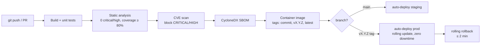

# EPIC 20 — CI/CD and Supply Chain Security

> Part of [Theme 8](theme_8_en.md)

**AS A** DevOps engineer  
**I WANT** automated build, test, security analysis, and deployment pipelines  
**SO THAT** every release is repeatable, auditable, and secure

## Spec anchors

| Contract surface | Reference |
|---|---|
| **Test contract** | Coverage targets and minimum scenarios: Epic 18 + [`openapi.yaml`](../specs/openapi.yaml) |
| **Security scanning** | Vuln-scanner: implementer's choice (Trivy / Grype / Snyk / equivalent); block threshold is the contract |
| **SBOM format** | CycloneDX |
| **Versioning** | SemVer MAJOR.MINOR.PATCH; deprecation window in Epic 19 |
| **Deployment topology** | Rolling update, two-replica floor, HPA: [`non-functional.md`](../specs/non-functional.md) §3, §3.1 |

## Pipeline at a glance

## Acceptance Criteria

### CI (per PR)

**Business rules:**
- [ ] Build and unit tests must pass.
- [ ] Static analysis gate: **0 critical/high** issues; coverage **≥ 80 %** (per Epic 18 floor).
- [ ] Container image vulnerability scan blocks CVEs at **CRITICAL** or **HIGH** severity. A PR introducing such a CVE is blocked and the report linked from the CI run.
- [ ] XSD validation: every XML sample file in the repo validates against the schemas in `docs/efti-analysis/xsd/`.
- [ ] **SBOM** (CycloneDX format) is generated for every build artefact and attached to the CI run.

### CD

**Business rules:**
- [ ] `main` branch update → automatic deployment to the staging environment.
- [ ] A version tag (`vX.Y.Z`) → automatic deployment to production.
- [ ] Container image is tagged with: the commit hash, the SemVer string, and `latest`. All three tags are pushed to the registry.
- [ ] Production rollout is **rolling** (new replicas start before old replicas are removed) — zero downtime. Coordinates with `/health/ready` per Epic 13.
- [ ] Rollback to the previous version is a **single action** (e.g. `kubectl rollout undo deployment/efti-gate` on Kubernetes; equivalent on other orchestrators) and completes within ≤ 2 minutes.

### Versioning + change tracking

**Business rules:**
- [ ] SemVer MAJOR.MINOR.PATCH is used for every production release. Breaking API changes require a MAJOR bump and a deprecation window of the previous MAJOR (see Epic 19, 6-month minimum).
- [ ] `CHANGELOG.md` follows **Keep a Changelog 1.1.0**.
- [ ] Every production release is tagged in git as `vX.Y.Z`.

## Rationale

Supply-chain security and reproducible deploys are non-optional for a regulator-facing service. CycloneDX SBOM + CVE scan + signed-image release process give the EU Trust Service auditors what they need without inventing a custom process. SemVer + a published `CHANGELOG.md` give integration partners the predictability they need to plan migrations against deprecation windows from Epic 19.
