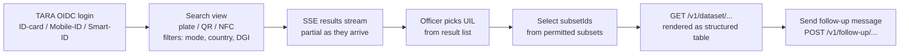

# EPIC 21 — Authority UI (AAP — H2M Interface)

> Part of [Theme 9](theme_9_en.md)

**AS A** competent authority officer  
**I WANT** a web interface for searching identifiers and viewing datasets  
**SO THAT** I can conduct roadside inspections without a separate IT system

## Spec anchors

| Contract surface | Reference |
|---|---|
| **API operations consumed** | `GET /v1/identifiers/{identifier}` (JSON + SSE), `GET /v1/dataset/{...}`, `POST /v1/follow-up/{...}`, `POST /api/v1/auth/logout` |
| | Full request / response shapes: [`openapi.yaml`](../specs/openapi.yaml) |
| **Access-check rules** | Authority role + subset enforcement: [`permissions-matrix.md`](../specs/permissions-matrix.md) |
| **Auth flow** | TARA OIDC (Authority/Admin path) — Epic 2 |
| **Architecture** | [RA §9.2 Authority API (AAP)](../architecture/eFTI-Gate-Reference-Architecture.md#92-authority-api-aap) |

## Officer journey at a glance

UI uses the TEDI (Tehik) design system. WCAG 2.2 AA compliance verified in CI.

## Acceptance Criteria

### Authentication

**Business rules:**
- [ ] Browser auth: TARA OIDC (ID-card, Mobile-ID, Smart-ID). The UI runs the OIDC code-exchange and attaches the resulting JWT to gate API calls.
- [ ] The TARA personal identification code (`sub`) is resolved against `users.tara_sub` to obtain the authority-user account and its permitted subsets.
- [ ] M2M access uses Bearer JWT (TARA-issued) — same backend route, no OIDC handshake.
- [ ] Logout invalidates the JWT via `POST /api/v1/auth/logout` (adds `jti` to `sessions` denylist) and triggers the TARA-side logout endpoint.
- [ ] Idle-timeout policy is configurable.

**Denial scenarios:**
- [ ] TARA identity not mapped to any active `users` row → friendly UI message ("Your identity is not registered as an authority user. Contact your administrator."), not a stack trace.

### Functionality

**Business rules:**
- [ ] Search view supports identifier entry by typed plate, scanned QR, or NFC read; filters include `modeCode`, `registrationCountryCode`, `dangerousGoodsIndicator`, optional `dateFrom`/`dateTo`.
- [ ] Results stream over SSE — partial results appear as peer gates respond.
- [ ] Multiple UILs displayed when present; the officer selects the relevant one.
- [ ] Dataset retrieval requires `subsetId` selection from the user's permitted subsets only (UI gates the picker by `users.subsets`).
- [ ] Dataset rendering: XML is presented as a structured table (human-readable). On malformed XML from the platform: show the raw XML + warning, do **not** crash the UI.
- [ ] Follow-up messages can be composed and sent against a returned UIL.
- [ ] Search results are paginated per the OpenAPI pagination contract.

**Performance:**
- [ ] Local-hit SSE first event arrives in ≤ `non-functional.md` §1's authority-search p95 SLO; broadcast results trickle in subject to the per-peer 8 s timeout.
- [ ] SSE stream open > 30 s shows a progress indicator; partial results are visible as they arrive.

### Design and accessibility

**Business rules:**
- [ ] UI uses the **TEDI (Tehik) design system** (https://tedi.tehik.ee/) components.
- [ ] Default language Estonian; full i18n with a language selector.
- [ ] WCAG 2.2 AA compliance verified by an automated accessibility scan (e.g. axe-core) in CI.
- [ ] Mobile-friendly: minimum touch target 44 × 44 px; layout adapts to roadside-inspection device sizes.

## Rationale

The AAP is the regulator-facing surface at roadside inspections. Streaming-first SSE matches the reality of cross-EU broadcast (partial results are useful before all peers respond). TARA OIDC + DB-backed subset enforcement makes the auth path identical to M2M (Epic 2) — there is no second permission model for "the browser". TEDI alignment and WCAG 2.2 AA are Estonian e-government baselines.
