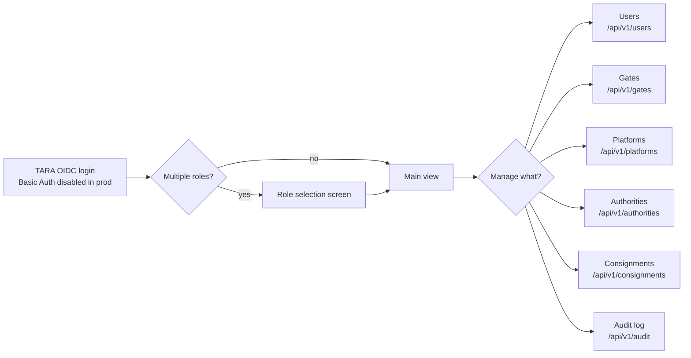

# EPIC 22 — Admin UI

> Part of [Theme 9](theme_9_en.md)

**AS AN** administrator  
**I WANT** a web-based management interface for users, registries and configuration  
**SO THAT** I can administer the system without direct database access

## Spec anchors

| Contract surface | Reference |
|---|---|
| **API operations consumed** | All Admin routes under `/api/v1/...`: `users`, `gates`, `platforms`, `authorities`, `consignments`, `audit`, plus `POST /api/v1/auth/logout` and `POST /api/js-error` |
| | Full request / response shapes: [`openapi.yaml`](../specs/openapi.yaml) |
| **Access-check rules** | Admin role + Party-ID scope-IDs enforcement: [`permissions-matrix.md`](../specs/permissions-matrix.md) |
| **Auth flow** | TARA OIDC (Authority/Admin path) — Epic 2 |
| **Environment** | `DRAFT_SAVE_INTERVAL_SECONDS` (default 30): [`non-functional.md`](../specs/non-functional.md) §4.1 |
| **Architecture** | [RA §7.1 Logical Component Layers](../architecture/eFTI-Gate-Reference-Architecture.md#71-logical-component-layers) |

## Admin journey at a glance

UI uses TEDI (Tehik) design system; WCAG 2.2 AA verified in CI; draft auto-save every 30 s.

## Acceptance Criteria

### Authentication

**Business rules:**
- [ ] Browser auth: TARA OIDC (ID-card, Mobile-ID, Smart-ID). HTTP-Basic email/password is **disabled** in production (allowed in dev only via Epic 1 break-glass).
- [ ] Logout calls `POST /api/v1/auth/logout` (denylist the JWT) and triggers the TARA-side logout endpoint.
- [ ] Repeated login failures trigger a temporary lockout — the UI presents a friendly message ("Account temporarily locked. Try again in 15 minutes."), never an error code.
- [ ] Idle-timeout policy is configurable.

### Role selection and navigation

**Business rules:**
- [ ] A user resolving to multiple roles is shown a role-selection screen after login.
- [ ] The active role is visible in the chrome throughout the session.
- [ ] Role can be switched without re-authenticating.
- [ ] A user with exactly one role skips the selection screen and lands on the main view.

### Forms and drafts

**Business rules:**
- [ ] Forms validate inline before submission (no full-page round-trip for trivially-bad input).
- [ ] Long forms auto-save drafts every `DRAFT_SAVE_INTERVAL_SECONDS` (default 30 s). Draft is restored on return.
- [ ] Draft-save failure surfaces a non-blocking warning ("Draft save failed — your data is not lost, but will not be restored on refresh"). It never blocks the user.

### Design and accessibility

**Business rules:**
- [ ] UI uses the **TEDI (Tehik) design system** (https://tedi.tehik.ee/).
- [ ] Default language Estonian; full i18n with a language selector.
- [ ] WCAG 2.2 AA: icon-only buttons carry `aria-label`; modals use `aria-labelledby`; skip-navigation link present; minimum 4.5 : 1 contrast.
- [ ] Accessibility scan (e.g. axe-core) runs in CI on every PR.

### Error handling

**Business rules:**
- [ ] Front-end JS errors are reported to the server via `POST /api/js-error` so they are visible in central logging.
- [ ] Errors shown to the user are friendly messages — never raw stack traces.
- [ ] Error pages include the `requestId` for support correlation.

## Rationale

The Admin UI is the operational control surface — every registry mutation, user creation, and audit-log review goes through it. TARA OIDC reuses the same identity primitive as the Authority UI (Epic 21). Disabling Basic Auth in production removes the only non-federated entry point. TEDI + WCAG 2.2 AA are Estonian e-government baselines; the spec inherits them rather than re-litigating.

---

## Priority Summary

| Phase | Theme | Epics | Rationale |
|-------|-------|-------|-----------|
| **1 — Production readiness** | T1, T5, T6 | 2 (Authentication), 12 (Scalability), 13 (Health), 14 (Security) | Cannot go to production without these |
| **2 — Core functionality** | T1, T2, T3 | 1 (RBAC), 3–5 (Platform/Authority API), 6–9 (Admin CRUD) | Core business logic of the system |
| **3 — Integrations** | T4 | 10 (eDelivery), 11 (X-Road) | EU and national interoperability |
| **4 — Quality** | T6, T7 | 15 (Audit), 16 (Logging), 17 (Monitoring) | Operational maturity |
| **5 — Standards and UI** | T8, T9 | 18–20 (Tests/API/CI/CD), 21–22 (UI) | KeMIT MFN compliance |

---

## Reference Architecture Compliance Check

| RA Principle | Epic | Status |
|---|---|---|
| Gate is a content-agnostic router | EPIC 3, 4, 5, 10 | ✅ Covered |
| Broadcast only on 0 local results | EPIC 4 | ✅ Covered |
| Platform filters subsets | EPIC 5 | ✅ Clarified |
| Gate does not store full datasets | EPIC 5, 9 | ✅ Covered |
| UIL = URL-based structure | EPIC 3, 4, 5 | ✅ Covered |
| CMDS statuses active/inactive/deleted | EPIC 9 | ✅ Addressed |
| AAP = authority REST interface (H2M + M2M) | EPIC 21 | ✅ Covered |
| Identifier `expires_at` field | EPIC 9 | ✅ Addressed |
| Audit logging jurisdiction question | EPIC 15 | ✅ Clarified |
| Multimodal support (road/sea/rail/air) | EPIC 3, 10 | ✅ Covered |

> **Architecture reference:** For component diagrams, security layers, and full design rationale see [eFTI Gate Reference Architecture](../architecture/eFTI-Gate-Reference-Architecture.md).
