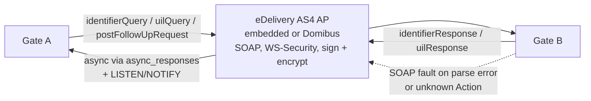
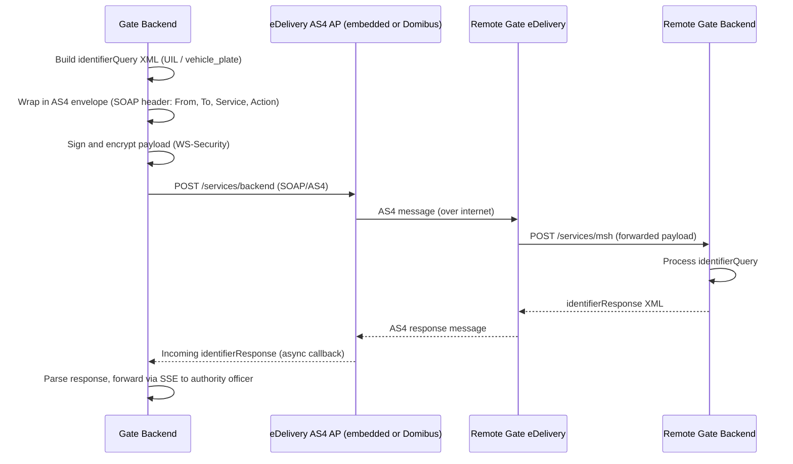
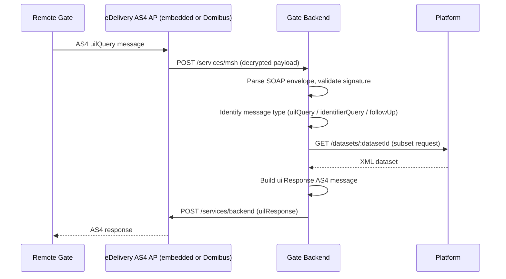

# EPIC 25 — eDelivery AS4 Message Flow

> Part of [Theme 4](theme_4_en.md)

**AS A** technical architect  
**I WANT** documented eDelivery AS4 message flows with sequence diagrams  
**SO THAT** developers understand exactly how inter-gate messages travel through the AS4 protocol

## Spec anchors

| Contract surface | Reference |
|---|---|
| **Underlying epic** | Epic 10 (eDelivery AS4 Integration) — the AC source of truth. This epic provides the **visual** companion. |
| **API operations shown** | `POST /services/msh` (AS4 inbound), `POST /services/backend` (AS4 outbound), `GET /datasets/{datasetId}` (platform-side). Full shapes: [`openapi.yaml`](../specs/openapi.yaml) |
| **XML schemas** | [`gate.xsd`](../efti-analysis/xsd/edelivery/gate.xsd) |
| **Wire transformations** | XML → AS4 envelope, WS-Security sign + encrypt, SOAP fault → RFC 7807: [`data-transformations.md`](../specs/data-transformations.md) |
| **Protocol pinning** | EU eDelivery AS4 1.15 conformance profile: [`non-functional.md`](../specs/non-functional.md) §3, §4 |
| **Companion mermaid files** | [`seq-14-gate-to-gate-search.mmd`](../specs/diagrams/seq-14-gate-to-gate-search.mmd) |
| | [`seq-16-mtls-fast-protocol.mmd`](../specs/diagrams/seq-16-mtls-fast-protocol.mmd) |
| **Architecture** | [RA §4 Protocol Architecture](../architecture/eFTI-Gate-Reference-Architecture.md#4-protocol-architecture-generic-envelope--variable-payload) |
| | [RA §5.1 Identifier Query](../architecture/eFTI-Gate-Reference-Architecture.md#51-identifier-query-cross-border-search) |

> **Implementation choice (not mandated by EU regs).** The diagrams show "eDelivery AS4 AP" generically. Operators may use the gate's embedded AS4 implementation (Askend baseline) or [Domibus](https://ec.europa.eu/digital-building-blocks/sites/display/DIGITAL/Domibus) — both are protocol-compatible per Reg 2024/1942 Art 11.

## AS4 message types at a glance

## Acceptance Criteria

**Business rules:**
- [ ] Both AS4 flows (outgoing identifier search, incoming UIL request) are documented as sequence diagrams below.
- [ ] Each diagram covers: SOAP envelope construction, WS-Security signing + encryption, parse + signature verification on the receiver, and failure handling (SOAP fault on parse error or unknown Action).
- [ ] The diagrams stay in sync with Epic 10 ACs — any change to the AS4 contract there must be reflected here in the same PR.

### Flow 1 — Outgoing identifier search (Gate → eDelivery → Remote Gate)

### Flow 2 — Incoming UIL request (Remote Gate → Gate → Platform)

## Rationale

eDelivery AS4 is the EU's standard cross-border message bus; documenting the on-wire shape (SOAP envelope, WS-Security, async callback via `async_responses` + `LISTEN/NOTIFY`) is what lets a partner trace any failure mode without reading the gate source. The "embedded or Domibus" framing makes the AS4 implementation a deployment-time decision rather than a hard spec mandate.
