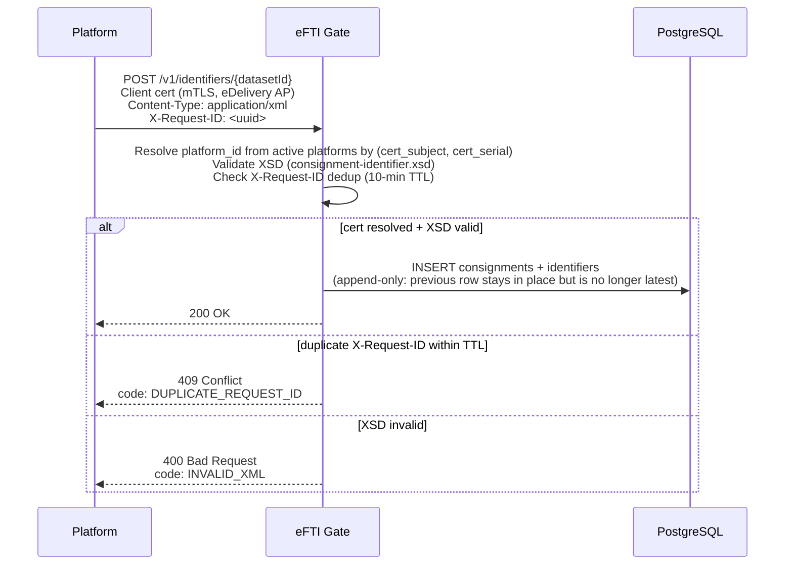

# EPIC 3 — Identifier Management (Platform API)

> Part of [Theme 2](theme_2_en.md)

**AS A** eFTI platform operator  
**I WANT** to register freight transport identifiers in the gate  
**SO THAT** competent authorities can search for them later

## Spec anchors

| Contract surface | Reference |
|---|---|
| **API operations** | `POST /v1/identifiers/{datasetId}` |
| | Full request / response / error shapes: [`openapi.yaml`](../specs/openapi.yaml) |
| **Schema** | `consignments` (latest-row-wins on `dataset_id`; denormalised search columns: `vehicle_plate`, `vehicle_country`, `transport_date`, `origin_country`, `destination_country`, `mode`, `dangerous_goods`) |
| | `identifiers` (1 consignment → N rows; type enum: `means`, `equipment`, `carried`) |
| | `request_id_cache` (`X-Request-ID` dedup, TTL 10 min) |
| | Full schema: [`db/schema.sql`](../specs/db/schema.sql) |
| | Migration policy: [`db/README.md`](../specs/db/README.md) |
| **XML schemas** | [`consignment-identifier.xsd`](../efti-analysis/xsd/consignment-identifier.xsd) |
| | XML → DB extraction rules (XPath maps for denormalised columns): [`data-transformations.md`](../specs/data-transformations.md) |
| **Error codes** | `INVALID_XML` |
| | `DUPLICATE_REQUEST_ID` |
| | `FORBIDDEN_NO_PLATFORM` |
| | `FORBIDDEN_MULTI_PLATFORM` |
| | `BAD_REQUEST_GENERAL` |
| | Full catalog: [`errors.json`](../specs/errors.json) |
| **Architecture** | [RA §2.1 UIL](../architecture/eFTI-Gate-Reference-Architecture.md#21-uil-unique-identifier-locator) |
| | [RA §2.2 Identifiers vs Datasets](../architecture/eFTI-Gate-Reference-Architecture.md#22-identifiers-vs-datasets) |
| | [RA §3 Data Lifecycle](../architecture/eFTI-Gate-Reference-Architecture.md#3-data-lifecycle--ownership) |
| **Diagrams** | [`seq-01-identifier-registration.mmd`](../specs/diagrams/seq-01-identifier-registration.mmd) |
| | [`seq-07-dataset-upload.mmd`](../specs/diagrams/seq-07-dataset-upload.mmd) |
| | [`seq-13-multi-platform-user.mmd`](../specs/diagrams/seq-13-multi-platform-user.mmd) |

## Registration flow at a glance

## Acceptance Criteria

### Registration

**Business rules:**
- [ ] Authentication is **mTLS only** — the platform's eDelivery AP cert (subject + serial) must resolve to exactly one active `platforms` row.
- [ ] `Content-Type: application/xml`; the body must validate against `consignment-identifier.xsd`.
- [ ] Re-sending the same `datasetId` with new data INSERTs a new `consignments` row sharing the same logical `dataset_id`. Append-only: the previous row remains; authority latest-row reads return the new row.
- [ ] Identifier rows are 1-to-N per consignment: types are `means` (vehicle / transport unit), `equipment` (container / trailer), `carried` (cargo unit).
- [ ] Transport mode enum (EU Reg 2024/2024 Annex I) ↔ XML `modeCode` mapping: `maritime`=1, `rail`=2, `road`=3, `air`=4, `multimodal`=5. Full mapping in [`data-transformations.md`](../specs/data-transformations.md) §2.4.
- [ ] Pre-registration is supported: the platform may submit without `vehicle_plate`; a subsequent `POST` with the same `datasetId` can supply / change the plate.
- [ ] Search by plate must not return records where `vehicle_plate` is empty or null.

**Denial scenarios:**
- [ ] Client cert resolves to 0 active rows.
- [ ] Client cert resolves to >1 active row (operator misconfiguration).
- [ ] Body XML invalid against the XSD — response carries the XSD validation path and line number.
- [ ] `countryCode` is not ISO 3166-1 alpha-2 (e.g. `"EST"` instead of `"EE"`).
- [ ] `datasetId` path parameter is not UUID v4.
- [ ] `X-Request-ID` header missing.
- [ ] `X-Request-ID` seen within the last 10 minutes (`request_id_cache` TTL).
- [ ] Unknown eDelivery message type — error returned to sender (never silently ignored); logged WARN.

## Dedup contract

- [ ] `X-Request-ID` deduplication uses the shared `request_id_cache` table — visible to all gate nodes. TTL 10 minutes per `request_id_cache.expires_at` default in [`db/schema.sql`](../specs/db/schema.sql).
- [ ] Past TTL, the same `X-Request-ID` value is accepted as a new request.

## Rationale

The gate is a registry, not a store of dataset content. The platform owns the dataset; the gate keeps the identifiers + the minimal denormalised search columns. Append-only INSERTs preserve every state transition without UPDATEs, which is critical for the EU Reg 2024/1942 audit trail and the GDPR Art. 30 record of processing.
