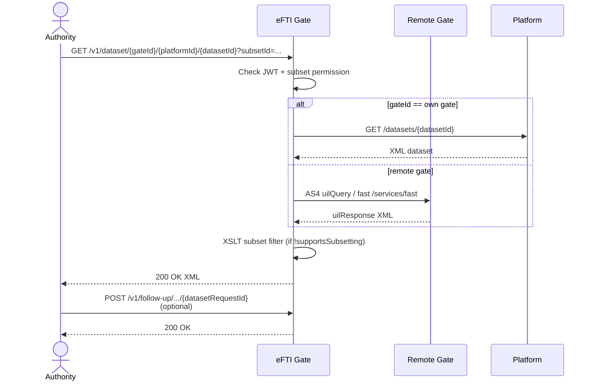

# EPIC 5 — Dataset Retrieval and Follow-up

> Part of [Theme 2](theme_2_en.md)

**AS A** competent authority officer  
**I WANT** to retrieve the full dataset for a specific consignment and send a follow-up message to the platform  
**SO THAT** I can fulfil my legal obligation in freight transport inspection

## Spec anchors

| Contract surface | Reference |
|---|---|
| **API operations** | `GET /v1/dataset/{gateId}/{platformId}/{datasetId}` |
| | `POST /v1/follow-up/{gateId}/{platformId}/{datasetId}/{datasetRequestId}` |
| | Full request / response / error shapes: [`openapi.yaml`](../specs/openapi.yaml) |
| **Schema** | `follow_up_log` (Art 6(2)(c) Reg 2024/1942 mandatory fields: follow-up id, AAP/requesting gate id, receipt timestamp) |
| | Full schema: [`db/schema.sql`](../specs/db/schema.sql) |
| **Data transformations** | XML→JSON marshalling, eDelivery AS4 wrapping, subset filtering, SSE streaming: [`data-transformations.md`](../specs/data-transformations.md) |
| **Access-check rules** | Subset access + per-route role check: [`permissions-matrix.md`](../specs/permissions-matrix.md) |
| **Error codes** | `CONSIGNMENT_NOT_FOUND` |
| | `FORBIDDEN_SUBSET` |
| | `GATEWAY_UNAVAILABLE` |
| | `GATE_TIMEOUT` |
| | `FOLLOW_UP_GATE_MISMATCH` |
| | `BAD_REQUEST_GENERAL` |
| | Full catalog: [`errors.json`](../specs/errors.json) |
| **Architecture** | [RA §2.3 Data Subsets](../architecture/eFTI-Gate-Reference-Architecture.md#23-data-subsets) |
| | [RA §5.2 Dataset Query](../architecture/eFTI-Gate-Reference-Architecture.md#52-dataset-query-request-full-data) |
| | [RA §5.3 Follow-Up](../architecture/eFTI-Gate-Reference-Architecture.md#53-follow-up-message) |
| **Diagrams** | [`seq-05-dataset-request.mmd`](../specs/diagrams/seq-05-dataset-request.mmd) |
| | [`seq-06-dataset-request-denied.mmd`](../specs/diagrams/seq-06-dataset-request-denied.mmd) |
| | [`state-02-dataset-request.mmd`](../specs/diagrams/state-02-dataset-request.mmd) |
| | [`flow-03-dataset-access-control.mmd`](../specs/diagrams/flow-03-dataset-access-control.mmd) |

## Dataset retrieval at a glance

## Acceptance Criteria

### Dataset request

**Business rules:**
- [ ] The request **must** carry at least one `subsetId` query parameter — without it the request is rejected.
- [ ] Local routing: if the UIL's `gateId` matches this gate, forward to the platform client (REST).
- [ ] Remote routing: if the UIL's `gateId` is a peer, forward via eDelivery AS4 `uilQuery` (or `/services/fast` for the mTLS fast variant).
- [ ] The gate is **content-agnostic**: dataset XML is forwarded unchanged regardless of payload content. The gate never caches, parses business semantics from, or modifies the dataset body (subset filtering is the only exception — see below).
- [ ] `X-Request-ID` from the caller is echoed back in the response.
- [ ] Local dataset retrieval SLO: p95 < 5 s.

**Denial scenarios:**
- [ ] No `subsetId` parameter.
- [ ] Caller's `users.subsets` does not include the requested `subsetId`.
- [ ] Routed gate is `OFFLINE` (checked **before** the outbound request) — short-circuit `502`-class failure.
- [ ] Platform-client returns non-2xx — `502`-class; the gate does not retry beyond the SLO budget.

### Subsetter

**Business rules:**
- [ ] If the platform advertises `supportsSubsetting=false`, the gate applies the XSLT subset filter **before** responding to the authority — the authority never sees data beyond their permitted subsets.
- [ ] XSLT-empty output is a `200 OK` with empty XML body, **not** a `404`.
- [ ] XML processing must be **streaming** (SAX-style) — the dataset must not be fully loaded into application heap. Required because freight datasets routinely exceed 10 MB.

### Follow-up

**Business rules:**
- [ ] Same routing logic as dataset request: `gateId == own gate` → platform client; otherwise → gate-to-gate client.
- [ ] If the resolved platform has `eDeliveryCert` configured, the follow-up is also sent via eDelivery AS4 (parallel to the REST forward).
- [ ] A `datasetRequestId` that does not reference a prior request is **still forwarded** — the gate is content-agnostic about correlation between requests and follow-ups. Logged at DEBUG.
- [ ] Each follow-up is logged with the Art 6(2)(c) Reg 2024/1942 mandatory fields: follow-up id, AAP/requesting gate id, receipt timestamp, destination, requesting user id.

**Denial scenarios:**
- [ ] Routed gate is `OFFLINE` — `502`-class.
- [ ] Platform client returns non-2xx — `502`-class; the failure is logged at ERROR with full trace.

## Rationale

The gate routes by UIL (`gateId`/`platformId`/`datasetId`) and enforces the subset-permission contract; the dataset body itself is the platform's responsibility. The gate-vs-platform subsetting split (platform may advertise `supportsSubsetting`) keeps the gate stateless about dataset content while still guaranteeing the authority cannot exceed their permitted subsets. Streaming XML processing is non-negotiable: a DOM parser would OOM on a real freight dataset.
