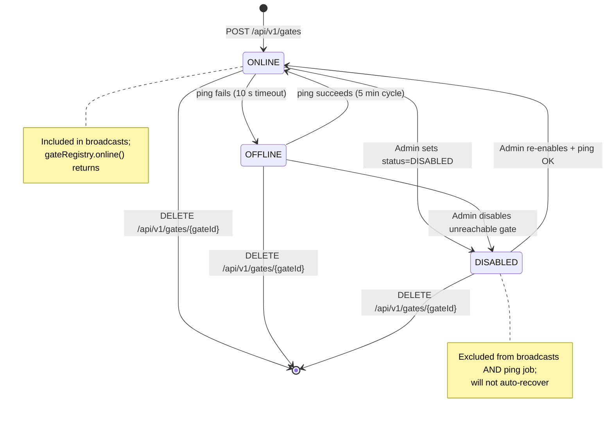

# EPIC 6 — Gate Registry Management (Admin API)

> Part of [Theme 3](theme_3_en.md)

**AS A** system administrator  
**I WANT** to manage the list of EU eFTI gates and monitor their status  
**SO THAT** broadcast requests only reach operational gates

## Spec anchors

| Contract surface | Reference |
|---|---|
| **API operations** | `GET/POST/PUT/DELETE /api/v1/gates[/{gateId}]` |
| | `GET /api/v1/gates/own` |
| | `POST /api/v1/gates/{gateId}/ping` (admin-triggered manual probe) |
| | `POST /api/v1/admin/ping-gates` (CronManager-triggered recurring sweep) |
| | Full request / response / error shapes: [`openapi.yaml`](../specs/openapi.yaml) |
| **Schema** | `gates` (append-only; logical id = `gates.id` CITEXT; latest row by `created_at` wins; `is_active=FALSE` on latest = logical delete; columns: `country_code`, `e_delivery_url`, `e_delivery_cert`, `tls_cert`, `status`, `last_ping_at`) |
| | `gate_status` enum: `ONLINE`, `OFFLINE`, `DISABLED` |
| | Full schema: [`db/schema.sql`](../specs/db/schema.sql) |
| **Access-check rules** | Admin write scope-ID check (target gate must be in `users.roles[ADMIN]`): [`permissions-matrix.md`](../specs/permissions-matrix.md) §8.1 |
| **Error codes** | `BAD_REQUEST_GENERAL` |
| | `FORBIDDEN_WRITE_ACCESS` |
| | `GATEWAY_UNAVAILABLE` |
| | `GATE_TIMEOUT` |
| | Full catalog: [`errors.json`](../specs/errors.json) |
| **Environment** | `PING_TIMEOUT_SECONDS` — see [`non-functional.md`](../specs/non-functional.md) §4.1 |
| **CronManager YAML** | [`cronmanager-ping-gates.yaml`](../specs/deploy/cronmanager-ping-gates.yaml) |
| **Architecture** | [RA §1 System Actors](../architecture/eFTI-Gate-Reference-Architecture.md#1-system-actors--components) |
| **Diagrams** | [`state-05-gate-health.mmd`](../specs/diagrams/state-05-gate-health.mmd) |
| | [`seq-09-gate-ping.mmd`](../specs/diagrams/seq-09-gate-ping.mmd) |
| | [`seq-15-gate-registry-sync.mmd`](../specs/diagrams/seq-15-gate-registry-sync.mmd) |
| | [`arch-02-gate-network.mmd`](../specs/diagrams/arch-02-gate-network.mmd) |

## Gate lifecycle at a glance

## Acceptance Criteria

### CRUD

**Business rules:**
- [ ] Listing: Super Admin sees all gates; a regular Admin sees only gates whose id is in their `users.roles[ADMIN]` scope-IDs.
- [ ] All writes (create / update / delete) are INSERTs of a new `gates` row sharing the same logical `id`. Latest row wins.
- [ ] Delete is **soft**: the latest row carries `is_active=FALSE`. The previous row remains in place (append-only).
- [ ] An admin cannot delete their own gate.

**Denial scenarios:**
- [ ] `POST` with an `id` whose latest row is active → conflict.
- [ ] `PUT` / `DELETE` on a logical id that doesn't exist (or whose latest row is already `is_active=FALSE`) → not found.
- [ ] Write targets a gate not in the caller's `users.roles[ADMIN]` scope-IDs → `FORBIDDEN_WRITE_ACCESS`.

### Ping

**Business rules:**
- [ ] Admins may trigger a one-off ping via `POST /api/v1/gates/{gateId}/ping` — response carries `responseTimeMs`.
- [ ] Recurring health probe is **CronManager-driven**: CronManager calls `POST /api/v1/admin/ping-gates` on its configured schedule (default every 5 min; canonical YAML in `cronmanager-ping-gates.yaml`). The gate process **never schedules its own jobs**.
- [ ] Each ping result INSERTs a new `gates` row carrying `status` (ONLINE / OFFLINE — `DISABLED` is operator-set only) and `last_ping_at = NOW()`. A `NOTIFY` on the `registry_change_gates` channel fires after commit.
- [ ] `DISABLED` gates AND latest-`is_active=FALSE` gates are excluded from the sweep query — `DISABLED` does not auto-recover.

**Denial scenarios:**
- [ ] Peer gate does not respond within `PING_TIMEOUT_SECONDS` → status flipped to `OFFLINE` on this gate's INSERT; response to the caller is `502`-class.

### Concurrency on the recurring sweep

- [ ] Multiple gate nodes may receive the same CronManager call. The handler must enforce a cluster-wide mutex (one in-flight call wins; others return `409 Conflict`). PostgreSQL advisory locks are the pinned implementation per [`non-functional.md`](../specs/non-functional.md) §3.

## Rationale

The gate registry is **shared state across the cluster**: every node caches the latest row per gate and refreshes on `NOTIFY`. Pings are append-only state transitions, so the history is auditable without an UPDATE-trigger pattern. Recurring jobs live in CronManager (not the gate) so a scheduled job runs exactly once regardless of how many gate replicas are deployed — combined with the advisory-lock mutex, multi-node deployments are safe.
