# EPIC 7 — Platform Registry Management (Admin API)

> Part of [Theme 3](theme_3_en.md)

**AS A** system administrator  
**I WANT** to manage the eFTI platform registry  
**SO THAT** platforms can register identifiers and authorities can retrieve datasets

## Spec anchors

| Contract surface | Reference |
|---|---|
| **API operations** | `GET/POST/PUT/DELETE /api/v1/platforms[/{platformId}]` |
| | `POST /api/v1/platforms/{platformId}/ping` |
| | Full request / response / error shapes: [`openapi.yaml`](../specs/openapi.yaml) |
| **Schema** | `platforms` (append-only; logical id = `platforms.id`; latest row by `created_at` wins; `is_active=FALSE` on latest = soft-delete; columns: `base_url`, `supports_subsetting`, `cert_subject`, `cert_serial`, `e_delivery_cert`) |
| | Full schema: [`db/schema.sql`](../specs/db/schema.sql) |
| **Access-check rules** | Admin write scope-ID check on the platform's owning gate: [`permissions-matrix.md`](../specs/permissions-matrix.md) §8.1 |
| **Error codes** | `BAD_REQUEST_GENERAL` |
| | `FORBIDDEN_WRITE_ACCESS` |
| | `GATEWAY_UNAVAILABLE` |
| | Full catalog: [`errors.json`](../specs/errors.json) |
| **Cluster sync** | `LISTEN/NOTIFY` on channel `registry_change_platforms` — see [`non-functional.md`](../specs/non-functional.md) §3 |
| **Architecture** | [RA §1 System Actors](../architecture/eFTI-Gate-Reference-Architecture.md#1-system-actors--components) |
| **Diagrams** | [`seq-10-platform-registration.mmd`](../specs/diagrams/seq-10-platform-registration.mmd) |
| | [`state-03-platform-status.mmd`](../specs/diagrams/state-03-platform-status.mmd) |

## Platform lifecycle at a glance

```mermaid
stateDiagram-v2
    [*] --> Active: POST /api/v1/platforms<br/>(id, baseUrl, supportsSubsetting,<br/>certSubject, certSerial, eDeliveryCert?)
    Active --> Active: PUT /api/v1/platforms/{id}<br/>(append-only INSERT; cert renewal etc.)
    Active --> Active: POST /api/v1/platforms/{id}/ping<br/>(updates responseTimeMs)
    Active --> SoftDeleted: DELETE /api/v1/platforms/{id}<br/>(latest row is_active=FALSE)
    SoftDeleted --> Active: PUT with new row is_active=TRUE
    note right of Active
        Registry change → app emits NOTIFY registry_change_platforms, id
        in same transaction; other nodes LISTEN and reload
        from gates/platforms within ≤ 500 ms.
    end note
```

## Acceptance Criteria

**Business rules:**
- [ ] Listing: Super Admin sees all platforms; a regular Admin sees only platforms whose owning gate is in their `users.roles[ADMIN]` scope-IDs.
- [ ] All writes (create / update / delete) are INSERTs of a new `platforms` row sharing the same logical `id`. Latest row wins.
- [ ] Delete is **always** soft (`is_active=FALSE` on the latest row). There is no force-delete and no purge. Identifiers previously registered by the platform remain queryable.
- [ ] A platform with `eDeliveryCert` set is callable via both REST and eDelivery AS4. Without it, REST only.
- [ ] A platform with `supportsSubsetting=false` triggers gate-side subset filtering on dataset retrieval (Epic 5).
- [ ] Manual ping (`POST /api/v1/platforms/{platformId}/ping`) checks HTTP reachability to `baseUrl`; response carries `responseTimeMs`.

**Denial scenarios:**
- [ ] `POST` with an `id` whose latest row is active → conflict.
- [ ] `PUT` / `DELETE` on a logical id that doesn't exist → not found.
- [ ] Manual ping: platform unreachable within timeout → `502`-class.
- [ ] Admin writes to a platform whose owning gate is **not** in the caller's `users.roles[ADMIN]` scope-IDs → `FORBIDDEN_WRITE_ACCESS`.

## Cluster-sync contract

- [ ] On every commit of a `platforms` INSERT, the application emits `NOTIFY registry_change_platforms, '<id>'` from the same transaction (no DB-side trigger). All gate nodes hold an open `LISTEN` on this channel and reload the latest row for the affected id within ≤ 500 ms.

## Rationale

Platform metadata (cert subject/serial, base URL, capability flags) drives Platform-API auth and the subsetting decision in Epic 5. Append-only INSERTs preserve every cert rotation and capability change as an auditable history. `LISTEN/NOTIFY` keeps every gate node's in-memory platform cache fresh without polling.
