# EPIC 9 — Consignment Management (Admin API)

> Part of [Theme 3](theme_3_en.md)

**AS A** system administrator
**I WANT** to view and manage stored consignment data
**SO THAT** I can audit data and remove erroneous records

## Spec anchors

| Contract surface | Reference |
|---|---|
| **API operations** | `GET /api/v1/consignments` |
| | `DELETE /api/v1/consignments/{datasetId}` (Super Admin only) |
| | `POST /api/v1/admin/expire-identifiers` (CronManager-triggered) |
| | Full request / response / error shapes: [`openapi.yaml`](../specs/openapi.yaml) |
| **Schema** | `consignments` (append-only; latest row by `created_at` wins per `dataset_id`) |
| | `consignment_status` enum: `active`, `inactive`, `deleted` |
| | `audit_log` (≥ 7 years retention; never archived) |
| | Index `idx_consignments_dataset_latest (dataset_id, created_at DESC)` — canonical latest-row read path |
| | Full schema: [`db/schema.sql`](../specs/db/schema.sql); read patterns: [`db/README.md`](../specs/db/README.md) |
| **Data transformations** | XML → denormalised search columns: [`data-transformations.md`](../specs/data-transformations.md) |
| **Error codes** | `BAD_REQUEST_GENERAL` |
| | `FORBIDDEN` |
| | `CONSIGNMENT_NOT_FOUND` |
| | `ARCHIVE_IN_PROGRESS` (concurrency-guard 409) |
| | Full catalog: [`errors.json`](../specs/errors.json) |
| **CronManager YAML** | [`cronmanager-expire.yaml`](../specs/deploy/cronmanager-expire.yaml) (default `0 45 3 * * ?` — 03:45 daily) |
| **Architecture** | [RA §3 Data Lifecycle](../architecture/eFTI-Gate-Reference-Architecture.md#3-data-lifecycle--ownership) |
| | [RA §6.2 Data Processing Matrix](../architecture/eFTI-Gate-Reference-Architecture.md#62-data-processing-matrix) |
| **Diagrams** | [`state-01-identifier-lifecycle.mmd`](../specs/diagrams/state-01-identifier-lifecycle.mmd) |
| | [`seq-08-identifier-expiration.mmd`](../specs/diagrams/seq-08-identifier-expiration.mmd) |
| **Related epic** | [Epic 26](epic_26_en.md) — CronManager-driven append-only archival sweep |

## Consignment lifecycle at a glance

```mermaid
stateDiagram-v2
    [*] --> active: POST /v1/identifiers/{datasetId}<br/>(INSERT consignments row, status='active')
    active --> active: re-register same datasetId<br/>(append-only INSERT; latest row wins)
    active --> inactive: CronManager → /api/v1/admin/expire-identifiers<br/>(road, transport_date+14d <NOW())<br/>or immediate inactive INSERT for other modes
    inactive --> active: re-registered by platform
    active --> deleted: Platform DELETE /v1/identifiers/{datasetId}<br/>or Admin DELETE /api/v1/consignments/{datasetId}<br/>(append-only INSERT, status='deleted')
    inactive --> deleted: Platform / Admin DELETE
    note right of inactive
        Returned by /v1/identifiers only with
        dateFrom/dateTo (cabotage control,
        Reg 2024/1942 Art 11(4)).
    end note
    note right of deleted
        Append-only — nothing is physically removed.
        Old (non-latest) rows are archived nightly by
        CronManager (Epic 26) to cold storage. The
        runtime app role has no DELETE grant.
    end note
```

## Acceptance Criteria

### Viewing and deletion

**Business rules:**
- [ ] Listing: Super Admin sees all consignments; a regular Admin sees only consignments owned by gates in their `users.roles[ADMIN]` scope-IDs.
- [ ] List response returns the **latest** row per `dataset_id`, ordered by `created_at DESC`.
- [ ] `DELETE` is **Super Admin only**. It INSERTs a new `consignments` row carrying `status='deleted'` — the previous row remains in place (append-only).

**Denial scenarios:**
- [ ] Regular Admin attempts `DELETE` → forbidden.
- [ ] `DELETE` on a `dataset_id` whose latest row is already `deleted` → not found.

### Identifier-status lifecycle (Reg 2025/2243)

**Business rules:**
- [ ] States: `active` (searchable), `inactive` (historical queries only — returned only with explicit `status=inactive` or `status=all`), `deleted` (excluded from all default queries).
- [ ] Every state transition is an INSERT of a new `consignments` row sharing the same logical `dataset_id`. **No row is ever mutated.**
- [ ] Re-registration after a `deleted` row: new `active` row INSERTed; latest now reads `active`. The deleted row remains until archived.

### Retention and expiry (Reg 2024/1942)

**Business rules:**
- [ ] **Cabotage retention.** `mode='road'` consignments transition `active → inactive` 14 days after `transport_date`, per Reg 2024/1942 Art 11(4). Triggered by CronManager calling `POST /api/v1/admin/expire-identifiers`.
- [ ] Other transport modes: deactivated immediately after `delivered_at` (operator may choose to mark inactive at platform-DELETE time instead).
- [ ] **Audit log retention.** `audit_log` is preserved on the live DB **indefinitely** (≥ 7-year regulatory floor). It is **never archived**.
- [ ] **Non-latest consignments rows are archived nightly** by CronManager via `POST /api/v1/admin/archive` (Epic 26). After each sweep the live DB carries only the latest row per `dataset_id`.
- [ ] The gate must support an export of the 5-year monitoring report for the European Commission.

**Idempotency / safety:**
- [ ] `transport_date` not set or in the future → identifier remains `active`; the expiry sweep skips it.
- [ ] The expire-identifiers endpoint, like every CronManager-triggered admin endpoint, holds a cluster-wide mutex at handler entry; a concurrent invocation returns `409 ARCHIVE_IN_PROGRESS`.
- [ ] Each expiry sweep emits `event.action: "identifier.expire"` with `efti.expired_count` (per [`logging-spec.md`](../specs/logging-spec.md) §5).

## Rationale

The gate's data model is **append-only everywhere**: state transitions (active → inactive, inactive → deleted, re-registration) are all INSERTs of new rows sharing the logical `dataset_id`. This preserves a complete audit trail without UPDATEs or change-tracking tables, satisfying Reg 2024/1942 Art 30's processing-record requirement without extra machinery. CronManager handles all scheduled state transitions (expiry, archival) so the gate process itself stays stateless.
