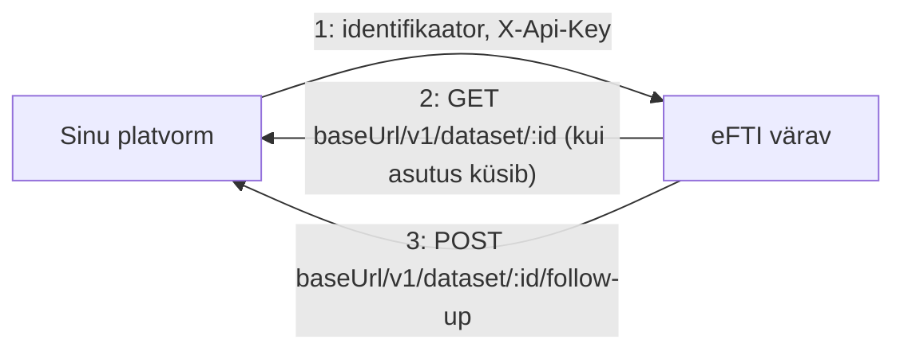
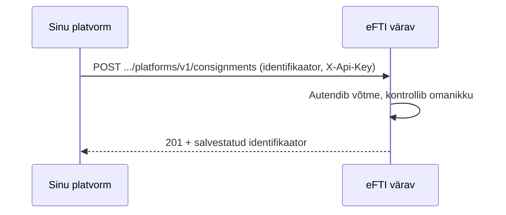
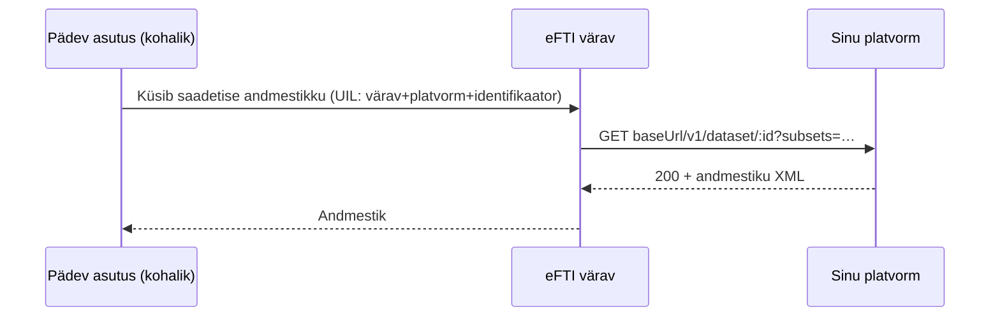
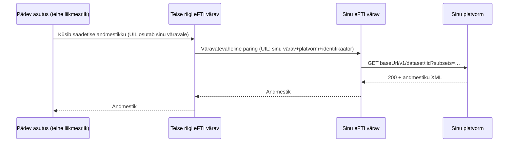

# Platvormi liidestumise juhis

eFTI värav pakub **kahesuunalist** REST-liidest registreeritud eFTI platvormidele. See juhis
kirjeldab, mida platvorm väravale saadab, ja mida platvorm ise peab väravale vastu pakkuma.

> Enne alustamist: platvorm peab olema Admini kasutajaliideses registreeritud (vt
> [`docs/user-guide/src/platforms.md`](../user-guide/src/platforms.md)) — platvormi ID,
> base-URL, väljuvad päised ja API võti lepitakse kokku sinu gate'i operaatoriga. Operaator
> loob platvormi kirje ja genereerib API võtme; täisvõtit näidatakse üks kord, hoia see
> turvaliselt.

## Ülevaade



Kaks eraldi suunda, kaks eraldi rolli:

1. **Platvorm → värav** (sina algatad): laed üles saadetise identifikaatori
   (`POST /platforms/v1/consignments`). Autendid ennast oma `X-Api-Key`-ga.
2. **Värav → platvorm** (värav algatab, sina vastad): kui pädev asutus küsib selle saadetise
   täisandmestikku või saadab järelpärimise, kutsub värav SINU `baseUrl`-i — sinu teenus peab
   need kaks otspunkti pakkuma ja autentima gate'i väravalt saadud päistega (mis on Adminis
   sinu platvormi kirje juures seadistatud).

Testimiseks on saadaval valmis testplatvorm (ID `mock`, API-võti `mock-secret-key`), mis
implementeerib kõiki kolme sammu — küsi oma gate'i operaatorilt, kuidas seda oma
arenduskeskkonnas kasutada.

---

## Sõnumivood

### Saadetise identifikaatori üleslaadimine

Sina algatad — värav salvestab identifikaadi ja vastab kohe.



### Kohalik pädev asutus küsib saadetise andmestikku

Kui SINU riigi pädev asutus küsib väravalt selle saadetise täisandmestikku, küsib värav selle
sinu käest — ise ta andmestikku ei säilita, ainult identifikaatorit.



### Teise liikmesriigi asutus küsib andmestikku sinu saadetise kohta

Kui välisriigi pädev asutus küsib SEDA saadetist läbi oma värava, jõuab päring eFTI väravate
võrgustiku kaudu sinu väravani — ja sinu väravast SINU platvormini täpselt samamoodi nagu
kohaliku päringu puhul. Sinu platvorm ei tea ega pea teadma, kas päring tuli kohalikult asutuselt
või teisest liikmesriigist — mõlemal juhul kutsub SINU väravaga ühendatud eFTI värav sinu
`baseUrl`-i.



Järelpärimised (follow-up, §3) käituvad samamoodi — sõltumata sellest, kas pärija on kohalik või
teise liikmesriigi pädev asutus, jõuab järelpärimine alati sinu `baseUrl`-i kaudu sinuni.

---

## 1. Saadetise identifikaatori üleslaadimine

### `POST /platforms/v1/consignments`

Kaks kuju, sõltuvalt sellest, kuidas su platvorm väravaga ühendub:

| Kuju | Millal | Path | Body |
|---|---|---|---|
| **Täis-FTI004** | eDelivery/AS4 kaudu ühendudes | `/platforms/v1/consignments` | Terve `FTI004UploadIdentifierRequest` (GateID/PlatformID/DatasetID + `ParameterIDSetCriteria`) |
| **Lühike** | Otse REST-iga ühendudes | `/platforms/v1/consignments/:datasetId` — **`datasetId` on path-parameeter** | Ainult `<ParameterIDSetCriteria>` element |

Mõlemal juhul: `Content-Type: text/xml`, keha on **toores XML string**, mitte JSON-mähitud.

**Päised:**

| Päis | Kohustuslik | Kirjeldus |
|---|---|---|
| `X-Api-Key` | jah | Sinu platvormi krediit — võrreldakse registreeritud platvormi salvestatud võtmega |
| `Content-Type` | jah | `text/xml` |
| `X-Gate-Id` | ei | Vaikimisi selle värava enda ID. Määra ainult siis, kui laed identifikaatori teise värava jaoks üles (harv) |
| `X-Request-ID` | ei | Korrelatsiooni-ID logides |

**Näide — lühike kuju** (`X-Gate-Id` vaikimisi, `datasetId` path-is):

```
POST /platforms/v1/consignments/b0284c81-a79d-11f1-931a-4ca954ebfb9f
Content-Type: text/xml
X-Api-Key: <sinu-võti>

<ParameterIDSetCriteria xmlns:udt="urn:eu:move:eFTI:data:standard:UnqualifiedDataType:34">
  <CarrierAcceptanceDateParameterScope>
    <SpecifiedDateTime><udt:DateTimeString format="102">20260924</udt:DateTimeString></SpecifiedDateTime>
  </CarrierAcceptanceDateParameterScope>
  <CarrierAcceptanceCountryParameterScope><CountryID>DE</CountryID></CarrierAcceptanceCountryParameterScope>
  <MainCarriageTransportMeansIDParameterScope><ID>MOCK-123</ID></MainCarriageTransportMeansIDParameterScope>
  <MainCarriageModeCodeParameterScope><TransportModeParameterCode>3</TransportModeParameterCode></MainCarriageModeCodeParameterScope>
</ParameterIDSetCriteria>
```

Täisnäited: [`examples/platforms/short-upload.xml`](examples/platforms/short-upload.xml) (see
näide) ja [`examples/platforms/full-upload.xml`](examples/platforms/full-upload.xml) (täis-FTI004
vorm).

**Vastus (201):**

```json
{
  "rowId": "…", "datasetId": "b0284c81-…", "platformId": "sinu-platvormi-id",
  "gateId": "EU-EE", "status": "ACTIVE", "createdAt": "2026-09-24T…"
}
```

**Oluline piirang:** dokumendis kodeeritud `PlatformID` ja `GateID` peavad ühtima autenditud
platvormi ja selle värava enda ID-ga (case-insensitive) — muu platvormi nimel identifikaatorit
üles laadida ei saa. Sama saadetise identifikaatori peale saab hiljem saata uue versiooni —
viimane loomisaeg võidab.

### Veakoodid

| Staatus | Põhjus | Tähendus |
|---|---|---|
| 401 | — | `X-Api-Key` puudub või ei vasta ühelegi registreeritud platvormile |
| 403 | Mitu platvormi | Sinu võti vastab enam kui ühele registreeritud platvormile — operaatori konfiguratsiooniviga, teata gate'i operaatorile |
| 403 | Vale omanik | XML-i sees kodeeritud PlatformID/GateID ei ühti autenditud platvormi või selle värava enda ID-ga |
| 400 | Vigane XML | XML ei vasta XSD-le või on parsimatu — kontrolli nimeruume ja kohustuslikke välju |
| 502 | Ajutine tõrge | Proovi uuesti |
| 500 | Sisemine tõrge | Proovi uuesti, kestva tõrke korral teata gate'i operaatorile |

---

## 2. Andmestiku väljastamine väravale (`baseUrl`)

Kui pädev asutus küsib selle saadetise **täisandmestikku**, kutsub värav SINU teenust:

### `GET {baseUrl}/v1/dataset/{datasetId}?subsets=EU01,EU02,…`

**Päised, mida värav saadab:** Adminis sinu platvormi kirje juures seadistatud väljuvad päised
(nt sinu enda nõutav API võti) + `X-Request-ID`.

**Sinu vastus peab olema:** `200 OK`, `Content-Type: text/xml`, toores XML — **paljas
`<rsm:SpecifiedSupplyChainConsignment>` element** (nimeruum
`urn:eu:move:eFTI:data:standard:FTI010GetCmdsResponse:1`), **ilma** ümbritseva
mähiseta — värav lisab ümbritseva struktuuri ise. Täpne kuju, mida väravale tagastada, koos kõigi
väljadega: [`examples/platforms/dataset-response.xml`](examples/platforms/dataset-response.xml).

`subsets` parameeter loetleb, milliseid eFTI andmealamhulki (EU01–EU07 vms) pädev asutus küsis —
sinu teenus võib selle järgi vastuse sisu piirata, aga see pole kohustuslik (värav ei filtreeri
üle; vastutus jääb platvormile subsette austada).

Kui su teenuse vastus ei ole `200`, jääb tulemata (ühendus katkes, ajalõpp) või on vigane XML,
saab pädev asutus **502 Bad Gateway** — sinu teenuse saadavus mõjutab otseselt asutuse töövoogu.

---

## 3. Järelpärimise (follow-up) vastuvõtmine

Kui pädev asutus saadab saadetise kohta järelpärimise:

### `POST {baseUrl}/v1/dataset/{datasetId}/follow-up`

**Päised:** Adminis seadistatud väljuvad päised + `Content-Type: application/json` +
`X-Request-ID` + `X-Dataset-Request-ID` (esimene `referenceIds` väärtus).

**Keha (JSON):**

```json
{
  "uil": { "gateId": "EU-EE", "platformId": "sinu-platvormi-id", "datasetId": "…" },
  "referenceIds": ["073b32bc-…"],
  "message": "Palun saatke saadetise täiendavad dokumendid.",
  "files": [{ "fileName": "document.pdf", "base64Content": "…", "mimeType": "application/pdf" }]
}
```

`files` on valikuline. **Vasta `201`** — värav edastab sinu vastuse staatuse otse asutusele
tagasi; midagi enamat väravale tagastada pole vaja.

---

## 4. Alternatiiv: eDelivery/AS4

REST (`baseUrl`) asemel saab liidestuda ka eDelivery/AS4 kaudu (mTLS, sõnumipõhine, sama muster
mis väravatevahelisel suhtlusel) — see nõuab operaatoriga eraldi kokkulepet (sertifikaadi
vahetus). Enamikule platvormidele piisab lihtsamast REST-liidesest; AS4 on mõeldud juhtudele,
kus platvormil on juba eDelivery access point olemas. Küsi oma gate'i operaatorilt, kui see on
sinu jaoks vajalik.

---

## 5. Onboarding'u kontrollnimekiri

1. Lepi gate'i operaatoriga kokku platvormi ID ja REST `baseUrl` (peab olema avalikult
   ligipääsetav väravale — HTTPS soovitatav).
2. Operaator loob platvormi kirje Adminis ja genereerib API võtme; salvesta see turvaliselt.
3. Kui su `baseUrl`-teenus vajab oma autentimist, anna operaatorile vastav päis-väärtus, mis
   lisatakse su platvormi kirje väljuvate päiste sekka.
4. Implementeeri kaks otspunkti oma teenuses: `GET /v1/dataset/:datasetId` (§2) ja
   `POST /v1/dataset/:datasetId/follow-up` (§3).
5. Testi kohapeal testplatvormi vastu (§ "Ülevaade") — laadi üles
   [`short-upload.xml`](examples/platforms/short-upload.xml), siis kontrolli tulemust koos
   operaatoriga Admini **Saadetised** vaates.
6. Kui kõik toimib arenduskeskkonna vastu, palu operaatorilt tootmisvõti ja korda
   tootmiskeskkonnas.

Küsimused: **Sten Viljus** — <Sten.Viljus@Askend.com>.
