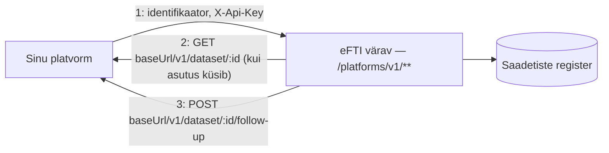

# Platvormi liidestumise juhis

eFTI värav pakub **kahesuunalist** REST-liidest registreeritud eFTI platvormidele. See juhis
kirjeldab, mida platvorm väravale saadab, ja mida platvorm ise peab väravale vastu pakkuma.

> Enne alustamist: platvorm peab olema Admini kasutajaliideses registreeritud (vt
> [`docs/user-guide/src/platforms.md`](../user-guide/src/platforms.md)) — ID, base-URL,
> väljuvad päised ja API võti tuleb sinu gate'i operaatorilt/adminilt. Operaator loob
> platvormi kirje ja genereerib `X-Api-Key` (`POST /admin/v1/platforms/api-key/:id`) —
> täisvõtit näidatakse üks kord, hoia see turvaliselt.

## Ülevaade



Kaks eraldi suunda, kaks eraldi rolli:

1. **Platvorm → värav** (sina algatad): laed üles saadetise identifikaatori
   (`POST /platforms/v1/consignments`). Autendid ennast oma `X-Api-Key`-ga.
2. **Värav → platvorm** (värav algatab, sina vastad): kui pädev asutus küsib selle saadetise
   täisandmestikku või saadab järelpärimise, kutsub värav SINU `baseUrl`-i — sinu teenus peab
   need kaks otspunkti pakkuma ja autentima gate'i väravalt saadud päistega
   (mis on Adminis seadistatud `headers` väljal).

Töötav, käivitatav viitrealisatsioon nii 2. kui 3. sammu jaoks: **`DSL/Ruuter/mock-platform/`**
selles repos (jookseb dev-compose'is ruuteri sees teel `http://ruuter:8086/mock-platform`,
seemendatud platvormina `mock`, API võti `mock-secret-key`). Loe seda otse kui täpseimat
lepingut — see juhend on selle kokkuvõte.

---

## 1. Saadetise identifikaatori üleslaadimine

### `POST /platforms/v1/consignments`

Kaks kuju, sõltuvalt sellest, kuidas su platvorm väravaga ühendub:

| Kuju | Millal | Path | Body |
|---|---|---|---|
| **Täis-FTI004** | eDelivery/AS4 kaudu ühendudes (`platforms.e_delivery_cert` seadistatud) | `/platforms/v1/consignments` | Terve `FTI004UploadIdentifierRequest` (GateID/PlatformID/DatasetID + `ParameterIDSetCriteria`) |
| **Lühike** | Otse REST-iga ühendudes (`platforms.base_url`) | `/platforms/v1/consignments/:datasetId` — **`datasetId` on path-parameeter** | Ainult `<ParameterIDSetCriteria>` element |

Mõlemal juhul: `Content-Type: text/xml`, keha on **toores XML string**, mitte JSON-mähitud.

**Päised:**

| Päis | Kohustuslik | Kirjeldus |
|---|---|---|
| `X-Api-Key` | jah | Sinu platvormi krediit (ADR-004) — SHA-256 võrreldakse `platforms.api_key_hash`-ga |
| `Content-Type` | jah | `text/xml` |
| `X-Gate-Id` | ei | Vaikimisi selle värava enda ID. Määra ainult siis, kui laed identifikaatori teise värava jaoks üles (harv) |
| `X-Request-ID` | ei | Korrelatsiooni-ID logides |

**Näide — lühike kuju** (`X-Gate-Id` vaikimisi, `datasetId` path-is):

```
POST /platforms/v1/consignments/b0284c81-a79d-11f1-931a-4ca954ebfb9f
Content-Type: text/xml
X-Api-Key: <sinu-võti>

<ParameterIDSetCriteria xmlns:udt="urn:eu:move:eFTI:data:standard:UnqualifiedDataType:34">
  <CarrierAcceptanceDateParameterScope>
    <SpecifiedDateTime><udt:DateTimeString format="102">20260924</udt:DateTimeString></SpecifiedDateTime>
  </CarrierAcceptanceDateParameterScope>
  <CarrierAcceptanceCountryParameterScope><CountryID>DE</CountryID></CarrierAcceptanceCountryParameterScope>
  <MainCarriageTransportMeansIDParameterScope><ID>MOCK-123</ID></MainCarriageTransportMeansIDParameterScope>
  <MainCarriageModeCodeParameterScope><TransportModeParameterCode>3</TransportModeParameterCode></MainCarriageModeCodeParameterScope>
</ParameterIDSetCriteria>
```

Täisnäited: [`examples/platforms/short-upload.xml`](examples/platforms/short-upload.xml) (see
näide) ja täis-FTI004 vorm — vt
[`code/xml-mapper/xsd/FTI004/sample.xml`](../../code/xml-mapper/xsd/FTI004/sample.xml).

**Vastus (201):** väljanimed camelCase (ReSql teisendab need alati wire peal, sõltumata SQL-i
veerunimedest):

```json
{
  "rowId": "…", "datasetId": "b0284c81-…", "platformId": "sinu-platvormi-id",
  "gateId": "EU-EE", "status": "ACTIVE", "createdAt": "2026-09-24T…"
}
```

**Oluline piirang:** dokumendis kodeeritud `PlatformID` ja `GateID` peavad ühtima autenditud
platvormi ja selle värava enda ID-ga (case-insensitive) — muu platvormi nimel identifikaatorit
üles laadida ei saa. Sama saadetise `dataset_id` peale saab hiljem saata uue versiooni (append-only
registrimudel — vt [`AGENTS.md`](../../AGENTS.md) "Database rules"); viimane loomisaeg võidab.

### Veakoodid

| Staatus | Kood/põhjus | Tähendus |
|---|---|---|
| 401 | — | `X-Api-Key` puudub või ei vasta ühelegi aktiivsele platvormile |
| 403 | `Forbidden` (mitu platvormi) | Sinu võtme räsi vastab enam kui ühele aktiivsele platvormile — operaatori konfiguratsiooniviga, teata gate'i operaatorile |
| 403 | `Consignment UIL must belong to the authenticated platform and this gate` | XML-i sees kodeeritud PlatformID/GateID ei ühti autenditud platvormi või selle värava enda ID-ga |
| 400 | `Invalid consignment XML` | XML ei vasta XSD-le või on parsimatu — kontrolli nimeruume ja kohustuslikke välju |
| 502 | `XML mapper unavailable` | Ajutine värava-sisene tõrge — proovi uuesti |
| 500 | `Failed to insert consignment` / `… could not be verified` | Andmebaasi tõrge — proovi uuesti, kestva tõrke korral teata operaatorile |

---

## 2. Andmestiku väljastamine väravale (`baseUrl`)

Kui pädev asutus küsib selle saadetise **täisandmestikku**, kutsub värav SINU teenust:

### `GET {baseUrl}/v1/dataset/{datasetId}?subsets=EU01,EU02,…`

**Päised, mida värav saadab:** Adminis platvormi kirje `headers` väljal seadistatu (nt oma
`X-Api-Key`, kui su teenus seda nõuab) + `X-Request-ID`.

**Sinu vastus peab olema:** `200 OK`, `Content-Type: text/xml`, toores XML — **paljas
`<rsm:SpecifiedSupplyChainConsignment>` element** (nimeruum
`urn:eu:move:eFTI:data:standard:FTI010GetCmdsResponse:1`), **ilma** ümbritseva
`FTI010GetCmdsResponse`/`ExchangedDocument` mähiseta — värav lisab selle ise. Täpne kuju, mida
väravale tagastada:

[`examples/platforms/dataset-response.xml`](examples/platforms/dataset-response.xml) (lühendatud) —
täisstruktuur: [`DSL/Ruuter/mock-platform/GET/v1/dataset.yml`](../../DSL/Ruuter/mock-platform/GET/v1/dataset.yml).

`subsets` parameeter loetleb, milliseid eFTI andmealamhulki (EU01–EU07 vms) pädev asutus küsis —
sinu teenus võib selle järgi vastuse sisu piirata, aga see pole kohustuslik (värav ei filtreeri
üle; vastutus jääb platvormile subsette austada).

Kui su teenuse vastus ei ole `200`, transpordiviga (ühendus katkes, DNS, ajalõpp) või vigane XML,
saab pädev asutus **502 Bad Gateway** — sinu teenuse saadavus mõjutab otseselt asutuse töövoogu.

---

## 3. Järelpärimise (follow-up) vastuvõtmine

Kui pädev asutus saadab saadetise kohta järelpärimise:

### `POST {baseUrl}/v1/dataset/{datasetId}/follow-up`

**Päised:** Adminis seadistatud `headers` + `Content-Type: application/json` + `X-Request-ID` +
`X-Dataset-Request-ID` (esimene `referenceIds` väärtus).

**Keha (JSON):**

```json
{
  "uil": { "gateId": "EU-EE", "platformId": "sinu-platvormi-id", "datasetId": "…" },
  "referenceIds": ["073b32bc-…"],
  "message": "Palun saatke saadetise täiendavad dokumendid.",
  "files": [{ "fileName": "document.pdf", "base64Content": "…", "mimeType": "application/pdf" }]
}
```

`files` on valikuline. **Vasta `201`** — värav edastab sinu vastuse staatuse otse asutusele
tagasi; midagi enamat väravale tagastada pole vaja. Referentsteostus:
[`DSL/Ruuter/mock-platform/POST/v1/dataset.yml`](../../DSL/Ruuter/mock-platform/POST/v1/dataset.yml)
(vaata `check_path` — see teenindab nii `GET /v1/dataset/:id` kui `POST /v1/:id/follow-up` samas
failipuus, path'i teine segment eristab).

---

## 4. Alternatiiv: eDelivery/AS4

REST (`baseUrl`) asemel saab liidestuda ka eDelivery/AS4 kaudu (mTLS, sõnumipõhine, sama muster
mis väravatevahelisel suhtlusel) — see nõuab operaatoriga eraldi kokkulepet (sertifikaadi vahetus,
`platforms.e_delivery_cert`). Enamikule platvormidele piisab lihtsamast REST-liidesest; AS4 on
mõeldud juhtudele, kus platvormil on juba eDelivery access point olemas. Küsi oma gate'i
operaatorilt, kui see on sinu jaoks vajalik.

---

## 5. Onboarding'u kontrollnimekiri

1. Lepi gate'i operaatoriga kokku platvormi ID ja REST `baseUrl` (peab olema avalikult
   ligipääsetav väravale — HTTPS soovitatav).
2. Operaator loob platvormi kirje Adminis ja genereerib `X-Api-Key`; salvesta see turvaliselt.
3. Kui su `baseUrl`-teenus vajab oma autentimist, anna operaatorile vastav päis-väärtus
   (nt `X-Api-Key: <sinu-teenuse-võti>`) kirje `headers` väljale.
4. Implementeeri kaks otspunkti oma teenuses: `GET /v1/dataset/:datasetId` (§2) ja
   `POST /v1/dataset/:datasetId/follow-up` (§3) — vaata `DSL/Ruuter/mock-platform/` täpse lepingu
   jaoks.
5. Testi kohapeal `mock`-platvormi vastu (dev-compose'is seemendatud, API võti
   `mock-secret-key`) — laadi üles `short-upload.xml`, siis mine Admini **Saadetised** vaatesse ja
   vaata sama identifikaatorit.
6. Kui kõik toimib dev vastu, palu operaatorilt tootmisvõti ja korda tootmiskeskkonnas.

Küsimused: **Sten Viljus** — <Sten.Viljus@Askend.com>.
