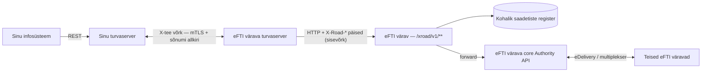
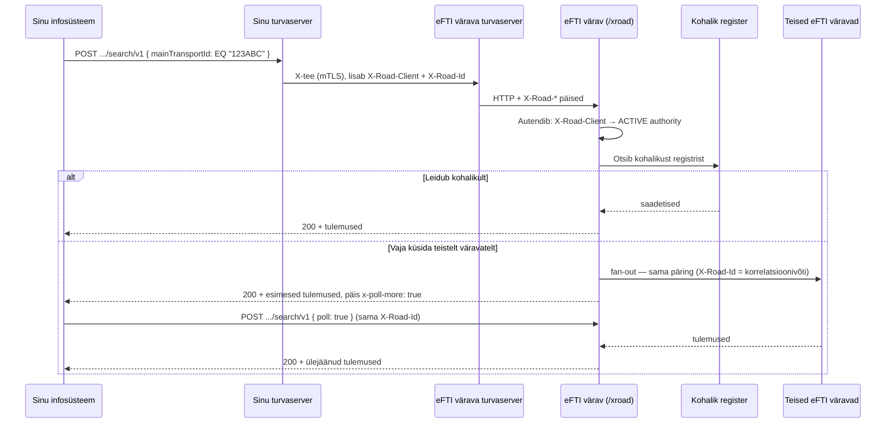

# X-tee liidestumise juhis pädevale asutusele

eFTI värav pakub X-tee kaudu pakkuja-poolset teenust pädevatele asutustele. See juhis kirjeldab
teenuse identifikaatorid, päringu- ja vastuseväljad ning vead.

> **Masinloetav leping:** [`x_road_openapi.yaml`](x_road_openapi.yaml) — OpenAPI 3.0
> kirjeldus kõigist kuuest operatsioonist (skeemid, päised, veakoodid). Käesolev
> dokument on proosaallikas; `x_road_openapi.yaml` on selle formaalne vaste.
> Praegu on `dev`-is teostatud ainult `echo` ja `subsets`; ülejäänud on leping.

## Ülevaade



Sinu turvaserver autendib sinu organisatsiooni mTLS-iga ja edastab selle päisena
`X-Road-Client`. eFTI värav usaldab seda päist — autentimine on juba toimunud. Värava pool
`/xroad/v1/**` ei ole avalikult marsruuditav; ligi pääseb ainult eFTI värava turvaserver.

## Näide: otsing auto numbri järgi



Kohalik-esmalt-siis-fan-out kehtib alati `search`-i puhul ja `transport-means`-i puhul siis, kui
`scope: allgates`.

## Teenuse identifikaator

eFTI värava X-tee liige ja alamsüsteem: **`EE/GOV/70001231/efti-gate`**.

Tarbija URL: `POST /r1/EE/GOV/70001231/efti-gate/{serviceCode}/v1[/...]`. `serviceCode` vastab
operatsioonile (`echo`, `subsets`, `transport-means`, `search`, `dataset`, `follow-up`). Värava
poolel vastab sellele tee `/xroad/v1/{serviceCode}`.

Sinu `X-Road-Client` on sinu organisatsiooni X-tee id. Kehtib nii 3-osaline
(`EE/GOV/70000097`) kui 4-osaline (`EE/GOV/70000097/tram`) kuju. Ligipääsuõiguse annab
`memberCode` (index 2), mis peab olema sinu **äriregistri kood** — värav lahendab selle
`authorities.registry_code` järgi täpselt üheks `ACTIVE` asutuse kirjeks.

## Eeltingimused

| Nõue | Kes teeb |
|---|---|
| Sinu organisatsioon on väravas registreeritud ühe `ACTIVE` asutusena, `registry_code` = sinu äriregistri kood | värava operaator |
| `authorities.subsets` on täidetud (nt `["EU01","EU05"]`) — vajalik `dataset`-i ja `transport-means`-i jaoks | värava operaator |
| Sinu kliendi-alamsüsteemil on X-tees access rights värava teenustele | RIA / turvaserveri haldus |

## Päised

Päised paneb turvaserver, mitte sina.

| Päis | Kohustuslik | Roll |
|---|---|---|
| `X-Road-Client` | jah | Kredentsiaal. `instance/memberClass/memberCode[/subsystemCode]`. `memberCode` → `authorities.registry_code`. |
| `X-Road-Id` | jah | Sõnumi id. Peab olema UUID. Logitakse korrelatsiooniks; ühtlasi `search`-i polling-võti. |
| `X-Road-UserId` | ei | Lõppkasutaja isikukood. Ei anna õigusi (X-tee ei autendi seda). Mõeldud auditiks. |
| `X-Road-Service`, `X-Road-Represented-Party`, `X-Road-Issue` | ei | Informatiivsed. |

`X-Road-Id` peab olema **UUID**. Värav vastendab selle sisemiseks `x-request-id`-ks, mida
tarbitakse tüübitud UUID-parameetrina. Mitte-UUID → `400 INVALID_REQUEST_ID`. Kui sinu süsteem
seab id ise (X-tee lubab siin suvalist unikaalset stringi), kasuta UUID-e. Kontroll on kujuline
(5 osa pikkustega 8-4-4-4-12).

## Operatsioonid

Vastuse `Content-Type` on `application/json`. Vead on
[RFC 7807](https://datatracker.ietf.org/doc/html/rfc7807) kujuga
(`type`/`code`/`title`/`status`/`detail`), meediatüübiga `application/json`.

| Operatsioon | `serviceCode` | Alamhulgakontroll | Fan-out teistele väravatele |
|---|---|---|---|
| Ühenduse test | `echo` | ei | ei |
| Oma õiguste päring | `subsets` | ei | ei |
| Veovahendi / veoseühiku otsing | `transport-means` | EU02 | ei (`scope: local`); `scope: allgates` → jah |
| Saadetiste otsing | `search` | ei | jah |
| Andmehulga päring | `dataset` | jah (`subsets ⊆ authorities.subsets`) | jah (kui `uil.gateId` ≠ eFTI värav) |
| Follow-up sõnum | `follow-up` | ei | jah (kui `uil.gateId` ≠ eFTI värav) |

---

### 1. `echo` — ühenduse test

Saadab tagasi tuvastatud asutuse ja päised.

**Päring**
```
POST /r1/EE/GOV/70001231/efti-gate/echo/v1
Content-Type: application/json

{ "hello": "world" }
```

**Vastus 200**
```json
{
  "xRoadClient": "EE/GOV/70000097/tram",
  "xRoadId": "4894e35d-bf0f-44a6-867a-8e51f1daa7e0",
  "xRoadUserId": null,
  "authority": { "id": "auth-mta", "registryCode": "70000097", "name": "...", "subsets": ["EU01","EU05"], "status": "ACTIVE" },
  "echo": { "hello": "world" }
}
```

---

### 2. `subsets` — oma alamhulga-õigused

Tagastab sinu organisatsiooni lubatud alamhulgad. Registrikood võetakse ainult `X-Road-Client`
päisest — teise organisatsiooni kohta küsida ei saa. Üks kutse katab kõik alamhulgad; vasta oma
jah/ei küsimustele lokaalselt.

**Päring**
```
GET /r1/EE/GOV/70001231/efti-gate/subsets/v1
```

**Vastus 200**
```json
{ "registryCode": "70000097", "authorityId": "auth-mta", "subsets": ["EU01", "EU05"] }
```

`subsets: []` on kehtiv 200 — asutus on registreeritud, õigusi ei ole.

**Vead:** `400 MISSING_REQUIRED_HEADER`, `401 UNAUTHORIZED`, `403 FORBIDDEN`.

---

### 3. `transport-means` — veovahendi / veoseühiku otsing

Tunnus sisse, identifikaatoritasandi andmed välja. Tunnust sobitatakse põhiveo veovahendi
tunnuse (`main_transport_id`) ja veoseühikute tunnuste (`used_equipment_ids` /
`carried_equipment_ids`) vastu — sama väli katab numbrimärgi ja konteinernumbri.

Dataset-sisu ei tagastata — selle saab pärida `dataset`-iga tagastatud `uil`-i abil. Tundmatu
tunnus → `200` koos `found: 0` (mitte 404).

Nõuab **EU02**-t `authorities.subsets`-is, muidu `403 FORBIDDEN_SUBSET`.

Sobitamine on tähtsuurustundlik ja trimmimata. Kohaliku otsingu tulemus on piiratud 50 reaga.

**Päring**
```
POST /r1/EE/GOV/70001231/efti-gate/transport-means/v1
Content-Type: application/json

{ "identifier": "123ABC", "countryCode": "EE", "scope": "local" }
```

| Väli | Kohustuslik | Sisu |
|---|---|---|
| `identifier` | jah | veovahendi või veoseühiku tunnus; mittetühi string |
| `countryCode` | ei | registririigi filter; puudub/tühi = kõik riigid |
| `scope` | ei | otsingu ulatus, kasvava hinnaga: `existence` \| `local` (vaikimisi) \| `allgates`. Vt tabel allpool. |

### `scope`

| `scope` | Ulatus | Vastus | Latents |
|---|---|---|---|
| `existence` | ainult kohalik | `{ identifier, countryCode, registered: true\|false }` | p95 < 1 s |
| `local` *(vaikimisi)* | ainult kohalik | `{ identifier, countryCode, found, consignments: [...] }` | sünkroonne |
| `allgates` | kohalik + kõik naaberväravad | sama kuju mis `local`, tulemused kogunevad | asünkroonne: vastuse päis `x-poll-more: true` kuni naaberväravad vastavad; küsi uuesti sama `X-Road-Id` + kehaga `{ "poll": true }` |

`existence` on alla-sekundi rada ega lahku riigist — ANTS-i olemasolukontrolli jaoks. `local` ja
`allgates` vastuse kuju on identne, nii et võrgu kaasamine on ühe välja muutus.

> **⚠ `scope: allgates` ei ole PR #121-s veel teostatud.** API-leping (kolmas väärtus) on
> paigas; fan-out'i teostus tuleb eraldi. Kuni siis tagastab `allgates` `400 BAD_REQUEST_GENERAL`
> või käitub nagu `local` — vt marsruudi lõplikku olekut.

**Vastus 200** (`scope: local`, vaikimisi)
```json
{
  "identifier": "123ABC",
  "countryCode": "EE",
  "found": 1,
  "consignments": [
    {
      "uil": { "gateId": "EU-EE", "platformId": "mock", "datasetId": "550e8400-e29b-41d4-a716-446655440001" },
      "mainTransportId": "123ABC",
      "mainTransportType": "...",
      "transportRegCountry": "EE",
      "transportMode": "3",
      "dangerousGoods": null,
      "acceptanceDate": null, "acceptanceCountry": null,
      "deliveryDate": null, "deliveryCountry": null,
      "loadingDate": null, "loadingCountry": null,
      "unloadingDate": null, "unloadingCountry": null,
      "usedEquipmentIds": [], "usedEquipmentCategories": [], "usedEquipmentCountries": [],
      "carriedEquipmentIds": [], "carriedEquipmentCategories": [],
      "status": "ACTIVE",
      "createdAt": "2026-04-23T10:15:00Z"
    }
  ]
}
```

`found` võrdub alati `consignments.length`-iga. Tundmatu tunnus:
`{ "identifier": "...", "countryCode": null, "found": 0, "consignments": [] }`.

**Vastus 200** (`scope: existence`)
```json
{ "identifier": "123ABC", "countryCode": "EE", "registered": true }
```

**Vead**

| Staatus | `code` | Millal |
|---|---|---|
| 400 | `BAD_REQUEST_GENERAL` | `identifier` puudub, tühi või pole string; või `scope` on tundmatu väärtus |
| 400 | `INVALID_REQUEST_ID` | `X-Road-Id` pole UUID-kujuline |
| 403 | `FORBIDDEN_SUBSET` | asutusel puudub EU02; keha kannab `deniedSubsets`, `permittedSubsets`, `authorityId` (otsitavat tunnust ei kajastata) |
| 403 | `FORBIDDEN` | ei lahene üheks `ACTIVE` asutuseks |
| 502 | `GATEWAY_UNAVAILABLE` | värava andmekiht ebaõnnestus; keha kannab `failedStep` ja `resqlStatus` |

---

### 4. `search` — saadetiste otsing

Otsib identifikaatoritasandi metaandmeid kriteeriumide järgi: kõigepealt kohalikust registrist,
siis fan-out naaberväravatele. Alamhulgakontrolli ei ole — pädeval asutusel on
identifikaatoriotsing piiramata (määrus 2024/1942).

Kriteeriumi kuju iga välja kohta:
`{ "<väli>": { "operator": "EQ" | "NE" | "LT" | "LE" | "GT" | "GE", "<väärtusevõti>": "..." } }`.

Väljad: `transportMode` (võti `mode`), `mainTransportId` (`id`), `mainTransportType` (`code`),
`transportRegCountry` / `acceptanceCountry` / `deliveryCountry` / `loadingCountry` /
`unloadingCountry` (`country`), `dangerousGoodsCode` (`code`), `usedEquipmentId` /
`carriedEquipmentId` (`id`), `usedEquipmentCategory` / `carriedEquipmentCategory` (`code`),
`usedEquipmentCountry` (`country`), `acceptanceDate` / `deliveryDate` / `loadingDate` /
`unloadingDate` (massiiv objekte `{ "operator": "...", "date": "2026-04-23T00:00:00Z" }`).

**Päring**
```
POST /r1/EE/GOV/70001231/efti-gate/search/v1
Content-Type: application/json

{ "mainTransportId": { "operator": "EQ", "id": "123ABC" } }
```

**Vastus 200** — sobivad saadetised. Kui vastuse päis `x-poll-more: true`, vastavad
naaberväravad veel. Küsi uuesti sama `X-Road-Id`-ga ja kehaga `{ "poll": true }`:

```
POST /r1/EE/GOV/70001231/efti-gate/search/v1
X-Road-Id: 4894e35d-bf0f-44a6-867a-8e51f1daa7e0   ← sama id

{ "poll": true }
```

Turvaserver annab uuele päringule tavaliselt uue `X-Road-Id` — pollimiseks pead selle teadlikult
üle kirjutama sama väärtusega.

**Vead:** `401 UNAUTHORIZED`, `403 FORBIDDEN`, `502 GATEWAY_UNAVAILABLE`
(`core` vastas ≥ 400; `coreStatus` / `coreResponse` kannavad päris vastust).

---

### 5. `dataset` — andmehulga päring

Edastab core Authority API-le pärast alamhulga-õiguse kontrolli. Kõik `subsets` peavad olema
`authorities.subsets`-i sees. Osaliselt lubatud päring keeldutakse tervikuna — vaikset
kitsendamist ei tehta. Oma õigusi vaata enne `subsets`-iga.

**Päring**
```
POST /r1/EE/GOV/70001231/efti-gate/dataset/v1
Content-Type: application/json

{
  "uil": { "gateId": "EU-EE", "platformId": "mock", "datasetId": "550e8400-e29b-41d4-a716-446655440001" },
  "subsets": ["EU01", "EU05"]
}
```

| Väli | Kohustuslik | Sisu |
|---|---|---|
| `uil.gateId` | jah | värava id; kui ≠ eFTI värav, edastatakse naaberväravale |
| `uil.platformId` | jah | platvormi id |
| `uil.datasetId` | jah | dataset UUID (platvormi määratud) |
| `subsets` | jah, vähemalt 1 | soovitud alamhulgad; massiiv stringe |

**Vastus 200** — dataset XML platvormilt/naaberväravalt, muutmata
(`{ "uil": {...}, "subsets": [...], "xml": "<...>" }`).

**Vead**

| Staatus | `code` | Millal |
|---|---|---|
| 400 | `MISSING_SUBSET` | `subsets` tühi või puudub |
| 400 | `BAD_REQUEST_GENERAL` | keha lükkas andmekiht tagasi (nt `subsets` stringina, mitte massiivina) |
| 400 | `INVALID_REQUEST_ID` | `X-Road-Id` pole UUID-kujuline |
| 401 | `UNAUTHORIZED` | `X-Road-Client` puudub/vigane |
| 403 | `FORBIDDEN` | ei lahene üheks `ACTIVE` asutuseks |
| 403 | `FORBIDDEN_SUBSET` | mõni soovitud alamhulk pole lubatud |
| 502 | `GATEWAY_UNAVAILABLE` | `core` vastas ≥ 400 (`coreStatus` / `coreResponse` kannavad päris vastust) |

`FORBIDDEN_SUBSET` keha näide:
```json
{
  "type": "https://api.efti.ee/errors/forbidden-subset",
  "code": "FORBIDDEN_SUBSET",
  "title": "Subset Access Denied",
  "status": 403,
  "detail": "The requesting authority is not permitted to access one or more of the requested eFTI subsets.",
  "authorityId": "auth-mta",
  "deniedSubsets": ["EU06"],
  "permittedSubsets": ["EU01", "EU02"]
}
```

---

### 6. `follow-up` — follow-up sõnum

Edastab core Authority API-le. Alamhulgakontrolli ei ole.

**Päring**
```
POST /r1/EE/GOV/70001231/efti-gate/follow-up/v1
Content-Type: application/json

{
  "uil": { "gateId": "EU-EE", "platformId": "mock", "datasetId": "550e8400-e29b-41d4-a716-446655440001" },
  "message": "Palun täpsustage veose kaal.",
  "referenceIds": ["REF-1"],
  "files": []
}
```

| Väli | Kohustuslik | Sisu |
|---|---|---|
| `uil` | jah | `{ gateId, platformId, datasetId }` |
| `message` | jah | sõnumi tekst |
| `referenceIds` | ei | viidatud identifikaatorid |
| `files` | ei | failiviidete massiiv |

**Vastus 200** — platvorm/naabervärav võttis follow-up'i vastu.

**Vead:** `401 UNAUTHORIZED`, `403 FORBIDDEN`, `502 GATEWAY_UNAVAILABLE`.

---

## Veakataloog

| Staatus | `code` | `type` (suffiks pärast `https://api.efti.ee/errors/`) |
|---|---|---|
| 400 | `MISSING_REQUIRED_HEADER` | `missing-required-header` |
| 400 | `INVALID_REQUEST_ID` | `invalid-request-id` |
| 400 | `MISSING_SUBSET` | `missing-subset` |
| 400 | `BAD_REQUEST_GENERAL` | `bad-request` |
| 401 | `UNAUTHORIZED` | `unauthorized` |
| 403 | `FORBIDDEN` | `forbidden` |
| 403 | `FORBIDDEN_SUBSET` | `forbidden-subset` |
| 502 | `GATEWAY_UNAVAILABLE` | `bad-gateway` |

`502` puhul hargne `coreStatus` peal, mitte HTTP-staatuse peal — värav normaliseerib core vea
alati 502-ks, päris staatus ja keha on `coreStatus` / `coreResponse` (andmekihi vea puhul
`resqlStatus`) sees.

Kõva core-katkestus (ühendus keeldub, DNS, 70 s timeout) tuleb 500-na, mitte 502-na.

## Kontrollnimekiri

1. Küsi värava operaatorilt kinnitus, et sinu organisatsioon on `ACTIVE` asutusena
   registreeritud õige `registry_code` ja `subsets`-iga; lase RIA-l anda kliendi-alamsüsteemile
   access rights värava teenustele.
2. `echo` — kontrolli, et `authority.registryCode` ja `subsets` on õiged.
3. `subsets` — vaata oma alamhulga-õigusi; hoia neid cache'is.
4. Genereeri iga päringu jaoks UUID `X-Road-Id` (või lase turvaserveril seada).
5. Otsi → `search`; kui `x-poll-more: true`, pollida sama id-ga ja `{ "poll": true }`.
6. Sisu → `dataset` tagastatud `uil` ja lubatud `subsets`-iga.

## Arendaja-mock

Kui X-tee juurdepääsu, turvaserverit ega asutuse registreeringut veel ei ole, ehita ja testi
oma klienti avaliku mock-teenuse vastu, mis matkib seda liidest konserveeritud vastustega.
Sihtdomeen on `https://dev.efti.ee/developer/`, esialgu on ta üleval aadressil
**`https://eu-ee.pikker.dev/developer/v1/{serviceCode}`**. Vt
[`x_road_developer_mock.md`](x_road_developer_mock.md) — sisendid, vastused ja erilised
testkoodid (nt `memberCode 70000000` alamhulga-vea jaoks).

**Postmani kollektsioon:**
[`eFTI-developer-mock.postman_collection.json`](eFTI-developer-mock.postman_collection.json) —
kõik kuus operatsiooni + vea- ja tervisekontrolli päringud, `baseUrl` muutujaga
(vaikimisi `https://eu-ee.pikker.dev`). Impordi Postmani (File → Import) ja jooksuta.

## Küsimused

Liidestumisel tekkivate küsimustega pöördu **Sten Viljus** — <Sten.Viljus@Askend.com>.
