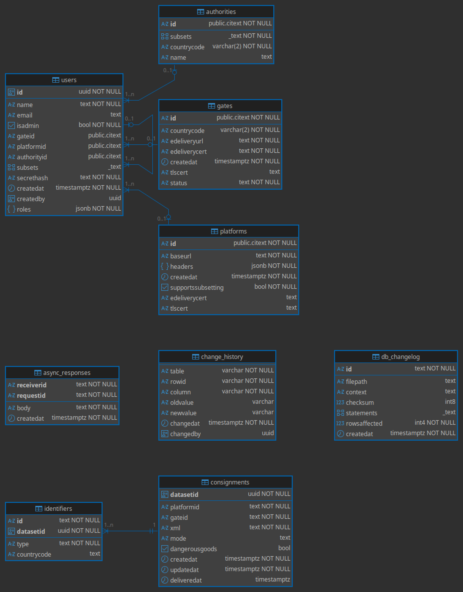

# Andmemudel

> **v2.0 spetsifikatsioon:** [`../../specs/db/schema.sql`](../../specs/db/schema.sql) — täielik PostgreSQL andmebaasi skeem (lühike ülevaade: [`../../specs/db/README.md`](../../specs/db/README.md)).

## Andmemudeli ülevaade
eFTI värava (Gate) andmemudel on loodud toetama kiiret ja turvalist sõnumivahetust 
pädevate asutuste, platvormide ja teiste liikmesriikide väravate vahel.
Andmebaasina kasutatakse PostgreSQL relatsioonilist andmebaasi, 
kuna see pakub kõrget töökindlust, tugevat andmete tervikluse kontrolli ning
laialdasi võimalusi keerukate päringute teostamiseks. 
PostgreSQL toetab ACID-omadusi, mis tagavad tehingute usaldusväärsuse ja andmete 
järjepidevuse ka süsteemivigade korral. Lisaks võimaldab see kasutada indekseerimist, 
vaateid ja salvestatud protseduure, mis parandavad süsteemi jõudlust ja paindlikkust.

eFTI andmemudel ning selle alamhulgad on kirjeldatud EL regulatsiooniga 2024/2024.
Selle põhjal on koostatud XSD skeemad, mis kirjeldavad seda andmesetti XML kujul.
XSD failid on leitavad selle projekti xsd kaustast.

## RoI tabelid (Registry of Identifiers)
RoI on register, mis hoiab platvormide poolt üles laaditud eFTI andmestike identifikaatoreid
ja võimaldab nende otsimist. 
- UIL (Unique Identifying Link) hoiustamine: Tabelites säilitatakse UIL-i komponente: värava ID, platvormi ID ja andmestiku unikaalne UUID .
- Otsingutunnused: RoI sisaldab seoseid UIL-i ja konkreetsete veo identifikaatorite vahel, nagu veoviisi kood (eFTI39), sõiduki registrinumber (eFTI188) ja ohtlike kaupade näitaja (eFTI1451).
- Andmeformaat: Platvormi poolt ülesse laetud identifikaatoried tuleks hoida XML kujul, nii nagu need algselt ka saadeti. Värava põhiülesanne on olla info edastaja ning saata otse edasi andmeid mida ta on saanud. Selle põhimõtte järgi ei ole mõtekas andmeid hoida muul kujul kui XML-ina andmebaasi veerus. 
- Staatused: Tabelid peavad haldama UIL-ide olekuid (aktiivne, deaktiveeritud, kustutatud).

## Logitabelid
Logimine on kriitiline auditijälje ja süsteemi seire tagamiseks. Küllaga ei ole andmebaas õige koht selleks kus hoida süsteemi logisid, selleks on olemas logifail. 

Mida võiks logida andmebaasi? 
- Logida peaks mõningaid metaandemid nagu näiteks millal on mõnda välja muudetud.
- Logima peaks ka kõiki muudatusi mida on tabelitele tehtud. Nagu näiteks tabelite nimed ja kes on muudatuse teinud ning millal. 

## Konfiguratsioonitabelid
Need tabelid haldavad värava ühendusi teiste süsteemidega.

- Väravate ja platvormide register. Teiste liikmesriikide väravate ning kohalike
sertifitseeritud platvormide unikaalsed ID-d ja tehnilised aadressid. 
Siin hoitakse ka platvormide ja väravate URLe ning sertifikaate. 
- Pädevate asutuste register. Hoiab infot ühendatud pädevate asutuste kohta. Eesti kontekstis on
pädevad asutused ühendatud värava väliselt, mis tähendab et see register hoiab ainult süsteemide ühenduseks olulist infot

## Õiguste ja rollide tabelid
Ligipääsu hallatakse läbi Loaregistri (Permission Register).

- Juurdepääsu- ja töötlemisõigused. Ametnikele määratud õigused on väljendatud JSON
struktuurina, mis sisaldab 3 välja: väravad, platvormid ja pädevad asutused.
Need väljad võivad sisaldada ID väärtuseid, mis määravad admin õigused selle ID jaoks.
- Kasutaja saab olla kas süsteemi kasutaja või admin.
Adminil on õigus oma andmeid muuta admin paneelil väravas.
Süsteemi kasutaja on mõeldud API liidestuste jaoks. Eesti näitel pädevate asutuste liidestused läbi X-Tee kasutavad süsteemi kontosid.

Loe lähemalt õiguste kohta sellest failist: [ACCESS.md](ACCESS.md)

## ER diagramm

## Andmete säilituspõhimõtted
eFTI värava põhimõte on olla info edastaja ning andmeid võimalikult vähe ise salvestada.
Sellegi poolest on oluline mõningaid andmeid andmebaasis hoida, selleks et kõik eFTI kasutusjuhud
oleksid võimaldatud.

- Nii asutuse juurdepääsupunkt (AAP) kui ka eFTI värav peavad säilitama eFTI andmetele
juurdepääsu taotluste ja neile saadud vastuste logide arhiivi vähemalt kaks aastat
(eFTI regulatsioon 2024/1942 art. 11). GDPR artikkel 30 nõuab töötlemistoimingute
registri säilitamist **vähemalt 7 aastat** — auditilogi säilitustähtajaks rakendatakse
pikemat neist nõuetest, st **7 aastat**.
- Kui siseriiklikud õigusnormid seda nõuavad (näiteks kontrollitoimingute tõendamiseks),
võib säilitustähtaeg olla ka pikem kui 7 aastat.
- Liikmesriigid peavad esitama Euroopa Komisjonile iga viie aasta järel seireandmeid selle kohta,
kui palju on pädevad asutused andmetele juurde pääsenud. Need aruanded koostatakse
toimingulogide põhjal ja peavad katma iga aruandlusperioodi aastat.

### Identifikaatorite registri andmete säilituspõhimõtted
Üldreeglina deaktiveerib identifikaatorite register UIL-i ja kustutab seejärel nii UIL-i
kui ka sellega seotud identifikaatorid Artikkel 11 (4) 2024/1942.

Regulatsioon 2024/1942 artikkel 11 lõige 4 sätestab erandi 
maanteetranspordile (mille kood on „3“). Selleks, et võimaldada maanteekabotaaži 
kontrollimist vastavalt määrusele 1072/2009, deaktiveeritakse need UIL-id alles 
pärast selles määruses sätestatud aja möödumist, mitte kohe pärast kauba kohalejõudmist.

