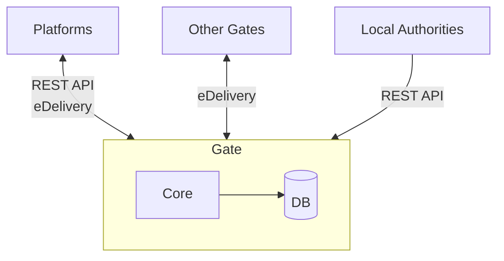
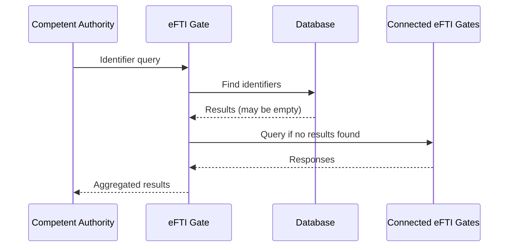
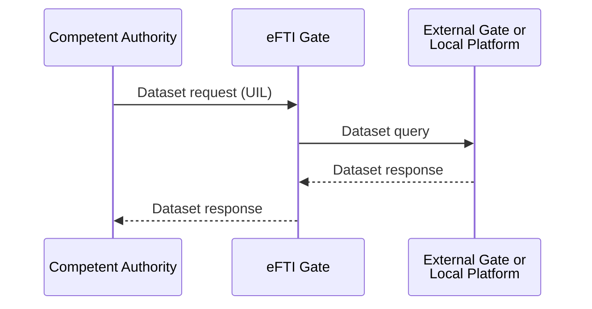
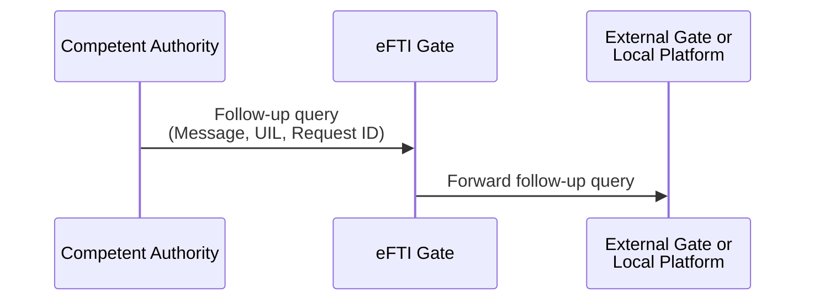

# Diagrammid

> **v2.0 spetsifikatsioon:** [`../../specs/diagrams/`](../../specs/diagrams/README.md) — 25 Mermaid diagrammi (15 järjestusdiagrammi, 5 olekudiagrammi, 3 voodiagrammi, 2 arhitektuuridiagrammi).

## Arhitektuur
Kuna eFTI värav ei ole oma olemuselt keerukas süsteem, siis ei pea olema arhitektuur ka keerukas.
eFTI värav võiks järgida põhimõtteid, mis vähendavad süsteemi keerukust.   
- Ei kasutata väliseid rakendusservereid ega raskekaalulisi raamistikke.
- Puhas ja modulaarne koodibaas, mida on lihtne mõista ja kohandada.
- Lihtsustatud liidesed platvormide ja asutustega integreerimiseks.

#### 4. Andmevood:

**Identifikaatorite otsing**

**andmeseti päring**

**Järelpäringu sõnum**
