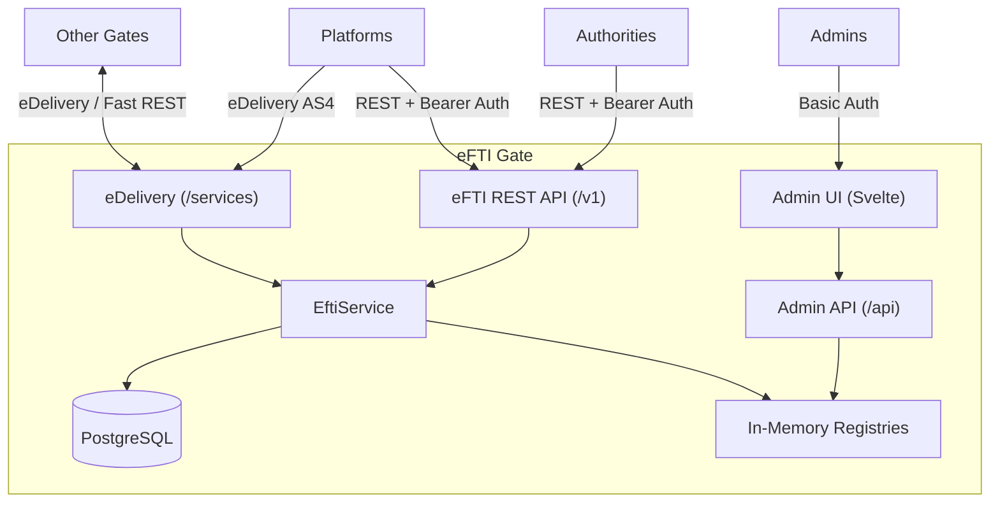

# eFTI Gate — Code Review

| | |
|---|---|
| **Author** | Sten Viljus |
| **Company** | Askend Estonia OÜ |
| **Contact** | sten.viljus@askend.com |

## 1. Introduction

### Purpose of the Analysis

This document consolidates the results of the eFTI Gate codebase analysis. The analysis covers architecture, security, performance, scalability, testing, and code quality. The goal is to provide a comprehensive overview of the system's current state and highlight strengths, weaknesses, and improvement proposals.

### Analyzed Codebase

| Property | Value |
|----------|-------|
| Project | eFTI Gate PoC |
| Language | Kotlin (JVM 21+) |
| Framework | Klite (lightweight HTTP framework) |
| Modules | 6 (gate, edelivery, subsetter, ui, demo-platform, e2e-tests) |
| Database | PostgreSQL 17 |
| Frontend | Svelte |

| Language | Files | Lines |
|----------|-------|-------|
| Kotlin (gate) | 74 | ~3,100 |
| Kotlin (edelivery) | 15 | ~975 |
| Kotlin (subsetter) | 5 | ~240 |
| Kotlin (demo-platform) | 12 | ~440 |
| Kotlin (e2e-tests) | 3 | ~380 |
| **Kotlin total** | **109** | **~5,150** |
| Svelte | 42 | ~1,750 |
| TypeScript | 33 | ~1,100 |
| **Frontend total** | **75** | **~2,850** |
| **Entire project** | **184** | **~8,000** |

---

## 2. Architecture Overview

### System Purpose

eFTI Gate is a node in the European Union's eFTI (Electronic Freight Transport Information) network, responsible for:
- **Identifier storage** — platforms register freight transport identifiers
- **Identifier search** — authorities search for identifiers locally and from other gates
- **Dataset mediation** — authorities query freight datasets by UIL
- **Follow-up message forwarding** — authorities send feedback messages to platforms

### Modules and Responsibilities

| Module | Description |
|--------|-------------|
| `gate/` | Core application — HTTP server, business logic, admin API, database |
| `edelivery/` | Custom eDelivery AS4 protocol implementation |
| `subsetter/` | XML dataset subsetting library (data filtering) |
| `ui/` | Svelte admin/authority user interface |
| `demo-platform/` | Demo platform demonstrating communication with the gate |
| `e2e-tests/` | Selenide browser end-to-end tests |

### High-Level Component Diagram



### Design Principles

1. **Simplicity** — minimal number of components, no heavy frameworks
2. **Performance** — optimized eDelivery, XML and cryptography operations
3. **Transparency** — compact codebase, easy to audit
4. **Minimal Persistence** — only identifiers are stored, not payloads

---

## 3. Technology Stack

### Backend

| Component | Technology | Notes |
|-----------|-----------|-------|
| Language | Kotlin | JVM 21+ |
| HTTP server | Klite + Java built-in HttpServer | Does not use Tomcat/Netty/Ktor etc. |
| Concurrency | Virtual Threads (Project Loom) | Each request on a separate virtual thread |
| HTTP client | Java HttpClient | Asynchronous (`sendAsync` + `await`) |
| DI | Klite DependencyInjectingRegistry | Constructor-based, without Spring |
| XML | JAXB + string templates | Deserialization + generation |
| Cryptography | JCA (AES-GCM, RSA-OAEP) | eDelivery message encryption |
| Database | PostgreSQL 17 + Klite JDBC | Simple SQL, connection pool |
| Background jobs | Klite JobRunner | Scheduled jobs (ping, expiration) |
| API docs | OpenAPI / Swagger | Automatic generation |

### Frontend

| Component | Technology |
|-----------|-----------|
| Framework | Svelte 4 |
| Types | Generated `api/types.ts` from Kotlin classes |
| Styling | Svelte scoped CSS |

### Infrastructure

| Component | Technology |
|-----------|-----------|
| Database | PostgreSQL 17-alpine |
| Containers | Docker / Docker Compose |
| Reverse proxy | Caddy (SSL termination) |
| CI/CD | GitHub Actions |

CI/CD pipeline (`.github/workflows/build.yml`) runs on every push and pull request:
1. **UI build** — `npm ci && npm run build && npm run test:run` (Node 24)
2. **Server build** — `./gradlew jar` (JDK 25, Temurin)
3. **Server tests** — `./gradlew test -x :e2e-tests:test`
4. **E2E tests** — `./gradlew :e2e-tests:test -Pci`
5. **Docker build** — `docker compose build`

Pipeline **does not include** image push to a registry or automatic deployment.

---

## 4. Code Quality and Style

### Code Style Rules

The project has defined style rules (`code-style.md`):

**Kotlin (Backend):**
- 2-space indentation
- No semicolons
- Short annotations on the same line (`@Test fun test()`)
- Expression body preferred
- Enum constant imports (without type prefix)

**SQL:**
- Lowercase keywords
- camelCase column names (matches Kotlin data classes — no transformation needed)
- Table-per-file structure for migrations

**Svelte/TypeScript:**
- Single quotes
- Generated type files
- Svelte 4 simple syntax

### Project Structure

Code is organized in a **feature-based** structure:
- `efti/gates/` — Gate domain object, repository, registry, client
- `efti/platforms/` — Platform domain object, repository, registry, client, routes
- `efti/authorities/` — Authority domain object, repository, registry, routes
- `admin/` — Admin CRUD routes
- `auth/` — Authentication and authorization logic

Each feature contains all its layers (model, repository, registry, routes) — this makes code navigation and modification easy.

### Code Size

The codebase is **compact**: ~8,000 lines in 184 files (see exact breakdown in chapter 1). Gate core application 74 files (~3,100 lines), eDelivery 15 files (~975 lines). This is a good result considering the system's functionality.

---

## 5. Security

### Authentication

The system supports two authentication methods:

| Method | Format | Usage |
|--------|--------|-------|
| **Basic Auth** | `Basic base64(email:password)` | Admin UI (browser native authentication) |
| **Bearer Token** | `Bearer base64(userId:secret)` | API access (platforms, authorities) |

Authentication is performed in the `AccessChecker` middleware, which runs before every request.

### Authorization (RBAC)

Role-based access control via annotations:

| Role | Access |
|------|--------|
| **ADMIN** (Super) | Everything — `isAdmin=true` + empty roles |
| **GATE** | Only associated gates |
| **PLATFORM** | Identifier storage under own platform |
| **AUTHORITY** | Identifier search, dataset query, follow-up |

```kotlin
@Access(ADMIN)              // Admin only
@Access(GATE, PLATFORM)     // Gate OR Platform role
@Public                     // Public endpoint
```

User roles are associated with specific Party IDs: `Map<Role, Set<PartyId>>`. Every CRUD operation checks whether the user has access to the specific entity.

### Password Management

- Passwords are hashed (`KeyGenerator.hash(secret, userId)`)
- Salt is the user UUID
- Hash is base64 encoded
- Password is visible only once during user creation

### eDelivery Cryptography

| Operation | Algorithm |
|-----------|-----------|
| Payload encryption | AES-128-GCM |
| AES key encryption | RSA-OAEP (SHA-256) |
| Signing | RSA-SHA256 |
| Compression | GZIP |

Certificates are stored in a PKCS12 keystore (`own.p12`). Gate certificates are registered via the admin UI and TrustStore is built dynamically.

### Data Protection (GDPR)

- Only **identifiers** are stored, not full datasets
- Datasets remain on platforms — the gate does not store them
- Subsets limit which data an authority can see
- Expired identifiers are automatically deleted

### Identified Security Risks

| Risk | Severity | Description |
|------|----------|-------------|
| TARA authentication missing | HIGH | Admin UI uses Basic Auth — in production should use TARA (national authentication service) |
| Username login | HIGH | Currently Basic Auth with username + password login is possible — in production this should be disabled, using only TARA |
| X-Road interfaces missing | HIGH | Interfaces with X-Road (Estonian national data exchange layer) are missing — needed for communication with authorities and platforms in production |
| Bearer Auth non-standard | HIGH | API Bearer token uses `base64(id:password)` format, which does not conform to any standard (JWT, OAuth2). May cause issues with third-party integrations |
| API Key `/services/fast` | MEDIUM | Fast adapter uses a simple `X-API-Key` header, not encrypted |
| Secrets in .env files | MEDIUM | Passwords and keys are in .env files, not in a secure vault |
| Rate limiting missing | MEDIUM | Request ID duplicate control exists, but full rate limiting is missing. **Recommendation:** implement at reverse proxy / ingress level, not in the application (see below) |
| Certificates on filesystem | LOW | PKCS12 keystore is read locally — harder to manage in container environments |
| XML canonicalization (C14N) | LOW | `Xml.kt` regex-based `canonicalXml` is actually a whitespace normalizer for its own generated string templates. **Not standard C14N**, but practical risk is low: (1) normalizes only its own generated XML with known and fixed structure, (2) during signing (`signedInfoXml`) it is used only for cleaning the SOAP envelope template, digests are calculated on specific blocks separately. Standard C14N (`javax.xml.crypto.dsig.CanonicalizationMethod`) would be formally more correct, but does not solve a practical problem |

### Rate Limiting Proposals

Rate limiting should be implemented at the **reverse proxy / ingress level**, not in application code. This provides several benefits:
- Does not load the application — excess traffic is rejected before reaching the JVM
- Configurable without code changes — modifiable in configuration
- Works automatically in front of all nodes — no shared state management needed
- Standard approach — all reverse proxies and ingress controllers support this

#### Option A: Caddy (Current Server Deploy)

The current `compose.server.yml` already uses Caddy as a reverse proxy. Caddy supports rate limiting with the `rate_limit` directive:

```
eu-ee31.eftisandbox.eu {
    rate_limit {
        zone api_zone {
            key    {remote_host}
            events 100
            window 1m
        }
        zone edelivery_zone {
            key    {remote_host}
            events 30
            window 1m
        }
    }

    @api path /api/* /v1/*
    rate_limit @api { zone api_zone }

    @edelivery path /services/*
    rate_limit @edelivery { zone edelivery_zone }

    reverse_proxy gate:8080
}
```

**Recommended limits:**
| Endpoint | Limit | Reason |
|----------|-------|--------|
| `/v1/*` (eFTI API) | 100 req/min per IP | Normal API usage |
| `/api/*` (Admin API) | 30 req/min per IP | Admin operations are less frequent |
| `/services/msh` (eDelivery) | 30 req/min per IP | eDelivery messages are larger |
| `/services/fast` (Fast Adapter) | 100 req/min per IP | Fast gate-to-gate communication |

**Effort:** ~0.5 days (Caddy configuration change)

NB: With the `caddy-docker-proxy` image, verify that the `rate_limit` module is included, or use a custom Caddy build.

#### Option B: Nginx Ingress (Kubernetes)

In Kubernetes, the nginx-ingress controller supports rate limiting via annotations:

```yaml
metadata:
  annotations:
    nginx.ingress.kubernetes.io/limit-rps: "10"
    nginx.ingress.kubernetes.io/limit-rpm: "100"
    nginx.ingress.kubernetes.io/limit-connections: "20"
    nginx.ingress.kubernetes.io/limit-whitelist: "10.0.0.0/8"
```

More detailed control is available via nginx `ConfigMap`, where different zones can be defined for different paths.

**Effort:** ~0.5 days (adding Ingress annotations)

#### Considerations

- **IP-based** rate limiting is sufficient if each client (authority, platform, gate) comes from a different IP
- If multiple clients are behind the same IP (e.g. NAT), consider **API-key-based** rate limiting (requires application-level support)
- eDelivery endpoint (`/services/msh`) should have more lenient limits — broadcast queries may generate multiple simultaneous requests
- Inter-gate IPs should be added to the **whitelist** to avoid limiting their communication

Additional security risks and proposals are documented in the [Rights and Access Control Document](../4-rights-n-permissions/eFTI_rights_and_permissions_en.md) (section 10) and [Improvement Proposals](eFTI_improvements_en.md) (section 1).

---

## 6. Performance

### Positive Design Decisions

| # | Aspect | Assessment | Description |
|---|--------|-----------|-------------|
| 1 | **Virtual Threads** | ✅ Excellent | Each HTTP request on a virtual thread — thousands of concurrent connections with minimal resources |
| 2 | **In-Memory Registries** | ✅/⚠️ Trade-off | O(1) lookup, zero DB latency for metadata reads. Excellent for PoC, but **critical issue with multiple instances** — `save()` and `delete()` only update the local `ConcurrentHashMap` + DB. `NotifiableRegistry.notifyChanged()` only notifies listeners within the same process (e.g. `KeyManager` rebuilds TrustStore), not other nodes. In production with multiple instances, this means gate/platform/authority addition/modification/deletion made through one node does not reach other nodes until restart. See [Scalability Analysis](eFTI_scalability_en.md) stage 1.1 |
| 3 | **Parallel Broadcast** | ✅ Excellent | All gates are queried in parallel (`channelFlow` + `coroutineScope` + `launch`) |
| 4 | **Fire-and-Forget Response** | ✅ Excellent | AS4 receipt is sent before message processing — lower latency |
| 5 | **Fast Adapter** | ✅ Excellent | eDelivery bypass — 4-5x faster gate-to-gate communication |
| 6 | **Custom eDelivery** | ✅ Excellent | Order of magnitude improvement vs reference implementation |
| 7 | **SSE Streaming** | ✅ Excellent | Identifier query results as a stream — local results immediately, remote gradually |
| 8 | **Minimal DB Schema** | ✅ Good | 2 main tables, composite PK, upsert |

### Questionable / Problematic Areas

| # | Aspect | Severity | Description |
|---|--------|----------|-------------|
| 1 | JAXB Unmarshaller creation | MEDIUM | Each `parse()` creates a new Unmarshaller — expensive and potentially high under load |
| 2 | DOM parsing in eDelivery | MEDIUM | Entire XML document loaded into memory — TODO comment in code |
| 3 | Request body in memory | MEDIUM | Entire eDelivery message read into memory at once |
| 4 | XML string concatenation | LOW-MEDIUM | GC pressure with large result sets |
| 5 | Regex re-compile | LOW | `Regex(...)` is created with each `handleSaveIdentifiersRequest` call |
| 6 | Expiration job | LOW | All delivered records read into memory, filtering in Kotlin code (better to move to SQL) |

### Recommendations

1. **JAXB:** Consider pooling or lighter XML parsing (StAX) under high load
2. **DOM:** Replace with StAX parsing (as the TODO in code also suggests)
3. **Regex:** Move `Regex(...)` to a companion object field
4. **StringBuilder:** Use for building XML with large result sets
5. **XML C14N (low priority):** `Xml.kt` regex-based `canonicalXml` is actually a whitespace normalizer for its own string templates — it is not standard XML Canonicalization. During signing (`EDeliveryMessageGenerator.signedInfoXml`) it is used for cleaning the SOAP envelope template, but digests are calculated on specific XML blocks separately. Standard C14N (`javax.xml.crypto.dsig.CanonicalizationMethod`) would be formally more correct, but practical risk is low — only its own generated XML is normalized, with a fixed structure
6. **XSD versioning:** Establish a formal XSD file versioning strategy to ensure smooth transition during eFTI common dataset model updates

---

## 7. Logging and Observability

### Existing Logging

#### HTTP Request Logging (Klite RequestLogger)

```kotlin
register<RequestLogger>(RequestLogger { ms ->
    "<" + attr<String?>("client") + "> " + defaultRequestLogFormatter(ms)
})
```

Every HTTP request is automatically logged in the format: `<client> METHOD /path - statusCode XXms`. Client is either authority ID, platform ID, or `null`. This covers all incoming requests.

#### Outgoing Request Logging

| Component | Logs destination | Logs result | Logs time | Logs errors |
|-----------|-----------------|-------------|-----------|-------------|
| **PlatformClient** | ✅ URL | ✅ status code | ✅ ms | ✅ exception |
| **GateClient** | ❌ | ❌ | ❌ | ✅ ping only |
| **EDeliveryClient** | ❌ | ❌ | ❌ | ✅ exception |

`PlatformClient` is the only place where logging answers the question "from where → to where → result":
```
platform-ee1: GET https://platform.example/v1/dataset/uuid?subsetId=... - 200 45 ms
```

#### eDelivery Message Logging

| Component | What is logged |
|-----------|---------------|
| **GateMessageHandler** | Incoming message type + sender: `Handling uilQuery from RequestKey(...)` |
| **EDeliveryRoutes** | Only errors and unknown cryptography warnings |
| **MultiNodeAsyncResponseProvider** | Async response waiting and storage |

#### Background Jobs

- **GatePingJob** — logs status changes and ping errors
- **IdentifierExpirationJob** — logs deleted record count
- **KeyManager** — logs certificate and TrustStore build

#### Authentication

- **AccessChecker** — only logs failed authentications (`log.error`). Successful authentications are not logged.

### Deficiencies

| # | Deficiency | Severity | Impact |
|---|-----------|----------|--------|
| 1 | **GateClient does not log outgoing requests** | HIGH | Cannot see which gate a request was sent to, what responded, or how long it took. Broadcast identifier queries and remote dataset requests are untraceable |
| 2 | **EDeliveryClient.send() does not log** | HIGH | eDelivery message sending is untraceable — destination, response, and duration are not visible |
| 3 | **Request ID missing from log messages** | HIGH | Requests cannot be correlated in logs — a single user request's path through the system cannot be traced |
| 4 | **EftiService does not log business logic flows** | MEDIUM | Cannot see when identifier query / dataset query started, whether it was routed to local platform or another gate, and what the result was |
| 5 | **Structured logging missing** | MEDIUM | Logs are in free-text format — machine-readable parsing, filtering, and monitoring are difficult |
| 6 | **Successful authentications not logged** | LOW | Audit information about who logged in and when is missing |

### Assessment

Current logging is at **PoC level** — critical errors are logged and `RequestLogger` provides an overview of incoming requests. But the question **"where was it made from, where to, what was the result"** is properly answered only by `PlatformClient`.

### Improvement Proposals

#### 1. Outgoing Request Logging (Priority: HIGH)

`GateClient` and `EDeliveryClient` need the same pattern that `PlatformClient` already uses — log destination, result, and duration for every outgoing request:

**GateClient — missing logging:**
- `sendAndReceive()` — does not log which gate (URL + gateId) the request was sent to, whether Fast or eDelivery was used, what status code was returned, and how long it took
- `getIdentifiers()` — does not log broadcast query result (how many consignments found)
- `getDataset()` — does not log remote dataset query result
- `postFollowUp()` — does not log follow-up message sending

**EDeliveryClient — missing logging:**
- `send()` — does not log destination URL, message type, response status code, or duration. Only errors are thrown as exceptions
- `sendAndReceive()` — does not log async waiting start or duration

**Recommended logging:**
```
GateClient: gate-fi1 (fast) POST https://gate-fi1.example/services/fast - 200 45ms
GateClient: gate-de1 (eDelivery) sendAndReceive https://gate-de1.example/services/msh - 200 1250ms
EDeliveryClient: POST https://gate.example/services/msh - 200 89ms (requestId=abc-123)
```

#### 2. Request ID Propagation (Priority: HIGH)

Currently `UUIDRequestIdGenerator` generates a request ID in the format `internalId/externalRequestId`, but this ID does not reach log messages outside of `RequestLogger`. Klite thread name contains the request ID, but this is not sufficient.

**Recommendation:** Use the SLF4J MDC (Mapped Diagnostic Context) mechanism:
- Add incoming request's request ID to MDC in `AccessChecker` or a separate `Before` handler
- Log format automatically includes `[requestId]` prefix
- All log messages (including async coroutines) are correlatable

This enables finding a single request's entire path in the logs: incoming request → routing decision → outgoing request → result.

#### 3. Business Logic Flow Logging (Priority: MEDIUM)

`EftiService` is the central business logic class, but only broadcast errors are logged there. The following should be added:
- `getDataset()` — log routing decision (local vs remote) and result
- `getIdentifiers()` — log broadcast start (to how many gates), local result, and summary
- `saveIdentifiers()` — log saved identifier count
- `sendFollowUp()` — log follow-up routing (local vs remote)

#### 4. Structured Logging (Priority: MEDIUM)

Current free-text logging is sufficient in development, but in production (especially in the cloud) JSON format is better:
- Machine-readable — log collection systems (CloudWatch, ELK, Loki) parse automatically
- Filterable — can filter by request ID, client, operation type
- Metrics — can automatically derive metrics from logs

**Recommendation:** Add logback-classic + logstash-logback-encoder dependency, JSON format only in production (switchable via env variable).

#### 5. Audit Logging (Priority: LOW)

In a production environment, the following must be logged:
- Successful logins (who, when, from which IP)
- Administrator actions (user creation, gate addition/modification/deletion)
- Data access (who queried which identifier / dataset)

This is important for GDPR and audit requirements compliance.

---

## 8. CI/CD and Deployment

### Build and Testing

The project uses the Gradle build system (Kotlin 2.3, JVM 25):

```sh
./gradlew build        # compilation + tests
cd ui && npm run build # Svelte UI build
```

GitHub Actions workflow (`build.yml`) automatically runs tests and build on every push.

### Docker Image

Gate and demo-platform are separate Docker images:

| Image | Base | Size | Files |
|-------|------|------|-------|
| `efti-gate-poc` | `eclipse-temurin:25-jre-alpine` | Minimal | JAR + UI build + certificates + XSD |
| `efti-demo-platform` | `eclipse-temurin:25-jre-alpine` | Minimal | JAR + certificates + XSD |

Security measures in the image:
- Non-root user (`adduser -S user`)
- `sbin` and `chmod/chgrp/chown` removed (`rm -fr /usr/sbin /bin/ch*`)
- JVM limits: `-Xss256K -Xmx1024M -XX:+ExitOnOutOfMemoryError`

### Deploy Process

Current deploy is a **manual script** (`deploy.sh`):

1. `./gradlew test jar` — tests and JAR build
2. UI tests and build (`npm run test:run && npm run check && npm run build`)
3. Docker image build (`docker compose build`)
4. Image transfer to server (`docker save | gzip | ssh ... docker load`)
5. Compose file copy (`scp compose.yml compose.server.yml`)
6. Existing log backup
7. `docker compose up -d --wait`

**Server** requires only Docker + Docker Compose + SSH access. Reverse proxy is Caddy (automatic HTTPS, configured via Docker labels).

### Kubernetes Deploy

Helm chart exists (`charts/efti-gate/`):
- Deployment, Service, Ingress, HPA, ServiceAccount, Secret templates
- Supports AWS ALB Ingress Controller and RDS PostgreSQL
- Certificates from Kubernetes Secret
- Liveness/readiness probes (`/health`)

### Existing Deployments

| Environment | URL | Description |
|-------------|-----|-------------|
| Demo | `https://eu-ee31.eftisandbox.eu/` | Primary demo |
| EFTI4ALL Testbed | `https://eu-ee32.eftisandbox.eu/` | Testbed |

### Deficiencies

| # | Deficiency | Severity | Description |
|---|-----------|----------|-------------|
| 1 | **Automated CI/CD missing for deployment** | HIGH | Deploy is a manual script, no automatic deployment after tests pass |
| 2 | **Image registry missing** | HIGH | Images are sent via `docker save | ssh | docker load`, not from a registry |
| 3 | **Certificates in image** | MEDIUM | `gate/.env` and `gate/certs/` are built into the image — not suitable for production |
| 4 | **Rollback mechanism missing** | MEDIUM | No previous version restoration — only log backup before deploy |
| 5 | **Staging environment missing** | MEDIUM | No separate staging for testing before production |
| 6 | **Zero-downtime deploy missing** | MEDIUM | `docker compose up -d` stops the old container before starting the new one |
| 7 | **Versioning weak** | LOW | Only `VERSION` build arg, no semantic versioning or changelog |

### Proposals

1. **Container Registry** — use GitHub Container Registry (ghcr.io) or AWS ECR. Tag images with Git commit hash
2. **Automatic deploy** — GitHub Actions workflow that after tests pass builds image, pushes to registry, and deploys to server
3. **Certificates and secrets out of image** — load at runtime (env vars, mounted volumes, Secrets Manager)
4. **Blue-green or rolling deploy** — difficult with Docker Compose, native in Kubernetes
5. **Staging environment** — separate VPS/namespace with the same compose files

Detailed deployment guide see [Deployment Guide](eFTI_deployment_en.md).

---

## 9. Load Testing

### Previous Results

#### Gate-to-Gate Performance Test (2 Connected PoC Gates)

Tested between two different Hetzner VPS instances (8 VCPU, 16GB RAM, €19.49/month). One Docker container per node, no horizontal scaling. Test duration 15 minutes, all operation types in parallel.

**Identifier Query (Broadcast):**

| Metric | eDelivery | Fast Adapter | Difference |
|--------|-----------|--------------|------------|
| Average time | 73.89 ms | 14.88 ms | 5x |
| Median | 24.90 ms | 11.80 ms | 2x |
| P95 | 86.47 ms | 19.04 ms | 4x |
| Req/s | 100 | 100 | - |
| Total requests | 89,354 | 89,938 | - |
| Success rate | 100% | 100% | - |

**Dataset Query (Remote):**

| Metric | eDelivery | Fast Adapter | Difference |
|--------|-----------|--------------|------------|
| Average time | 89.92 ms | 24.49 ms | 4x |
| Median | 33.04 ms | 21.37 ms | 1.5x |
| P95 | 101.87 ms | 29.99 ms | 3x |
| Req/s | 100 | 100 | - |
| Total requests | 88,970 | 89,930 | - |
| Success rate | 100% | 100% | - |

**Dataset Query (Local):**

| Metric | eDelivery | Fast Adapter |
|--------|-----------|--------------|
| Average time | 20.30 ms | 20.32 ms |
| Median | 18.37 ms | 18.65 ms |
| P95 | 27.54 ms | 27.15 ms |
| Success rate | 100% | 100% |

**Total:** ~715,000 requests in 15 minutes (entire system), 100% success rate.

#### Test Fest 3 Results

Test Fest 3 was a multi-party test where all European eFTI gates were connected. eFTI Gate PoC (eu-ee31) results:

- **Best round (Round A-3):** Average identifier query 3,578 ms, dataset query 2,592 ms, local 64 ms. High averages result from other gates' latency (broadcast waits for all responses).
- **100% success rate** on local queries in all rounds.
- **Failures** were always caused by other gates' (EU-IT1, EU-FR1, eu-ee12) slowness or unavailability.
- Reverse proxy was switched from Traefik → **Caddy**, which resolved load handling issues.

### Load Testing Plan

#### Setup

Two VPS instances from different providers (real network latency, not same DC):

```
┌─────────────────────┐          ┌─────────────────────┐
│  Hetzner VPS        │          │  Contabo VPS        │
│  8 VCPU / 16GB RAM  │◄────────►│  8 VCPU / 16GB RAM  │
│                     │          │                     │
│  Gate A + PostgreSQL │          │  Gate B + PostgreSQL │
│                     │          │  k6 load tester     │
└─────────────────────┘          └─────────────────────┘
```

Gate A and Gate B are connected to each other (eDelivery + Fast). Each has its own DB and demo-platform. k6 runs on the Contabo VPS and fires at both gates.

#### What We Test

Four operations in parallel, each test duration 15 min:

| Operation | Description | Payload |
|-----------|-------------|---------|
| Identifier Query (broadcast) | Search that propagates to other gate | ~1 kB |
| Dataset Query (remote) | Dataset from the other gate | ~300 kB |
| Dataset Query (local) | Dataset from own platform | ~300 kB |
| Save Identifiers | Platform identifier registration | ~1 kB |

#### Test Procedure

1. **Warmup** — 50 req/s, 2 min. Verify everything works.
2. **Baseline load** — 100 req/s per operation, 15 min. Measure throughput and latency.
3. **Ramp-up** — increase load step by step (100 → 200 → 500 → 1000 req/s) until something breaks. Find the ceiling.
4. **eDelivery vs Fast** — same load with both protocols, compare latency.
5. **Long-running** — baseline load for 2h. Monitor memory trend (heap leak).

#### Measurements

- **Latency**: average, median, P95, P99
- **Throughput**: req/s, success rate
- **Resources**: CPU %, JVM heap, DB connections

#### When is it OK

| Metric | Requirement |
|--------|-------------|
| Success rate | ≥99.9% |
| P95 local query | <50 ms |
| P95 remote query | <100 ms |
| Memory leak | None (heap stabilizes) |

---

## 10. Testing

### Testing Strategy

The project uses three-tier testing:

| Tier | Framework | Database | Description |
|------|-----------|----------|-------------|
| **Unit** | JUnit 5 + MockK | Mocked | Business logic, XML parsing, authorization, API routes |
| **Integration** | JUnit 5 + Atrium | Real PostgreSQL | Repositories, registries, async response |
| **E2E** | JUnit 5 + Selenide | Real PostgreSQL | Browser UI tests — admin and authority workflows |

### Base Classes

- **TestData** — centralized immutable test objects (users, gates, platforms, etc.)
- **DBTest** — integration test base (test DB, migrations, transaction-based isolation)
- **BaseMocks** — mock base (DI registry + pre-configured mocks)

### Test Coverage

| Component | Unit | DB Integr. | E2E | Coverage |
|-----------|------|------------|-----|----------|
| Authentication/authorization | ✅ | | ✅ | Good |
| Identifier query | ✅ | ✅ | ✅ | Very good |
| Dataset query | ✅ | | ✅ | Good |
| Identifier save | ✅ | ✅ | | Good |
| eDelivery cryptography | ✅ | | | Good |
| eDelivery message exchange | ✅ | | | Good |
| Admin CRUD (all entities) | ✅ | ✅ | ✅ | Very good |
| User management | ✅ | ✅ | ✅ | Very good |
| Async response (single+multi) | | ✅ | | Good |
| XML parsing/generation | ✅ | | | Very good |
| XSD validation | ✅ | | | Very good |

### Strengths

- **XSD validation** — eDelivery messages are validated against XSD schemas
- **Real DB integration tests** — repository and registry tests use real PostgreSQL with transaction-based isolation
- **Multi-node async testing** — PostgreSQL LISTEN/NOTIFY mechanism is tested
- **E2E tests cover the entire admin workflow** — gates, platforms, authorities, users, consignments

### Deficiencies

- **EftiService complex flows** (parallel broadcast, local vs remote routing) are missing from unit tests
- **PlatformClient** is not separately tested (complex logic: eDelivery vs REST, subsetting, timeout)
- **Follow-up business logic** tests are minimal
- **Error handling tests weak** — missing timeouts, DB connection loss, invalid XML
- **E2E tests lack gate-to-gate remote communication test** (2 instances are started but inter-gate communication is not tested)

---

## 11. Data Model and Persistence

### Database Schema

7 tables + changelog:

| Table | Description | PK |
|-------|-------------|-----|
| `consignments` | Freight consignment data | `datasetId` (UUID) |
| `identifiers` | Transport identifiers | `(id, datasetId)` composite |
| `gates` | Registered gates | `id` (text) |
| `platforms` | Registered platforms | `id` (text) |
| `authorities` | Registered authorities | `id` (text) |
| `app_user` | Users | `id` (UUID) |
| `async_responses` | Asynchronous responses | `(receiverId, requestId)` |

### In-Memory Registry Pattern

All three registries (Gate, Platform, Authority) follow the same pattern:

1. **At startup:** `repository.list()` → `ConcurrentHashMap` (in memory)
2. **Reading:** always from memory (O(1), zero latency)
3. **Writing:** memory + DB simultaneous update
4. **Change listeners:** notified on changes (e.g. KeyManager rebuilds TrustStore)

**Trade-off:** Excellent read speed with a single node, but data does not sync with multiple nodes. See scalability chapter.

### Asynchronous Response Management

eDelivery AS4 is inherently asynchronous — the response arrives as a separate HTTP request.

| Implementation | Mechanism | Usage |
|---------------|-----------|-------|
| `SingleNodeAsyncResponseProvider` | `ConcurrentHashMap` + Kotlin `Channel` | Single node |
| `MultiNodeAsyncResponseProvider` | PostgreSQL `LISTEN/NOTIFY` + DB table | Multiple nodes |

### Migrations

- `DBMigrator` (Klite) runs at application startup
- SQL files in `gate/db/` directory, with `--changeset` comments
- Separate `app` user with limited permissions (Row Level Security)

---

## 12. Business Logic Flows

### Identifier Registration

`Platform → PlatformRoutes → EftiService.saveIdentifiers → EftiParser → ConsignmentRepository`

1. Platform sends XML identifiers via REST API
2. EftiParser parses XML → Consignment + List\<Identifier\>
3. Saved to DB (upsert)

### Identifier Search (Broadcast)

`Authority → AuthorityRoutes → EftiService.getIdentifiers → channelFlow`

1. Local search from DB → immediate SSE response
2. If empty (or forceBroadcast) → parallel broadcast to all online gates
3. Each gate's response is sent via SSE stream as soon as it arrives
4. Slow gate does not block fast responses

### Dataset Query

`Authority → AuthorityRoutes → EftiService.getDataset`

1. If `gateId == own gate` → `PlatformClient.getDataset()` (REST or eDelivery)
2. If `gateId == other gate` → `GateClient.getDataset()` (eDelivery / Fast)
3. PlatformClient applies subsetting if the platform itself does not support it

### Follow-up Message

`Authority → AuthorityRoutes → EftiService.sendFollowUp`

Routed to either the local platform (REST/eDelivery) or another gate (eDelivery/Fast), depending on the UIL gateId value.

### Incoming eDelivery Message

`EDeliveryRoutes.msh → parsing → decryption → AS4 receipt → async: GateMessageHandler.response`

GateMessageHandler identifies the message type by XML root tag:
- `uilQuery` → dataset query response generation
- `identifierQuery` → identifier query response generation
- `uilResponse` / `identifierResponse` → async response forwarding to the waiter
- `postFollowUpRequest` → follow-up forwarding to platform
- `saveIdentifiersRequest` → identifier registration

---

## 13. Scalability

### Current Solution Limitations

The system is designed to run as a single node. Main obstacles to horizontal scaling:

| # | Problem | Severity | Description |
|---|---------|----------|-------------|
| 1 | In-memory registries | CRITICAL | Changes between nodes do not sync |
| 2 | Request ID cache | CRITICAL | Duplicate control only within a single node |
| 3 | Admin auth state | MEDIUM | IP-based state in memory |
| 4 | Background jobs on every node | MEDIUM | Duplicate jobs |
| 5 | Certificates on filesystem | MEDIUM | Every node needs the same files |
| 6 | DB migration at startup | MEDIUM | Race condition with multiple nodes |

### Migration Options

[Scalability Analysis](eFTI_scalability_en.md) describes two options:

**Option A: AWS Migration (~37-54 days for a mid-level developer):**
- Cross-platform code changes (~19-28 days): registry synchronization, Redis, leader election, logging, secrets
- AWS infrastructure (~18-26 days): RDS, ECS/Fargate, ALB, ElastiCache, Secrets Manager, CloudWatch

**Option B: Kubernetes Migration (~43-61 days for a mid-level developer):**
- Same cross-platform code changes (~19-28 days)
- K8s infrastructure (~24-33 days): PostgreSQL operator, Deployment + Ingress, Redis, Sealed Secrets, Loki + Prometheus

**Minimal approach (~8-12 days):**
- Managed PostgreSQL (Hetzner Managed DB / RDS)
- Secrets to secure vault
- Monitoring and logging improvements
- Regular backups

Detailed plan see [Scalability Analysis](eFTI_scalability_en.md).

---

## 14. Future Development Opportunities and Recommendations

### Critical Improvements

| # | Topic | Description |
|---|-------|-------------|
| 1 | Fast adapter security | Replace `X-API-Key` with proper authentication |
| 2 | Secrets management | From .env files to secure vault (AWS Secrets Manager etc.) |
| 3 | Rate limiting | Implement at reverse proxy / ingress level (see below) |
| 4 | EftiService tests | Add unit tests for parallel broadcast and routing logic |
| 5 | TARA authentication | Replace Admin UI Basic Auth with TARA authentication, disable username login |
| 6 | X-Road interfaces | Implement X-Road interfaces for communication with authorities and platforms |
| 7 | Logging | GateClient and EDeliveryClient outgoing request logging, request ID propagation to log messages |
| 8 | Bearer Auth standardization | Replace `base64(id:password)` with JWT tokens or opaque API keys |
| 9 | XML canonicalization (C14N) | `Xml.kt` regex-based `canonicalXml` — standard C14N would be formally more correct, but practical risk is low (see ch. 6) |
| 10 | XSD versioning | Formal versioning strategy for XSD files |

### Recommended Improvements

| # | Topic | Description |
|---|-------|-------------|
| 11 | DOM → StAX | eDelivery message parsing without DOM |
| 12 | JAXB optimization | Unmarshaller pooling or StAX-based parsing |
| 13 | Regex caching | `Regex(...)` to companion object |
| 14 | Expiration SQL | Filtering in DB, not in Kotlin code |
| 15 | PlatformClient tests | Separate unit tests for complex logic |
| 16 | E2E gate-to-gate test | Communication test between two instances |

### Long-term Goals

| # | Topic | Description |
|---|-------|-------------|
| 17 | Horizontal scaling | AWS migration or registry synchronization |
| 18 | Monitoring | Centralized logging and metrics |
| 19 | Auto-scaling | Load-based scaling |

---

## 15. Summary

### Overall Assessment

eFTI Gate PoC is a **well-readable and well-designed system**. The custom eDelivery implementation, virtual threads, and minimal architecture ensure performance that is an order of magnitude better than the reference implementation.

### Strengths

- **Performance** — ~715,000 requests / 15 min, 100% success rate, P95 <100ms
- **Simplicity** — compact codebase, minimal dependencies, easy to understand
- **eDelivery** — custom implementation 4-5x faster than standard
- **Testing** — three-tier (unit, integration, E2E), XSD validation
- **RBAC** — granular role-based access control

### Weaknesses

- **Scalability** — single node design, in-memory registries do not sync
- **Security** — secrets in .env files, fast adapter auth weak, TARA authentication missing, username login allowed
- **Missing interfaces** — X-Road interfaces not implemented
- **Test coverage** — EftiService complex flows and PlatformClient uncovered
- **Logging** — outgoing requests (GateClient, EDeliveryClient) not logged, request ID missing from log messages, structured logging missing
- **Error handling** — missing timeout and connection interruption tests

### Priority Actions

1. Conduct load tests (Hetzner + Contabo VPS instances)
2. Implement TARA authentication and disable username login
3. Implement X-Road interfaces
4. Improve fast adapter security
5. Move secrets management to secure vault
6. Improve logging (GateClient, EDeliveryClient, request ID propagation)
7. Add EftiService and PlatformClient tests
8. Choose and plan scalability solution

---

## 12. KeMIT MFN Compliance Analysis

This chapter analyzes eFTI Gate codebase compliance with **KeMIT non-functional requirements** (version 2026 v1.2.0, effective 01.02.2026). For each requirement category, a compliance assessment and identified non-conformities are provided.

### 12.1 General Requirements (Standards and Legislation)

| Requirement | Compliance | Notes |
|------------|-----------|-------|
| Compliance with Public Information Act, GDPR, AvTS, IKS and other laws | **Partial** | GDPR-compliant audit logging missing. eFTI Gate is an EU regulation, not an Estonian internal IS — some requirements (e.g. ADS, EMTAK, RIHA) are not directly applicable |
| ISO 8601 date and time format | **Compliant** | Code uses `Instant` and ISO 8601 format |
| WCAG 2.2 AA accessibility | **Partial** | Strong baseline: label-input associations (`for`/`id`), focus rings on all interactive elements, `role="dialog"` + Escape key on modal, `aria-live="assertive"` on toasts, semantic HTML (`nav`, `table`, `th scope`, `label`, `button`), `focusable="false"` on decorative SVGs. Deficiencies: icon-only buttons lack `aria-label`, modal lacks `aria-labelledby`, skip navigation link missing, `.text-muted` (gray-400) color contrast below 4.5:1 requirement, `SortableTable` lacks `aria-sort` |
| HTML5, CSS3 | **Compliant** | Svelte generates HTML5/CSS3 output |
| UTF-8 encoding and UTC time | **Compliant** | Database and application use UTF-8 and UTC |

### 12.2 API Requirements

| Requirement | Compliance | Notes |
|------------|-----------|-------|
| REST API conforming to RFC 9110 (HTTP semantics) | **Compliant** | Klite framework follows HTTP standards |
| OpenAPI 3.0+ specification, automatic documentation | **Planned** | OpenAPI specification creation is planned within this project |
| Error messages per RFC 7807 (Problem Details) | **Non-compliant** | Error messages returned as plain text, standard JSON structure missing |
| Richardson Maturity Model level 2+ | **Compliant** | REST API uses correct HTTP methods and status codes |
| API versioning in URL (/api/v1/) | **Non-compliant** | API lacks version number in URL |
| API version deprecation policy (min 6 months) | **Non-compliant** | Versioning not implemented |
| CORS policy | **Non-compliant** | Explicit CORS configuration missing |
| Pagination per RFC 5988 | **Non-compliant** | Identifier search lacks pagination |

### 12.3 Architecture

| Requirement | Compliance | Notes |
|------------|-----------|-------|
| 3-tier architecture (data, business logic, presentation) | **Compliant** | Clear layer separation: DB → Service → Routes/UI |
| Front-end and back-end architecturally separated | **Compliant** | Svelte SPA + Kotlin REST API |
| 12-Factor App principles | **Partial** | Configuration via env vars, but secrets in .env files, not in secure vault |
| Stateless application server processes | **Non-compliant** | In-memory registry (ConcurrentHashMap), in-memory cache, IP-based admin auth state |
| Session management JWT-based (RFC 7519, RFC 9068) | **Non-compliant** | Uses Basic Auth and non-standard Bearer token, JWT missing |
| Component identification and documentation | **Partial** | Modules are separated, but component documentation insufficient |
| Fault tolerance | **Partial** | eDelivery timeouts exist, but systematic fault tolerance strategy missing |
| Modular, service-oriented architecture | **Compliant** | 6 modules, clear responsibility separation |
| Environment variable usage | **Compliant** | All configuration is env var driven |
| Meaningful database object names | **Compliant** | Flyway migrations have English and meaningful table and field names |

### 12.4 Security, incl. Information Security

| Requirement | Compliance | Notes |
|------------|-----------|-------|
| OWASP ASVS 4, level 2 | **Not assessed** | Formal ASVS audit not conducted |
| JWT-based authentication (RFC 7519, RFC 9068) + TARA | **Non-compliant** | Basic Auth + non-standard Bearer, JWT and TARA missing |
| Role-based authorization (RBAC) | **Compliant** | Granular RBAC implemented (ADMIN, GATE, PLATFORM roles) |
| Failed authentication info not disclosed | **Compliant** | Generic 401/403 returned without internal info disclosure |
| Does not run with root/admin privileges | **Compliant** | Docker containers use non-root user |
| Secrets not in source code | **Partial** | Secrets in .env files (not directly in code), but demo certificates in repo |
| URLs do not contain personal data | **Compliant** | URLs do not contain personal data |
| Session timeout configurable | **Non-compliant** | Session timeout mechanism missing |
| Logout | **Non-compliant** | User cannot terminate session (Bearer token valid forever) |
| Session ID unique and random | **Non-compliant** | JWT-based session management missing, session ID concept absent |
| SonarQube code quality control | **Non-compliant** | SonarQube integration missing from CI/CD pipeline |
| Dependency Track vulnerability tracking | **Non-compliant** | Dependency Track / SBOM generation missing |
| robots.txt | **Non-compliant** | robots.txt file missing |
| Failed login attempt limiting | **Non-compliant** | Rate limiting missing |
| Sensitive data encryption | **Partial** | TLS transport layer present, but data encryption at rest not separately documented |
| TLS 1.3 readiness | **Compliant** | JVM 21 supports TLS 1.3, Caddy uses automatic TLS |
| E-ITS baseline security measures | **Not assessed** | E-ITS compliance assessment not conducted |

### 12.5 Source Code

| Requirement | Compliance | Notes |
|------------|-----------|-------|
| Code in KeMIT code repository | **Compliant** | Code is in KeMIT-controlled GitHub repo |
| UTF-8 without BOM | **Compliant** | All files are UTF-8 without BOM |
| LF line endings | **Compliant** | `.gitattributes` ensures LF line endings |
| Compilable without modifications | **Compliant** | `./gradlew build` compiles and tests successfully |
| Commented with sufficient detail | **Partial** | Code is readable, but inline documentation minimal |
| English variables, functions, comments | **Compliant** | All code is in English |
| Constants in uppercase | **Compliant** | Kotlin conventions followed |
| Secrets, endpoint addresses not in code | **Partial** | Demo certificates in repo, other secrets via .env |
| Change author identifiable | **Compliant** | Git commits associated with author |
| Java build tools Maven/Gradle | **Compliant** | Gradle (Kotlin DSL) |
| Unused code removed | **Partial** | Some TODO comments and work-in-progress code sections |
| Meaningful commit messages | **Compliant** | Commit messages are meaningful |

### 12.6 Versioning

| Requirement | Compliance | Notes |
|------------|-----------|-------|
| Semantic versioning (SemVer) | **Non-compliant** | Version number not formally managed |
| CHANGELOG.md (Keep a Changelog 1.1.0) | **Non-compliant** | CHANGELOG.md file missing |
| Git tags for releases (vX.Y.Z) | **Non-compliant** | Git tags not used |
| Pre-release versions (alpha, beta, rc) | **Non-compliant** | Versioning process missing |

### 12.7 Database

| Requirement | Compliance | Notes |
|------------|-----------|-------|
| Tables and fields commented (in English) | **Non-compliant** | Database objects lack COMMENTs |
| Field lengths in characters | **Compliant** | VARCHAR lengths are in characters |
| English, meaningful names | **Compliant** | Table and field names are English |
| Naming: a-z, 0-9, _ | **Compliant** | Snake_case naming convention |
| Primary key in every table | **Compliant** | All tables have PK defined |
| Migration tools (Liquibase/Flyway) | **Compliant** | Flyway in use |
| Foreign keys and their indexing | **Partial** | FKs exist, indexing needs verification |
| Data record versioning (audit trail) | **Non-compliant** | Data change history not recorded |

### 12.8 Logging and Monitoring

| Requirement | Compliance | Notes |
|------------|-----------|-------|
| Activities logged with person and role association | **Non-compliant** | User identity not reflected in log messages |
| Logs in English | **Compliant** | Log messages are in English |
| Sensitive data excluded from logs | **Compliant** | Passwords and tokens are not logged |
| JSON log format (ECS standard) | **Non-compliant** | Logs are in plain text format, ECS format missing |
| Prometheus metrics | **Non-compliant** | Actuator/Micrometer missing (Klite framework, not Spring Boot) |
| Audit log in separate database | **Non-compliant** | Audit log missing |
| Logging levels (DEBUG, INFO, WARNING, ERROR, FATAL, TRACE) | **Compliant** | SLF4J logging levels in use |
| Exponential logging of repeated error messages | **Non-compliant** | Duplicate reduction logic missing |
| Liveness and readiness checks | **Partial** | `/health` endpoint exists, but does not check all components (DB, certificates) |

### 12.9 Configuration

| Requirement | Compliance | Notes |
|------------|-----------|-------|
| Configuration via environment variables, without recompilation | **Compliant** | All parameters via env vars |
| English, meaningful parameter names | **Compliant** | Env var names are meaningful |
| Encrypted communication between components | **Partial** | TLS for external connections, but internal container network encryption depends on deployment |
| Inter-application identification via OAuth2 | **Non-compliant** | Inter-application communication does not use OAuth2 |

### 12.10 Containers

| Requirement | Compliance | Notes |
|------------|-----------|-------|
| Multi-stage build | **Compliant** | Dockerfile uses multi-stage build |
| Non-root user | **Compliant** | USER directive in Dockerfile |
| Minimalist base image | **Partial** | JVM image, not distroless/Alpine |
| Vulnerability scanning in CI/CD (Trivy/Grype) | **Non-compliant** | Container image scanning missing from CI |
| Secrets not in image layers | **Compliant** | Secrets via env vars / mount |
| Image signing (Cosign) | **Non-compliant** | Image signing missing |
| Dockerfile approved by KeMIT | **Non-compliant** | Dockerfile not coordinated with KeMIT |

### 12.11 Kubernetes

| Requirement | Compliance | Notes |
|------------|-----------|-------|
| Horizontal scaling (HPA) | **Non-compliant** | Stateful in-memory registry prevents scaling |
| JWT session management (between pods) | **Non-compliant** | JWT missing, session is node-local |
| Liveness/readiness checks (/health/live, /health/ready) | **Partial** | `/health` exists, but separate live/ready endpoints missing |
| Resource limits (requests/limits) | **Non-compliant** | K8s manifests missing (only Docker Compose) |
| SIGTERM graceful shutdown (30s) | **Partial** | JVM handles SIGTERM, but graceful shutdown not explicitly implemented |
| ConfigMap/Secret management | **Non-compliant** | K8s manifests missing |

### 12.12 User Interface

| Requirement | Compliance | Notes |
|------------|-----------|-------|
| TEDI design system components | **Non-compliant** | Custom Svelte components used, not TEDI |
| Estonian language user interface | **Non-compliant** | UI is in English |
| User name and role info display | **Partial** | User info displayed, but role selection for multiple roles insufficient |
| Delete and mass change confirmation | **Partial** | Deletion asks for confirmation, mass changes not applicable |
| Resume activity from same point | **Non-compliant** | Form state persistence missing |
| Keyboard navigation | **Not assessed** | Not tested |
| Three-click principle, one-click logout | **Non-compliant** | Logout missing |

### 12.13 Summary

The KeMIT MFN document contains **~90 requirements** in the following categories: general requirements, API, architecture, security, source code, versioning, database, logging, configuration, containers, Kubernetes, and user interface.

**Compliance assessment:**

| Assessment | Count | Share |
|-----------|-------|-------|
| **Compliant** | ~30 | ~33% |
| **Partial** | ~17 | ~19% |
| **Non-compliant** | ~37 | ~41% |
| **Not assessed** | ~4 | ~4% |
| **Not applicable** | ~2 | ~2% |

**Most critical non-conformities** (high impact, must be resolved before going to production):

1. **JWT authentication missing** — KeMIT requires JWT (RFC 7519, RFC 9068) with TARA. Currently Basic Auth and non-standard Bearer token are used
2. **OpenAPI specification** — planned within this project
3. **API versioning missing** — URL must contain version number (/api/v1/)
4. **Error messages do not conform to RFC 7807** — plain text must be replaced with standard Problem Details JSON
5. **Stateful in-memory state** — 12-Factor and K8s requirements expect stateless processes
6. **SonarQube and Dependency Track missing** — mandatory in CI/CD pipeline
7. **Logs do not conform to ECS standard** — JSON format per Elastic Common Schema is mandatory
8. **Prometheus metrics missing** — Spring Boot Actuator + Micrometer (or analog for Klite framework)
9. **CHANGELOG.md and SemVer missing** — version management is mandatory
10. **Kubernetes manifests missing** — HPA, liveness/readiness, resource limits, ConfigMap/Secret
11. **TEDI design system** — user interface must use TEDI components
12. **Estonian language UI** — user interface must be fully in Estonian

> **NB:** Some requirements (e.g. ADS, EMTAK, RIHA registration, X-Road direct access from user's computer) are specific to Estonian internal information systems and may not be directly applicable in the eFTI Gate context. These must be discussed separately with the client.

Detailed improvement proposals see [Improvement Proposals](eFTI_improvements_en.md) chapter 10.
