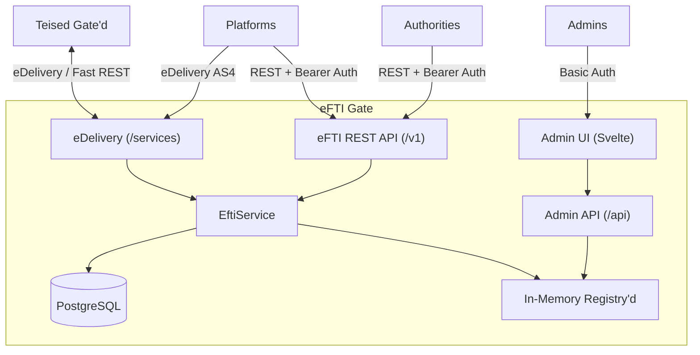

# eFTI Gate — Koodianalüüs

| | |
|---|---|
| **Autor** | Sten Viljus |
| **Ettevõte** | Askend Estonia OÜ |
| **Kontakt** | sten.viljus@askend.com |

## 1. Sissejuhatus

### Analüüsi eesmärk

Käesolev dokument koondab eFTI Gate koodibaasi analüüsi tulemused. Analüüs hõlmab arhitektuuri, turvalisust, jõudlust, skaleeritavust, testimist ja koodi kvaliteeti. Eesmärk on anda terviklik ülevaade süsteemi hetkeseisust ning tuua välja tugevused, nõrkused ja edasiarendusettepanekud.

### Analüüsitav koodibaas

| Omadus | Väärtus |
|--------|---------|
| Projekt | eFTI Gate PoC |
| Keel | Kotlin (JVM 21+) |
| Raamistik | Klite (kerge HTTP raamistik) |
| Moodulid | 6 (gate, edelivery, subsetter, ui, demo-platform, e2e-tests) |
| Andmebaas | PostgreSQL 17 |
| Frontend | Svelte |

| Keel | Failid | Read |
|------|--------|------|
| Kotlin (gate) | 74 | ~3 100 |
| Kotlin (edelivery) | 15 | ~975 |
| Kotlin (subsetter) | 5 | ~240 |
| Kotlin (demo-platform) | 12 | ~440 |
| Kotlin (e2e-tests) | 3 | ~380 |
| **Kotlin kokku** | **109** | **~5 150** |
| Svelte | 42 | ~1 750 |
| TypeScript | 33 | ~1 100 |
| **Frontend kokku** | **75** | **~2 850** |
| **Kogu projekt** | **184** | **~8 000** |

---

## 2. Arhitektuuri ülevaade

### Süsteemi eesmärk

eFTI Gate on Euroopa Liidu eFTI (Electronic Freight Transport Information) võrgustiku sõlmpunkt, mis vastutab:
- **Identifier'ite salvestamise** eest — platvormid registreerivad kaubaveo identifikaatoreid
- **Identifier'ite otsingu** eest — asutused otsivad identifikaatoreid lokaalselt ja teistelt gate'idelt
- **Dataset'ide vahendamise** eest — asutused pärivad kaubaveo andmestikke UIL alusel
- **Follow-up sõnumite edastamise** eest — asutused saadavad tagasiside sõnumeid platvormidele

### Moodulid ja vastutused

| Moodul | Kirjeldus |
|--------|-----------|
| `gate/` | Põhirakendus — HTTP server, äriloogika, admin API, andmebaas |
| `edelivery/` | Kohandatud eDelivery AS4 protokolli implementatsioon |
| `subsetter/` | XML dataset subset'imise teek (andmete filtreerimine) |
| `ui/` | Svelte admin/authority kasutajaliides |
| `demo-platform/` | Näidisplatvorm, mis demonstreerib gate'iga suhtlemist |
| `e2e-tests/` | Selenide brauseri end-to-end testid |

### Kõrgtaseme komponentide skeem



### Disainiprintsiibid

1. **Lihtsus** — minimaalne komponentide arv, ei kasuta raskeid raamistikke
2. **Jõudlus** — optimeeritud eDelivery, XML ja krüptograafia operatsioonid
3. **Läbipaistvus** — kompaktne koodibaas, lihtne auditeerida
4. **Minimaalne Persistents** — ainult identifikaatorid salvestatakse, payload'd mitte

---

## 3. Tehnoloogiline stack

### Backend

| Komponent | Tehnoloogia | Märkused |
|-----------|------------|----------|
| Keel | Kotlin | JVM 21+ |
| HTTP server | Klite + Java built-in HttpServer | Ei kasuta Tomcat/Netty/Ktor jms |
| Concurrency | Virtual Threads (Project Loom) | Iga päring eraldi virtuaallõimel |
| HTTP klient | Java HttpClient | Asünkroonne (`sendAsync` + `await`) |
| DI | Klite DependencyInjectingRegistry | Konstruktoripõhine, ilma Spring'ita |
| XML | JAXB + string template'id | Deserialiseerimine + genereerimine |
| Krüptograafia | JCA (AES-GCM, RSA-OAEP) | eDelivery sõnumite krüptimine |
| Andmebaas | PostgreSQL 17 + Klite JDBC | Lihtne SQL, connection pool |
| Taustatööd | Klite JobRunner | Ajastatud tööd (ping, expiration) |
| API docs | OpenAPI / Swagger | Automaatne genereerimine |

### Frontend

| Komponent | Tehnoloogia |
|-----------|------------|
| Raamistik | Svelte 4 |
| Tüübid | Genereeritud `api/types.ts` Kotlin klassidest |
| Stiil | Svelte scoped CSS |

### Infrastruktuur

| Komponent | Tehnoloogia |
|-----------|------------|
| Andmebaas | PostgreSQL 17-alpine |
| Konteinerid | Docker / Docker Compose |
| Reverse proxy | Caddy (SSL terminatsioon) |
| CI/CD | GitHub Actions |

CI/CD pipeline (`.github/workflows/build.yml`) käivitub igal push'il ja pull request'il:
1. **UI build** — `npm ci && npm run build && npm run test:run` (Node 24)
2. **Server build** — `./gradlew jar` (JDK 25, Temurin)
3. **Server testid** — `./gradlew test -x :e2e-tests:test`
4. **E2E testid** — `./gradlew :e2e-tests:test -Pci`
5. **Docker build** — `docker compose build`

Pipeline **ei sisalda** image push't registrisse ega automaatset deploy't.

---

## 4. Koodi kvaliteet ja stiil

### Koodistiili reeglid

Projektil on defineeritud stiilireeglid (`code-style.md`):

**Kotlin (Backend):**
- 2-tühiku taane
- Semikoolonid puuduvad
- Lühikesed annotatsioonid samal real (`@Test fun test()`)
- Expression body eelistatud
- Enum konstantide import (ilma tüübiprefixita)

**SQL:**
- Väiketähtede märksõnad
- camelCase veerunimed (vastab Kotlin data class'idele — transformatsioon pole vajalik)
- Tabel-per-file struktuur migratsioonidele

**Svelte/TypeScript:**
- Ühekordsed jutumärgid
- Genereeritud tüübifailid
- Svelte 4 lihtne süntaks

### Projekti struktureerimine

Kood on organiseeritud **feature-based** struktuuri järgi:
- `efti/gates/` — Gate domeeniobjekt, repository, registry, klient
- `efti/platforms/` — Platform domeeniobjekt, repository, registry, klient, marsruudid
- `efti/authorities/` — Authority domeeniobjekt, repository, registry, marsruudid
- `admin/` — Admin CRUD marsruudid
- `auth/` — Autentimise ja autoriseerimise loogika

Iga feature sisaldab kõiki oma kihte (mudel, repository, registry, routes) — see teeb koodi navigeerimise ja muutmise lihtsaks.

### Koodi maht

Koodibaas on **kompaktne**: ~8 000 rida 184 failis (vt täpne jaotus 1. peatükist). Gate põhirakendus 74 faili (~3 100 rida), eDelivery 15 faili (~975 rida). See on hea tulemus arvestades süsteemi funktsionaalsust.

---

## 5. Turvalisus

### Autentimine

Süsteem toetab kahte autentimisviisi:

| Viis | Formaat | Kasutus |
|------|---------|---------|
| **Basic Auth** | `Basic base64(email:password)` | Admin UI (brauseri põhiautentimine) |
| **Bearer Token** | `Bearer base64(userId:secret)` | API ligipääs (platvormid, asutused) |

Autentimine toimub `AccessChecker` middleware'is, mis töötab enne iga päringut.

### Autoriseerimine (RBAC)

Rollipõhine juurdepääsukontroll annotatsioonide abil:

| Roll | Ligipääs |
|------|----------|
| **ADMIN** (Super) | Kõik — `isAdmin=true` + tühjad rollid |
| **GATE** | Ainult seotud gate'id |
| **PLATFORM** | Identifier'ite salvestamine oma platvormi alt |
| **AUTHORITY** | Identifier'ite otsing, dataset pärimine, follow-up |

```kotlin
@Access(ADMIN)              // Ainult admin
@Access(GATE, PLATFORM)     // Gate VÕI Platform roll
@Public                     // Avalik endpoint
```

Kasutaja rollid on seotud konkreetsete Party ID-dega: `Map<Role, Set<PartyId>>`. Iga CRUD operatsioon kontrollib, kas kasutajal on ligipääs konkreetsele entiteedile.

### Paroolide haldus

- Paroolid on häshitud (`KeyGenerator.hash(secret, userId)`)
- Salt on kasutaja UUID
- Hash on base64 kodeeritud
- Parool on nähtav ainult ühekordselt kasutaja loomisel

### eDelivery krüptograafia

| Operatsioon | Algoritm |
|-------------|----------|
| Payload krüptimine | AES-128-GCM |
| AES võtme krüptimine | RSA-OAEP (SHA-256) |
| Allkirjastamine | RSA-SHA256 |
| Tihendamine | GZIP |

Sertifikaadid hoitakse PKCS12 keystore'is (`own.p12`). Gate'ide sertifikaadid registreeritakse admin UI kaudu ja TrustStore ehitatakse dünaamiliselt.

### Andmekaitse (GDPR)

- Salvestatakse **ainult identifikaatoreid**, mitte täielisi andmestikke
- Dataset'id jäävad platvormidele — gate neid ei salvesta
- Subset'id piiravad, milliseid andmeid asutus näeb
- Aegunud identifikaatorid kustutatakse automaatselt

### Tuvastatud turvariskid

| Risk | Tase | Kirjeldus |
|------|------|-----------|
| TARA autentimine puudub | KÕRGE | Admin UI kasutab Basic Auth'i — tootmiskeskkonnas peaks kasutama TARA (riiklik autentimisteenus) |
| Kasutajanimega sisselogimine | KÕRGE | Praegu saab Basic Auth'iga kasutajanime + parooliga sisse logida — tootmises peaks see olema keelatud ja kasutama ainult TARA't |
| X-tee liidesed puuduvad | KÕRGE | Puuduvad liidesed X-teega (Eesti riiklik andmevahetuskiht) — vajalik asutuste ja platvormidega suhtlemiseks tootmiskeskkonnas |
| Bearer Auth mittestandardne | KÕRGE | API Bearer token kasutab `base64(id:password)` formaati, mis ei vasta ühelegi standardile (JWT, OAuth2). Võib tekitada probleeme kolmandate osapoolte integratsioonidel |
| API Key `/services/fast` | KESKMINE | Fast adapter kasutab lihtsat `X-API-Key` headerit, pole krüpteeritud |
| Saladused .env failides | KESKMINE | Paroolid ja võtmed on .env failides, mitte turvalises hoidlas |
| Rate limiting puudub | KESKMINE | Request ID duplikaatide kontroll on olemas, aga täielik rate limiting puudub. **Soovitus:** implementeerida reverse proxy / ingress tasemel, mitte rakenduses (vt allpool) |
| Sertifikaadid failisüsteemis | MADAL | PKCS12 keystore loetakse lokaalselt — konteinerkeskkondades keerulisem hallata |
| XML kanoniseerimine (C14N) | MADAL | `Xml.kt` regex-põhine `canonicalXml` on tegelikult whitespace normaliseerija oma genereeritud string template'ide jaoks. **Ei ole standardne C14N**, aga praktiline risk on madal: (1) normaliseerib ainult oma genereeritud XML-i, mille struktuur on teada ja fikseeritud, (2) allkirjastamisel (`signedInfoXml`) kasutatakse seda ainult SOAP ümbriku template'i puhastamiseks, digest'id arvutatakse konkreetsete blokkide pealt eraldi. Standardne C14N (`javax.xml.crypto.dsig.CanonicalizationMethod`) oleks formaalselt korrektsem, aga ei lahenda praktilist probleemi |

### Rate limiting ettepanekud

Rate limiting tuleb implementeerida **reverse proxy / ingress tasemel**, mitte rakenduse koodis. See annab mitu eelist:
- Ei koormata rakendust — liigne liiklus lükatakse tagasi enne, kui see jõuab JVM-i
- Konfigureeritav ilma koodi muutmata — muudetav konfiguratsioonis
- Töötab automaatselt kõigi node'ide ees — ei vaja jagatud oleku haldust
- Standardne lähenemine — kõik reverse proxy'd ja ingress controller'id toetavad seda

#### Variant A: Caddy (praegune server deploy)

Praegune `compose.server.yml` kasutab juba Caddy reverse proxy't. Caddy toetab rate limiting'ut `rate_limit` direktiiviga:

```
# Caddyfile näide (Docker label'ite asemel eraldi fail)
eu-ee31.eftisandbox.eu {
    rate_limit {
        zone api_zone {
            key    {remote_host}
            events 100
            window 1m
        }
        zone edelivery_zone {
            key    {remote_host}
            events 30
            window 1m
        }
    }

    @api path /api/* /v1/*
    rate_limit @api { zone api_zone }

    @edelivery path /services/*
    rate_limit @edelivery { zone edelivery_zone }

    reverse_proxy gate:8080
}
```

**Soovituslikud limiidid:**
| Endpoint | Limiit | Põhjus |
|----------|--------|--------|
| `/v1/*` (eFTI API) | 100 req/min IP kohta | Normaalne API kasutus |
| `/api/*` (Admin API) | 30 req/min IP kohta | Admin operatsioonid on harvemad |
| `/services/msh` (eDelivery) | 30 req/min IP kohta | eDelivery sõnumid on mahukamad |
| `/services/fast` (Fast Adapter) | 100 req/min IP kohta | Kiire gate-to-gate suhtlus |

**Maht:** ~0.5 päeva (Caddy konfiguratsiooni muudatus)

NB: `caddy-docker-proxy` image korral tuleb kontrollida, kas `rate_limit` moodul on kaasas, või kasutada custom Caddy build'i.

#### Variant B: Nginx Ingress (Kubernetes)

Kubernetes'es nginx-ingress controller toetab rate limiting'ut annotatsioonide kaudu:

```yaml
# Ingress annotatsioonid
metadata:
  annotations:
    nginx.ingress.kubernetes.io/limit-rps: "10"
    nginx.ingress.kubernetes.io/limit-rpm: "100"
    nginx.ingress.kubernetes.io/limit-connections: "20"
    nginx.ingress.kubernetes.io/limit-whitelist: "10.0.0.0/8"  # sisevõrk
```

Detailsema kontroll saab nginx `ConfigMap`'i kaudu, kus saab defineerida erinevad tsoonid erinevate path'ide jaoks.

**Maht:** ~0.5 päeva (Ingress annotatsioonide lisamine)

#### Kaalutlused

- **IP-põhine** rate limiting on piisav, kui iga klient (asutus, platvorm, gate) tuleb erinevalt IP-lt
- Kui mitu klienti on sama IP taga (nt NAT), siis kaaluda **API-key-põhist** rate limiting'ut (nõuab rakenduse tasemel tuge)
- eDelivery endpoint'ile (`/services/msh`) tuleb leebemad limiidid — broadcast query'd võivad genereerida mitmeid samaaegseid päringuid
- Gate'ide vahelised IP-d tasub lisada **whitelist'i**, et nende suhtlust mitte piirata

Täiendavad turvariskid ja -ettepanekud on dokumenteeritud [Õiguste ja ligipääsuhalduse dokumendis](../4-rights-n-permissions/eFTI_rights_and_permissions_et.md) (sektsioon 10) ja [Parandusettepanekutes](eFTI_improvements_et.md) (sektsioon 1).

---

## 6. Jõudlus

### Positiivsed disainiotsused

| # | Aspekt | Hinnang | Kirjeldus |
|---|--------|---------|-----------|
| 1 | **Virtual Threads** | ✅ Suurepärane | Iga HTTP päring virtuaallõimel — tuhandeid samaaegseid ühendusi minimaalsete ressurssidega |
| 2 | **In-Memory Registry'd** | ✅/⚠️ Kompromiss | O(1) lookup, null DB latentsus metaandmete lugemisel. PoC jaoks suurepärane, aga **mitme instansi puhul kriitiline probleem** — `save()` ja `delete()` uuendavad ainult lokaalset `ConcurrentHashMap`'i + DB-d. `NotifiableRegistry.notifyChanged()` teavitab ainult sama protsessi siseseid kuulajaid (nt `KeyManager` ehitab TrustStore ümber), mitte teisi node'e. Tootmises, kus on mitu instansi, tähendab see, et ühe node'i kaudu tehtud gate'i/platvormi/asutuse lisamine/muutmine/kustutamine ei jõua teiste node'ideni enne restart'i. Vt [Skaleeritavuse analüüs](eFTI_scalability_et.md) etapp 1.1 |
| 3 | **Paralleelne Broadcast** | ✅ Suurepärane | Kõik gate'd päritakse paralleelselt (`channelFlow` + `coroutineScope` + `launch`) |
| 4 | **Fire-and-Forget Response** | ✅ Suurepärane | AS4 receipt saadetakse enne sõnumi töötlemist — väiksem latentsus |
| 5 | **Fast Adapter** | ✅ Suurepärane | eDelivery bypass — 4-5x kiirem gate-to-gate suhtlus |
| 6 | **Custom eDelivery** | ✅ Suurepärane | Suurusjärgu võit vs referentsimplementatsioon |
| 7 | **SSE Streaming** | ✅ Suurepärane | Identifier query tulemused stream'ina — lokaalsed koheselt, remote järk-järgult |
| 8 | **Minimaalne DB skeem** | ✅ Hea | 2 põhitabelit, composite PK, upsert |

### Kahtlased / probleemsed kohad

| # | Aspekt | Tase | Kirjeldus |
|---|--------|------|-----------|
| 1 | JAXB Unmarshaller loomine | KESKMINE | Iga `parse()` loob uue Unmarshaller'i — kulukas ja potensiaalselt kõrge koormusega |
| 2 | DOM parsing eDelivery's | KESKMINE | Kogu XML dokument mällu — TODO kommentaar koodi sees |
| 3 | Request body mällu | KESKMINE | Kogu eDelivery sõnum loetakse korraga mällu |
| 4 | XML string konkatenatsioon | MADAL-KESKMINE | GC surve suure tulemuste hulga puhul |
| 5 | Regex re-compile | MADAL | `Regex(...)` luuakse iga `handleSaveIdentifiersRequest` kutsega uuesti |
| 6 | Expiration job | MADAL | Kõik delivered kirjed loetakse mällu, filtreerimine Kotlin koodis (parem oleks SQL'i panna) |

### Soovitused

1. **JAXB:** Kaaluda pool'imist või kergemat XML parsimist (StAX) kõrge koormuse korral
2. **DOM:** Asendada StAX parsimisega (nagu ka koodis olev TODO soovitab)
3. **Regex:** Liigutada `Regex(...)` companion object väljale
4. **StringBuilder:** Kasutada suure tulemuste hulga XML ehitamisel
5. **XML C14N (madal prioriteet):** `Xml.kt` regex-põhine `canonicalXml` on tegelikult whitespace normaliseerija oma string template'ide jaoks — see ei ole standardne XML Canonicalization. Allkirjastamisel (`EDeliveryMessageGenerator.signedInfoXml`) kasutatakse seda SOAP ümbriku template'i puhastamiseks, aga digest'id arvutatakse konkreetsete XML-blokkide pealt eraldi. Standardne C14N (`javax.xml.crypto.dsig.CanonicalizationMethod`) oleks formaalselt korrektsem, kuid praktiline risk on madal — normaliseeritakse ainult oma genereeritud XML-i, mille struktuur on fikseeritud
6. **XSD versioonimine:** Kehtestada formaalne XSD failide versioonistrateegia, et tagada sujuv üleminek eFTI common dataset model'i uuendustel

---

## 7. Logimine ja jälgitavus

### Olemasolev logimine

#### HTTP päringu logimine (Klite RequestLogger)

```kotlin
register<RequestLogger>(RequestLogger { ms ->
    "<" + attr<String?>("client") + "> " + defaultRequestLogFormatter(ms)
})
```

Iga HTTP päring logitakse automaatselt formaadis: `<klient> METHOD /path - statusCode XXms`. Klient on kas authority ID, platform ID või `null`. See katab kõik sissetulevad päringud.

#### Väljaminevate päringute logimine

| Komponent | Logib sihtpunkti | Logib tulemust | Logib aega | Logib viga |
|-----------|-----------------|----------------|------------|------------|
| **PlatformClient** | ✅ URL | ✅ staatuskood | ✅ ms | ✅ exception |
| **GateClient** | ❌ | ❌ | ❌ | ✅ ainult ping |
| **EDeliveryClient** | ❌ | ❌ | ❌ | ✅ exception |

`PlatformClient` on ainuke koht, kus logimine vastab küsimusele "kust → kuhu → tulemus":
```
platform-ee1: GET https://platform.example/v1/dataset/uuid?subsetId=... - 200 45 ms
```

#### eDelivery sõnumite logimine

| Komponent | Mis logitakse |
|-----------|---------------|
| **GateMessageHandler** | Sissetulev sõnumi tüüp + saatja: `Handling uilQuery from RequestKey(...)` |
| **EDeliveryRoutes** | Ainult vead ja tundmatu krüptograafia hoiatused |
| **MultiNodeAsyncResponseProvider** | Async vastuse ootamine ja salvestamine |

#### Taustatööd

- **GatePingJob** — logib staatuse muutused ja ping vead
- **IdentifierExpirationJob** — logib kustutatud kirjete arvu
- **KeyManager** — logib sertifikaatide ja TrustStore ehituse

#### Autentimine

- **AccessChecker** — logib ainult ebaõnnestunud autentimisi (`log.error`). Edukad autentimised pole logitud.

### Puudused

| # | Puudus | Tase | Mõju |
|---|--------|------|------|
| 1 | **GateClient ei logi väljaminevaid päringuid** | KÕRGE | Ei ole näha, millisele gate'ile saadeti päring, mis vastas ja kui kaua kestis. Broadcast identifier query'd ja remote dataset päringud on jälgimatud |
| 2 | **EDeliveryClient.send() ei logi** | KÕRGE | eDelivery sõnumite saatmine on jälgimatu — ei ole näha sihtpunkti, vastust ega kestust |
| 3 | **Request ID puudub logisõnumitest** | KÕRGE | Päringuid ei saa logist korreleerida — ühe kasutaja päringu teekonda läbi süsteemi ei saa jälgida |
| 4 | **EftiService ei logi äriloogika voogusid** | KESKMINE | Ei ole näha, millal identifier query / dataset query algas, kas suunati lokaalsele platvormile või teisele gate'ile, ja mis tulemusega lõppes |
| 5 | **Struktureeritud logimine puudub** | KESKMINE | Logid on vabas tekstiformaadis — masinloetav parsimine, filtreerimine ja monitooring keeruline |
| 6 | **Edukad autentimised pole logitud** | MADAL | Auditi jaoks puudub info, kes ja millal sisse logis |

### Hinnang

Praegune logimine vastab **PoC tasemele** — kriitilised vead logitakse ja `RequestLogger` annab ülevaate sissetulevatest päringutest. Aga küsimusele **"kust tehti, kuhu tehakse, mis tulemus oli"** vastab korralikult ainult `PlatformClient`.

### Ettepanekud parendamiseks

#### 1. Väljaminevate päringute logimine (prioriteet: KÕRGE)

`GateClient` ja `EDeliveryClient` vajavad sama mustrit nagu `PlatformClient` juba kasutab — iga väljamineva päringu kohta logida sihtpunkt, tulemus ja kestus:

**GateClient — puuduv logimine:**
- `sendAndReceive()` — ei logi, millisele gate'ile (URL + gateId) päring saadeti, kas kasutati Fast või eDelivery'd, mis staatuskood tuli ja kui kaua kestis
- `getIdentifiers()` — ei logi broadcast päringu tulemust (mitu consignment'i leiti)
- `getDataset()` — ei logi remote dataset päringu tulemust
- `postFollowUp()` — ei logi follow-up sõnumi saatmist

**EDeliveryClient — puuduv logimine:**
- `send()` — ei logi siht-URL-i, sõnumi tüüpi, vastuse staatuskoodi ega kestust. Ainult vead visatakse exception'ina
- `sendAndReceive()` — ei logi async ootamise algust ega kestust

**Soovitav logimine:**
```
GateClient: gate-fi1 (fast) POST https://gate-fi1.example/services/fast - 200 45ms
GateClient: gate-de1 (eDelivery) sendAndReceive https://gate-de1.example/services/msh - 200 1250ms
EDeliveryClient: POST https://gate.example/services/msh - 200 89ms (requestId=abc-123)
```

#### 2. Request ID propageerimine (prioriteet: KÕRGE)

Praegu `UUIDRequestIdGenerator` genereerib request ID formaadis `internalId/externalRequestId`, aga see ID ei jõua logisõnumitesse väljaspool `RequestLogger`'it. Klite lõime nimi sisaldab request ID-d, aga see pole piisav.

**Soovitus:** Kasutada SLF4J MDC (Mapped Diagnostic Context) mehhanismi:
- Sissetuleva päringu request ID lisada MDC-sse `AccessChecker`'is või eraldi `Before` handler'is
- Log formaat sisaldab automaatselt `[requestId]` prefiksit
- Kõik logisõnumid (ka async coroutine'ides) on korreleeritavad

See võimaldab ühe päringu kogu teekonda logist üles leida: sissetulev päring → routing otsus → väljaminev päring → tulemus.

#### 3. Äriloogika voogude logimine (prioriteet: KESKMINE)

`EftiService` on keskne äriloogika klass, aga seal logitakse ainult broadcast vead. Lisada tuleks:
- `getDataset()` — logida routing otsus (lokaalne vs remote) ja tulemus
- `getIdentifiers()` — logida broadcast algus (mitmele gate'ile), lokaalne tulemus ja koondtulemus
- `saveIdentifiers()` — logida salvestatud identifikaatorite arv
- `sendFollowUp()` — logida follow-up suunamine (lokaalne vs remote)

#### 4. Struktureeritud logimine (prioriteet: KESKMINE)

Praegune vabatekstiline logimine on piisav arenduskeskkonnas, aga tootmises (eriti pilves) on JSON formaat parem:
- Masinloetav — logikogumissüsteemid (CloudWatch, ELK, Loki) parsivad automaatselt
- Filtreeritav — saab filtreerida request ID, kliendi, operatsioonitüübi järgi
- Meetrikad — saab logidest automaatselt meetrikaid tuletada

**Soovitus:** Lisada logback-classic + logstash-logback-encoder sõltuvus, JSON formaat ainult tootmiskeskkonnas (env muutujaga lülitatav).

#### 5. Auditi logimine (prioriteet: MADAL)

Tootmiskeskkonnas on vajalik logida:
- Edukad sisselogimised (kes, millal, milliselt IP-lt)
- Administraatori tegevused (kasutaja loomine, gate'i lisamine/muutmine/kustutamine)
- Andmetele ligipääs (kes küsis millise identifier'i / dataset'i kohta)

See on oluline GDPR ja auditi nõuete täitmiseks.

---

## 8. CI/CD ja paigaldus

### Ehitus ja testimine

Projekt kasutab Gradle build süsteemi (Kotlin 2.3, JVM 25):

```sh
./gradlew build        # kompileerimine + testid
cd ui && npm run build # Svelte UI ehitus
```

GitHub Actions workflow (`build.yml`) jooksutab automaatselt testid ja ehituse igal push'il.

### Docker image

Gate ja demo-platform on eraldi Docker image'd:

| Image | Baas | Suurus | Failid |
|-------|------|--------|--------|
| `efti-gate-poc` | `eclipse-temurin:25-jre-alpine` | Minimaalne | JAR + UI build + sertifikaadid + XSD |
| `efti-demo-platform` | `eclipse-temurin:25-jre-alpine` | Minimaalne | JAR + sertifikaadid + XSD |

Turvameetmed image'is:
- Non-root kasutaja (`adduser -S user`)
- `sbin` ja `chmod/chgrp/chown` eemaldatud (`rm -fr /usr/sbin /bin/ch*`)
- JVM piirangud: `-Xss256K -Xmx1024M -XX:+ExitOnOutOfMemoryError`

### Deploy protsess

Praegune deploy on **käsitsi skript** (`deploy.sh`):

1. `./gradlew test jar` — testid ja JAR ehitus
2. UI testid ja ehitus (`npm run test:run && npm run check && npm run build`)
3. Docker image ehitus (`docker compose build`)
4. Image'i saatmine serverisse (`docker save | gzip | ssh ... docker load`)
5. Compose failide kopeerimine (`scp compose.yml compose.server.yml`)
6. Olemasolevate logide salvestamine
7. `docker compose up -d --wait`

**Server** vajab ainult Docker + Docker Compose + SSH ligipääsu. Reverse proxy on Caddy (automaatne HTTPS, Docker label'ite kaudu konfigureeritud).

### Kubernetes deploy

Olemas Helm chart (`charts/efti-gate/`):
- Deployment, Service, Ingress, HPA, ServiceAccount, Secret template'd
- Toetab AWS ALB Ingress Controller'it ja RDS PostgreSQL'i
- Sertifikaadid Kubernetes Secret'ist
- Liveness/readiness probed (`/health`)

### Olemasolevad deploy'd

| Keskkond | URL | Kirjeldus |
|----------|-----|-----------|
| Demo | `https://eu-ee31.eftisandbox.eu/` | Peamine demo |
| EFTI4ALL Testbed | `https://eu-ee32.eftisandbox.eu/` | Testbed |

### Puudused

| # | Puudus | Tase | Kirjeldus |
|---|--------|------|-----------|
| 1 | **Automatiseeritud CI/CD puudub deploy'iks** | KÕRGE | Deploy on käsitsi skript, puudub automaatne deploy peale testide läbimist |
| 2 | **Image registry puudub** | KÕRGE | Image'd saadetakse `docker save | ssh | docker load` kaudu, mitte registrist |
| 3 | **Sertifikaadid image'is** | KESKMINE | `gate/.env` ja `gate/certs/` on image'i sisse ehitatud — ei sobi tootmiseks |
| 4 | **Rollback mehhanism puudub** | KESKMINE | Puudub eelmise versiooni taastamine — ainult logide salvestamine enne deploy'd |
| 5 | **Staging keskkond puudub** | KESKMINE | Puudub eraldi staging, kus testida enne tootmist |
| 6 | **Zero-downtime deploy puudub** | KESKMINE | `docker compose up -d` peatab vana konteineri enne uue käivitamist |
| 7 | **Versioonimine nõrk** | MADAL | Ainult `VERSION` build arg, puudub semantiline versioonimine ja changelog |

### Ettepanekud

1. **Container Registry** — kasutada GitHub Container Registry (ghcr.io) või AWS ECR. Image'd tagida Git commit hash'iga
2. **Automaatne deploy** — GitHub Actions workflow, mis peale testide läbimist ehitab image, push'ib registrisse ja deploy'ib serverile
3. **Sertifikaadid ja saladused välja image'ist** — laadida runtime'il (env vars, mounted volumes, Secrets Manager)
4. **Blue-green või rolling deploy** — Docker Compose'iga raske, Kubernetes'es natiivne
5. **Staging keskkond** — eraldi VPS/namespace samade compose failidega

Detailne paigaldamise juhend vt [Paigaldamise juhend](eFTI_deployment_et.md).

---

## 9. Koormustestimine

### Varasemad tulemused

#### Gate-to-Gate jõudlustest (2 ühendatud PoC gate'i)

Testiti kahe erineva Hetzner VPS-i vahel (8 VCPU, 16GB RAM, 19.49€/kuu). Üks Docker konteiner node kohta, horisontaalset skaleerimist ei kasutatud. Testi kestus 15 minutit, kõik operatsioonitüübid paralleelselt.

**Identifier Query (Broadcast):**

| Mõõdik | eDelivery | Fast Adapter | Erinevus |
|--------|-----------|--------------|----------|
| Keskmine aeg | 73.89 ms | 14.88 ms | 5x |
| Mediaan | 24.90 ms | 11.80 ms | 2x |
| P95 | 86.47 ms | 19.04 ms | 4x |
| Req/s | 100 | 100 | - |
| Kokku päringuid | 89 354 | 89 938 | - |
| Success rate | 100% | 100% | - |

**Dataset Query (Remote):**

| Mõõdik | eDelivery | Fast Adapter | Erinevus |
|--------|-----------|--------------|----------|
| Keskmine aeg | 89.92 ms | 24.49 ms | 4x |
| Mediaan | 33.04 ms | 21.37 ms | 1.5x |
| P95 | 101.87 ms | 29.99 ms | 3x |
| Req/s | 100 | 100 | - |
| Kokku päringuid | 88 970 | 89 930 | - |
| Success rate | 100% | 100% | - |

**Dataset Query (Local):**

| Mõõdik | eDelivery | Fast Adapter |
|--------|-----------|--------------|
| Keskmine aeg | 20.30 ms | 20.32 ms |
| Mediaan | 18.37 ms | 18.65 ms |
| P95 | 27.54 ms | 27.15 ms |
| Success rate | 100% | 100% |

**Kokku:** ~715 000 päringut 15 minutiga (kogu süsteem), 100% success rate.

#### Test Fest 3 tulemused

Test Fest 3 oli mitmepoolne test, kus kõik Euroopa eFTI gate'd olid ühendatud. eFTI Gate PoC (eu-ee31) tulemused:

- **Parim voor (Round A-3):** Keskmine identifier query 3 578 ms, dataset query 2 592 ms, lokaalne 64 ms. Kõrged keskmised tulenevad teiste gate'ide latentsusest (broadcast ootab kõiki vastuseid).
- **100% success rate** lokaalsetel päringustel kõigis voorudes.
- **Ebaõnnestumised** olid alati tingitud teiste gate'ide (EU-IT1, EU-FR1, eu-ee12) aeglustest või kättesaamatusest.
- Reverse proxy vahetati Traefik → **Caddy**, mis lahendas koormuse käsitlemise probleemid.

### Koormustestimise plaan

#### Ülesseade

Kaks VPS-i eri pakkujatelt (reaalne võrgulatentsus, mitte sama DC):

```
┌─────────────────────┐          ┌─────────────────────┐
│  Hetzner VPS        │          │  Contabo VPS        │
│  8 VCPU / 16GB RAM  │◄────────►│  8 VCPU / 16GB RAM  │
│                     │          │                     │
│  Gate A + PostgreSQL │          │  Gate B + PostgreSQL │
│                     │          │  k6 koormustester   │
└─────────────────────┘          └─────────────────────┘
```

Gate A ja Gate B on omavahel ühendatud (eDelivery + Fast). Kummalgi on oma DB ja demo-platform. k6 jookseb Contabo VPS-il ja tulistab mõlemat gate'i.

#### Mida testime

Neli operatsiooni paralleelselt, iga testi kestus 15 min:

| Operatsioon | Kirjeldus | Payload |
|-------------|-----------|---------|
| Identifier Query (broadcast) | Otsing, mis levib teisele gate'ile | ~1 kB |
| Dataset Query (remote) | Dataset teiselt gate'ilt | ~300 kB |
| Dataset Query (local) | Dataset oma platvormilt | ~300 kB |
| Save Identifiers | Platvormi identifier'ite registreerimine | ~1 kB |

#### Testimise käik

1. **Soojendus** — 50 req/s, 2 min. Veendume, et kõik toimib.
2. **Baaskoormus** — 100 req/s operatsiooni kohta, 15 min. Mõõdame läbilaskevõimet ja latentsust.
3. **Ramp-up** — tõstame koormust sammhaaval (100 → 200 → 500 → 1000 req/s) kuni midagi murdub. Leiame lae.
4. **eDelivery vs Fast** — sama koormus mõlema protokolliga, võrdleme latentsust.
5. **Pikaajaline** — baaskoormus 2h. Jälgime mälu trendi (heap leak).

#### Mõõdame

- **Latentsus**: keskmine, mediaan, P95, P99
- **Läbilaskevõime**: req/s, success rate
- **Ressursid**: CPU %, JVM heap, DB ühendused

#### Millal on OK

| Meetrik | Nõue |
|---------|------|
| Success rate | ≥99.9% |
| P95 lokaalne query | <50 ms |
| P95 remote query | <100 ms |
| Mäluleke | Puudub (heap stabiliseerub) |

---

## 10. Testimine

### Testimise strateegia

Projekt kasutab kolmetasandilist testimist:

| Tase | Raamistik | Andmebaas | Kirjeldus |
|------|-----------|-----------|-----------|
| **Unit** | JUnit 5 + MockK | Mock'itud | Äriloogika, XML parsimine, autoriseerimine, API marsruudid |
| **Integratsioon** | JUnit 5 + Atrium | Päris PostgreSQL | Repository'd, registry'd, async response |
| **E2E** | JUnit 5 + Selenide | Päris PostgreSQL | Brauseri UI testid — admin ja authority workflow'd |

### Baasklassid

- **TestData** — tsentraliseeritud muutumatud testobjektid (kasutajad, gate'd, platvormid jne)
- **DBTest** — integratsioonitestide baas (test-DB, migratsioonid, transaktsioonipõhine isolatsioon)
- **BaseMocks** — mock'ide baas (DI registry + eelseadistatud mock'id)

### Testide katvus

| Komponent | Unit | DB Integr. | E2E | Katvus |
|-----------|------|------------|-----|--------|
| Autentimine/autoriseerimine | ✅ | | ✅ | Hea |
| Identifier query | ✅ | ✅ | ✅ | Väga hea |
| Dataset query | ✅ | | ✅ | Hea |
| Identifier save | ✅ | ✅ | | Hea |
| eDelivery krüptograafia | ✅ | | | Hea |
| eDelivery sõnumivahetus | ✅ | | | Hea |
| Admin CRUD (kõik entiteedid) | ✅ | ✅ | ✅ | Väga hea |
| User haldus | ✅ | ✅ | ✅ | Väga hea |
| Async response (single+multi) | | ✅ | | Hea |
| XML parsimine/genereerimine | ✅ | | | Väga hea |
| XSD valideerimine | ✅ | | | Väga hea |

### Tugevused

- **XSD valideerimine** — eDelivery sõnumid valideeritakse XSD skeemide vastu
- **Päris DB integratsioonitestid** — repository ja registry testid kasutavad päris PostgreSQL'i transaktsioonipõhise isolatsiooniga
- **Multi-node async testimine** — PostgreSQL LISTEN/NOTIFY mehhanism on testitud
- **E2E testid katavad kogu admin workflow** — gates, platforms, authorities, users, consignments

### Puudused

- **EftiService keerukamad vood** (paralleelne broadcast, local vs remote routing) puuduvad unit testidest
- **PlatformClient** pole eraldi testitud (keerulim loogika: eDelivery vs REST, subsetting, timeout)
- **Follow-up äriloogika** testid minimaalsed
- **Veakäsitluse testid nõrgad** — puuduvad timeout'id, DB ühenduse kaotus, vigane XML
- **E2E testides puudub gate-to-gate remote suhtluse test** (2 instansi käivitatakse, aga omavahelist suhtlust ei testita)

---

## 11. Andmemudel ja persistents

### Andmebaasi skeem

7 tabelit + changelog:

| Tabel | Kirjeldus | PK |
|-------|-----------|-----|
| `consignments` | Kaubaveo andmestikud | `datasetId` (UUID) |
| `identifiers` | Transpordiidentifikaatorid | `(id, datasetId)` composite |
| `gates` | Registreeritud gate'd | `id` (text) |
| `platforms` | Registreeritud platvormid | `id` (text) |
| `authorities` | Registreeritud asutused | `id` (text) |
| `app_user` | Kasutajad | `id` (UUID) |
| `async_responses` | Asünkroonsed vastused | `(receiverId, requestId)` |

### In-memory registry muster

Kõik kolm registrit (Gate, Platform, Authority) järgivad sama mustrit:

1. **Käivitumisel:** `repository.list()` → `ConcurrentHashMap` (mällu)
2. **Lugemine:** alati mälust (O(1), null latentsus)
3. **Kirjutamine:** mälu + DB samaaegne uuendamine
4. **Change listeners:** muudatusel teavitatakse (nt KeyManager ehitab TrustStore'i ümber)

**Trade-off:** Suurepärane lugemiskiirus ühe node'iga, aga mitme node'i puhul andmed ei sünkrooni. Vt skaleeritavuse peatükk.

### Asünkroonne vastuste haldus

eDelivery AS4 on olemuselt asünkroonne — vastus tuleb eraldi HTTP päringuna.

| Implementatsioon | Mehhanism | Kasutus |
|------------------|-----------|---------|
| `SingleNodeAsyncResponseProvider` | `ConcurrentHashMap` + Kotlin `Channel` | Ühe node'i puhul |
| `MultiNodeAsyncResponseProvider` | PostgreSQL `LISTEN/NOTIFY` + DB tabel | Mitme node'i puhul |

### Migratsioonid

- `DBMigrator` (Klite) käivitub rakenduse startimisel
- SQL failid `gate/db/` kataloogis, `--changeset` kommentaaridega
- Eraldi `app` kasutaja piiratud õigustega (Row Level Security)

---

## 12. Äriloogika vood

### Identifier'ite salvestamine

`Platform → PlatformRoutes → EftiService.saveIdentifiers → EftiParser → ConsignmentRepository`

1. Platform saadab XML identifikaatorid REST API kaudu
2. EftiParser parsib XML → Consignment + List\<Identifier\>
3. Salvestatakse DB-sse (upsert)

### Identifier'ite otsing (broadcast)

`Authority → AuthorityRoutes → EftiService.getIdentifiers → channelFlow`

1. Lokaalne otsing DB-st → kohene SSE vastus
2. Kui tühi (või forceBroadcast) → paralleelne broadcast kõigile online gate'idele
3. Iga gate'i vastus saadetakse SSE stream'ina niipea kui saabub
4. Aeglane gate ei blokeeri kiirete vastuseid

### Dataset pärimine

`Authority → AuthorityRoutes → EftiService.getDataset`

1. Kui `gateId == oma gate` → `PlatformClient.getDataset()` (REST või eDelivery)
2. Kui `gateId == teine gate` → `GateClient.getDataset()` (eDelivery / Fast)
3. PlatformClient rakendab subsetting'ut, kui platform ise ei toeta

### Follow-up sõnum

`Authority → AuthorityRoutes → EftiService.sendFollowUp`

Suunatakse kas kohalikule platvormile (REST/eDelivery) või teisele gate'ile (eDelivery/Fast), sõltuvalt UIL gateId väärtusest.

### Sissetulev eDelivery sõnum

`EDeliveryRoutes.msh → parsemine → dekrüptimine → AS4 receipt → async: GateMessageHandler.response`

GateMessageHandler tuvastab sõnumi tüübi XML root tag'i järgi:
- `uilQuery` → dataset query vastuse genereerimine
- `identifierQuery` → identifier query vastuse genereerimine
- `uilResponse` / `identifierResponse` → async vastuse edastamine ootajale
- `postFollowUpRequest` → follow-up edastamine platvormile
- `saveIdentifiersRequest` → identifier'ite salvestamine

---

## 13. Skaleeritavus

### Praeguse lahenduse piirangud

Süsteem on disainitud ühe node'ina töötama. Horisontaalse skaleerimise peamised takistused:

| # | Probleem | Tase | Kirjeldus |
|---|----------|------|-----------|
| 1 | In-memory registry'd | KRIITILINE | Node'idevahelised muudatused ei sünkrooni |
| 2 | Request ID cache | KRIITILINE | Duplikaatide kontroll ainult ühe node'i piires |
| 3 | Admin auth state | KESKMINE | IP-põhine olek mälus |
| 4 | Taustatööd igal node'il | KESKMINE | Duplikaatsed job'id |
| 5 | Sertifikaadid failisüsteemis | KESKMINE | Iga node vajab samu faile |
| 6 | DB migratsioon käivitusel | KESKMINE | Race condition mitme node'iga |

### Migratsiooni variandid

[Skaleeritavuse analüüs](eFTI_scalability_et.md) kirjeldab kahte varianti:

**Variant A: AWS migratsioon (~37-54 päeva keskmise arendaja jaoks):**
- Platvormiülesed koodimuudatused (~19-28 päeva): registry sünkroonimine, Redis, leader election, logimine, saladused
- AWS infrastruktuur (~18-26 päeva): RDS, ECS/Fargate, ALB, ElastiCache, Secrets Manager, CloudWatch

**Variant B: Kubernetes migratsioon (~43-61 päeva keskmise arendaja jaoks):**
- Samad platvormiülesed koodimuudatused (~19-28 päeva)
- K8s infrastruktuur (~24-33 päeva): PostgreSQL operaator, Deployment + Ingress, Redis, Sealed Secrets, Loki + Prometheus

**Minimaalne lähenemine (~8-12 päeva):**
- Hallatav PostgreSQL (Hetzner Managed DB / RDS)
- Saladused turvalisse hoidlasse
- Monitooring ja logimise parendamine
- Regulaarsed varukoopiad

Detailne plaan vt [Skaleeritavuse analüüs](eFTI_scalability_et.md).

---

## 14. Edasiarendusvõimalused ja soovitused

### Kriitilised parendused

| # | Teema | Kirjeldus |
|---|-------|-----------|
| 1 | Fast adapter turvalisus | `X-API-Key` asendada korraliku autentimisega |
| 2 | Saladuste haldus | .env failidest turvalisse hoidlasse (AWS Secrets Manager vms) |
| 3 | Rate limiting | Implementeerida reverse proxy / ingress tasemel (vt allpool) |
| 4 | EftiService testid | Lisada unit testid paralleelsele broadcast'ile ja routing loogikale |
| 5 | TARA autentimine | Admin UI Basic Auth asendada TARA autentimisega, keelata kasutajanimega sisselogimine |
| 6 | X-tee liidesed | Implementeerida X-tee liidesed asutuste ja platvormidega suhtlemiseks |
| 7 | Logimine | GateClient ja EDeliveryClient väljaminevate päringute logimine, request ID propageerimine logisõnumitesse |
| 8 | Bearer Auth standardiseerimine | `base64(id:password)` asendada JWT tokenite või opaque API key'dega |
| 9 | XML kanoniseerimine (C14N) | `Xml.kt` regex-põhine `canonicalXml` — standardne C14N oleks formaalselt korrektsem, aga praktiline risk madal (vt 6. ptk) |
| 10 | XSD versioonimine | Formaalne versioonistrateegia XSD failidele |

### Soovituslikud parendused

| # | Teema | Kirjeldus |
|---|-------|-----------|
| 11 | DOM → StAX | eDelivery sõnumite parsimine ilma DOM-ita |
| 12 | JAXB optimiseerimine | Unmarshaller pool'imine või StAX-põhine parsimine |
| 13 | Regex caching | `Regex(...)` companion object'ile |
| 14 | Expiration SQL | Filtreerimine DB-s, mitte Kotlin koodis |
| 15 | PlatformClient testid | Eraldi unit testid keerukale loogikale |
| 16 | E2E gate-to-gate test | Kahe instansi vaheline suhtluse test |

### Pikaajalised eesmärgid

| # | Teema | Kirjeldus |
|---|-------|-----------|
| 17 | Horisontaalne skaleerimine | AWS migratsioon või registry sünkroonimine |
| 18 | Monitooring | Tsentraalne logimine ja meetrikad |
| 19 | Auto-scaling | Koormuspõhine skaleerumine |

---

## 15. Kokkuvõte

### Üldine hinnang

eFTI Gate PoC on **hea loetavusega ja hästi disainitud süsteem**. Kohandatud eDelivery implementatsioon, virtual thread'id ja minimaalne arhitektuur tagavad jõudluse, mis on suurusjärgu võrra parem referentsimplementatsioonist.

### Tugevused

- **Jõudlus** — ~715 000 päringut / 15 min, 100% success rate, P95 <100ms
- **Lihtsus** — kompaktne koodibaas, minimaalne sõltuvuste arv, lihtne mõista
- **eDelivery** — kohandatud implementatsioon 4-5x kiirem kui standardne
- **Testimine** — kolmetasandiline (unit, integratsioon, E2E), XSD valideerimine
- **RBAC** — granulaarne rollipõhine juurdepääsukontroll

### Nõrkused

- **Skaleeritavus** — ühe node'i disain, in-memory registry'd ei sünkrooni
- **Turvalisus** — saladused .env failides, fast adapter'i auth nõrk, TARA autentimine puudub, kasutajanimega sisselogimine lubatud
- **Puuduvad liidesed** — X-tee liidesed implementeerimata
- **Testide katvus** — EftiService keerukad vood ja PlatformClient katmata
- **Logimine** — väljaminevad päringud (GateClient, EDeliveryClient) logimata, request ID puudub logisõnumitest, struktureeritud logimine puudub
- **Veakäsitlus** — puuduvad timeout'ide ja ühenduskatkestuste testid

### Prioriteetsed tegevused

1. Koormustestide läbiviimine (Hetzner + Contabo VPS-id)
2. TARA autentimise implementeerimine ja kasutajanimega sisselogimise keelamine
3. X-tee liideste implementeerimine
4. Fast adapter turvalisuse parendamine
5. Saladuste halduse üleviimine turvalisse hoidlasse
6. Logimise parendamine (GateClient, EDeliveryClient, request ID propageerimine)
7. EftiService ja PlatformClient testide lisamine
8. Skaleeritavuslahenduse valimine ja planeerimine

---

## 12. KeMIT MFN vastavusanalüüs

Käesolev peatükk analüüsib eFTI Gate koodibaasi vastavust **KeMIT mittefunktsionaalsetele nõuetele** (versioon 2026 v1.2.0, jõustunud 01.02.2026). Iga nõude kategooria kohta on toodud vastavuse hinnang ja tuvastatud mittevastavused.

### 12.1 Üldnõuded (standardid ja seadusandlus)

| Nõue | Vastavus | Märkused |
|------|----------|----------|
| Avaliku teabe seaduse, IKÜM (GDPR), AvTS, IKS jt seaduste järgimine | **Osaliselt** | GDPR-kohane auditi logimine puudub. eFTI Gate on EU-regulatsioon, mitte Eesti riigisisene IS — osa nõudeid (nt ADS, EMTAK, RIHA) ei ole otseselt kohalduvad |
| ISO 8601 kuupäeva- ja kellaajaformaat | **Vastab** | Koodis kasutatakse `Instant` ja ISO 8601 formaati |
| WCAG 2.2 AA ligipääsetavus | **Osaliselt** | Tugev baastase: label-input seosed (`for`/`id`), focus ring'id kõigil interaktiivsetel elementidel, `role="dialog"` + Escape klahv modalil, `aria-live="assertive"` toastidel, semantic HTML (`nav`, `table`, `th scope`, `label`, `button`), `focusable="false"` dekoratiivsetel SVG-del. Puudused: icon-only nuppudel puudub `aria-label`, modal'il puudub `aria-labelledby`, skip navigation link puudub, `.text-muted` (gray-400) värvikontrastsus alla 4.5:1 nõude, `SortableTable`'il puudub `aria-sort` |
| HTML5, CSS3 | **Vastab** | Svelte genereerib HTML5/CSS3 väljundit |
| UTF-8 kodeering ja UTC aeg | **Vastab** | Andmebaas ja rakendus kasutavad UTF-8 ja UTC-d |

### 12.2 API nõuded

| Nõue | Vastavus | Märkused |
|------|----------|----------|
| REST API vastavus RFC 9110 (HTTP semantika) | **Vastab** | Klite raamistik järgib HTTP standardeid |
| OpenAPI 3.0+ spetsifikatsioon, automaatne dokumentatsioon | **Plaanis** | OpenAPI spetsifikatsiooni loomine on planeeritud käesoleva projekti raames |
| Veateated vastavalt RFC 7807 (Problem Details) | **Ei vasta** | Veateated tagastatakse plain text'ina, puudub standardne JSON struktuur |
| Richardson Maturity Model tase 2+ | **Vastab** | REST API kasutab korrektseid HTTP meetodeid ja staatuskoode |
| API versioonimine URL-is (/api/v1/) | **Ei vasta** | API-l puudub versiooninumber URL-is |
| API versiooni aegumispoliitika (min 6 kuud) | **Ei vasta** | Versioonimist ei ole implementeeritud |
| CORS poliitika | **Ei vasta** | Eksplitsiitne CORS konfiguratsioon puudub |
| Lehekülgjaotus (pagination) RFC 5988 | **Ei vasta** | Identifier'ite otsingul puudub pagination |

### 12.3 Arhitektuur

| Nõue | Vastavus | Märkused |
|------|----------|----------|
| 3-kihiline arhitektuur (andmed, äriloogika, esitlus) | **Vastab** | Selge kihtide eraldus: DB → Service → Routes/UI |
| Front-end ja back-end arhitektuuriliselt lahutatud | **Vastab** | Svelte SPA + Kotlin REST API |
| 12-Factor App põhimõtted | **Osaliselt** | Konfiguratsioon env vars'iga, aga saladused .env failides, mitte turvalises hoidlas |
| Stateless rakendusserveri protsessid | **Ei vasta** | In-memory registry (ConcurrentHashMap), in-memory cache, IP-põhine admin auth olek |
| Seansihaldus JWT (RFC 7519, RFC 9068) põhine | **Ei vasta** | Kasutatakse Basic Auth ja mittestandardset Bearer token'it, JWT puudub |
| Komponentide identifitseerimine ja dokumenteerimine | **Osaliselt** | Moodulid on eraldatud, aga komponentide dokumentatsioon puudulik |
| Tõrkekindlus (fault tolerance) | **Osaliselt** | eDelivery timeout'id olemas, aga süstemaatiline tõrkekindluse strateegia puudub |
| Modulaarne, teenustepõhine arhitektuur | **Vastab** | 6 moodulit, selge vastutuste jaotus |
| Keskkonnamuutujate kasutamine | **Vastab** | Kõik konfiguratsioon on env vars'iga juhitav |
| Andmebaasi objektide sisulised nimed | **Vastab** | Flyway migratsioonides on tabelid ja väljad ingliskeelsed ja sisulised |

### 12.4 Turvalisus, sh infoturve

| Nõue | Vastavus | Märkused |
|------|----------|----------|
| OWASP ASVS 4, tase 2 | **Hindamata** | Formaalset ASVS auditit ei ole läbi viidud |
| Autentimine JWT põhine (RFC 7519, RFC 9068) + TARA | **Ei vasta** | Basic Auth + mittestandardne Bearer, JWT ja TARA puuduvad |
| Rollipõhine autoriseerimine (RBAC) | **Vastab** | Granulaarne RBAC implementeeritud (ADMIN, GATE, PLATFORM rollid) |
| Ebaõnnestunud autentimise info ei avaldata | **Vastab** | Tagastatakse üldine 401/403 ilma sisemise info avaldamiseta |
| Ei tööta root/admin õigustega | **Vastab** | Docker konteinerid kasutavad non-root kasutajat |
| Saladused ei sisaldu lähtekoodis | **Osaliselt** | Saladused on .env failides (mitte otse koodis), aga demo sertifikaadid on repos |
| URL-id ei sisalda isikuandmeid | **Vastab** | URL-id ei sisalda isikuandmeid |
| Seansi aegumise aeg konfigureeritav | **Ei vasta** | Sessiooni aegumise mehhanism puudub |
| Väljalogimine | **Ei vasta** | Kasutaja ei saa seansi lõpetada (Bearer token kehtib igavesti) |
| Seansi ID unikaalne ja juhuslik | **Ei vasta** | JWT-põhist seansihaldust ei ole, session ID mõiste puudub |
| SonarQube koodikvaliteedikontroll | **Ei vasta** | SonarQube integratsioon puudub CI/CD pipeline'is |
| Dependency Track haavatavuste jälgimine | **Ei vasta** | Dependency Track / SBOM genereerimine puudub |
| robots.txt | **Ei vasta** | robots.txt fail puudub |
| Ebaõnnestunud sisselogimiste arvu piiramine | **Ei vasta** | Rate limiting puudub |
| Tundlike andmete krüpteerimine | **Osaliselt** | TLS transpordikiht olemas, aga andmete krüpteerimine puhkeolekus (at rest) eraldi dokumenteerimata |
| TLS 1.3 valmidus | **Vastab** | JVM 21 toetab TLS 1.3, Caddy kasutab automaatset TLS-i |
| E-ITS etalonturbe meetmed | **Hindamata** | E-ITS vastavuse hindamist pole läbi viidud |

### 12.5 Lähtekood

| Nõue | Vastavus | Märkused |
|------|----------|----------|
| Kood KeMIT koodihoidlas | **Vastab** | Kood on KeMIT kontrolli all olevas GitHub repos |
| UTF-8 ilma BOM-ita | **Vastab** | Kõik failid on UTF-8 ilma BOM-ita |
| LF realõpud | **Vastab** | `.gitattributes` tagab LF realõpud |
| Kompileeritav ilma muudatusteta | **Vastab** | `./gradlew build` kompileerib ja testib edukalt |
| Kommenteeritud detailsusega | **Osaliselt** | Kood on loetav, aga inline dokumentatsioon minimaalne |
| Ingliskeelsed muutujad, funktsioonid, kommentaarid | **Vastab** | Kogu kood on ingliskeelne |
| Konstandid suurtähtedega | **Vastab** | Kotlin convention'id järgitud |
| Saladused, pöördumispunktide aadressid ei sisaldu koodis | **Osaliselt** | Demo sertifikaadid repos, muud saladused .env kaudu |
| Muudatuse teinud isik tuvastatav | **Vastab** | Git commit'id seotud autoriga |
| Java ehitustööriistad Maven/Gradle | **Vastab** | Gradle (Kotlin DSL) |
| Kasutuses mitteolev kood eemaldatud | **Osaliselt** | Mõned TODO kommentaarid ja pooleli olevad koodiosad |
| Sisuline commit message | **Vastab** | Commit sõnumid on sisulised |

### 12.6 Versioonimine

| Nõue | Vastavus | Märkused |
|------|----------|----------|
| Semantiline versioonimine (SemVer) | **Ei vasta** | Versiooninumbrit ei haldata formaalselt |
| CHANGELOG.md (Keep a Changelog 1.1.0) | **Ei vasta** | CHANGELOG.md fail puudub |
| Git tag'id väljalasete tähistamiseks (vX.Y.Z) | **Ei vasta** | Git tag'e ei kasutata |
| Eelväljalaske versioonid (alpha, beta, rc) | **Ei vasta** | Versioonimise protsess puudub |

### 12.7 Andmebaas

| Nõue | Vastavus | Märkused |
|------|----------|----------|
| Tabelid ja väljad kommenteeritud (inglise keeles) | **Ei vasta** | Andmebaasi objektidel puuduvad COMMENT-id |
| Väljapikkused sümbolites | **Vastab** | VARCHAR pikkused on sümbolites |
| Ingliskeelsed, sisulised nimed | **Vastab** | Tabelite ja väljade nimed on ingliskeelsed |
| Nimetused: a-z, 0-9, _ | **Vastab** | Snake_case nimekonventsioon |
| Primaarvõti igas tabelis | **Vastab** | Kõigis tabelites on PK defineeritud |
| Migratsioonivahendid (Liquibase/Flyway) | **Vastab** | Flyway kasutusel |
| Võõrvõtmed ja nende indekseerimine | **Osaliselt** | FK-d olemas, indekseerimine vajab kontrolli |
| Andmekirjete versioneerimine (audit trail) | **Ei vasta** | Andmemuudatuste ajalugu ei salvestata |

### 12.8 Logimine ja monitooring

| Nõue | Vastavus | Märkused |
|------|----------|----------|
| Tegevused logitakse isiku ja rolliga seostatuna | **Ei vasta** | Kasutaja identiteet ei kajastu logisõnumites |
| Logid inglise keeles | **Vastab** | Logisõnumid on ingliskeelsed |
| Tundlikud andmed logidest välja | **Vastab** | Paroole ja tokeneid ei logita |
| JSON logiformaat (ECS standard) | **Ei vasta** | Logid on plain text formaadis, ECS formaat puudub |
| Prometheus meetrikad | **Ei vasta** | Actuator/Micrometer puudub (Klite raamistik, mitte Spring Boot) |
| Auditi log eraldi andmebaasis | **Ei vasta** | Auditi log puudub |
| Logimise tasandid (DEBUG, INFO, WARNING, ERROR, FATAL, TRACE) | **Vastab** | SLF4J logimistasandid kasutusel |
| Korduvate veateadete eksponentsiaalne logimine | **Ei vasta** | Duplikaatide vähendamise loogika puudub |
| Elusoleku ja valmisoleku kontrollid | **Osaliselt** | `/health` endpoint olemas, aga ei kontrolli kõiki komponente (DB, sertifikaadid) |

### 12.9 Konfiguratsioon

| Nõue | Vastavus | Märkused |
|------|----------|----------|
| Konfiguratsioon keskkonnamuutujatega, ilma ümberkompileerimiseta | **Vastab** | Kõik parameetrid env vars'iga |
| Ingliskeelsed, sisulised parameetrite nimed | **Vastab** | Env vars nimed on sisulised |
| Komponentide vaheline krüpteeritud suhtlus | **Osaliselt** | TLS välistele ühendustele, aga konteinerite sisevõrgus krüpteerimine sõltub paigaldusest |
| Rakenduste omavaheline tuvastamine OAuth2-ga | **Ei vasta** | Rakenduste vaheline suhtlus ei kasuta OAuth2-t |

### 12.10 Konteinerid

| Nõue | Vastavus | Märkused |
|------|----------|----------|
| Multi-stage build | **Vastab** | Dockerfile kasutab multi-stage build'i |
| Non-root kasutaja | **Vastab** | USER direktiiv Dockerfile'is |
| Minimalistlik baaskujutis | **Osaliselt** | JVM image, mitte distroless/Alpine |
| Haavatavuste skaneerimine CI/CD-s (Trivy/Grype) | **Ei vasta** | Container image skaneerimine puudub CI-st |
| Saladused ei ole kujutise kihtides | **Vastab** | Saladused on env vars / mount kaudu |
| Kujutise allkirjastamine (Cosign) | **Ei vasta** | Kujutise allkirjastamine puudub |
| Dockerfile KeMIT kinnitatud | **Ei vasta** | Dockerfile ei ole KeMIT-iga kooskõlastatud |

### 12.11 Kubernetes

| Nõue | Vastavus | Märkused |
|------|----------|----------|
| Horisontaalne skaleerimine (HPA) | **Ei vasta** | Stateful in-memory registry takistab skaleerimist |
| JWT sessioonihaldus (pod'ide vaheline) | **Ei vasta** | JWT puudub, session on node-local |
| Liveness/readiness kontrollid (/health/live, /health/ready) | **Osaliselt** | `/health` olemas, aga puuduvad eraldi live/ready endpoint'id |
| Ressursipiirangud (requests/limits) | **Ei vasta** | K8s manifestid puuduvad (ainult Docker Compose) |
| SIGTERM graceful shutdown (30s) | **Osaliselt** | JVM käsitleb SIGTERM-i, aga graatsiline sulgemine ei ole eksplitsiitselt implementeeritud |
| ConfigMap/Secret haldus | **Ei vasta** | K8s manifestid puuduvad |

### 12.12 Kasutajaliides

| Nõue | Vastavus | Märkused |
|------|----------|----------|
| TEDI disainisüsteemi komponendid | **Ei vasta** | Kasutusel oma Svelte komponendid, mitte TEDI |
| Eestikeelne kasutajaliides | **Ei vasta** | UI on ingliskeelne |
| Kasutaja nime ja rolliinfo kuvamine | **Osaliselt** | Kasutajainfo kuvatakse, aga rollivalik mitme rolli puhul puudulik |
| Kustutamise ja massmuutmise kinnitus | **Osaliselt** | Kustutamine küsib kinnitust, massmuutmist ei ole |
| Tegevuse jätkamine samast kohast | **Ei vasta** | Vormi oleku salvestamine puudub |
| Klaviatuuriga navigeerimine | **Hindamata** | Pole testitud |
| Kolme klõpsu printsiip, väljalogimine ühe klõpsuga | **Ei vasta** | Väljalogimine puudub |

### 12.13 Kokkuvõte

KeMIT MFN dokument sisaldab **~90 nõuet** järgmistes kategooriates: üldnõuded, API, arhitektuur, turvalisus, lähtekood, versioonimine, andmebaas, logimine, konfiguratsioon, konteinerid, Kubernetes ja kasutajaliides.

**Vastavuse hinnang:**

| Hinnang | Arv | Osakaal |
|---------|-----|---------|
| **Vastab** | ~30 | ~33% |
| **Osaliselt** | ~17 | ~19% |
| **Ei vasta** | ~37 | ~41% |
| **Hindamata** | ~4 | ~4% |
| **Ei kohaldu** | ~2 | ~2% |

**Kriitilisemad mittevastavused** (kõrge mõjuga, vajavad lahendamist enne toodangusse minekut):

1. **JWT autentimine puudub** — KeMIT nõuab JWT-d (RFC 7519, RFC 9068) koos TARA-ga. Praegu kasutatakse Basic Auth ja mittestandardset Bearer token'it
2. **OpenAPI spetsifikatsioon** — planeeritud käesoleva projekti raames
3. **API versioonimine puudub** — URL-is peab olema versiooninumber (/api/v1/)
4. **Veateated ei vasta RFC 7807-le** — plain text asemel peab olema standardne Problem Details JSON
5. **Stateful in-memory olek** — 12-Factor ja K8s nõuded eeldavad stateless protsesse
6. **SonarQube ja Dependency Track puuduvad** — CI/CD pipeline'is kohustuslikud
7. **Logid ei vasta ECS standardile** — JSON formaat Elastic Common Schema järgi on kohustuslik
8. **Prometheus meetrikad puuduvad** — Spring Boot Actuator + Micrometer (või analoog Klite raamistikule)
9. **CHANGELOG.md ja SemVer puuduvad** — versioonihaldus on kohustuslik
10. **Kubernetes manifestid puuduvad** — HPA, liveness/readiness, ressursipiirangud, ConfigMap/Secret
11. **TEDI disainisüsteem** — kasutajaliides peab kasutama TEDI komponente
12. **Eestikeelne UI** — kasutajaliides peab olema täielikult eestikeelne

> **NB:** Osa nõuetest (nt ADS, EMTAK, RIHA registreerimine, X-tee otsepöördus kasutaja arvutist) on spetsiifilised Eesti riigisisestele infosüsteemidele ja ei pruugi eFTI Gate kontekstis otseselt kohalduda. Need tuleb tellijaga eraldi läbi rääkida.

Detailsed parandusettepanekud vt [Parandusettepanekud](eFTI_improvements_et.md) peatükk 10.
