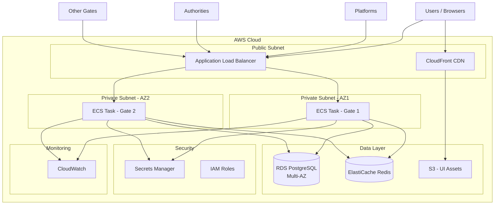
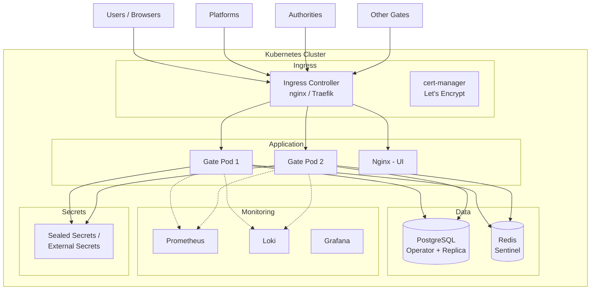

# Scalability Analysis and Migration Plan

## Summary

This document analyzes the scalability deficiencies of the current eFTI Gate solution and describes all necessary work to make the application horizontally scalable. The document covers two variants:
- **Option A: AWS** — With Amazon Web Services managed services (ECS/Fargate, RDS, ElastiCache, etc.)
- **Option B: Kubernetes** — Any Kubernetes cluster (e.g. Hetzner, DigitalOcean, on-premise, RKE2, etc.), without cloud provider-specific services

---

## Current Solution Deficiencies

### 1. In-Memory Registries (CRITICAL)

**Files:** `GateRegistry.kt`, `PlatformRegistry.kt`, `AuthorityRegistry.kt`

All registries load data into memory at startup and keep them in `ConcurrentHashMap`:

```kotlin
// GateRegistry.kt
private val gates = repository.list(...).associateByTo(ConcurrentHashMap()) { it.id }

// PlatformRegistry.kt
private val platforms = repository.list().associateByTo(ConcurrentHashMap()) { it.id }

// AuthorityRegistry.kt
private val authorities = repository.list().associateByTo(ConcurrentHashMap()) { it.id }
```

**Problem:** When running multiple Gate nodes, a change made through one node (e.g. adding a new gate) does not reach the other node. Data is out of sync.

**Impact:** Platform/gate/authority addition, modification, or deletion is visible only to the node that made the change.

---

### 2. In-Memory Request ID Cache (CRITICAL)

**File:** `RequestIdValidator.kt`

```kotlin
private val requestIds = Cache<String, Boolean>(600.seconds)
```

**Problem:** Request ID duplicate control works only within a single node. If a load balancer routes the same Request ID to a different node, there is no duplicate protection.

**Impact:** Replay attacks and duplicate requests are not blocked with multiple nodes.

---

### 3. In-Memory Admin Auth State (MEDIUM)

**File:** `AdminAuthRoutes.kt`

```kotlin
private val activeAuths = ConcurrentHashMap<String, Boolean>()
```

**Problem:** User switch state is kept in memory by IP address. With multiple nodes, user switching does not work correctly.

---

### 4. In-Memory Async Response Provider (PARTIAL SOLUTION)

**File:** `SingleNodeAsyncResponseProvider.kt`

```kotlin
protected val pendingResponses = ConcurrentHashMap<RequestKey, Channel<String>>()
```

**Partial solution exists:** `MultiNodeAsyncResponseProvider.kt` uses PostgreSQL LISTEN/NOTIFY mechanism for inter-node synchronization. This works, but depends on PostgreSQL and adds latency.

---

### 5. Certificates on Filesystem (MEDIUM)

**File:** `KeyManager.kt`

```kotlin
private val ownKeys = KeyStore.getInstance("pkcs12").apply {
    load(FileInputStream("$keyStoreDir/own.p12"), keyStorePassword)
}
val ownCertPem = File(keyStoreDir, "own.crt").readText()
```

**Problem:** Certificates are read from the local filesystem. In container environments, every node must have the same certificates available. Password and file management is not secure in cloud environments.

---

### 6. Database Migration at Startup (MEDIUM)

**File:** `DB.kt`

```kotlin
if (Config.optional("DB_MIGRATE") != "no") use(DBMigrator())
```

**Problem:** All nodes attempt to run database migrations at startup. Multiple simultaneously starting nodes may cause a race condition.

---

### 7. Scheduled Jobs on Every Node (MEDIUM)

**File:** `GateLauncher.kt`

```kotlin
scheduleDaily(identifierExpirationJob, LocalTime.of(3, 45), LocalTime.of(5, 45))
schedule(require<GatePingJob>(), 5.minutes)
```

**Problem:** Every node runs background jobs independently. `IdentifierExpirationJob` and `GatePingJob` run in parallel on all nodes, causing duplicate work and potential conflicts.

---

### 8. Single Database Dependency (LOW)

**File:** `compose.yml`

```yaml
db:
    image: postgres:17-alpine
    volumes:
      - data:/var/lib/postgresql/data
```

**Problem:** A single PostgreSQL instance is a single point of failure. Replication, automatic failover, and backup management are missing.

---

### 9. Static File Serving (LOW)

**File:** `GateLauncher.kt`

```kotlin
assets("/", AssetsHandler(Path.of("ui/build"), useIndexForUnknownPaths = true))
```

**Problem:** UI static files are served directly from the Gate process. This wastes compute resources and does not leverage CDN benefits.

---

### 10. Configuration Management (LOW)

**File:** `gate/.env`

```
DB_PASS=gate
DB_APP_PASS=app-secret
KEYSTORE_PASSWORD=changeit
```

**Problem:** Secrets are in .env files. In the cloud, more secure secrets management must be used.

---

## Required Code Changes (Cross-Platform)

These changes are required **regardless of the platform** (AWS, Kubernetes, other) and must be done before infrastructure migration.

### Stage 1: Registry Synchronization (Priority: CRITICAL)

**Goal:** Ensure all nodes see the same data.

#### 1.1 Make Registries Database-Based

Modify `GateRegistry`, `PlatformRegistry`, `AuthorityRegistry` to always read data from the database (with short-lived cache) or use the PostgreSQL LISTEN/NOTIFY mechanism (as `MultiNodeAsyncResponseProvider` already does).

```
Work: Registry cache invalidation via PostgreSQL NOTIFY
Effort: ~3-5 days
Files: GateRegistry.kt, PlatformRegistry.kt, AuthorityRegistry.kt, NotifiableRegistry.kt
Note: MultiNodeAsyncResponseProvider is a good example — same pattern for registries
```

#### 1.2 Request ID Cache to Shared Storage

Replace in-memory `Cache` with a Redis-based solution.

```
Work: Redis-based Request ID duplicate control
Effort: ~2-3 days
Files: RequestIdValidator.kt
New dependencies: Redis client (Jedis or Lettuce)
Note: includes Redis client integration, error handling, and adding tests
```

#### 1.3 Admin Auth State to Shared Storage

Move `activeAuths` to Redis or remove IP-based logic and replace with session-based approach.

```
Work: Admin auth state to Redis or session-based
Effort: ~1-2 days
Files: AdminAuthRoutes.kt
```

---

### Stage 2: Background Job Coordination (Priority: MEDIUM)

#### 2.1 Leader Election for Background Jobs

Only one node should run scheduled jobs.

```
Option A: PostgreSQL advisory locks (simple, already existing dependency)
Option B: Redis distributed lock (Redlock)

Recommendation: Option A — does not add a new dependency

Work: Leader election mechanism for IdentifierExpirationJob and GatePingJob
Effort: ~2-3 days
Files: GateLauncher.kt, IdentifierExpirationJob.kt, GatePingJob.kt
```

#### 2.2 Migration Locking

```
Work: Database migration lock (only one node migrates at a time)
Effort: ~1 day
Files: DB.kt
Note: Klite DBMigrator may already use PostgreSQL locks — verify
```

---

### Stage 3: Security (Priority: HIGH)

#### 3.1 Secrets Management

Move all secrets from .env files to a secure vault.

```
Work: DB passwords, API keys, KEYSTORE_PASSWORD to secure vault
Effort: ~2-3 days
Files: DB.kt, KeyManager.kt, .env files
Note: includes code changes (Config loading from external source)
```

#### 3.2 Certificates to Secure Vault

eDelivery certificates must be available to all nodes.

```
Work: own.p12 and own.crt to secure vault, code adaptation
Effort: ~2-3 days
Files: KeyManager.kt
```

---

### Stage 4: Monitoring and Logging (Priority: MEDIUM)

#### 4.1 Logging Improvement

```
Work: GateClient and EDeliveryClient outgoing request logging,
     request ID propagation (MDC), EftiService business logic logging
Effort: ~3-4 days
Files: GateClient.kt, EDeliveryClient.kt, EftiService.kt, AccessChecker.kt
```

#### 4.2 Structured Logging

```
Work: JSON log format for production (logback + logstash-encoder)
Effort: ~1-2 days
Files: build.gradle.kts, logback.xml (new), GateLauncher.kt
```

#### 4.3 Health Check Extension

```
Work: /health endpoint extension (DB connection, Redis connection, certificate validity)
Effort: ~1-2 days
Files: GateLauncher.kt
```

---

## Option A: AWS Migration

### A1: AWS Infrastructure (Priority: HIGH)

#### A1.1 Amazon RDS PostgreSQL

Replace Docker PostgreSQL with Amazon RDS.

```
Work: RDS instance, Multi-AZ, automatic backups, connection pooling
AWS services: Amazon RDS for PostgreSQL, RDS Proxy
Effort: ~2-3 days
Note: includes networking (VPC, security groups), parameters, and testing
```

#### A1.2 Amazon ECS/Fargate

Use ECS Fargate for container orchestration.

```
Work: ECS task definitions, service scaling policies, health checks, CI/CD integration
AWS services: Amazon ECS, AWS Fargate, ECR
Effort: ~4-5 days
Note: includes Dockerfile optimization, task definition, service, log
      routing to CloudWatch, and deployment pipeline setup
```

#### A1.3 Application Load Balancer (ALB)

For traffic distribution between nodes.

```
Work: ALB setup, target groups, health check, SSL certificates
AWS services: ALB, ACM (certificates)
Effort: ~1-2 days
```

#### A1.4 Amazon ElastiCache (Redis)

Shared cache for Request ID and sessions.

```
Work: Redis cluster setup, failover, encryption, security groups
AWS services: Amazon ElastiCache for Redis
Effort: ~1-2 days
```

---

### A2: AWS Security (Priority: HIGH)

#### A2.1 AWS Secrets Manager

```
Work: Secrets migration to Secrets Manager, code integration
AWS services: AWS Secrets Manager
Effort: ~2-3 days (includes stages 3.1 and 3.2 code side)
```

#### A2.2 IAM Roles and Policies

```
Work: ECS task role, execution role, least-privilege policies
AWS services: IAM
Effort: ~1-2 days
```

---

### A3: AWS Static Files and CDN (Priority: LOW)

#### A3.1 Amazon S3 + CloudFront

UI static files via CDN.

```
Work: S3 bucket, CloudFront distribution, CI/CD pipeline for UI
AWS services: S3, CloudFront
Effort: ~2-3 days
```

#### A3.2 Separating UI from Gate Process

```
Work: Remove AssetsHandler from GateLauncher, route UI traffic to CDN
Effort: ~1 day
Files: GateLauncher.kt
```

---

### A4: AWS Monitoring (Priority: MEDIUM)

#### A4.1 Amazon CloudWatch

```
Work: Log collection, metrics, alarms, dashboards
AWS services: CloudWatch Logs, CloudWatch Metrics, CloudWatch Alarms
Effort: ~2-3 days
```

#### A4.2 Auto Scaling

```
Work: ECS Service Auto Scaling policies based on CPU/memory, RDS storage auto scaling
AWS services: Application Auto Scaling
Effort: ~1-2 days
```

---

## AWS Architecture Diagram



---

## Option B: Kubernetes Migration (without AWS)

This variant is suitable for any Kubernetes environment: Hetzner, DigitalOcean, on-premise, RKE2, k3s, etc.

### B1: Kubernetes Infrastructure (Priority: HIGH)

#### B1.1 PostgreSQL Cluster

```
Work: PostgreSQL operator (CloudNativePG or Zalando Postgres Operator),
     replication, automatic failover, backups (PgBackRest / Barman)
Effort: ~4-5 days
Note: operator selection, setup, and testing takes time
```

#### B1.2 Gate Deployment + Ingress

```
Work: Deployment manifest, Service, Ingress (nginx-ingress / Traefik),
     cert-manager (Let's Encrypt), HPA, PDB, resource limits
Effort: ~4-6 days
Note: includes Helm chart or Kustomize setup, Docker image CI/CD pipeline,
      readiness/liveness probes, graceful shutdown
```

#### B1.3 Redis

```
Work: Redis Deployment or Redis operator (Spotahome/Redis-Operator),
     Sentinel failover (or simple single-node Redis for development)
Effort: ~2-3 days
```

---

### B2: Kubernetes Security (Priority: HIGH)

#### B2.1 Secrets Management

```
Option A: Kubernetes Secrets + Sealed Secrets (Bitnami) — encrypted in Git
Option B: External Secrets Operator + Vault (HashiCorp)
Option C: SOPS + age/GPG encrypted secrets

Recommendation: Option A is the simplest to start with

Work: Secrets management strategy, setup, code integration
Effort: ~2-3 days (includes stages 3.1 and 3.2 code side)
```

#### B2.2 Network Policies

```
Work: NetworkPolicy manifests — Gate can only communicate with its own DB and Redis,
     Ingress allows only required ports
Effort: ~1-2 days
```

#### B2.3 RBAC and ServiceAccount

```
Work: Kubernetes RBAC, ServiceAccount with minimal permissions
Effort: ~1 day
```

---

### B3: Kubernetes Static Files (Priority: LOW)

#### B3.1 UI Serving via Nginx Sidecar / Separate Deployment

```
Option A: Nginx sidecar container in Gate pod — serves static files
Option B: Separate Nginx Deployment + Service for UI
Option C: CDN (Cloudflare, BunnyCDN, etc.)

Work: UI file serving in separate process, Ingress routing
Effort: ~2-3 days
```

---

### B4: Kubernetes Monitoring (Priority: MEDIUM)

#### B4.1 Log Collection

```
Option A: Loki + Promtail (Grafana stack) — lightweight
Option B: ELK/EFK stack (Elasticsearch + Fluentd + Kibana)

Recommendation: Loki + Grafana — less resources, sufficient for log searching

Work: Log collection stack installation, dashboards
Effort: ~3-4 days
```

#### B4.2 Metrics and Alerts

```
Work: Prometheus + Grafana, JVM metrics (Micrometer), custom metrics,
     AlertManager alerts
Effort: ~3-4 days
Note: Klite Metrics already exists — need to add Prometheus format
```

#### B4.3 Auto Scaling

```
Work: HorizontalPodAutoscaler based on CPU/memory,
     Kubernetes Metrics Server (if missing)
Effort: ~1-2 days
```

---

## Kubernetes Architecture Diagram



---

## Work Summary

### Cross-Platform Code Changes

| Stage | Description | Priority | Effort |
|-------|-------------|----------|--------|
| 1.1 | Registry synchronization (NOTIFY) | CRITICAL | 3-5 days |
| 1.2 | Request ID cache to Redis | CRITICAL | 2-3 days |
| 1.3 | Admin auth state | CRITICAL | 1-2 days |
| 2.1 | Leader election for background jobs | MEDIUM | 2-3 days |
| 2.2 | Migration lock | MEDIUM | 1 day |
| 3.1 | Secrets management (code side) | HIGH | 2-3 days |
| 3.2 | Certificates (code side) | HIGH | 2-3 days |
| 4.1 | Logging improvement | MEDIUM | 3-4 days |
| 4.2 | Structured logging | MEDIUM | 1-2 days |
| 4.3 | Health checks | MEDIUM | 1-2 days |
| | **Code changes total** | | **~19-28 days** |

### Option A: AWS Infrastructure (in addition to code changes)

| Stage | Description | Priority | Effort |
|-------|-------------|----------|--------|
| A1.1 | Amazon RDS | HIGH | 2-3 days |
| A1.2 | ECS/Fargate + ECR + CI/CD | HIGH | 4-5 days |
| A1.3 | ALB + ACM | HIGH | 1-2 days |
| A1.4 | ElastiCache Redis | HIGH | 1-2 days |
| A2.1 | Secrets Manager | HIGH | 2-3 days |
| A2.2 | IAM | HIGH | 1-2 days |
| A3.1 | S3 + CloudFront | LOW | 2-3 days |
| A3.2 | UI separation | LOW | 1 day |
| A4.1 | CloudWatch | MEDIUM | 2-3 days |
| A4.2 | Auto Scaling | MEDIUM | 1-2 days |
| | **AWS infrastructure total** | | **~18-26 days** |
| | **TOTAL (code + AWS)** | | **~37-54 days** |

### Option B: Kubernetes Infrastructure (in addition to code changes)

| Stage | Description | Priority | Effort |
|-------|-------------|----------|--------|
| B1.1 | PostgreSQL operator | HIGH | 4-5 days |
| B1.2 | Gate Deployment + Ingress + CI/CD | HIGH | 4-6 days |
| B1.3 | Redis | HIGH | 2-3 days |
| B2.1 | Secrets management (Sealed Secrets) | HIGH | 2-3 days |
| B2.2 | Network policies | MEDIUM | 1-2 days |
| B2.3 | RBAC and ServiceAccount | MEDIUM | 1 day |
| B3.1 | UI serving | LOW | 2-3 days |
| B4.1 | Loki + Grafana | MEDIUM | 3-4 days |
| B4.2 | Prometheus + metrics | MEDIUM | 3-4 days |
| B4.3 | HPA Auto Scaling | MEDIUM | 1-2 days |
| | **K8s infrastructure total** | | **~24-33 days** |
| | **TOTAL (code + K8s)** | | **~43-61 days** |

---

## Option Comparison

| Aspect | AWS (ECS/Fargate) | Kubernetes |
|--------|-------------------|------------|
| **Managed services** | RDS, ElastiCache, ALB — less management | Operators — more management and knowledge |
| **Cost** | Higher (managed services cost more) | Lower (VPS + self-management) |
| **Complexity** | Moderate (AWS console + Terraform/CDK) | High (K8s manifests, operators, Helm) |
| **Vendor lock-in** | High (AWS-specific services) | Low (portable) |
| **Experience required** | AWS experience needed | Kubernetes experience needed |
| **Operational overhead** | Low (managed services) | Medium-high (self-management) |
| **Scaling speed** | Fast (Fargate auto scaling) | Fast (HPA), but cluster itself doesn't auto-scale |

---

## Alternative Simple Approach

If full migration is not immediately necessary, scalability can be achieved with minimal effort:

### Option: Single Node Optimization

The current solution is very lightweight and can very likely serve all required requests as a single node. Klite + virtual threads + PostgreSQL is already very efficient.

**Minimal changes:**
1. Managed PostgreSQL (RDS / other managed service) — database high availability
2. Secrets to secure vault (Kubernetes Secrets / Secrets Manager)
3. Monitoring (Grafana Cloud / CloudWatch)
4. Regular backups
5. Logging improvement (see stage 4)

**Effort:** ~8-12 days

This is a reasonable intermediate step, since eFTI Gate stores only identifiers and the load is likely low. The need for horizontal scaling arises only when a single node can no longer handle the load, or when high availability is needed (zero downtime deployments).

---

## Effort Estimate Summary

| Option | Code Changes | Infrastructure | Total |
|--------|-------------|----------------|-------|
| **Minimal** (single node optimization) | — | — | **~8-12 days** |
| **Option A** (AWS) | ~19-28 days | ~18-26 days | **~37-54 days** |
| **Option B** (Kubernetes) | ~19-28 days | ~24-33 days | **~43-61 days** |

Code changes are the same for both options. The difference comes from the infrastructure side — AWS managed services are faster to set up, but Kubernetes requires more manual work for operator and monitoring setup.
