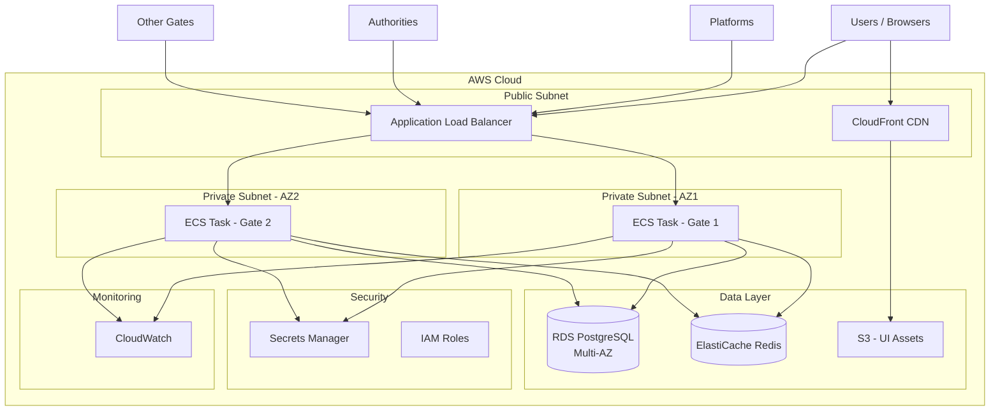
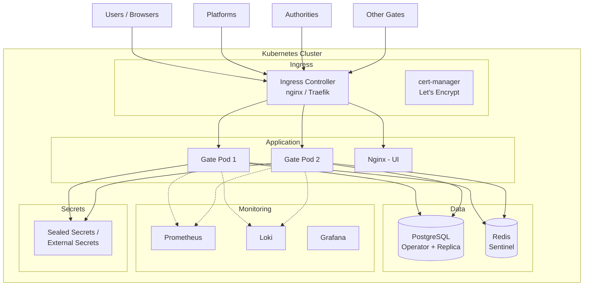

# Skaleeritavuse analüüs ja migratsiooni plaan

## Lühikirjeldus

See dokument analüüsib eFTI Gate praeguse lahenduse skaleeritavuse puudusi ja kirjeldab kõik vajalikud tööd, et muuta rakendus horisontaalselt skaleeritavaks. Dokument käsitleb kahte varianti:
- **Variant A: AWS** — Amazon Web Services hallatavate teenustega (ECS/Fargate, RDS, ElastiCache jne)
- **Variant B: Kubernetes** — suvaline Kubernetes klaster (nt Hetzner, DigitalOcean, on-premise, RKE2 jne), ilma pilveteenuse pakkuja spetsiifiliste teenusteta

---

## Praeguse lahenduse puudused

### 1. In-Memory Registry'd (KRIITILINE)

**Failid:** `GateRegistry.kt`, `PlatformRegistry.kt`, `AuthorityRegistry.kt`

Kõik registrid laevad andmed mällu käivitamisel ja hoiavad neid `ConcurrentHashMap`'is:

```kotlin
// GateRegistry.kt
private val gates = repository.list(...).associateByTo(ConcurrentHashMap()) { it.id }

// PlatformRegistry.kt
private val platforms = repository.list().associateByTo(ConcurrentHashMap()) { it.id }

// AuthorityRegistry.kt
private val authorities = repository.list().associateByTo(ConcurrentHashMap()) { it.id }
```

**Probleem:** Kui jookseb mitu Gate node'i, siis ühe node'i kaudu tehtud muudatus (nt uue gate'i lisamine) ei jõua teise node'ini. Andmed on sünkroonist väljas.

**Mõju:** Platvormi/gate'i/asutuse lisamine, muutmine või kustutamine on nähtav ainult selle node'i jaoks, mis muudatuse tegi.

---

### 2. In-Memory Request ID Cache (KRIITILINE)

**Fail:** `RequestIdValidator.kt`

```kotlin
private val requestIds = Cache<String, Boolean>(600.seconds)
```

**Probleem:** Request ID duplikaatide kontroll toimib ainult ühe node'i piires. Kui load balancer suunab sama Request ID teise node'i, siis duplikaatide kaitset ei ole.

**Mõju:** Replay-rünnakud ja duplikaatpäringud ei ole mitme node'i puhul blokeeritud.

---

### 3. In-Memory Admin Auth State (KESKMINE)

**Fail:** `AdminAuthRoutes.kt`

```kotlin
private val activeAuths = ConcurrentHashMap<String, Boolean>()
```

**Probleem:** Kasutaja vahetuse (switch) olek hoitakse mälus IP-aadressi järgi. Mitme node'i puhul ei toimi kasutajate vahetamine korrektselt.

---

### 4. In-Memory Async Response Provider (OSALINE LAHENDUS)

**Fail:** `SingleNodeAsyncResponseProvider.kt`

```kotlin
protected val pendingResponses = ConcurrentHashMap<RequestKey, Channel<String>>()
```

**Osaline lahendus olemas:** `MultiNodeAsyncResponseProvider.kt` kasutab PostgreSQL LISTEN/NOTIFY mehhanismi node'ide vaheliseks sünkroonimiseks. See töötab, kuid sõltub PostgreSQL'ist ja lisab latentsust.

---

### 5. Sertifikaadid Failisüsteemis (KESKMINE)

**Fail:** `KeyManager.kt`

```kotlin
private val ownKeys = KeyStore.getInstance("pkcs12").apply {
    load(FileInputStream("$keyStoreDir/own.p12"), keyStorePassword)
}
val ownCertPem = File(keyStoreDir, "own.crt").readText()
```

**Probleem:** Sertifikaadid loetakse lokaalse failisüsteemi kaugelt. Konteinerkeskkondades peab iga node'il olema samad sertifikaadid kättesaadavad. Parooli ja failide haldus pole pilvekeskkonnas turvaline.

---

### 6. Andmebaasi Migratsioon Käivitusel (KESKMINE)

**Fail:** `DB.kt`

```kotlin
if (Config.optional("DB_MIGRATE") != "no") use(DBMigrator())
```

**Probleem:** Kõik node'id proovivad käivitusel andmebaasi migratsioone jooksutada. Mitu samaaegselt käivituvat node'i võivad tekitada race condition'i.

---

### 7. Ajastatud Tööd Igal Node'il (KESKMINE)

**Fail:** `GateLauncher.kt`

```kotlin
scheduleDaily(identifierExpirationJob, LocalTime.of(3, 45), LocalTime.of(5, 45))
schedule(require<GatePingJob>(), 5.minutes)
```

**Probleem:** Iga node jooksutab tausttöid iseseisvalt. `IdentifierExpirationJob` ja `GatePingJob` jooksevad paralleelselt kõigil node'idel, põhjustades duplikaatset tööd ja potentsiaalseid konflikte.

---

### 8. Ühe Andmebaasi Sõltuvus (MADAL)

**Fail:** `compose.yml`

```yaml
db:
    image: postgres:17-alpine
    volumes:
      - data:/var/lib/postgresql/data
```

**Probleem:** Üks PostgreSQL instants on single point of failure. Puudub replikatsioon, automaatne failover ja varukoopiate haldus.

---

### 9. Staatiliste Failide Serveerimine (MADAL)

**Fail:** `GateLauncher.kt`

```kotlin
assets("/", AssetsHandler(Path.of("ui/build"), useIndexForUnknownPaths = true))
```

**Probleem:** UI staatilised failid serveeritakse otse Gate protsessist. See raiskab arvutusressursse ja ei kasuta CDN-i eeliseid.

---

### 10. Konfiguratsiooni Haldus (MADAL)

**Fail:** `gate/.env`

```
DB_PASS=gate
DB_APP_PASS=app-secret
KEYSTORE_PASSWORD=changeit
```

**Probleem:** Saladused on .env failides. Pilves peab kasutama turvalisemat saladuste haldust.

---

## Vajalikud koodimuudatused (platvormiülesed)

Need muudatused on vajalikud **olenemata platvormist** (AWS, Kubernetes, muu) ja tuleb teha enne infrastruktuuri migratsiooni.

### Etapp 1: Registrite sünkroonimine (prioriteet: KRIITILINE)

**Eesmärk:** Tagada, et kõik node'id näevad samu andmeid.

#### 1.1 Registry'd andmebaasipõhiseks

Muuda `GateRegistry`, `PlatformRegistry`, `AuthorityRegistry` nii, et need loevad andmeid alati andmebaasist (koos lühiajalise cache'iga) või kasutavad PostgreSQL LISTEN/NOTIFY mehhanismi (nagu `MultiNodeAsyncResponseProvider` juba teeb).

```
Töö: Registry cache invalidation PostgreSQL NOTIFY kaudu
Maht: ~3-5 päeva
Failid: GateRegistry.kt, PlatformRegistry.kt, AuthorityRegistry.kt, NotifiableRegistry.kt
Märkus: MultiNodeAsyncResponseProvider on hea eeskuju — sama muster registry'tele
```

#### 1.2 Request ID cache jagatud salvestusse

Asenda in-memory `Cache` Redis-põhise lahendusega.

```
Töö: Redis-põhine Request ID duplikaatide kontroll
Maht: ~2-3 päeva
Failid: RequestIdValidator.kt
Uued sõltuvused: Redis klient (Jedis või Lettuce)
Märkus: sisaldab Redis kliendi integreerimist, error handling'ut ja testide lisamist
```

#### 1.3 Admin auth state jagatud salvestusse

Liiguta `activeAuths` Redis'esse või eemalda IP-põhine loogika ja asenda sessioonipõhisega.

```
Töö: Admin auth state Redis'esse või sessioonipõhiseks
Maht: ~1-2 päeva
Failid: AdminAuthRoutes.kt
```

---

### Etapp 2: Tausttööde koordineerimine (prioriteet: KESKMINE)

#### 2.1 Leader election tausttöödele

Ainult üks node peaks jooksutama ajastatud töid.

```
Variant A: PostgreSQL advisory locks (lihtne, juba olemasolev sõltuvus)
Variant B: Redis distributed lock (Redlock)

Soovitus: Variant A — ei lisa uut sõltuvust

Töö: Leader election mehhanism IdentifierExpirationJob ja GatePingJob jaoks
Maht: ~2-3 päeva
Failid: GateLauncher.kt, IdentifierExpirationJob.kt, GatePingJob.kt
```

#### 2.2 Migratsiooni lukustamine

```
Töö: Andmebaasi migratsiooni lukk (ainult üks node migreerib korraga)
Maht: ~1 päev
Failid: DB.kt
Märkus: Klite DBMigrator võib juba kasutada PostgreSQL lukke — kontrollida
```

---

### Etapp 3: Turvalisus (prioriteet: KÕRGE)

#### 3.1 Saladuste haldus

Liiguta kõik saladused .env failidest turvalisse hoidlasse.

```
Töö: DB paroolid, API võtmed, KEYSTORE_PASSWORD turvalisse hoidlasse
Maht: ~2-3 päeva
Failid: DB.kt, KeyManager.kt, .env failid
Märkus: sisaldab ka koodi muutmist (Config laadimine välisest allikast)
```

#### 3.2 Sertifikaadid turvalisse hoidlasse

eDelivery sertifikaadid peavad olema kättesaadavad kõigile node'idele.

```
Töö: own.p12 ja own.crt turvalisse hoidlasse, koodi kohandamine
Maht: ~2-3 päeva
Failid: KeyManager.kt
```

---

### Etapp 4: Monitooring ja logimine (prioriteet: KESKMINE)

#### 4.1 Logimise parendamine

```
Töö: GateClient ja EDeliveryClient väljaminevate päringute logimine,
     request ID propageerimine (MDC), EftiService äriloogika logimine
Maht: ~3-4 päeva
Failid: GateClient.kt, EDeliveryClient.kt, EftiService.kt, AccessChecker.kt
```

#### 4.2 Struktureeritud logimine

```
Töö: JSON logiformaat tootmiskeskkonna jaoks (logback + logstash-encoder)
Maht: ~1-2 päeva
Failid: build.gradle.kts, logback.xml (uus), GateLauncher.kt
```

#### 4.3 Health check'ide laiendamine

```
Töö: /health endpoint laiendamine (DB ühendus, Redis ühendus, sertifikaatide kehtivus)
Maht: ~1-2 päeva
Failid: GateLauncher.kt
```

---

## Variant A: AWS migratsioon

### A1: AWS infrastruktuur (prioriteet: KÕRGE)

#### A1.1 Amazon RDS PostgreSQL

Asenda Docker PostgreSQL Amazon RDS-iga.

```
Töö: RDS instants, Multi-AZ, automaatsed varukoopiad, connection pooling
AWS teenused: Amazon RDS for PostgreSQL, RDS Proxy
Maht: ~2-3 päeva
Märkus: sisaldab networking (VPC, security groups), parameetreid ja testimist
```

#### A1.2 Amazon ECS/Fargate

Konteinerite orkestreerimiseks kasuta ECS Fargate't.

```
Töö: ECS task definitions, service scaling policies, health checks, CI/CD integratsioon
AWS teenused: Amazon ECS, AWS Fargate, ECR
Maht: ~4-5 päeva
Märkus: sisaldab Dockerfile optimeerimist, task definition'i, service'i, logide
        suunamist CloudWatch'i ja deployment pipeline'i seadistamist
```

#### A1.3 Application Load Balancer (ALB)

Liikluse jaotamiseks node'ide vahel.

```
Töö: ALB seadistamine, target groups, health check, SSL sertifikaadid
AWS teenused: ALB, ACM (sertifikaadid)
Maht: ~1-2 päeva
```

#### A1.4 Amazon ElastiCache (Redis)

Jagatud cache Request ID ja sessioonide jaoks.

```
Töö: Redis cluster seadistamine, failover, encryption, security groups
AWS teenused: Amazon ElastiCache for Redis
Maht: ~1-2 päeva
```

---

### A2: AWS turvalisus (prioriteet: KÕRGE)

#### A2.1 AWS Secrets Manager

```
Töö: Saladuste üleviimine Secrets Manager'isse, koodi integratsioon
AWS teenused: AWS Secrets Manager
Maht: ~2-3 päeva (sisaldab etappe 3.1 ja 3.2 koodipoolest)
```

#### A2.2 IAM rollid ja poliitikad

```
Töö: ECS task role, execution role, minimaalsete õigustega poliitikad
AWS teenused: IAM
Maht: ~1-2 päeva
```

---

### A3: AWS staatilised failid ja CDN (prioriteet: MADAL)

#### A3.1 Amazon S3 + CloudFront

UI staatilised failid CDN-i kaudu.

```
Töö: S3 bucket, CloudFront distribution, CI/CD pipeline UI jaoks
AWS teenused: S3, CloudFront
Maht: ~2-3 päeva
```

#### A3.2 UI eraldamine Gate protsessist

```
Töö: Eemalda AssetsHandler GateLauncher'ist, suuna UI liiklus CDN-i
Maht: ~1 päev
Failid: GateLauncher.kt
```

---

### A4: AWS monitooring (prioriteet: KESKMINE)

#### A4.1 Amazon CloudWatch

```
Töö: Logide kogumine, meetrikad, alarmid, dashboard'id
AWS teenused: CloudWatch Logs, CloudWatch Metrics, CloudWatch Alarms
Maht: ~2-3 päeva
```

#### A4.2 Auto Scaling

```
Töö: ECS Service Auto Scaling poliitikad CPU/mälu põhjal, RDS storage auto scaling
AWS teenused: Application Auto Scaling
Maht: ~1-2 päeva
```

---

## AWS arhitektuuriskeem



---

## Variant B: Kubernetes migratsioon (ilma AWS-ita)

See variant sobib suvalise Kubernetes keskkonna jaoks: Hetzner, DigitalOcean, on-premise, RKE2, k3s jne.

### B1: Kubernetes infrastruktuur (prioriteet: KÕRGE)

#### B1.1 PostgreSQL klaster

```
Töö: PostgreSQL operaator (CloudNativePG või Zalando Postgres Operator),
     replikatsioon, automaatne failover, varukoopiad (PgBackRest / Barman)
Maht: ~4-5 päeva
Märkus: operaatori valimine, seadistamine ja testimine võtab aega
```

#### B1.2 Gate Deployment + Ingress

```
Töö: Deployment manifest, Service, Ingress (nginx-ingress / Traefik),
     cert-manager (Let's Encrypt), HPA, PDB, resource limits
Maht: ~4-6 päeva
Märkus: sisaldab Helm chart'i või Kustomize seadistust, Docker image CI/CD pipeline'i,
        readiness/liveness probes, graceful shutdown
```

#### B1.3 Redis

```
Töö: Redis Deployment või Redis operaator (Spotahome/Redis-Operator),
     Sentinel failover'iga (või lihtne ühe node'i Redis arenduseks)
Maht: ~2-3 päeva
```

---

### B2: Kubernetes turvalisus (prioriteet: KÕRGE)

#### B2.1 Saladuste haldus

```
Variant A: Kubernetes Secrets + Sealed Secrets (Bitnami) — krüpteeritud Git'is
Variant B: External Secrets Operator + Vault (HashiCorp)
Variant C: SOPS + age/GPG krüpteeritud secrets

Soovitus: Variant A on kõige lihtsam alustamiseks

Töö: Secrets haldamise strateegia, seadistamine, koodi integratsioon
Maht: ~2-3 päeva (sisaldab etappe 3.1 ja 3.2 koodipoolest)
```

#### B2.2 Network policies

```
Töö: NetworkPolicy manifested — Gate saab suhelda ainult oma DB ja Redis'ega,
     Ingress lubab ainult vajalikud pordid
Maht: ~1-2 päeva
```

#### B2.3 RBAC ja ServiceAccount

```
Töö: Kubernetes RBAC, ServiceAccount minimaalsete õigustega
Maht: ~1 päev
```

---

### B3: Kubernetes staatilised failid (prioriteet: MADAL)

#### B3.1 UI serveerimine Nginx sidecar / eraldi Deployment

```
Variant A: Nginx sidecar konteiner Gate pod'is — serveerib staatilised failid
Variant B: Eraldi Nginx Deployment + Service UI jaoks
Variant C: CDN (Cloudflare, BunnyCDN jms)

Töö: UI failide serveerimine eraldi protsessis, Ingress routing
Maht: ~2-3 päeva
```

---

### B4: Kubernetes monitooring (prioriteet: KESKMINE)

#### B4.1 Logide kogumine

```
Variant A: Loki + Promtail (Grafana stack) — kergekaaluline
Variant B: ELK/EFK stack (Elasticsearch + Fluentd + Kibana)

Soovitus: Loki + Grafana — vähem ressursse, piisav logide otsimiseks

Töö: Logikogumise stack'i paigaldus, dashboard'id
Maht: ~3-4 päeva
```

#### B4.2 Meetrikad ja alarmid

```
Töö: Prometheus + Grafana, JVM meetrikad (Micrometer), custom meetrikad,
     AlertManager alarmid
Maht: ~3-4 päeva
Märkus: Klite Metrics on juba olemas — vaja lisada Prometheus formaat
```

#### B4.3 Auto Scaling

```
Töö: HorizontalPodAutoscaler CPU/mälu põhjal,
     Kubernetes Metrics Server (kui puudub)
Maht: ~1-2 päeva
```

---

## Kubernetes arhitektuuriskeem



---

## Tööde kokkuvõte

### Platvormiülesed koodimuudatused

| Etapp | Kirjeldus | Prioriteet | Maht |
|-------|-----------|------------|------|
| 1.1 | Registry sünkroonimine (NOTIFY) | KRIITILINE | 3-5 päeva |
| 1.2 | Request ID cache Redis'esse | KRIITILINE | 2-3 päeva |
| 1.3 | Admin auth state | KRIITILINE | 1-2 päeva |
| 2.1 | Leader election tausttöödele | KESKMINE | 2-3 päeva |
| 2.2 | Migratsiooni lukk | KESKMINE | 1 päev |
| 3.1 | Saladuste haldus (koodipool) | KÕRGE | 2-3 päeva |
| 3.2 | Sertifikaadid (koodipool) | KÕRGE | 2-3 päeva |
| 4.1 | Logimise parendamine | KESKMINE | 3-4 päeva |
| 4.2 | Struktureeritud logimine | KESKMINE | 1-2 päeva |
| 4.3 | Health check'id | KESKMINE | 1-2 päeva |
| | **Koodimuudatused kokku** | | **~19-28 päeva** |

### Variant A: AWS infrastruktuur (lisaks koodimuudatustele)

| Etapp | Kirjeldus | Prioriteet | Maht |
|-------|-----------|------------|------|
| A1.1 | Amazon RDS | KÕRGE | 2-3 päeva |
| A1.2 | ECS/Fargate + ECR + CI/CD | KÕRGE | 4-5 päeva |
| A1.3 | ALB + ACM | KÕRGE | 1-2 päeva |
| A1.4 | ElastiCache Redis | KÕRGE | 1-2 päeva |
| A2.1 | Secrets Manager | KÕRGE | 2-3 päeva |
| A2.2 | IAM | KÕRGE | 1-2 päeva |
| A3.1 | S3 + CloudFront | MADAL | 2-3 päeva |
| A3.2 | UI eraldamine | MADAL | 1 päev |
| A4.1 | CloudWatch | KESKMINE | 2-3 päeva |
| A4.2 | Auto Scaling | KESKMINE | 1-2 päeva |
| | **AWS infrastruktuur kokku** | | **~18-26 päeva** |
| | **KOKKU (kood + AWS)** | | **~37-54 päeva** |

### Variant B: Kubernetes infrastruktuur (lisaks koodimuudatustele)

| Etapp | Kirjeldus | Prioriteet | Maht |
|-------|-----------|------------|------|
| B1.1 | PostgreSQL operaator | KÕRGE | 4-5 päeva |
| B1.2 | Gate Deployment + Ingress + CI/CD | KÕRGE | 4-6 päeva |
| B1.3 | Redis | KÕRGE | 2-3 päeva |
| B2.1 | Saladuste haldus (Sealed Secrets) | KÕRGE | 2-3 päeva |
| B2.2 | Network policies | KESKMINE | 1-2 päeva |
| B2.3 | RBAC ja ServiceAccount | KESKMINE | 1 päev |
| B3.1 | UI serveerimine | MADAL | 2-3 päeva |
| B4.1 | Loki + Grafana | KESKMINE | 3-4 päeva |
| B4.2 | Prometheus + meetrikad | KESKMINE | 3-4 päeva |
| B4.3 | HPA Auto Scaling | KESKMINE | 1-2 päeva |
| | **K8s infrastruktuur kokku** | | **~24-33 päeva** |
| | **KOKKU (kood + K8s)** | | **~43-61 päeva** |

---

## Variantide võrdlus

| Aspekt | AWS (ECS/Fargate) | Kubernetes |
|--------|-------------------|------------|
| **Hallatavad teenused** | RDS, ElastiCache, ALB — vähem haldust | Operaatorid — rohkem haldust ja teadmisi |
| **Hind** | Kõrgem (hallatavad teenused maksavad) | Madalam (VPS-id + ise haldamine) |
| **Keerukus** | Mõõdukas (AWS konsool + Terraform/CDK) | Kõrge (K8s manifestid, operaatorid, Helm) |
| **Vendor lock-in** | Kõrge (AWS-spetsiifilised teenused) | Madal (porditav) |
| **Kogemusenõue** | AWS kogemus vajalik | Kubernetes kogemus vajalik |
| **Opereerimiskoormus** | Madal (hallatavad teenused) | Keskmine-kõrge (ise haldamine) |
| **Skaleerumiskiirus** | Kiire (Fargate auto scaling) | Kiire (HPA), aga klaster ise ei skaleeru automaatselt |

---

## Alternatiivne lihtne lähenemine

Kui täielik migratsioon pole kohe vajalik, saab skaleeritavust saavutada minimaalse vaevaga:

### Variant: ühe node'i optimeerimine

Praegune lahendus on väga kerge ja suudab suure tõenäosusega ühe node'ina teenindada kõiki vajalikke päringuid. Klite + virtual threads + PostgreSQL on juba väga efektiivne.

**Minimaalsed muudatused:**
1. Hallatav PostgreSQL (RDS / muu hallatav teenus) — andmebaasi kõrgkäideldavus
2. Saladused turvalisse hoidlasse (Kubernetes Secrets / Secrets Manager)
3. Monitooring (Grafana Cloud / CloudWatch)
4. Regulaarsed varukoopiad
5. Logimise parendamine (vt etapp 4)

**Maht:** ~8-12 päeva

See on mõistlik vahesamm, kuna eFTI Gate salvestab ainult identifikaatoreid ja koormus on tõenäoliselt madal. Horisontaalse skaleerimise vajadus tekib alles siis, kui üks node enam ei jaksa, või kui on vaja kõrgkäideldavust (zero downtime deployments).

---

## Ajahinnangute koondkokkuvõte

| Variant | Koodimuudatused | Infrastruktuur | Kokku |
|---------|----------------|----------------|-------|
| **Minimaalne** (ühe node'i optimeerimine) | — | — | **~8-12 päeva** |
| **Variant A** (AWS) | ~19-28 päeva | ~18-26 päeva | **~37-54 päeva** |
| **Variant B** (Kubernetes) | ~19-28 päeva | ~24-33 päeva | **~43-61 päeva** |

Koodimuudatused on mõlema variandi puhul samad. Erinevus tuleb infrastruktuuri poolest — AWS hallatavad teenused on kiiremini üles seatud, aga Kubernetes nõuab rohkem käsitööd operaatorite ja monitooringu seadistamisel.
