# eFTI Gate — Complete Epics Specification

> Reference document for building the eFTI Gate system. Based on: [eFTI Gate Reference Architecture](architecture/eFTI-Gate-Reference-Architecture.md) (v2.0, 2026-04-02) and EU Regulations 2024/1942 and 2025/2243.  
> Each epic contains all acceptance criteria required to implement and verify the functionality.

---

## Overview

The eFTI Gate is a node in the EU eFTI (Electronic Freight Transport Information) network that:
1. **Stores identifiers** — platforms register freight transport identifiers (vehicle registration plates, containers, trailers)
2. **Searches identifiers** — authorities can search both locally and across other EU gates (broadcast only when local result is empty)
3. **Mediates datasets** — authorities request full datasets based on UIL (Unique Identifier Locator)
4. **Forwards follow-up messages** — authorities send feedback messages to platforms

**Protocols and standards:** REST, eDelivery AS4 (SOAP), OpenAPI, JWT (RFC 7519), RFC 7807, XSD/XML

> **Module boundaries:** This document distinguishes two categories:
> - **EU core** — country-neutral, applies to all member states
> - **EE extension** — Estonia-specific, implemented in a separate module without modifying core code

### Core Principles (Reference Architecture §6)

> **eFTI Gate is a content-agnostic router with minimal persistence** (identifiers only).

| eFTI Gate **DOES** | eFTI Gate **DOES NOT** |
|---|---|
| Store identifiers | Store full datasets (only eFTI platform) |
| Route queries based on UIL | Parse/validate payload content |
| Broadcast searches to other gates | Enforce subset filters (eFTI platform does this) |
| Aggregate results from multiple sources | Transform data formats |
| Manage authentication/authorisation | Apply business logic |
| Manage registries (gates, platforms, authorities) | Retain query history |
| eDelivery AS4 protocol (signing, encryption) | — |
| AAP (Authority Access Point) REST interface for authorities | — |

### Key Terms

- **UIL (Unique Identifier Locator):** `<gateURL>/<platformURL>/<datasetId>` — globally unique reference to a specific freight transport dataset. Example: `https://eu-ee31.eftisandbox.eu/https://demo-platform.eu-ee31.eftisandbox.eu/v1/550e8400-e29b-41d4-a716-446655440000`
- **identifier:** The searchable value used to locate a consignment (vehicle registration plate, container number, trailer ID). UIL is the full compound URL form of the identifier.
- **AAP (Authority Access Point):** Gate's REST API interface for authorities (both H2M and M2M use)
- **dataset:** The complete freight transport documentation stored on the eFTI platform — never stored on the eFTI Gate
- **H2M:** Human-to-Machine (browser/application)
- **M2M:** Machine-to-Machine (API/AS4)
- **G2G:** Gate-to-Gate communication (eDelivery AS4)
- **G2P:** Gate-to-Platform communication (REST or AS4)

---

## THEME 1 — Identity and Access

**Objective:** Ensure that all parties interacting with the gate (admins, platforms, authorities, other gates) are authenticated securely and can only access resources they are permitted to access.

**Requirements to address:**

| Area | Current state | Requirement |
|------|--------------|-------------|
| Admin authentication | HTTP Basic Auth | TARA (ID-card, Mobile-ID, Smart-ID) |
| Password-based login | Enabled | Disabled in production |
| X-Road | Missing | Required for government authority access |
| Platform API auth | `base64(id:password)` | RFC 7519 JWT |
| Secrets management | Plain text in `.env` files | Runtime loading (K8s Secret / vault) |
| Write-access control | `checkWriteAccess()` does not check role type | Role-type check enforced |

**Business value:**
- TARA authentication eliminates password management overhead and meets e-government standards (required for production)
- Enables centralised identity management
- GDPR Art. 30 compliance — record of processing with audit log

**Theme done when:**
- [ ] EPIC 1 (RBAC): all roles enforced, write-access type check fixed
- [ ] EPIC 2 (Authentication): TARA login works, Basic Auth disabled in production, mTLS for G2G
- [ ] EPIC 23 (Auth flows): all three auth sequence diagrams documented

### EPIC 1 — User Management and RBAC

**AS A** system administrator  
**I WANT** role-based access control with resource-level filtering  
**SO THAT** each user can only see and manage the resources they are permitted to access

**Reference:** [Permissions Matrix](specs/permissions-matrix.md) — Complete authorization model and role-based access control specification

**Authorisation at a glance:**

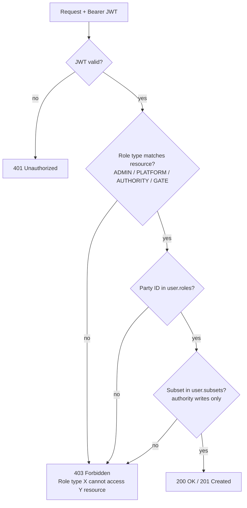
```mermaid
flowchart TD
    Req[Request + Bearer JWT] --> Auth{JWT valid?}
    Auth -- no --> R401[401 Unauthorized]
    Auth -- yes --> Role{Role type matches resource?<br/>ADMIN / PLATFORM / AUTHORITY / GATE}
    Role -- no --> R403["403 Forbidden<br/>Role type X cannot access Y resource"]
    Role -- yes --> Party{Party ID in user.roles?}
    Party -- no --> R403
    Party -- yes --> Subset{Subset in user.subsets?<br/>authority writes only}
    Subset -- no --> R403
    Subset -- yes --> Allow[200 OK / 201 Created]
```

See `flow-02-authorization-check.mmd` for the full decision tree.

#### Acceptance Criteria

##### Role management

**Happy path:**
- [ ] `POST /api/v1/users` — admin creates user; new user receives only creator's roles (except Super Admin); response `201 Created` with user ID
- [ ] `GET /api/v1/users` — Super Admin sees all users; regular admin sees only users within their own roles; response paginated (`limit`, `offset`, `X-Total-Count`)
- [ ] `DELETE /api/v1/users/:userId` — admin deletes another user visible to them; response `204 No Content`
- [ ] A user can be assigned multiple roles and multiple Party IDs under a single role
- [ ] Creating authority user with `subsets` that are subset of Authority's `subsets` → `201 Created`

**Edge cases:**
- [ ] Admin attempts to assign Super Admin role → `403 Forbidden` with `"detail": "Super Admin role cannot be assigned by regular admin"`
- [ ] Admin attempts to delete own account → `409 Conflict` with `"detail": "Cannot delete your own account"`
- [ ] Creating authority user with `subsets` not in Authority's allowed list → `400 Bad Request` with `"detail": "Subset 'EU04' not permitted for authority 'mta@mta.ee'"`
- [ ] `POST /api/v1/users` with duplicate email → `409 Conflict`

**Error handling:**
- [ ] `POST /api/v1/users` with missing required field (e.g. no `roles`) → `400 Bad Request` RFC 7807 with field-level detail
- [ ] All authorisation denials logged: user ID, endpoint, reason, IP address, timestamp

**Technical constraints:**
- [ ] Primary auth is TARA OIDC JWT (RS256, JWKS from `TARA_OIDC_DISCOVERY_URL`); TARA owns expiry policy. Permission claims (`roles`, `subsets`, scope) are read from the resolved `users` row, not from the JWT.
- [ ] User `taraSub` (= JWT `sub` claim, Estonian PIC) is the auth identifier. Admin POST creates the row; on first inbound JWT the gate has a row to bind to.
- [ ] Break-glass `/api/v1/auth/local-token` issues a gate-signed JWT with hardcoded 600 s TTL (default-disabled via `LOCAL_ADMIN_FALLBACK_ENABLED=false`); bcrypt is used **only** on the single break-glass row.
- [ ] Revocation: JWT `jti` written to `sessions` denylist; `AccessChecker` rejects any JWT whose `jti` is in the denylist AND `exp` is still future.

**Technical artifacts:**
- [ ] OpenAPI: `POST /api/v1/users`, `GET /api/v1/users`, `GET /api/v1/users/{userId}`, `PUT /api/v1/users/{userId}`, `DELETE /api/v1/users/{userId}`, `POST /api/v1/users/{userId}/revoke-token`
- [ ] DB schema: `users` table with `tara_sub TEXT`, `roles JSONB` (only `AUTHORITY` and `ADMIN` keys), `subsets TEXT[]`, `secret_hash TEXT NULL`; partial index `(tara_sub, created_at DESC) WHERE tara_sub IS NOT NULL`.

##### Access control

**Happy path:**
- [ ] Endpoints requiring `ADMIN` role accessible only to admin users → `200 OK`
- [ ] Endpoints requiring `PLATFORM` role accessible only to platform users → `200 OK`
- [ ] Endpoints requiring `AUTHORITY` role accessible only to authority users → `200 OK`
- [ ] Write-access validates both Party ID presence **and** role type

**Edge cases:**
- [ ] GATE user attempts PLATFORM write → `403 Forbidden` with `"detail": "Role type GATE cannot access PLATFORM resource"`
- [ ] Request without Bearer token → `401 Unauthorized` RFC 7807
- [ ] Expired JWT → `401 Unauthorized` with `"detail": "Token expired"`
- [ ] Tampered JWT signature → `401 Unauthorized` with `"detail": "Invalid token signature"` — no internal detail exposed

**Rationale:** `checkWriteAccess()` current bug — does not check role type, allowing GATE user to write to PLATFORM resource. Fix: add role-type assertion before Party ID check.

### EPIC 2 — Authentication

**AS A** system administrator or authority user  
**I WANT** secure authentication mechanisms (TARA, JWT, mTLS)  
**SO THAT** only authorized parties can access the gate

**Reference:** [Permissions Matrix](specs/permissions-matrix.md) — Authentication flow and authorization checks

**Three authentication channels at a glance:**

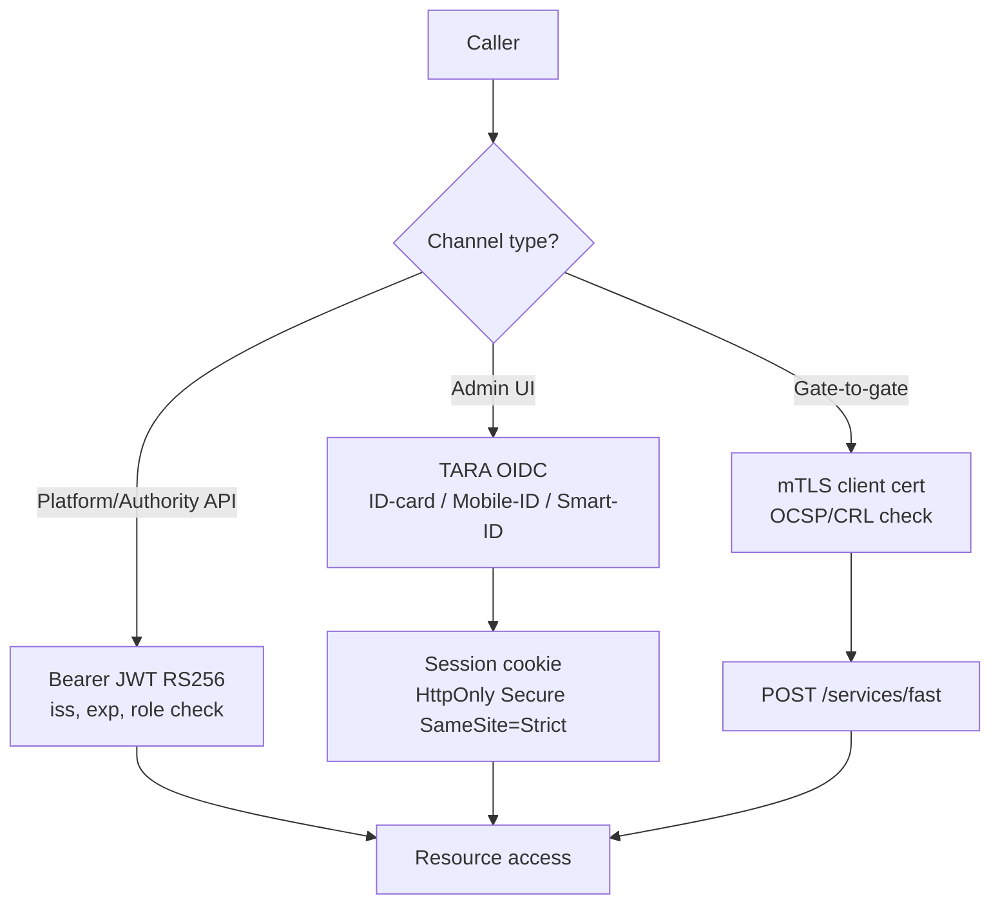
```mermaid
flowchart TD
    Caller[Caller] --> Channel{Channel type?}
    Channel -- Admin UI --> TARA[TARA OIDC<br/>ID-card / Mobile-ID / Smart-ID]
    TARA --> Session[Session cookie<br/>HttpOnly Secure SameSite=Strict]
    Channel -- Platform/Authority API --> JWT[Bearer JWT RS256<br/>iss, exp, role check]
    JWT --> Resource[Resource access]
    Channel -- Gate-to-gate --> MTLS[mTLS client cert<br/>OCSP/CRL check]
    MTLS --> Fast[POST /services/fast]
    Session --> Resource
    Fast --> Resource
```

See `seq-12-user-authentication.mmd` and `seq-16-mtls-fast-protocol.mmd` for full detail.

#### Acceptance Criteria

##### Admin UI authentication (OIDC)

**Happy path:**
- [ ] Admin opens UI → redirected to TARA OIDC authorize endpoint with `client_id`, `scope=openid`, `state` (CSRF token), `redirect_uri`
- [ ] TARA presents ID-card / Mobile-ID / Smart-ID; admin authenticates; TARA redirects to `/auth/callback?code=...&state=...`
- [ ] eFTI Gate exchanges `code` for `id_token` (POST `/token`); validates signature, `iss`, `aud`, `exp`, `nonce`
- [ ] Session created in database; `session_id` cookie set (HttpOnly; Secure; SameSite=Strict)
- [ ] Session validity configurable (`SESSION_EXPIRY_SECONDS`, default 3600)
- [ ] Session state in database — works behind load balancer without session affinity
- [ ] TARA callback URL registered in TARA management console

**Edge cases:**
- [ ] `state` mismatch in callback → `400 Bad Request`; session not created; event logged WARN
- [ ] `id_token` signature invalid → `401 Unauthorized`; session not created
- [ ] Session expired → user redirected to login page (not error stack trace)
- [ ] 5 failed login attempts within 10 minutes → account locked 15 minutes (configurable); event logged

**Error handling:**
- [ ] Logout → session deleted from database; OIDC `end_session_endpoint` called on TARA
- [ ] Basic Auth endpoint returns `405 Method Not Allowed` in production profile

**Technical constraints:**
- [ ] `OIDC_ISSUER_URL`, `OIDC_CLIENT_ID`, `OIDC_CLIENT_SECRET` loaded from runtime secrets — never from committed `.env` file
- [ ] MUST use Spring Security OAuth2 Client — no custom OIDC implementation

**Technical artifacts:**
- [ ] OpenAPI: `GET /auth/login`, `GET /auth/callback`, `POST /auth/logout`
- [ ] Diagram: `seq-12-user-authentication.mmd`

##### Platform/Authority API authentication

**Happy path:**
- [ ] Admin provisions an authority/admin user via `POST /api/v1/users` carrying `taraSub` → `201 Created`. No token is issued — TARA owns auth.
- [ ] Authority/admin calls API with `Authorization: Bearer <TARA-JWT>` → gate validates signature against TARA JWKS, `iss`, `aud`, `exp`, denylist; resolves `users` row by `tara_sub = jwt.sub`; `200 OK` if active and required role present.
- [ ] Platform calls API with **mTLS** — reverse proxy forwards `X-Client-Cert-Subject` / `X-Client-Cert-Serial`; gate resolves `platforms` row → `200 OK`.

**Edge cases:**
- [ ] JWT issued by an issuer other than the configured TARA (`iss` mismatch) → `401 TOKEN_INVALID`.
- [ ] JWT subject does not resolve to any active `users` row → `401 TOKEN_INVALID` with `"detail": "no provisioned user"`.
- [ ] Platform's mTLS cert subject DN + serial resolves to >1 active `platforms` row (config error) → `403 FORBIDDEN_MULTI_PLATFORM`.

**Error handling:**
- [ ] Compromised token: `POST /api/v1/users/:userId/revoke-token` → JWT `jti` added to `sessions` denylist; subsequent requests with that JWT → `401 TOKEN_INVALID`.

**Technical constraints:**
- [ ] Signing: RS256; gate private key loaded from K8s Secret at startup — never in container image
- [ ] Token blacklist TTL = token `exp`; cleaned up automatically

**Technical artifacts:**
- [ ] Diagram: `seq-12-user-authentication.mmd`

##### Gate-to-gate fast protocol

**Happy path:**
- [ ] eFTI Gate A calls `POST /services/fast` on eFTI Gate B with mTLS client certificate; eFTI Gate B verifies against trusted CA → `200 OK`

**Edge cases:**
- [ ] eFTI Gate A presents certificate from unknown CA → TLS handshake fails; event logged WARN with eFTI Gate A IP
- [ ] eFTI Gate A presents revoked certificate (OCSP check fails) → connection refused; event logged

**Error handling:**
- [ ] `X-API-Key` header only (no mTLS) → `401 Unauthorized`; `X-API-Key` not accepted as authentication

**Technical constraints:**
- [ ] mTLS certificates loaded from K8s Secret at runtime — no certificates in container image
- [ ] `X-API-Key` removed from `/services/fast` endpoint entirely

**Technical artifacts:**
- [ ] Diagram: [`specs/diagrams/seq-16-mtls-fast-protocol.mmd`](specs/diagrams/seq-16-mtls-fast-protocol.mmd)

### EPIC 23 — Authentication and Access Flows

**AS A** technical architect  
**I WANT** documented authentication and access flows with sequence diagrams  
**SO THAT** integration partners and developers understand exactly how authentication works in each channel type

**Three authentication channels at a glance:**

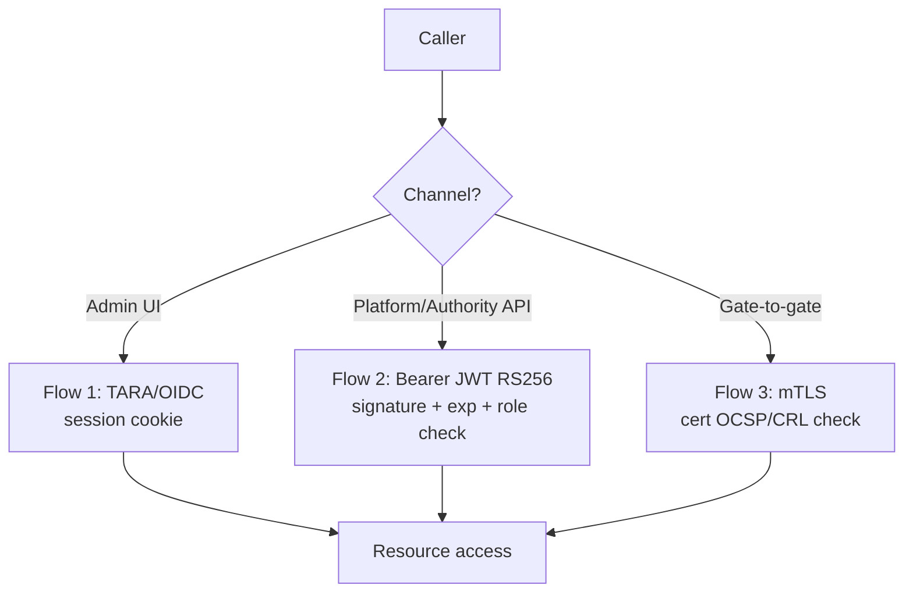
```mermaid
flowchart TD
    Caller[Caller] --> Type{Channel?}
    Type -- Admin UI --> F1[Flow 1: TARA/OIDC<br/>session cookie]
    Type -- Platform/Authority API --> F2[Flow 2: Bearer JWT RS256<br/>signature + exp + role check]
    Type -- Gate-to-gate --> F3[Flow 3: mTLS<br/>cert OCSP/CRL check]
    F1 --> Allow[Resource access]
    F2 --> Allow
    F3 --> Allow
```

Detailed sequences for each flow follow below.

#### Acceptance Criteria

- [ ] All three authentication patterns documented as sequence diagrams (see below)
- [ ] Each flow covers: authentication, authorisation check, error cases
- [ ] Diagrams published in GitHub documentation

##### Flow 1 — Admin UI login (TARA/OIDC)

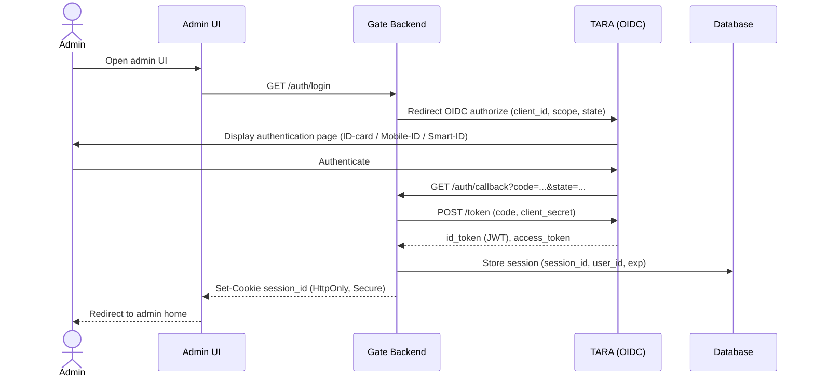
```mermaid
sequenceDiagram
    actor Admin
    participant UI as Admin UI
    participant Gate as Gate Backend
    participant TARA as TARA (OIDC)
    participant DB as Database

    Admin->>UI: Open admin UI
    UI->>Gate: GET /auth/login
    Gate->>TARA: Redirect OIDC authorize (client_id, scope, state)
    TARA->>Admin: Display authentication page (ID-card / Mobile-ID / Smart-ID)
    Admin->>TARA: Authenticate
    TARA->>Gate: GET /auth/callback?code=...&state=...
    Gate->>TARA: POST /token (code, client_secret)
    TARA-->>Gate: id_token (JWT), access_token
    Gate->>DB: Store session (session_id, user_id, exp)
    Gate-->>UI: Set-Cookie session_id (HttpOnly, Secure)
    UI-->>Admin: Redirect to admin home
```

##### Flow 2 — Authority / Admin API (TARA OIDC JWT)

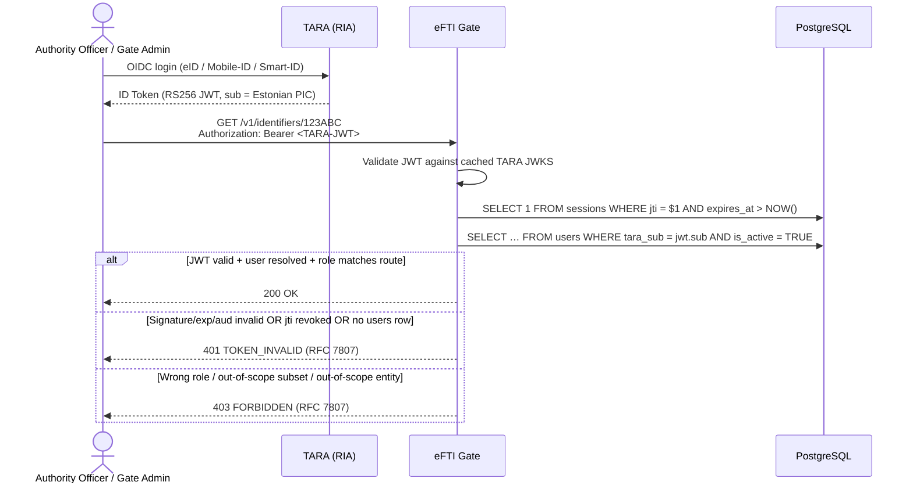
```mermaid
sequenceDiagram
    actor Officer as Authority Officer / Gate Admin
    participant TARA as TARA (RIA)
    participant Gate as eFTI Gate
    participant DB as PostgreSQL

    Officer->>TARA: OIDC login (eID / Mobile-ID / Smart-ID)
    TARA-->>Officer: ID Token (RS256 JWT, sub = Estonian PIC)

    Officer->>Gate: GET /v1/identifiers/123ABC<br/>Authorization: Bearer <TARA-JWT>
    Gate->>Gate: Validate JWT against cached TARA JWKS
    Gate->>DB: SELECT 1 FROM sessions WHERE jti = $1 AND expires_at > NOW()
    Gate->>DB: SELECT … FROM users WHERE tara_sub = jwt.sub AND is_active = TRUE
    alt JWT valid + user resolved + role matches route
        Gate-->>Officer: 200 OK
    else Signature/exp/aud invalid OR jti revoked OR no users row
        Gate-->>Officer: 401 TOKEN_INVALID (RFC 7807)
    else Wrong role / out-of-scope subset / out-of-scope entity
        Gate-->>Officer: 403 FORBIDDEN (RFC 7807)
    end
```

##### Flow 2b — Platform API (mTLS)

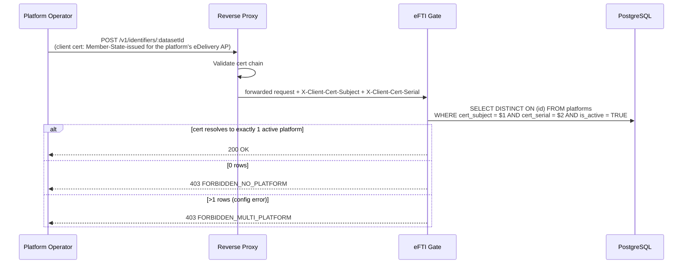
```mermaid
sequenceDiagram
    participant Platform as Platform Operator
    participant Proxy as Reverse Proxy
    participant Gate as eFTI Gate
    participant DB as PostgreSQL

    Platform->>Proxy: POST /v1/identifiers/:datasetId<br/>(client cert: Member-State-issued for the platform's eDelivery AP)
    Proxy->>Proxy: Validate cert chain
    Proxy->>Gate: forwarded request + X-Client-Cert-Subject + X-Client-Cert-Serial
    Gate->>DB: SELECT DISTINCT ON (id) FROM platforms<br/>WHERE cert_subject = $1 AND cert_serial = $2 AND is_active = TRUE
    alt cert resolves to exactly 1 active platform
        Gate-->>Platform: 200 OK
    else 0 rows
        Gate-->>Platform: 403 FORBIDDEN_NO_PLATFORM
    else >1 rows (config error)
        Gate-->>Platform: 403 FORBIDDEN_MULTI_PLATFORM
    end
```

##### Flow 3 — Gate-to-gate fast protocol (mTLS)

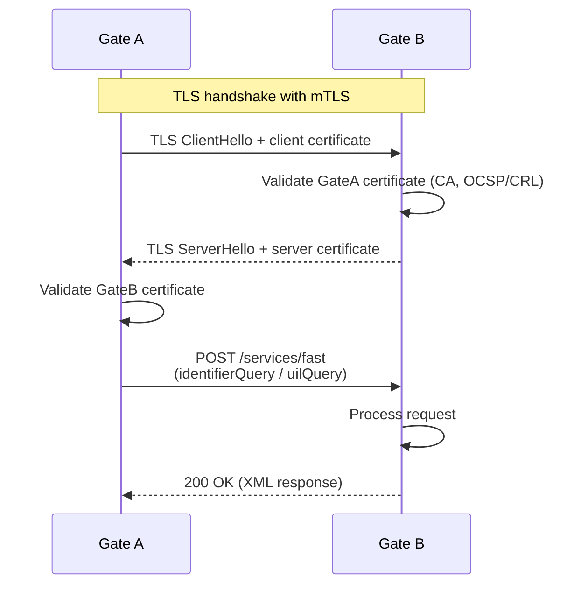
```mermaid
sequenceDiagram
    participant GateA as Gate A
    participant GateB as Gate B

    Note over GateA,GateB: TLS handshake with mTLS
    GateA->>GateB: TLS ClientHello + client certificate
    GateB->>GateB: Validate GateA certificate (CA, OCSP/CRL)
    GateB-->>GateA: TLS ServerHello + server certificate
    GateA->>GateA: Validate GateB certificate

    GateA->>GateB: POST /services/fast<br/>(identifierQuery / uilQuery)
    GateB->>GateB: Process request
    GateB-->>GateA: 200 OK (XML response)
```

---

## THEME 2 — Core Functionality

**Objective:** Implement the eFTI Gate's four core functions in accordance with EU Regulations 2020/1056 and 2024/1942: identifier registration (Platform), search (Authority), dataset retrieval by UIL, and follow-up message forwarding.

**Business value:** These functions constitute the gate's core value — without them, an eFTI Gate is meaningless. EU regulation requires member states to have an operational gate by 9 July 2027.

**Theme done when:**
- [ ] EPIC 3 (Identifier registration): platforms can register/update identifiers via REST
- [ ] EPIC 4 (Identifier search): local + broadcast search works, SSE streaming complete
- [ ] EPIC 5 (Dataset + follow-up): UIL-based dataset retrieval and follow-up forwarding works

### EPIC 3 — Identifier Management (Platform API)

**AS A** eFTI platform operator  
**I WANT** to register freight transport identifiers in the gate  
**SO THAT** competent authorities can search for them later

**Registration flow at a glance:**

```mermaid
sequenceDiagram
    participant Platform
    participant Gate as eFTI Gate
    participant DB as PostgreSQL
    Platform->>Gate: POST /v1/identifiers/{datasetId}<br/>Authorization: Bearer <JWT><br/>Content-Type: application/xml
    Gate->>Gate: Validate XSD (consignment-identifier.xsd)<br/>Check X-Request-ID dedup (600 s TTL)
    alt new datasetId
        Gate->>DB: INSERT consignments + identifiers<br/>(status=active)
        Gate-->>Platform: 201 Created<br/>Location: /v1/identifiers/{datasetId}
    else existing datasetId
        Gate->>DB: previous → inactive; new row → active
        Gate-->>Platform: 200 OK
    end
```

See `seq-01-identifier-registration.mmd` for full detail.

#### Acceptance Criteria

##### Registration

**Happy path:**
- [ ] `POST /v1/identifiers/:datasetId` accepts XML body `Content-Type: application/xml`; valid per `consignment-identifier.xsd`; user has exactly 1 PLATFORM role → `201 Created` with `Location: /v1/identifiers/:datasetId`
- [ ] Re-sending same `datasetId` with updated data → upsert; previous version set `inactive`; new version set `active` → `200 OK`
- [ ] Stored searchable fields: `vehicle_plate`, `transport_date`, `origin_country`, `destination_country`, `mode_code`, `dangerous_goods_indicator`
- [ ] Identifier types supported: `means` (vehicle/transport unit), `equipment` (container/trailer), `carried` (cargo)
- [ ] Transport modes: `1`=maritime, `2`=rail, `3`=road, `4`=air — no mode-specific routing logic

**Edge cases:**
- [ ] eFTI platform omits `vehicle_plate` (pre-registration) → record stored with empty `vehicle_plate`; subsequent `POST` with same `datasetId` adds/updates plate
- [ ] Search by plate does not return records where `vehicle_plate` is empty or null
- [ ] Client cert subject DN resolves to >1 active row in `platforms.cert_subject` → `403 Forbidden` with `code: FORBIDDEN_MULTI_PLATFORM` (configuration error)
- [ ] Client cert subject DN resolves to 0 active rows → `403 Forbidden` with `code: FORBIDDEN_NO_PLATFORM`
- [ ] `countryCode` not ISO 3166-1 alpha-2 (e.g. `"EST"`) → `400 Bad Request` with field-level error
- [ ] `datasetId` not UUID format → `400 Bad Request` with `"detail": "datasetId must be a valid UUID v4"`

**Error handling:**
- [ ] XML invalid against `consignment-identifier.xsd` → `400 Bad Request` with XSD validation error path and line number
- [ ] `X-Request-ID` header missing → `400 Bad Request` with `"detail": "X-Request-ID header is required"`
- [ ] `X-Request-ID` seen within 600 seconds → `400 Bad Request` with `"detail": "Duplicate request ID"`
- [ ] Unknown eDelivery message type received → error returned to sender; not silently ignored; event logged WARN

**Technical constraints:**
- [ ] Identifiers stored in `identifiers` table: one consignment → multiple identifier rows (1:N)
- [ ] `X-Request-ID` deduplication uses shared database table — checked across all nodes; TTL 600 seconds
- [ ] MUST use Flyway or Liquibase for all schema migrations — no custom migration scripts
- [ ] Rationale: procurement requirement "Tarkvara tehnilise analüüsi nõuded"

**Technical artifacts:**
- [ ] OpenAPI: `POST /v1/identifiers/{datasetId}` — request body, all error responses
- [ ] DB schema: `consignments`, `identifiers` tables with FK indexes and English column comments
- [ ] XSD: `consignment-identifier.xsd`

### EPIC 4 — Identifier Search (Authority API)

**AS A** competent authority officer  
**I WANT** to search freight transport identifiers (e.g. by registration plate) across all EU gates  
**SO THAT** I can verify a consignment's compliance with eFTI regulations

**Search decision at a glance:**

```mermaid
flowchart TD
    Q[GET /v1/identifiers/{identifier}<br/>Accept: text/event-stream] --> Local[Query identifiers table<br/>status=active, pg_trgm plate match]
    Local --> Count{local count > 0<br/>OR forceBroadcast?}
    Count -- local hits, no force --> SSEonly[SSE: stream local<br/>+ event: complete]
    Count -- empty or force --> Broadcast[Broadcast to ONLINE gates<br/>parallel, 8 s timeout]
    Broadcast --> Stream["SSE: gate, consignment, complete<br/>per-gate failures array"]
    SSEonly --> End([200 OK])
    Stream --> End
```

See `flow-01-search-broadcast-decision.mmd` and `seq-03-identifier-search-broadcast.mmd` for full detail.

#### Acceptance Criteria

##### Local search

**Happy path:**
- [ ] `GET /v1/identifiers/:identifier` searches `identifiers` table; all filters applied at database level: `modeCode`, `identifierTypes`, `registrationCountryCode`, `dangerousGoodsIndicator`
- [ ] Only identifiers with status `active` returned
- [ ] Results paginated: `limit` (default 20, max 100), `offset`; response includes `X-Total-Count`
- [ ] Empty result → `200 OK` with `{"identifiers": []}` — not `404`
- [ ] Local DB query response time < 50 ms at p95 (requires `pg_trgm` index)

**Edge cases:**
- [ ] `limit` exceeds 100 → `400 Bad Request` with `"detail": "limit must not exceed 100"`
- [ ] `dateFrom` after `dateTo` → `400 Bad Request` with `"detail": "dateFrom must be before dateTo"`
- [ ] `dateFrom`/`dateTo` without `modeCode=3` → `400 Bad Request` with `"detail": "dateFrom/dateTo requires modeCode=3"`

**Error handling:**
- [ ] Missing Bearer token → `401 Unauthorized` RFC 7807
- [ ] Authority user without search permission → `403 Forbidden` with `"detail": "Insufficient permissions for identifier search"`

**Technical constraints:**
- [ ] PostgreSQL 14+; MUST use `pg_trgm` extension for fuzzy plate search — performance requirement: < 50 ms local query
- [ ] DB index: `CREATE INDEX CONCURRENTLY idx_identifiers_plate_trgm ON identifiers USING GIN (vehicle_plate gin_trgm_ops)`

**Technical artifacts:**
- [ ] OpenAPI: `GET /v1/identifiers/{identifier}` — all query params, response schema, all error responses
- [ ] Diagram: `seq-02-identifier-search-local-only.mmd`

##### Cabotage control

**Happy path:**
- [ ] `dateFrom`–`dateTo` range filter returns `inactive` road transport (`modeCode=3`) records within date range
- [ ] Road transport UIL remains `inactive` for 14 days after `delivered_at` (art. 11 para. 4 Reg 2024/1942)
- [ ] Result list shows record status (`active` / `inactive`) per item

**Technical artifacts:**
- [ ] OpenAPI: `dateFrom`, `dateTo` query parameters on `GET /v1/identifiers/{identifier}`

##### Broadcast to other gates

**Happy path:**
- [ ] Broadcast triggered **only** when local search returns 0 results — prevents unnecessary load and privacy exposure
- [ ] Rationale: broadcast-only-when-empty pattern from Current Gate `EftiService.kt:91`
- [ ] Broadcast sends parallel requests to all gates with status `ACTIVE`; `DISABLED` and `OFFLINE` gates skipped
- [ ] Per-gate response metadata: `gateId`, `responseTimeMs`, `success`, `failure`
- [ ] Each gate interaction logged: gate ID, response time ms, success/failure

**Edge cases:**
- [ ] 3 of 15 active gates timeout after 8 seconds → partial results returned; timeout gates in `failures[]`; SSE stream still ends with `event: complete`
- [ ] All gates offline → `200 OK` with empty identifiers and populated `failures[]` — not a 5xx error
- [ ] One gate returns unexpected format → that gate marked `failure`; others unaffected

**Technical constraints:**
- [ ] Broadcast timeout: 8 seconds (configurable via `BROADCAST_TIMEOUT_SECONDS`)
- [ ] All active gates queried in parallel — not sequentially

**Technical artifacts:**
- [ ] Diagram: `seq-03-identifier-search-broadcast.mmd`

##### SSE (streaming)

**Happy path:**
- [ ] Request with `Accept: text/event-stream` → `Content-Type: text/event-stream` response
- [ ] Each gate's result: `event: gate` SSE event
- [ ] Each individual consignment: `event: consignment` with `id: <UIL>`
- [ ] Stream ends with `event: complete` — client knows all results delivered
- [ ] Without SSE (`Accept: application/json`) → all results returned together after all gates respond

**Edge cases:**
- [ ] Client disconnects mid-stream → gate stops sending and releases resources (no resource leak)
- [ ] Stream open > 60 seconds (all gates timed out) → `event: complete` sent; connection closed

**Technical artifacts:**
- [ ] OpenAPI: `GET /v1/identifiers/{identifier}` with `Accept: text/event-stream` variant documented

### EPIC 5 — Dataset Retrieval and Follow-up

**AS A** competent authority officer  
**I WANT** to retrieve the full dataset for a specific consignment and send a follow-up message to the platform  
**SO THAT** I can fulfil my legal obligation in freight transport inspection

**Dataset retrieval at a glance:**

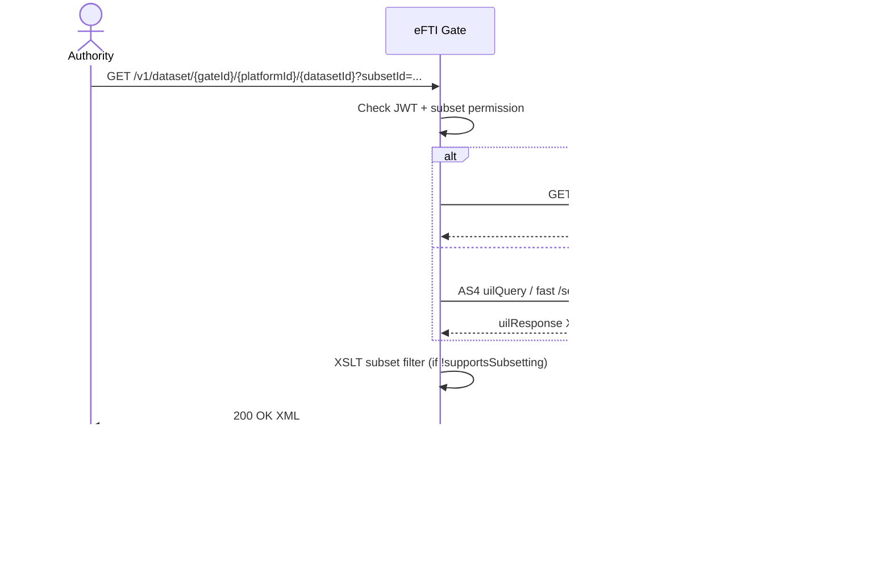
```mermaid
sequenceDiagram
    actor Officer as Authority
    participant Gate as eFTI Gate
    participant Remote as Remote Gate
    participant Platform
    Officer->>Gate: GET /v1/dataset/{gateId}/{platformId}/{datasetId}?subsetId=...
    Gate->>Gate: Check JWT + subset permission
    alt gateId == own gate
        Gate->>Platform: GET /datasets/{datasetId}
        Platform-->>Gate: XML dataset
    else remote gate
        Gate->>Remote: AS4 uilQuery / fast /services/fast
        Remote-->>Gate: uilResponse XML
    end
    Gate->>Gate: XSLT subset filter (if !supportsSubsetting)
    Gate-->>Officer: 200 OK XML
    Officer->>Gate: POST /v1/follow-up/.../{datasetRequestId}<br/>(optional)
    Gate-->>Officer: 200 OK
```

See `seq-05-dataset-request.mmd` and `seq-06-dataset-request-denied.mmd` for full detail.

#### Acceptance Criteria

##### Dataset request

**Happy path:**
- [ ] `GET /v1/dataset/:gateId/:platformId/:datasetId` with ≥1 `subsetId` → JWT validated, subset permissions checked
- [ ] Local request (own gate's platform): routes to platform client; returns `Content-Type: application/xml` unchanged
- [ ] `X-Request-ID` echoed in response header
- [ ] Local dataset retrieval response time < 5 seconds at p95

**Edge cases:**
- [ ] No `subsetId` parameter → `400 Bad Request` with `"detail": "At least one subsetId is required"`
- [ ] UIL points to remote gate with status `OFFLINE` → `502 Bad Gateway` with `"detail": "Gate 'eu-fi01.efti.fi' is offline — dataset unavailable"` — checked before sending request

**Error handling:**
- [ ] User `subsets` does not include requested `subsetId` → `403 Forbidden` with `"detail": "Subset 'EU04' not in your permitted subsets"`
- [ ] eFTI platform client returns non-200 → `502 Bad Gateway`; gate does not cache or modify dataset
- [ ] eFTI Gate is content-agnostic: dataset XML forwarded unchanged regardless of content

**Technical artifacts:**
- [ ] OpenAPI: `GET /v1/dataset/{gateId}/{platformId}/{datasetId}`
- [ ] Diagram: `seq-05-dataset-request.mmd`, `seq-06-dataset-request-denied.mmd`

##### Subsetter module

**Happy path:**
- [ ] eFTI platform with `supportsSubsetting=false`: gate applies XSLT-based filter; only permitted subsets returned to authority
- [ ] Filter applied before response sent — authority never receives data beyond permitted subsets

**Edge cases:**
- [ ] XSLT produces empty output → `200 OK` with empty XML body; not `404`
- [ ] Dataset > 10 MB → SAX-based streaming parser used; dataset not fully loaded into JVM heap

**Technical constraints:**
- [ ] Subsetter MUST use SAX streaming — no DOM in-memory parsing for large payloads
- [ ] Rationale: prevents OOM errors for large freight documents

##### Follow-up

**Happy path:**
- [ ] `POST /v1/follow-up/:gateId/:platformId/:datasetId/:datasetRequestId` → JWT validated; routes by `gateId`
- [ ] `gateId == own gate` → forwarded to platform client (REST) → `200 OK`
- [ ] `gateId != own gate` → forwarded to gate-to-gate client → `200 OK`
- [ ] Follow-up logged: follow-up ID, requesting user ID, `datasetRequestId`, timestamp, destination

**Edge cases:**
- [ ] eFTI platform has `eDeliveryCert` → follow-up also sent via eDelivery AS4
- [ ] `datasetRequestId` references no prior request → still forwarded; logged DEBUG

**Error handling:**
- [ ] Remote gate offline → `502 Bad Gateway` with `"detail": "Gate 'eu-de01.efti.de' is offline"`
- [ ] eFTI platform client error → `502 Bad Gateway`; failure logged ERROR with full trace

**Technical constraints:**
- [ ] Follow-up log record (Art 6(2)(c) Reg 2024/1942): follow-up ID, AAP/requesting gate ID, date and time of receipt — mandatory fields

**Technical artifacts:**
- [ ] OpenAPI: `POST /v1/follow-up/{gateId}/{platformId}/{datasetId}/{datasetRequestId}`
- [ ] DB schema: `follow_up_log` table with Art 6(2)(c) mandatory fields

### EPIC 24 — Identifier Search and Dataset Retrieval Flows

**AS A** technical architect  
**I WANT** documented data flows with sequence diagrams  
**SO THAT** developers and integration partners understand exactly how identifier search, broadcast, and dataset retrieval works

**Four data flows at a glance:**

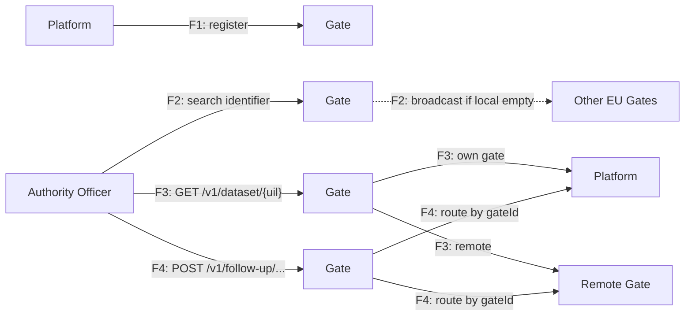
```mermaid
flowchart LR
    P[Platform] -- F1: register --> G1[Gate]
    A[Authority Officer] -- F2: search identifier --> G2[Gate]
    G2 -. F2: broadcast if local empty .-> Other[Other EU Gates]
    A -- F3: GET /v1/dataset/{uil} --> G3[Gate]
    G3 -- F3: own gate --> Plat[Platform]
    G3 -- F3: remote --> RG[Remote Gate]
    A -- F4: POST /v1/follow-up/... --> G4[Gate]
    G4 -- F4: route by gateId --> Plat
    G4 -- F4: route by gateId --> RG
```

Detailed sequence diagrams for each flow follow below.

#### Acceptance Criteria

- [ ] All four core flows documented as sequence diagrams (see below)
- [ ] Each flow covers error cases (gate offline, empty result, unauthorised access)
- [ ] Diagrams published in GitHub documentation

##### Flow 1 — Identifier registration (Platform → Gate)

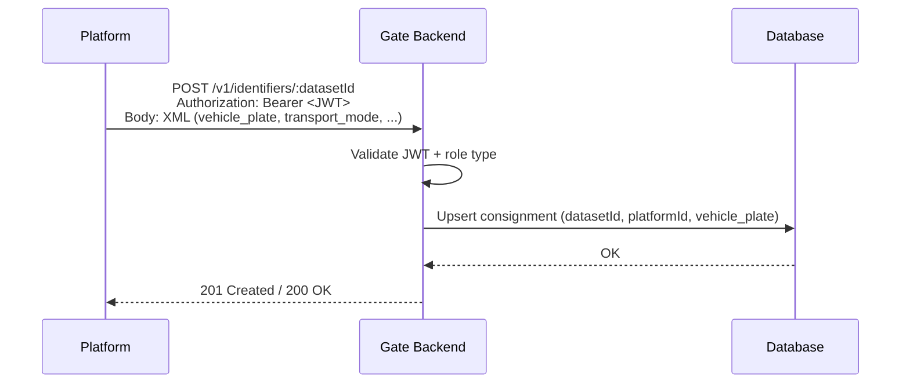
```mermaid
sequenceDiagram
    participant Platform
    participant Gate as Gate Backend
    participant DB as Database

    Platform->>Gate: POST /v1/identifiers/:datasetId<br/>Authorization: Bearer <JWT><br/>Body: XML (vehicle_plate, transport_mode, ...)
    Gate->>Gate: Validate JWT + role type
    Gate->>DB: Upsert consignment (datasetId, platformId, vehicle_plate)
    DB-->>Gate: OK
    Gate-->>Platform: 201 Created / 200 OK
```

##### Flow 2 — Identifier search (Authority → Gate → Broadcast)

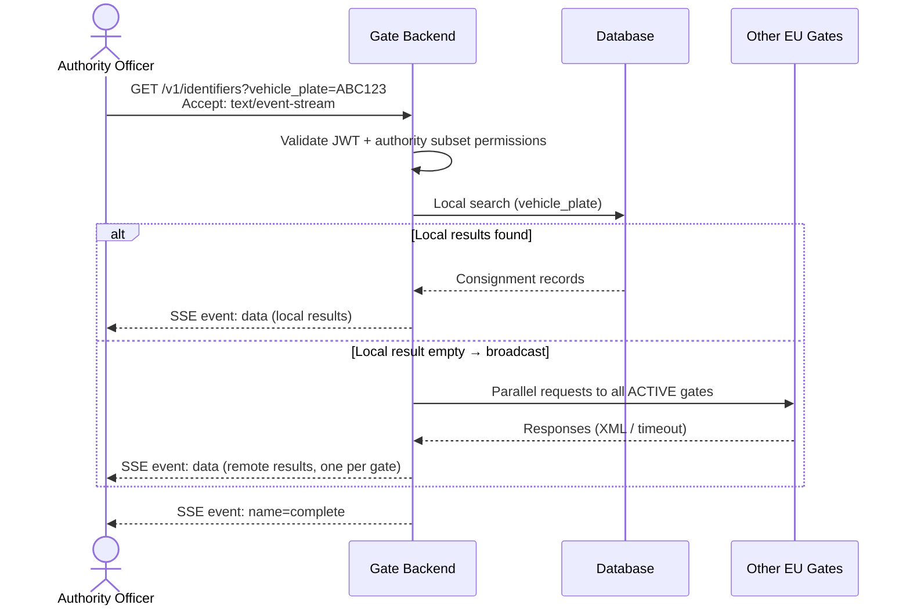
```mermaid
sequenceDiagram
    actor Officer as Authority Officer
    participant Gate as Gate Backend
    participant DB as Database
    participant OtherGates as Other EU Gates

    Officer->>Gate: GET /v1/identifiers?vehicle_plate=ABC123<br/>Accept: text/event-stream
    Gate->>Gate: Validate JWT + authority subset permissions
    Gate->>DB: Local search (vehicle_plate)

    alt Local results found
        DB-->>Gate: Consignment records
        Gate-->>Officer: SSE event: data (local results)
    else Local result empty → broadcast
        Gate->>OtherGates: Parallel requests to all ACTIVE gates
        OtherGates-->>Gate: Responses (XML / timeout)
        Gate-->>Officer: SSE event: data (remote results, one per gate)
    end

    Gate-->>Officer: SSE event: name=complete
```

##### Flow 3 — Dataset retrieval by UIL

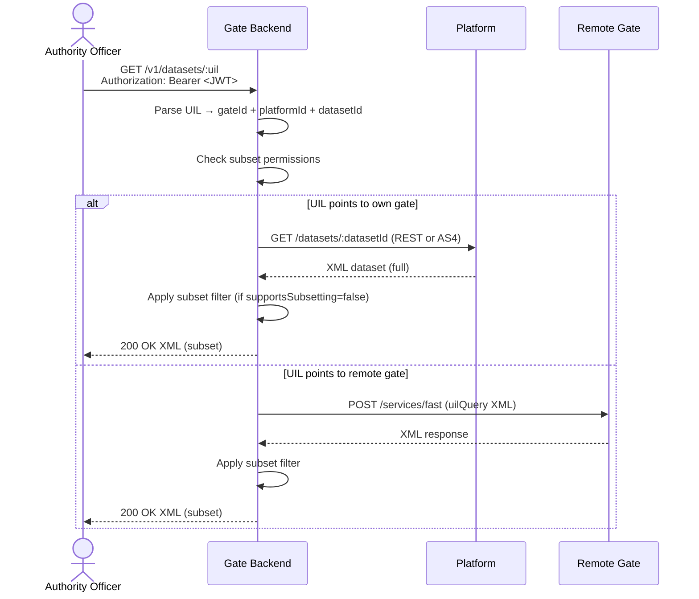
```mermaid
sequenceDiagram
    actor Officer as Authority Officer
    participant Gate as Gate Backend
    participant Platform
    participant RemoteGate as Remote Gate

    Officer->>Gate: GET /v1/datasets/:uil<br/>Authorization: Bearer <JWT>
    Gate->>Gate: Parse UIL → gateId + platformId + datasetId
    Gate->>Gate: Check subset permissions

    alt UIL points to own gate
        Gate->>Platform: GET /datasets/:datasetId (REST or AS4)
        Platform-->>Gate: XML dataset (full)
        Gate->>Gate: Apply subset filter (if supportsSubsetting=false)
        Gate-->>Officer: 200 OK XML (subset)
    else UIL points to remote gate
        Gate->>RemoteGate: POST /services/fast (uilQuery XML)
        RemoteGate-->>Gate: XML response
        Gate->>Gate: Apply subset filter
        Gate-->>Officer: 200 OK XML (subset)
    end
```

##### Flow 4 — Follow-up message forwarding

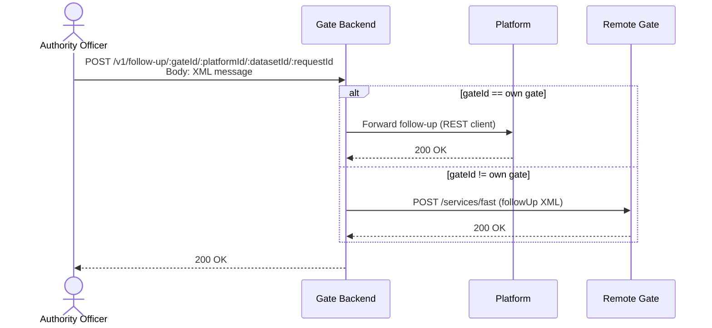
```mermaid
sequenceDiagram
    actor Officer as Authority Officer
    participant Gate as Gate Backend
    participant Platform
    participant RemoteGate as Remote Gate

    Officer->>Gate: POST /v1/follow-up/:gateId/:platformId/:datasetId/:requestId<br/>Body: XML message

    alt gateId == own gate
        Gate->>Platform: Forward follow-up (REST client)
        Platform-->>Gate: 200 OK
    else gateId != own gate
        Gate->>RemoteGate: POST /services/fast (followUp XML)
        RemoteGate-->>Gate: 200 OK
    end

    Gate-->>Officer: 200 OK
```

---

## THEME 3 — Registry Management

**Objective:** Give administrators full control over the foundational data that drives gate operations — the EU gate list, registered platforms, competent authorities, and stored consignments — all manageable via the Admin API without direct database access.

**Business value:** Registries are the foundation of gate operation. Incorrect or missing registry data causes search failures, incorrect broadcasts, or unauthorised access. Data changes must synchronise in real time to all running nodes.

**Theme done when:**
- [ ] EPIC 6 (Gates): gate CRUD + ping + LISTEN/NOTIFY sync done
- [ ] EPIC 7 (Platforms): platform CRUD + connectivity ping + subsetting flag done
- [ ] EPIC 8 (Authorities): authority CRUD + subset assignment done
- [ ] EPIC 9 (Consignments): identifier expiry + CMDS lifecycle done

### EPIC 6 — Gate Registry Management (Admin API)

**AS A** system administrator  
**I WANT** to manage the list of EU eFTI gates and monitor their status  
**SO THAT** broadcast requests only reach operational gates

**Gate lifecycle at a glance:**

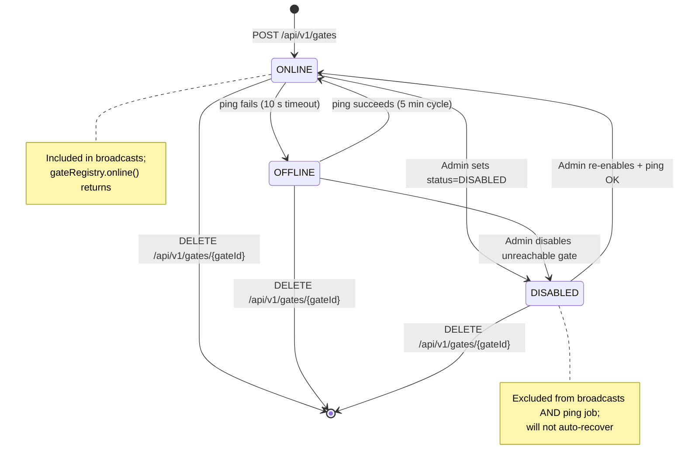
```mermaid
stateDiagram-v2
    [*] --> ONLINE: POST /api/v1/gates
    ONLINE --> OFFLINE: ping fails (10 s timeout)
    OFFLINE --> ONLINE: ping succeeds (5 min cycle)
    ONLINE --> DISABLED: Admin sets status=DISABLED
    OFFLINE --> DISABLED: Admin disables unreachable gate
    DISABLED --> ONLINE: Admin re-enables + ping OK
    ONLINE --> [*]: DELETE /api/v1/gates/{gateId}
    OFFLINE --> [*]: DELETE /api/v1/gates/{gateId}
    DISABLED --> [*]: DELETE /api/v1/gates/{gateId}
    note right of ONLINE
        Included in broadcasts;
        gateRegistry.online() returns
    end note
    note right of DISABLED
        Excluded from broadcasts AND ping job;
        will not auto-recover
    end note
```

See `state-05-gate-health.mmd` for full detail.

#### Acceptance Criteria

##### CRUD

**Happy path:**
- [ ] `GET /api/v1/gates` — Super Admin sees all gates; regular Admin sees only gates in their `roles[GATE]` Party IDs; paginated
- [ ] `POST /api/v1/gates` — adds new gate with `baseUrl`, `eDeliveryUrl`, certificate info; write access requires matching Party ID → `201 Created`
- [ ] `DELETE /api/v1/gates/:gateId` — write access verified → `204 No Content`
- [ ] `GET /api/v1/gates/own` — returns own gate configuration

**Edge cases:**
- [ ] Admin deletes own gate → `409 Conflict` with `"detail": "Cannot delete your own gate"`
- [ ] `POST /api/v1/gates` with `baseUrl` already registered → `409 Conflict`
- [ ] `DELETE` on non-existent gate → `404 Not Found`

**Error handling:**
- [ ] Write with non-matching Party ID → `403 Forbidden`

**Technical artifacts:**
- [ ] OpenAPI: `GET /api/v1/gates`, `POST /api/v1/gates`, `DELETE /api/v1/gates/{gateId}`, `GET /api/v1/gates/own`

##### Ping

**Happy path:**
- [ ] `POST /api/v1/gates/:gateId/ping` → fast protocol ping (`POST {eDeliveryUrl}` with mTLS) → `200 OK` with `responseTimeMs`
- [ ] eDelivery ping: SOAP ping request → `200 OK` or `502`
- [ ] Ping result updates gate status in database and in-memory registry on all nodes (via NOTIFY)

**Edge cases:**
- [ ] eFTI Gate does not respond within 10 seconds → status set `OFFLINE`; `502 Bad Gateway` with `"detail": "Gate 'eu-fi01.efti.fi' did not respond within 10 seconds"`
- [ ] eFTI Gate was `OFFLINE`, ping succeeds → status changed to `ONLINE`; status change logged INFO

**Technical constraints:**
- [ ] Ping timeout: 10 seconds (configurable via `PING_TIMEOUT_SECONDS`)

##### Automated monitoring

**Happy path:**
- [ ] Automated ping runs every 5 minutes (production only, configurable via `PING_INTERVAL_MINUTES`)
- [ ] `DISABLED` status gates not pinged by automated job
- [ ] Status change logged INFO: gate ID, old status, new status, timestamp

**Edge cases:**
- [ ] Ping job attempts to start on 2 nodes → database advisory lock ensures only 1 node runs it

**Technical constraints:**
- [ ] Leader election: database advisory lock (`pg_try_advisory_lock`)

**Technical artifacts:**
- [ ] OpenAPI: `POST /api/v1/gates/{gateId}/ping`

### EPIC 7 — Platform Registry Management (Admin API)

**AS A** system administrator  
**I WANT** to manage the eFTI platform registry  
**SO THAT** platforms can register identifiers and authorities can retrieve datasets

**Platform lifecycle at a glance:**

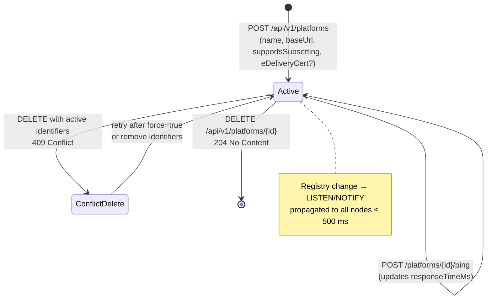
```mermaid
stateDiagram-v2
    [*] --> Active: POST /api/v1/platforms<br/>(name, baseUrl, supportsSubsetting, eDeliveryCert?)
    Active --> Active: POST /platforms/{id}/ping<br/>(updates responseTimeMs)
    Active --> ConflictDelete: DELETE with active identifiers<br/>409 Conflict
    ConflictDelete --> Active: retry after force=true<br/>or remove identifiers
    Active --> [*]: DELETE /api/v1/platforms/{id}<br/>204 No Content
    note right of Active
        Registry change → LISTEN/NOTIFY
        propagated to all nodes ≤ 500 ms
    end note
```

See `seq-10-platform-registration.mmd` and `state-03-platform-status.mmd` for full detail.

#### Acceptance Criteria

**Happy path:**
- [ ] `GET /api/v1/platforms` — Super Admin sees all; Admin sees only platforms in their `roles[ADMIN]` gate scope; paginated
- [ ] `POST /api/v1/platforms` — creates platform with `id`, `baseUrl`, `supportsSubsetting`, `certSubject`, `certSerial`, optional `eDeliveryCert` → `201 Created` (409 if `id` already exists)
- [ ] `PUT /api/v1/platforms/{platformId}` — updates an existing platform (append-only INSERT) → `200 OK` (404 if unknown id)
- [ ] `DELETE /api/v1/platforms/{platformId}` — soft-delete (latest row written with `is_active=FALSE`) → `204 No Content`
- [ ] `POST /api/v1/platforms/{platformId}/ping` — checks HTTP connectivity to `baseUrl` → `200 OK` with `responseTimeMs` or `502`
- [ ] eFTI platform without `eDeliveryCert`: REST-only; with `eDeliveryCert`: also callable via eDelivery AS4
- [ ] eFTI platform with `supportsSubsetting=false`: gate applies XSLT subsetter before returning dataset

**Edge cases:**
- [ ] `POST /api/v1/platforms` with `baseUrl` already registered → `409 Conflict`
- [ ] `DELETE` while platform has active identifiers → `409 Conflict` with `"detail": "Platform has 42 active identifiers — delete them first or use force=true"`
- [ ] Ping — platform unreachable after 10 seconds → `502 Bad Gateway` with `"detail": "Platform 'mta-platform-1' did not respond within 10 seconds"`

**Error handling:**
- [ ] Write with non-matching Party ID → `403 Forbidden`

**Technical constraints:**
- [ ] Registry changes propagated to all nodes via LISTEN/NOTIFY within 500 ms

**Technical artifacts:**
- [ ] OpenAPI: `GET /api/v1/platforms`, `POST /api/v1/platforms`, `DELETE /api/v1/platforms/{platformId}`, `POST /api/v1/platforms/{platformId}/ping`

### EPIC 8 — Authority Registry Management (Admin API)

**AS A** system administrator  
**I WANT** to manage the registry of Competent Authorities  
**SO THAT** authority users have controlled access to eFTI data

**Authority lifecycle at a glance:**

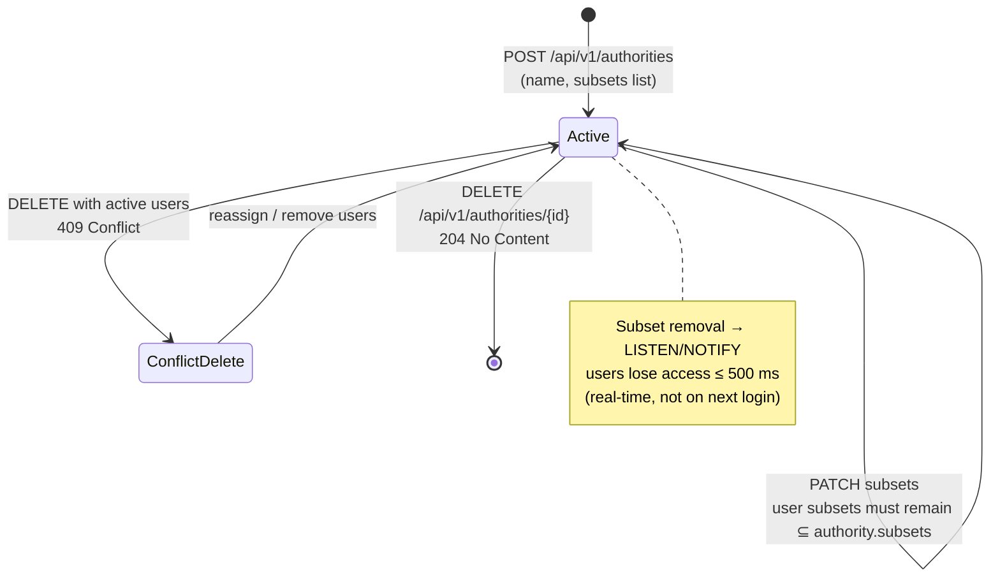
```mermaid
stateDiagram-v2
    [*] --> Active: POST /api/v1/authorities<br/>(name, subsets list)
    Active --> Active: PATCH subsets<br/>user subsets must remain ⊆ authority.subsets
    Active --> ConflictDelete: DELETE with active users<br/>409 Conflict
    ConflictDelete --> Active: reassign / remove users
    Active --> [*]: DELETE /api/v1/authorities/{id}<br/>204 No Content
    note right of Active
        Subset removal → LISTEN/NOTIFY
        users lose access ≤ 500 ms
        (real-time, not on next login)
    end note
```

See `seq-11-authority-registration.mmd` and `state-04-authority-status.mmd` for full detail.

#### Acceptance Criteria

**Happy path:**
- [ ] `GET /api/v1/authorities` — Super Admin sees all; Admin sees only authorities in their `roles[AUTHORITY]` Party IDs; paginated
- [ ] `GET /api/v1/authorities/:authorityId` — returns authority details: name, `subsets[]`, contact
- [ ] `POST /api/v1/authorities` — adds authority with permitted `subsets[]` → `201 Created`
- [ ] `DELETE /api/v1/authorities/:authorityId` → `204 No Content`

**Edge cases:**
- [ ] `DELETE` when authority has active users → `409 Conflict` with `"detail": "Authority has 3 active users — delete or reassign them first"`
- [ ] `POST` with unknown subset code → `400 Bad Request` with `"detail": "Unknown subset: 'EU99'"`
- [ ] Authority `subsets[]` updated to remove a subset → existing users lose access immediately (real-time, not on next login)
- [ ] `GET /api/v1/authorities/:authorityId` for non-existent → `404 Not Found`

**Error handling:**
- [ ] Write with non-matching Party ID → `403 Forbidden`

**Technical constraints:**
- [ ] Subset access change propagated via LISTEN/NOTIFY within 500 ms

**Technical artifacts:**
- [ ] OpenAPI: `GET /api/v1/authorities`, `POST /api/v1/authorities`, `DELETE /api/v1/authorities/{authorityId}`

### EPIC 9 — Consignment Management (Admin API)

**AS A** system administrator  
**I WANT** to view and manage stored consignment data  
**SO THAT** I can audit data and remove erroneous records

**Consignment lifecycle at a glance:**

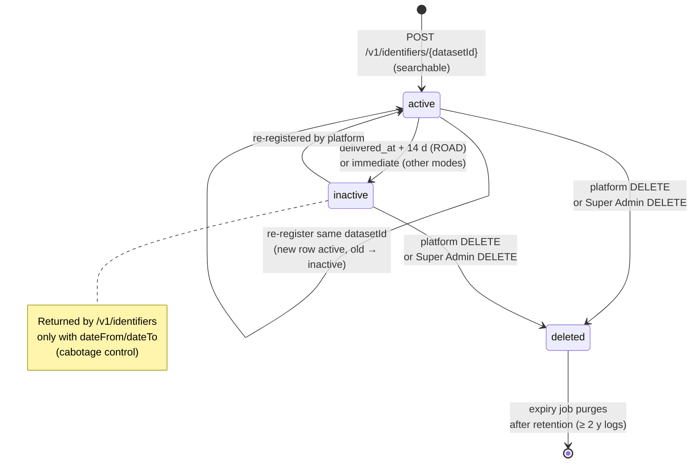
```mermaid
stateDiagram-v2
    [*] --> active: POST /v1/identifiers/{datasetId}<br/>(searchable)
    active --> active: re-register same datasetId<br/>(new row active, old → inactive)
    active --> inactive: delivered_at + 14 d (ROAD)<br/>or immediate (other modes)
    inactive --> active: re-registered by platform
    active --> deleted: platform DELETE<br/>or Super Admin DELETE
    inactive --> deleted: platform DELETE<br/>or Super Admin DELETE
    deleted --> [*]: expiry job purges<br/>after retention (≥ 2 y logs)
    note right of inactive
        Returned by /v1/identifiers
        only with dateFrom/dateTo
        (cabotage control)
    end note
```

See `state-01-identifier-lifecycle.mmd` and `seq-08-identifier-expiration.mmd` for full detail.

#### Acceptance Criteria

##### Viewing and deletion

**Happy path:**
- [ ] `GET /api/v1/consignments` — Super Admin sees all; Admin sees own platform's consignments; latest row per `dataset_id` resolved by `SELECT DISTINCT ON (dataset_id) … ORDER BY dataset_id, created_at DESC` and presented in `created_at DESC` order; paginated
- [ ] `DELETE /api/v1/consignments/:datasetId` — Super Admin only; soft delete (status → `deleted`) → `204 No Content`

**Edge cases:**
- [ ] Regular admin attempts `DELETE` → `403 Forbidden` with `"detail": "Only Super Admin can delete consignments"`
- [ ] `DELETE` on already-deleted record → `404 Not Found`

**Technical artifacts:**
- [ ] OpenAPI: `GET /api/v1/consignments`, `DELETE /api/v1/consignments/{datasetId}`

##### Identifier status management (Regulation 2025/2243)

**Happy path:**
- [ ] Status lifecycle: `active` (searchable) → `inactive` (historical queries only) → `deleted` (returns not found)
- [ ] eFTI platform sends updated data for same `datasetId` → previous version → `inactive`; new version → `active`
- [ ] eFTI platform sends DELETE request → status → `deleted` (soft delete; not physically removed immediately)
- [ ] `deleted` records physically purged after retention period

**Edge cases:**
- [ ] eFTI platform re-registers after `deleted` → new `active` record created; old `deleted` retained until retention expiry

**Technical constraints:**
- [ ] DB: `status` enum (`active`, `inactive`, `deleted`); `expires_at` timestamp per record
- [ ] MUST use Flyway or Liquibase for schema migration — no custom scripts

##### Retention rules (Regulation 2024/1942)

**Happy path:**
- [ ] All data access logs (authority queries, dataset requests) retained ≥ **2 years**
- [ ] Road transport (`mode_code=3`): identifier deactivated (`active → inactive`) **14 days** after `delivered_at` (cabotage control, art. 11 para. 4)
- [ ] Other transport modes: deactivated immediately after `delivered_at`
- [ ] Expiry job purges `deleted` records past retention — database-level filter (not application memory)
- [ ] System supports export of 5-year monitoring report data for European Commission

**Edge cases:**
- [ ] `delivered_at` not set (in transit) → identifier remains `active`; expiry job skips
- [ ] Expiry job starts on 2 nodes simultaneously → leader election: only 1 node processes

**Technical constraints:**
- [ ] Expiry job: daily, random window 03:45–05:45 (production only); `EXPIRY_JOB_WINDOW_START` / `EXPIRY_JOB_WINDOW_END`
- [ ] Leader election: database advisory lock (`pg_try_advisory_lock`)
- [ ] Expiry job logs deleted record count at INFO level

**Technical artifacts:**
- [ ] DB index: `CREATE INDEX idx_consignments_expiry ON consignments (mode_code, delivered_at) WHERE status = 'deleted'`
- [ ] Unit test: expiry logic — ROAD/non-ROAD mode, `delivered_at` set/not set

---

## THEME 4 — Integrations

**Objective:** Ensure the gate's interoperability at both EU level (eDelivery AS4) and Estonian national level (X-Road, ANTS, and competent authority information systems).

**Business value:** eDelivery AS4 is the EU-mandated data exchange protocol between eFTI gates. X-Road integration is required because Estonian government authorities use X-Road as their standard data exchange layer. ANTS integration enables fast licence plate lookups for border control.

**Theme done when:**
- [ ] EPIC 10 (eDelivery AS4): inbound/outbound AS4 messages handled; async responses delivered
- [ ] EPIC 11 (X-Road, EE): platform registration available as X-Road service; core unchanged

### EPIC 10 — eDelivery AS4 Integration

**AS A** eFTI Gate  
**I WANT** to communicate with other EU gates via the eDelivery AS4 protocol  
**SO THAT** cross-border eFTI data exchange uses the standard EU infrastructure

**AS4 message exchange at a glance:**

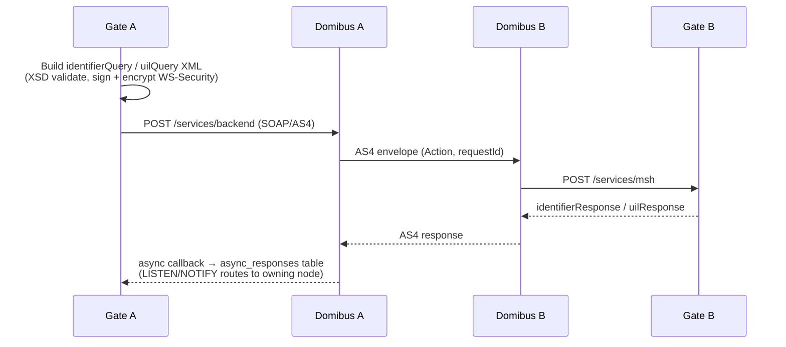
```mermaid
sequenceDiagram
    participant GateA as Gate A
    participant DomA as Domibus A
    participant DomB as Domibus B
    participant GateB as Gate B
    GateA->>GateA: Build identifierQuery / uilQuery XML<br/>(XSD validate, sign + encrypt WS-Security)
    GateA->>DomA: POST /services/backend (SOAP/AS4)
    DomA->>DomB: AS4 envelope (Action, requestId)
    DomB->>GateB: POST /services/msh
    GateB-->>DomB: identifierResponse / uilResponse
    DomB-->>DomA: AS4 response
    DomA-->>GateA: async callback → async_responses table<br/>(LISTEN/NOTIFY routes to owning node)
```

See `seq-14-gate-to-gate-search.mmd` and `seq-16-mtls-fast-protocol.mmd` for full detail.

#### Acceptance Criteria

##### Inbound messages

**Happy path:**
- [ ] `POST /services/msh` accepts SOAP/AS4 message; decrypts and parses per AS4 profile
- [ ] `identifierQuery` → processes search; returns `identifierResponse`
- [ ] `uilQuery` → retrieves dataset from platform; returns `uilResponse`
- [ ] `postFollowUpRequest` → forwards follow-up to platform; returns acknowledgement
- [ ] `saveIdentifiersRequest` → stores identifiers

**Edge cases:**
- [ ] Unknown `Action` field → error returned to sender; event logged WARN; not silently ignored
- [ ] Unknown `CompressionType` → error returned; not silently decompressed
- [ ] Incoming message with invalid AS4 signature → rejected; event logged WARN with sender Party ID

**Error handling:**
- [ ] SOAP parsing failure → AS4 fault returned with error code and description

**Technical constraints:**
- [ ] MUST use Domibus or compatible AS4 implementation — no custom AS4 stack

**Technical artifacts:**
- [ ] Diagram: `seq-14-gate-to-gate-search.mmd`

##### Outbound messages

**Happy path:**
- [ ] Gate-to-gate client logs each outbound: gate ID, protocol (Fast/eDelivery), URL, duration ms, HTTP status, error
- [ ] eDelivery client logs: destination Party ID, requestId, duration ms, response status
- [ ] Fast protocol: `POST {gate.eDeliveryUrl}` with mTLS (X-API-Key removed)
- [ ] eDelivery AS4: SOAP message encrypted and signed (WS-Security) before sending

**Error handling:**
- [ ] Outbound eDelivery failure → logged ERROR with full context; caller receives `502 Bad Gateway`

##### Protocol envelope and request generation

**Happy path:**
- [ ] eFTI Gate generates request envelope (identifierQuery, uilQuery XML) conforming to `xsd/edelivery.xsd`
- [ ] Dataset content forwarded **unchanged** — eFTI Gate is content-agnostic
- [ ] Every outbound request includes `requestId` (UUID v4) for audit trail
- [ ] Envelope validated against XSD before sending — invalid XML returns error, not silent failure
- [ ] Operates across all transport modes without mode-specific logic

**Edge cases:**
- [ ] XSD validation of generated envelope fails → `500` logged ERROR; not forwarded to client

**Technical constraints:**
- [ ] WS-Security signing certificate loaded from K8s Secret at runtime — never in container image

##### Asynchronous response handling

**Happy path:**
- [ ] Async responses (uilResponse, identifierResponse) delivered via PostgreSQL LISTEN/NOTIFY — no session affinity needed
- [ ] Handler runs on all nodes; each node processes only responses matching its `requestId`

**Edge cases:**
- [ ] Async response arrives after SSE stream closed → discarded; logged DEBUG

**Technical artifacts:**
- [ ] DB schema: `async_responses (request_id, gate_id, payload, received_at)`

### EPIC 11 — X-Road Integration (EE extension)

**AS AN** Estonian government system or transport platform  
**I WANT** to communicate with the eFTI gate via X-Road  
**SO THAT** the integration uses the standard Estonian national data exchange layer

**X-Road integration at a glance:**

```mermaid
sequenceDiagram
    participant Client as EE client<br/>(TRAM / LOIS2 / ANTS via NES)
    participant SS as X-Road Security Server
    participant Adapter as ee-adapter module
    participant Core as core REST API
    Client->>SS: SOAP request<br/>EE/GOV/70003158/efti-gate/...
    SS->>SS: Verify client identity (mTLS)
    SS->>Adapter: Forward SOAP (client, service, id)
    Adapter->>Adapter: Validate protocolVersion + headers
    Adapter->>Core: REST call (Admin or Authority API)
    Core-->>Adapter: JSON / XML response
    Adapter-->>SS: SOAP response (or X-Road fault)
    SS-->>Client: SOAP response
```

`ee-adapter` calls `core` only via the published REST API; no internal core dependency.

#### Acceptance Criteria

**Happy path:**
- [ ] X-Road service endpoint implemented in `ee-adapter` module — zero X-Road references in core module
- [ ] eFTI platform registration available as X-Road service: `EE/GOV/70003158/efti-gate/registerPlatform/v1`
- [ ] X-Road message headers validated: `client`, `service`, `id`, `protocolVersion`
- [ ] Registration request forwarded to core Admin REST API
- [ ] Response returned as valid X-Road SOAP envelope
- [ ] Works with X-Road Security Server v6.x test environment

**Edge cases:**
- [ ] Unknown `protocolVersion` → SOAP fault `"faultCode": "Client.unknownVersion"`
- [ ] `client` identity not authorised → `403 Forbidden` SOAP fault

**Error handling:**
- [ ] Core REST API returns `4xx/5xx` → error wrapped in X-Road SOAP fault

**Technical constraints:**
- [ ] `ee-adapter` module calls core only via published REST API — no internal dependency on core module code
- [ ] MUST NOT modify `core` module to add X-Road support

**Technical artifacts:**
- [ ] WSDL: `efti-xroad.wsdl`
- [ ] Diagram: `seq-10-platform-registration.mmd`

##### Estonian competent authorities

**Happy path:**
- [ ] Each authority chooses: eDelivery AS4 or X-Road — both supported
- [ ] X-Road client identity validated by X-Road Security Server — no separate Bearer token needed
- [ ] Subset access authority-specific: TRAM/LOIS2 may only query AWB/manifest subsets — road transport filtered out at gate

**Edge cases:**
- [ ] TRAM queries road transport subset `EU02` via X-Road → `403 Forbidden` SOAP fault with `"detail": "Subset EU02 not permitted for authority 'TRAM'"`

##### ANTS integration

**Happy path:**
- [ ] eFTI Gate exposes high-throughput endpoint for ANTS: existence check only — no full data returned
- [ ] ANTS response: `{"registered": true}` or `{"registered": false}`; response time < 1 second at p95
- [ ] ANTS integration via X-Road through NES intermediary (MTA internal system)

**Edge cases:**
- [ ] ANTS query for plate not in local registry → `{"registered": false}` — does NOT trigger broadcast (ANTS is local-only)

**Technical constraints:**
- [ ] ANTS endpoint: read-only, existence check, index-only scan on `vehicle_plate`
- [ ] Rationale: ANTS may send > 10 000 queries/hour during border operations

##### ADR 1000-point rule

**Happy path:**
- [ ] eFTI Gate calculates ADR 1.1.3.6 dangerous goods point total per vehicle (UN number × hazard class × net mass)
- [ ] Score ≥ 1000: full ADR; < 1000: partial (ADR 1.1.3.6 exemptions); = 0: full exemption
- [ ] ADR score appended to `EU05` subset response

**Edge cases:**
- [ ] `supportsAdrCalculation=true` on platform → gate skips calculation; platform value used as-is
- [ ] `supportsAdrCalculation=false` → gate performs calculation and appends

### EPIC 25 — eDelivery AS4 Message Flow

**AS A** technical architect  
**I WANT** documented eDelivery AS4 message flows with sequence diagrams  
**SO THAT** developers understand exactly how inter-gate messages travel through the AS4 protocol

**AS4 message types at a glance:**

```mermaid
flowchart LR
    GA[Gate A] -- identifierQuery / uilQuery / postFollowUpRequest --> Dom[Domibus AS4<br/>SOAP, WS-Security<br/>sign + encrypt]
    Dom --> GB[Gate B]
    GB -- identifierResponse / uilResponse --> Dom
    Dom -- async via async_responses<br/>+ LISTEN/NOTIFY --> GA
    GB -. SOAP fault on parse error<br/>or unknown Action .-> Dom
```

Detailed sequence diagrams for outgoing and incoming flows follow below.

#### Acceptance Criteria

- [ ] Both AS4 flows documented (outgoing identifierQuery and incoming uilResponse)
- [ ] Diagrams cover: SOAP envelope construction, signing, encryption, failure handling
- [ ] Diagrams published in GitHub documentation

##### Flow 1 — Outgoing identifier search (Gate → eDelivery → Remote Gate)

```mermaid
sequenceDiagram
    participant Gate as Gate Backend
    participant EDelivery as eDelivery (Domibus)
    participant RemoteEDelivery as Remote Gate eDelivery
    participant RemoteGate as Remote Gate Backend

    Gate->>Gate: Build identifierQuery XML (UIL / vehicle_plate)
    Gate->>Gate: Wrap in AS4 envelope (SOAP header: From, To, Service, Action)
    Gate->>Gate: Sign and encrypt payload (WS-Security)
    Gate->>EDelivery: POST /services/backend (SOAP/AS4)
    EDelivery->>RemoteEDelivery: AS4 message (over internet)
    RemoteEDelivery->>RemoteGate: POST /services/msh (forwarded payload)
    RemoteGate->>RemoteGate: Process identifierQuery
    RemoteGate-->>RemoteEDelivery: identifierResponse XML
    RemoteEDelivery-->>EDelivery: AS4 response message
    EDelivery-->>Gate: Incoming identifierResponse (async callback)
    Gate->>Gate: Parse response, forward via SSE to authority officer
```

##### Flow 2 — Incoming UIL request (Remote Gate → Gate → Platform)

```mermaid
sequenceDiagram
    participant RemoteGate as Remote Gate
    participant EDelivery as eDelivery (Domibus)
    participant Gate as Gate Backend
    participant Platform

    RemoteGate->>EDelivery: AS4 uilQuery message
    EDelivery->>Gate: POST /services/msh (decrypted payload)
    Gate->>Gate: Parse SOAP envelope, validate signature
    Gate->>Gate: Identify message type (uilQuery / identifierQuery / followUp)
    Gate->>Platform: GET /datasets/:datasetId (subset request)
    Platform-->>Gate: XML dataset
    Gate->>Gate: Build uilResponse AS4 message
    Gate->>EDelivery: POST /services/backend (uilResponse)
    EDelivery-->>RemoteGate: AS4 response
```

---

## THEME 5 — Infrastructure

**Objective:** Ensure the gate operates to production standards: horizontally scalable across multiple nodes, tolerant of a single node failure without data loss, and smoothly integrated with Kubernetes lifecycle management.

**Theme done when:**
- [ ] EPIC 12 (Scalability): 2+ nodes run without shared memory; registries sync via LISTEN/NOTIFY
- [ ] EPIC 13 (Health): liveness/readiness probes pass; graceful shutdown ≤30s; `/health` public

**Problem:** The current architecture uses in-memory registries — running multiple nodes results in desynchronised state. Request ID duplicate detection only works within a single node. Background jobs (ping, expiry) run on every node simultaneously. Certificates and secrets are baked into container images — reuse across environments is not possible.

**Business value:**
- N+1 redundancy (required for production SLA)
- No session affinity needed at the load balancer — simpler infrastructure
- Zero data loss during node failures
- Zero-downtime rolling updates in Kubernetes
- Kubernetes auto-healing: unhealthy pods are restarted automatically

### EPIC 12 — Scalability and Statelessness

**AS A** DevOps engineer  
**I WANT** the gate to run on multiple nodes without shared memory  
**SO THAT** the system is horizontally scalable and tolerates a single node failure

**Multi-node topology at a glance:**

```mermaid
graph TD
    LB[Load Balancer<br/>no session affinity]
    LB --> N1[Gate node 1]
    LB --> N2[Gate node 2]
    LB --> N3[Gate node N]
    N1 -.LISTEN/NOTIFY.- DB[(PostgreSQL 14+<br/>request_id_cache,<br/>sessions, registries,<br/>audit_log)]
    N2 -.LISTEN/NOTIFY.- DB
    N3 -.LISTEN/NOTIFY.- DB
    DB --> Lock[pg_try_advisory_lock<br/>ping job, expiry job<br/>1 leader at a time]
```

See `arch-01-multi-node-deployment.mmd` and `seq-15-gate-registry-sync.mmd` for full detail.

#### Acceptance Criteria

##### Registry synchronisation

**Happy path:**
- [ ] Registry changes → PostgreSQL NOTIFY; all nodes update in-memory copy within 500 ms
- [ ] After node restart, registry loaded from database — no data loss

**Edge cases:**
- [ ] Node receives NOTIFY for unknown registry entry → loads from database
- [ ] Database unreachable on startup → node does not start; readiness probe returns `503`

**Technical constraints:**
- [ ] MUST use PostgreSQL LISTEN/NOTIFY — no Redis, Hazelcast, or other shared-memory dependencies
- [ ] Rationale: minimises infrastructure dependencies (PostgreSQL already required)

##### Request ID duplicate checking

**Happy path:**
- [ ] `X-Request-ID` uniqueness checked in shared database table — checked across all nodes
- [ ] Duplicate detection window: 600 seconds
- [ ] Duplicate from any node → `400 Bad Request` with `"detail": "Duplicate X-Request-ID within 600 seconds"`

**Edge cases:**
- [ ] Same ID arrives at 2 nodes within 1 ms → database unique constraint prevents both succeeding; one gets `400`

**Technical constraints:**
- [ ] DB: `request_id_cache (request_id VARCHAR PK, seen_at TIMESTAMPTZ, expires_at TIMESTAMPTZ)` with 10-minute TTL (per `schema.sql`)

##### Admin auth state

**Happy path:**
- [ ] Admin session stored in database — not node-local memory; works correctly behind load balancer

**Edge cases:**
- [ ] Session expires → `401 Unauthorized` on next request; admin redirected to login page

##### Leader election

**Happy path:**
- [ ] Ping job runs on exactly 1 node (database advisory lock)
- [ ] Expiry job runs on exactly 1 node

**Edge cases:**
- [ ] Leader node fails mid-job → lock released; another node takes over within next scheduling interval

**Technical constraints:**
- [ ] Leader election: `pg_try_advisory_lock` database advisory lock

##### Database migrations

**Happy path:**
- [ ] Migrations use Flyway locking — no conflicts when multiple nodes start simultaneously
- [ ] Migration lock released even if application crashes

**Technical constraints:**
- [ ] MUST use Flyway OR Liquibase — no custom migration scripts
- [ ] Rationale: procurement requirement "Tarkvara tehnilise analüüsi nõuded"

##### Database design

**Happy path:**
- [ ] All tables and fields have English comments — schema understandable to all developers
- [ ] All foreign key fields are indexed
- [ ] `audit_log` table (action-level audit trail): row_id, user_id, action, resource, resource_id, recorded_at

**Technical artifacts:**
- [ ] DB schema ERD in documentation
- [ ] Technical constraints: PostgreSQL 14+, `pg_trgm` extension for fuzzy plate search

### EPIC 13 — Health Checks and Graceful Shutdown

**AS A** orchestrated deployment environment  
**I WANT** the gate to expose health check endpoints and handle graceful shutdown  
**SO THAT** the deployment platform can manage the application lifecycle correctly

**Liveness vs readiness at a glance:**

```mermaid
flowchart TD
    Probe{Probe type} --> Live[GET /health/live]
    Probe --> Ready[GET /health/ready]
    Live --> LiveResp[200 OK if process alive<br/>503 only if crashed]
    Ready --> Checks{DB reachable?<br/>Flyway done?<br/>Registries loaded?<br/>Not in shutdown?}
    Checks -- all yes --> Ready200[200 OK<br/>LB routes traffic]
    Checks -- any no --> Ready503[503<br/>LB removes from rotation]
    SIGTERM[SIGTERM] --> Drain[Stop accepting new conns<br/>readiness → 503<br/>wait ≤ 30 s for in-flight]
```

#### Acceptance Criteria

**Happy path:**
- [ ] `GET /health/live` — `200 OK` when running; `503` if crashed
- [ ] `GET /health/ready` — `200 OK` only when: database connection OK, Flyway migrations complete, registries loaded; `503` otherwise
- [ ] Liveness and readiness are **separate** endpoints — not the same `/health`
- [ ] `SIGTERM` received → stop accepting new connections; wait for in-flight requests (max 30 seconds); then shut down
- [ ] During graceful shutdown, readiness returns `503` — load balancer removes node from traffic

**Edge cases:**
- [ ] Database connection lost mid-run → readiness `503`; liveness still `200` (app running but degraded)
- [ ] In-flight request takes > 30 seconds → force-shutdown after 30 s; request receives connection reset

**Technical constraints:**
- [ ] Graceful shutdown timeout: 30 seconds (configurable via `SHUTDOWN_TIMEOUT_SECONDS`)
- [ ] Kubernetes: `livenessProbe` → `/health/live`, `readinessProbe` → `/health/ready`, `terminationGracePeriodSeconds: 35`

**Technical artifacts:**
- [ ] OpenAPI: `GET /health/live`, `GET /health/ready`
- [ ] Kubernetes deployment manifest with probe and graceful shutdown config

### EPIC 26 — Append-Only Archival via CronManager

**AS A** gate operator
**I WANT** non-latest rows of every operational table moved to archival storage on a regular schedule
**SO THAT** the live database stays lean while the full event history is preserved for audit and forensics

**References:**
- DB schema design rule (append-only) — `specs/db/README.md`
- CronManager — https://github.com/Buerostack/CronManager (Quartz-based external scheduler)
- Non-functional contracts — `specs/non-functional.md`

**Acceptance Criteria:**

CronManager integration:
- [ ] CronManager YAML job (`DSL/jobs/efti-gate-archive.yaml`) defines an HTTP job with cron `"0 0 3 * * ?"` (default 03:00 daily; operator-overridable). Target = `POST {GATE_BASE_URL}/api/v1/admin/archive`.
- [ ] Authentication: ops-only Bearer token sourced from a Kubernetes Secret; never in plaintext YAML.
- [ ] Failure path: CronManager retries on next tick with exponential backoff; failures recorded in CronManager's own log.

Archive endpoint (gate side):
- [ ] `POST /api/v1/admin/archive` defined in `openapi.yaml`. Auth: `opsToken` security scheme (static `ARCHIVE_OPS_TOKEN` Bearer compared literally against env var); mismatch → `403 FORBIDDEN`.
- [ ] Optional body `{ "tables": [...], "batch_size": 1000, "max_runtime_seconds": 600 }` (defaults: all 11 archivable tables — `audit_log` is excluded and preserved indefinitely on the live DB; batch_size 1000; runtime 600s).
- [ ] Response: `200 OK` with per-table archived counts, durations, and a `next_archivable_count_estimate` for monitoring.
- [ ] Archive job already running → `409 Conflict` with `code: ARCHIVE_IN_PROGRESS`.
- [ ] Archive destination unavailable mid-batch → `502 Bad Gateway` with `code: ARCHIVE_STORAGE_UNAVAILABLE`; live DB unchanged (per-batch transactional).
- [ ] `max_runtime_seconds` reached mid-table → response `200 OK` with `partial: true`; remaining rows picked up by next run.
- [ ] Idempotent: a second run immediately after produces zero counts.

Technical constraints:
- [ ] Archival selection uses the canonical `NOT IN (SELECT DISTINCT ON (logical_id) row_id …)` (or `ROW_NUMBER() OVER (…)` equivalent); no JOINs.
- [ ] DELETE on the live DB is performed by a separate database role `db_archiver`, NOT the runtime `app` role. The `app` role retains its `SELECT, INSERT` only privilege — Epic 26 does NOT weaken Rule 1.
- [ ] Archive destination operator-configurable: S3-compatible object store, secondary Postgres on a different cluster, or append-only file storage. Storage shape: JSON-Lines, partitioned by `(table, year, month)`.
- [ ] Retention in archive: 7 years minimum (compliance floor); indefinite acceptable.
- [ ] Environment parity: same software in dev/test/stage/prod (no Redis-vs-Postgres splits, no LocalStack-only-in-dev unless the prod choice is also S3-compatible).

Operator deployment:
- [ ] CronManager deployed as a sibling container/Pod to the gate; its own Postgres for Quartz state (separate from the gate DB).
- [ ] Internal-only ports for both CronManager (`:9010`) and the gate's `/api/v1/admin/archive` endpoint.

Technical artifacts:
- [ ] OpenAPI: `POST /api/v1/admin/archive` operation + `ARCHIVE_IN_PROGRESS`, `ARCHIVE_STORAGE_UNAVAILABLE` error codes.
- [ ] DB role: `db_archiver` with DELETE on operational tables; documented in `db/README.md`.
- [ ] CronManager YAML example: `docs/specs/deploy/cronmanager-archive.yaml`.
- [ ] Logging: `event.action: archive.run`, audit-meaningful, records archived counts per table.

---

## THEME 6 — Security and Compliance

**Objective:** Meet production security requirements, regulatory obligations (GDPR Art. 30, EU Reg. 2024/1942 Art. 5(4)), and ensure an audit trail for all sensitive operations.

**Theme done when:**
- [ ] EPIC 14 (Security): secrets in K8s Secrets, mTLS enforced, rate limiting active, RFC 7807 errors
- [ ] EPIC 15 (Audit/GDPR): audit log immutable, authority queries logged with 7-year retention

**Requirements to address:**

| Area | Current state | Requirement |
|------|--------------|-------------|
| Secrets management | Plain text in `.env` files | Runtime loading (K8s Secret / vault) |
| TLS certificates | Baked into container images | Runtime loading, rotation without redeployment |
| Gate-to-gate auth | `X-API-Key` | Mutual TLS (mTLS) |
| Audit log | Missing | Authority queries logged — GDPR Art. 30 |
| Rate limiting | Missing | Limits at reverse proxy level |
| Write-access control | Role type not checked | Role-type check enforced |

**Business value:**
- Certificate rotation is possible without restarting the application
- Gate-to-gate communication hardened against impersonation
- GDPR Art. 30 compliance (mandatory for production)
- Security incident investigation is possible via audit log

### EPIC 14 — Security

**AS A** security auditor  
**I WANT** the gate to meet production security requirements  
**SO THAT** the system passes a security audit and complies with e-government standards

**Security layer stack at a glance:**

```mermaid
flowchart TD
    In[Inbound request] --> RL[Rate limit<br/>100 req/min/IP → 429]
    RL --> TLS[TLS / mTLS termination<br/>K8s Secret-loaded certs<br/>OCSP/CRL check]
    TLS --> AuthN[AuthN: TARA OIDC / JWT RS256 / mTLS]
    AuthN --> AuthZ[AuthZ: role + Party ID + subset]
    AuthZ --> EUReg[EU platform registry check<br/>Art 7+12 Reg 2020/1056]
    EUReg --> Audit[audit_log INSERT-only<br/>RFC 7807 errors out]
    Audit --> Handler[Resource handler]
```

#### Acceptance Criteria

##### Secrets management

**Happy path:**
- [ ] No secret (password, API key, private key) stored in configuration file or build artefact
- [ ] Secrets loaded at runtime from external secrets store (K8s Secret / vault); environment variable injection supported
- [ ] Secrets manager supports multiple backends (development vs production) without code changes
- [ ] TLS certificates loaded from mounted volume or secrets store — not embedded in build artefact
- [ ] Certificate rotation possible without application restart
- [ ] Demo/test certificates absent from production-runnable code; repository provides only certificate generation instructions
- [ ] System-generated passwords and API tokens shown to user **only once** at creation ("Show Once") — thereafter only hash stored
- [ ] API Bearer tokens revocable without deleting user; new token issued as replacement

**Edge cases:**
- [ ] Secrets store unavailable on startup → application refuses to start; logs ERROR with missing secret name (not value)

**Technical constraints:**
- [ ] Demo certificates (`*.p12`, `*.pem`, `*.crt` test files) MUST NOT exist in production build path
- [ ] Rationale: Askend security audit finding

##### Certificate validity checks (Art 5(4) 2024/1942)

**Happy path:**
- [ ] Outgoing eDelivery connections verify destination certificate status (OCSP or CRL) before sending
- [ ] Revoked/expired/non-compliant certificate → connection aborted; event logged with peer identity

**Edge cases:**
- [ ] OCSP responder unreachable → fail closed (connection refused), not fail open; event logged WARN
- [ ] Incoming AS4 message with revoked signing certificate → rejected; event logged WARN with sender Party ID

**Rationale:** Art 5(4) Reg 2024/1942 requires certificate validity verification for all inter-gate communication.

##### Platform compliance check (Art 7 + Art 12 Reg 2020/1056)

**Happy path:**
- [ ] eFTI Gate verifies communicating platform is listed as active in EU central registry of eFTI platforms
- [ ] Configuration includes EU registry query URL and refresh schedule

**Edge cases:**
- [ ] eFTI platform removed from EU registry → requests logged and answered with warning; not immediately blocked

**Technical constraints:**
- [ ] EU registry URL configurable via `EU_PLATFORM_REGISTRY_URL`; refresh interval via `EU_PLATFORM_REGISTRY_REFRESH_MINUTES`

##### Fast protocol (fast adapter)

**Happy path:**
- [ ] `/services/fast` endpoint uses mTLS — `X-API-Key` removed
- [ ] eFTI Gate identity verified by TLS certificate

##### Rate limiting

**Happy path:**
- [ ] Rate limiting configured at reverse proxy level
- [ ] `/v1/` endpoints: max 100 req/min per IP (configurable via `RATE_LIMIT_PER_MINUTE`)
- [ ] Rate limit exceeded → `429 Too Many Requests` RFC 7807 format

**Edge cases:**
- [ ] Burst of 101 requests in 1 minute from same IP → 101st returns `429`; first 100 processed normally

##### Error formats

**Happy path:**
- [ ] All REST API errors in RFC 7807 JSON: `{type, title, status, detail, instance, requestId}`
- [ ] Error messages do not expose internal stack traces or system information
- [ ] XML API errors (`/services/`) returned in XML format
- [ ] `robots.txt` present and disallows search engine access to all endpoints

**Edge cases:**
- [ ] Unhandled exception → `500 Internal Server Error` with generic message; full stack trace logged server-side only; `requestId` present in response for incident correlation

### EPIC 15 — Audit and GDPR Compliance

**AS A** GDPR data controller  
**I WANT** data changes and admin actions to be logged, and authority query auditing to be configurable  
**SO THAT** the Gate complies with GDPR Article 30 requirements and jurisdiction-specific obligations

**References:** 
- [Permissions Matrix](specs/permissions-matrix.md) — Authorization decisions and audit logging requirements
- [Logging Specification](specs/logging-spec.md) — Complete logging format and audit trail specification

> **Note:** EU Regulations 2024/1942 and 2025/2243 do not explicitly require persistent audit logging of authority queries at the gate level. Member states must decide based on their own jurisdictional requirements. This epic implements a reasonable default behaviour with configurability.

**Audit write paths at a glance:**

```mermaid
flowchart TD
    Action{Action type} --> DataChange[Data change<br/>user/gate/platform/authority<br/>create/modify/delete<br/>identifier save/delete]
    Action --> Login[Login success or failure]
    Action --> AuthQ[Authority identifier query<br/>or dataset request]
    DataChange --> AuditLog[(audit_log<br/>INSERT-only,<br/>RLS / DB user)]
    Login --> AuditLog
    AuthQ --> Toggle{AUTHORITY_QUERY_AUDIT<br/>enabled?}
    Toggle -->|yes - default| AuditLog
    Toggle -->|disabled| Skip[skipped]
    AuditLog --> Query[GET /api/v1/audit<br/>Super Admin only, paginated]
```

#### Acceptance Criteria

##### Mandatory audit log (data changes)

**Happy path:**
- [ ] `audit_log` table: `id`, `userId`, `action`, `resource`, `resourceId`, `timestamp`, `ipAddress`, `details`
- [ ] Audit log is immutable — append-only (no UPDATE/DELETE rights for the application user)
- [ ] Always-logged events:
  - Successful and failed logins (user ID, IP, method)
  - Admin actions: user creation/modification/deletion
  - Gate/Platform/Authority creation/modification/deletion
  - Identifier save and deletion (by platform)
- [ ] `GET /api/v1/audit` — Super Admin can query the audit log (paginated)
- [ ] Sensitive data (passwords, tokens) never stored in audit log

**Edge cases:**
- [ ] Audit log write fails → application logs ERROR server-side; the triggering operation is NOT rolled back (audit failure must not cause service failure)
- [ ] Audit log query with large date range → response paginated; max 1000 rows per page

**Technical constraints:**
- [ ] `audit_log` table: PostgreSQL row-level security or separate DB user with INSERT-only permission
- [ ] Rationale: GDPR Art. 30 requires immutable processing record

##### Configurable authority query audit

**Happy path:**
- [ ] Logging of authority requests toggled via `AUTHORITY_QUERY_AUDIT=enabled|disabled` environment variable
- [ ] When enabled, logged fields: user ID, UIL, subsets, timestamp, IP address
- [ ] Member state operator responsible for meeting jurisdictional requirements

**Edge cases:**
- [ ] `AUTHORITY_QUERY_AUDIT` not set → defaults to `enabled` (fail-safe default)

**Technical artifacts:**
- [ ] OpenAPI: `GET /api/v1/audit`
- [ ] DB schema: `audit_log` table

---

## THEME 7 — Observability

**Objective:** Ensure every request is traceable end-to-end across all components, the operations team is notified of incidents before users are affected, and 95% of incidents are resolved within 4 hours.

**Theme done when:**
- [ ] EPIC 16 (Logging): all logs in ECS JSON, X-Request-ID propagated end-to-end
- [ ] EPIC 17 (Monitoring): Prometheus + Grafana active, alert rules configured

**Problem:** Current logging is inconsistent:
- `GateClient`, `EDeliveryClient`, `PlatformClient` outgoing requests are not logged
- Correlation IDs are not propagated across all log lines (MDC missing)
- Business logic routing decisions (broadcast vs local) are not visible in logs
- Authorisation denials are logged without user identity or reason
- Structured JSON logging (ECS) is missing — centralised collection is not feasible
- Prometheus metrics, Grafana dashboards, and alerting are entirely absent

**Business value:**
- Every failed request can be traced end-to-end using a correlation ID
- All gate-to-gate communication is visible in logs (which gate, response time, success/failure)
- Proactive incident detection reduces downtime
- SLA compliance: 95% of incidents resolved within 4 hours

### EPIC 16 — Logging and Observability

**AS A** operations engineer  
**I WANT** structured JSON logs, request tracing, and operational visibility  
**SO THAT** I can troubleshoot issues, monitor performance, and ensure GDPR compliance

**Reference:** [Logging Specification](specs/logging-spec.md) — Complete logging format, ECS schema, and audit trail specification

**Log pipeline at a glance:**

```mermaid
flowchart LR
    Req[Inbound request<br/>X-Request-ID] --> MDC["MDC put trace.id<br/>generated UUID if missing"]
    MDC --> Logback[Logback / Log4j2<br/>ECS encoder]
    Logback --> Stdout[stdout JSON<br/>@timestamp, log.level, trace.id,<br/>user.id, http.response.status_code,<br/>event.duration]
    Stdout --> Aggregator[Log aggregator<br/>Loki / ELK]
    Aggregator --> Search[Searchable by trace.id<br/>across all nodes]
    MDC -.cleared on response.- Req
```

#### Acceptance Criteria

##### Structured logging

**Happy path:**
- [ ] All log lines in JSON conforming to Elastic Common Schema (ECS)
- [ ] Mandatory fields: `@timestamp`, `log.level`, `trace.id` (requestId), `service.name`, `user.id`, `url.path`, `client.ip`, `http.response.status_code`, `event.duration`
- [ ] JSON/text format switchable via `LOG_FORMAT=json|text`

**Edge cases:**
- [ ] `user.id` not available (unauthenticated request) → field set to `"anonymous"`; not omitted
- [ ] `event.duration` not calculable (connection dropped) → field set to `-1`; not omitted

**Technical constraints:**
- [ ] MUST use Logback or Log4j2 with ECS encoder — no custom JSON formatting

##### Request ID propagation

**Happy path:**
- [ ] `X-Request-ID` header added to MDC at start of each request
- [ ] All log lines for same request contain same `trace.id` value
- [ ] Log context cleared at end of request (thread safety)

**Edge cases:**
- [ ] Inbound request without `X-Request-ID` → gate generates UUID and uses it; logs it as `generated=true`

##### Outbound request logging

**Happy path:**
- [ ] Gate-to-gate client logs each gate called: gate ID, protocol, URL, duration ms, HTTP status, error (if any)
- [ ] eDelivery client logs: recipient Party ID, requestId, duration ms, response status
- [ ] eFTI platform client logs REST and eDelivery: platform ID, URL, duration ms, HTTP status

**Edge cases:**
- [ ] Outbound request times out → logged at WARN with gate ID and configured timeout value

##### Business logic logging

**Happy path:**
- [ ] Identifier search logs: local result count, broadcast gate count, result per gate, `broadcastTriggered: true/false`
- [ ] Dataset request logs: UIL, routing decision (local vs remote), duration ms
- [ ] Authorisation denials: user ID, endpoint, reason for denial

**Technical artifacts:**
- [ ] Logging configuration: `logback-spring.xml` with ECS encoder
- [ ] Environment variable: `LOG_FORMAT=json|text`

### EPIC 17 — Monitoring and Alerting

**AS AN** operations engineer  
**I WANT** real-time metrics, dashboards, and automated alerts  
**SO THAT** I can detect and resolve incidents before users are affected

**Monitoring pipeline at a glance:**

```mermaid
flowchart LR
    Gate[Gate node<br/>/metrics endpoint<br/>HTTP req/duration/errors,<br/>eDelivery msg count,<br/>gate ONLINE/OFFLINE] --> Prom[Prometheus<br/>15 s scrape]
    Prom --> Graf[Grafana dashboard<br/>p50/p95/p99,<br/>error rate, gate status]
    Prom --> Rules[Alert rules<br/>error rate > 5%/5 min,<br/>restarts > 3/10 min,<br/>DB down, disk > 90%]
    Rules --> Alert[Alertmanager → on-call]
```

#### Acceptance Criteria

**Happy path:**
- [ ] Metrics endpoint exposes: HTTP request count/duration/errors, eDelivery message count, total identifier count, gate ONLINE/OFFLINE status
- [ ] Real-time dashboard: req/min, latency (p50/p95/p99), error rate, gate status
- [ ] Centralised log aggregation — logs from all pods collected in central system (Loki/ELK)
- [ ] Alerts configured:
  - Gate error rate > 5% in last 5 minutes
  - Application node restarting repeatedly (> 3 restarts in 10 minutes)
  - Database connection failure
  - Disk usage > 90%
  - eDelivery message processing stalled > 15 minutes

**Edge cases:**
- [ ] Metrics endpoint unavailable (app crash) → Prometheus marks target as DOWN; alert fires after 2 missed scrapes

**Technical constraints:**
- [ ] Prometheus scrape interval: 15 seconds (configurable)
- [ ] Grafana dashboard exported as JSON and committed to repository

##### Performance and SLA

**Happy path:**
- [ ] System handles > 1 million queries per year without performance degradation
- [ ] Single node capacity: ≥ 100 requests/sec without exceeding p95 latency threshold
- [ ] End-to-end response time for roadside inspections < 60 seconds (EU Reg 2024/1942)
- [ ] Service availability ≥ 99.9% during business hours (10:00–16:00 CET minimum — Art 8(3) Reg 2024/1942)
- [ ] Performance tests run in CI/CD — regressions cause build failure
- [ ] Incident resolution SLA: 95% of incidents resolvable within 4 hours

**Technical artifacts:**
- [ ] Grafana dashboard JSON in `monitoring/` directory
- [ ] Prometheus alert rules in `monitoring/alerts.yaml`

---

## THEME 8 — Software Quality

**Objective:** Ensure every change is automatically tested, documented, securely packaged, and deployed in an auditable way. This is the foundation of KeMIT NFR (Non-Functional Requirements) compliance.

**Theme done when:**
- [ ] EPIC 18 (Tests): unit coverage ≥80%, E2E gate-to-gate flow passes in CI
- [ ] EPIC 19 (API docs): OpenAPI 3.0 spec published, Swagger UI live, versioning `/v1/` in place
- [ ] EPIC 20 (CI/CD): every PR builds + tests + scans; `main` → staging auto-deploy; git tag → production

**Business value:**
- Automated tests catch regressions before production — increases release confidence
- CI/CD automation reduces deployment risk and enables fast rollback (within minutes)
- SonarQube quality gates, SBOM, and Trivy scanning are KeMIT project supply chain security requirements
- OpenAPI specification and API versioning allows partners to integrate without direct technical support
- Semantic versioning with CHANGELOG provides a traceable release history

### EPIC 18 — Test Coverage and Quality

**AS A** developer  
**I WANT** automated tests covering the core business logic  
**SO THAT** regressions are caught before reaching production

#### Acceptance Criteria

##### Unit tests

**Happy path:**
- [ ] Business logic layer coverage ≥ 80%: local vs remote routing, broadcast parallelism, error handling (gate offline, invalid XML, timeout)
- [ ] Access control unit tests: all role combinations × endpoints, Super Admin, regular Admin, denial
- [ ] User management unit tests: role restriction, subset validation, self-deletion prevention
- [ ] Request ID validator unit tests: duplicate detection, TTL expiry behaviour
- [ ] eDelivery message parsing: all message types, unknown compression type, unknown rootTag

**Edge cases tested:**
- [ ] `broadcast-only-when-empty`: test that broadcast is NOT triggered when local results > 0
- [ ] Multi-platform user with/without `platformId` parameter
- [ ] Expiry job with ROAD mode and `delivered_at + 14 days` boundary

**Technical constraints:**
- [ ] Test framework: JUnit 5 + Mockito; no custom test frameworks

##### Integration tests

**Happy path:**
- [ ] eFTI platform client tests: REST vs eDelivery selection, subsetting, timeout, error handling
- [ ] Identifier repository tests: search filters at database level, role-based filtering
- [ ] Expiry job tests: 14-day expiry logic, ROAD mode only

##### E2E tests

**Happy path:**
- [ ] Gate-to-gate identifier request (between 2 gate instances)
- [ ] eFTI platform → eFTI Gate identifier save → Authority query → SSE stream (full happy path)
- [ ] Follow-up message forwarding — local and remote

**Technical artifacts:**
- [ ] CI: test coverage report published as artefact
- [ ] Test: subsetter with 10 MB XML, heap usage < 256 MB

### EPIC 19 — API Standardisation

**AS A** integration partner  
**I WANT** a well-documented, versioned API  
**SO THAT** I can integrate with the gate without direct technical support

**Request handling at a glance:**

```mermaid
flowchart TD
    Req[Request to /api/v1/* or /v1/*] --> CORS[CORS check<br/>ALLOWED_ORIGINS or same-origin]
    CORS --> Ver{Version supported?}
    Ver -- deprecated --> Dep[200 OK<br/>Deprecation: true header]
    Ver -- current --> Schema{OpenAPI 3.0 schema valid?}
    Ver -- unsupported --> R410[410 Gone]
    Schema -- no --> R400[400 Bad Request<br/>RFC 7807 field errors]
    Schema -- yes --> Handler[Resource handler]
    Handler --> Page[Paginate: limit, offset,<br/>X-Total-Count]
    Handler --> Err[Error → RFC 7807<br/>type, title, status, detail, requestId]
```

Swagger UI: `/api/openapi`, `/v1/openapi`.

#### Acceptance Criteria

**Happy path:**
- [ ] OpenAPI 3.0+ specification automatically generated from source code
- [ ] Swagger UI available at `/api/openapi` and `/v1/openapi` — including ability to test authentication
- [ ] URL-based API versioning: `/api/v1/` (admin), `/v1/` (eFTI) — existing URLs redirected
- [ ] Version deprecation policy: old version supported ≥ 6 months after new version released
- [ ] CORS policy configured: `ALLOWED_ORIGINS` environment variable; default same-origin in production
- [ ] Identifier search results paginated: `limit`, `offset` parameters; response includes `X-Total-Count`

**Edge cases:**
- [ ] `ALLOWED_ORIGINS` not set → CORS defaults to same-origin; not `*` (open)
- [ ] Client requests deprecated API version → `200 OK` with `Deprecation: true` response header and migration link

**Technical artifacts:**
- [ ] OpenAPI spec committed to repository as `openapi.yaml`

### EPIC 20 — CI/CD and Supply Chain Security

**AS A** DevOps engineer  
**I WANT** automated build, test, security analysis, and deployment pipelines  
**SO THAT** every release is repeatable, auditable, and secure

**Pipeline at a glance:**

```mermaid
flowchart LR
    Commit[git push / PR] --> Build[Build + unit tests<br/>JUnit 5]
    Build --> Static[Static analysis<br/>0 critical/high, coverage ≥ 80%]
    Static --> Scan[Trivy CVE scan<br/>block CRITICAL/HIGH]
    Scan --> SBOM[CycloneDX SBOM]
    SBOM --> Image[Container image<br/>tags: commit, vX.Y.Z, latest]
    Image --> Stage{branch?}
    Stage -- main --> Staging[auto-deploy staging]
    Stage -- vX.Y.Z tag --> Prod[auto-deploy prod<br/>rolling update, zero downtime]
    Prod --> Rollback[kubectl rollout undo<br/>≤ 2 min]
```

#### Acceptance Criteria

##### CI pipeline (per PR)

**Happy path:**
- [ ] Build + unit tests pass
- [ ] Static analysis quality gate: 0 critical/high issues, coverage ≥ 80%
- [ ] Container image security scanning: blocks CRITICAL/HIGH CVE vulnerabilities (Trivy)
- [ ] XSD validation: XML sample files validated against schemas in `xsd/`
- [ ] Software Bill of Materials (SBOM) in CycloneDX format generated for each artefact

**Edge cases:**
- [ ] New dependency introduces HIGH CVE → PR blocked; developer receives CVE details in CI report

##### CD pipeline

**Happy path:**
- [ ] `main` branch update → automatic deployment to staging environment
- [ ] Version tag (e.g. `v1.2.3`) → automatic deployment to production
- [ ] Container image tagged with: commit hash, semantic version, `latest`
- [ ] Images published to container registry
- [ ] Rolling update: new version starts before old one removed (zero downtime)
- [ ] Single-action rollback to previous version

**Edge cases:**
- [ ] Rollback needed → single command: `kubectl rollout undo deployment/efti-gate`; completes within 2 minutes

##### Versioning

**Happy path:**
- [ ] SemVer MAJOR.MINOR.PATCH process established
- [ ] `CHANGELOG.md` following Keep a Changelog 1.1.0 standard
- [ ] Git tags in format `vX.Y.Z` for every production release

---

## THEME 9 — User Interfaces

**Objective:** Provide usable, accessible, and Estonian e-government-compliant web interfaces for both authority officers (roadside inspections) and system administrators (registry management).

**Theme done when:**
- [ ] EPIC 21 (Authority UI): identifier search with real-time SSE results works; WCAG 2.2 AA
- [ ] EPIC 22 (Admin UI): all registry CRUD accessible via UI; TARA login functional

**Business value:**
- Authority officers (PPA, MTA, TRAM, KeA) need a fast, intuitive, mobile-friendly interface for roadside checks — without a separate IT system
- Administrators need a secure management interface with TARA authentication (required for production)
- TEDI design system ensures consistency with other Estonian government services
- WCAG 2.2 AA compliance is a legal requirement (accessibility for all)
- Multi-role users can switch their active role without re-authenticating
- Auto-saved form drafts reduce user errors

### EPIC 21 — Authority UI (AAP — H2M Interface)

**AS A** competent authority officer  
**I WANT** a web interface for searching identifiers and viewing datasets  
**SO THAT** I can conduct roadside inspections without a separate IT system

**Officer journey at a glance:**

```mermaid
flowchart LR
    Login[TARA OIDC login<br/>ID-card / Mobile-ID / Smart-ID] --> Search[Search view<br/>plate / QR / NFC<br/>filters: mode, country, DGI]
    Search --> SSE[SSE results stream<br/>partial as they arrive]
    SSE --> Pick[Officer picks UIL<br/>from result list]
    Pick --> Subset[Select subsetIds<br/>from permitted subsets]
    Subset --> Dataset[GET /v1/dataset/...<br/>rendered as structured table]
    Dataset --> FollowUp[Send follow-up message<br/>POST /v1/follow-up/...]
```

UI uses TEDI (Tehik) design system; WCAG 2.2 AA verified in CI.

#### Acceptance Criteria

##### Authentication

**Happy path:**
- [ ] Authority UI uses OIDC via TARA; supported: ID card, Mobile-ID, Smart-ID
- [ ] TARA personal identification code mapped to authority user account (e.g. PPA officer → PPA Authority role)
- [ ] M2M access uses Bearer token (JWT RFC 7519) — OIDC does not apply to API clients
- [ ] Session expires after configurable period of inactivity
- [ ] Logout invalidates session and notifies TARA

**Edge cases:**
- [ ] Authority officer's TARA identity not mapped to any authority account → `403 Forbidden` with `"detail": "Your identity is not registered as an authority user. Contact your administrator."` — not an error stack trace

##### Design and language

**Happy path:**
- [ ] UI uses TEDI (Tehik) design system components (https://tedi.tehik.ee/)
- [ ] i18n translation files; default language Estonian; language selector available
- [ ] WCAG 2.2 AA compliance verified by automated accessibility scan in CI
- [ ] Mobile device support: touch-friendly controls, minimum touch target 44×44 px

##### Functionality

**Happy path:**
- [ ] Search view: enter identifier (e.g. registration plate), select filters (mode, country, DGI), view results in real time (SSE)
- [ ] Identifier can be entered manually, by QR code scan, or NFC reading
- [ ] Clicking result allows requesting dataset — subset selection per user's permitted subsets
- [ ] Dataset displayed in human-readable form (XML rendered as structured table)
- [ ] Follow-up message can be sent directly to a UIL
- [ ] AAP provides both H2M (web interface) and M2M (REST API) — same backend endpoint
- [ ] When multiple UILs returned, all displayed — officer selects most relevant
- [ ] Search results paginated

**Edge cases:**
- [ ] SSE stream takes > 30 seconds → UI shows progress indicator; partial results displayed as they arrive
- [ ] Dataset XML rendering fails (malformed XML from platform) → UI shows raw XML with warning; does not crash

**Technical artifacts:**
- [ ] UI component: plate search with real-time SSE result display
- [ ] Accessibility: automated scan (axe-core) in CI

### EPIC 22 — Admin UI

**AS AN** administrator  
**I WANT** a web-based management interface for users, registries and configuration  
**SO THAT** I can administer the system without direct database access

**Admin journey at a glance:**

```mermaid
flowchart LR
    Login[TARA OIDC login<br/>Basic Auth disabled in prod] --> Roles{Multiple roles?}
    Roles -- yes --> Pick[Role selection screen]
    Roles -- no --> Home[Main view]
    Pick --> Home
    Home --> Manage{Manage what?}
    Manage --> Users[Users<br/>/api/v1/users]
    Manage --> Gates[Gates<br/>/api/v1/gates]
    Manage --> Platforms[Platforms<br/>/api/v1/platforms]
    Manage --> Authorities[Authorities<br/>/api/v1/authorities]
    Manage --> Cons[Consignments<br/>/api/v1/consignments]
    Manage --> Audit[Audit log<br/>/api/v1/audit]
```

UI uses TEDI (Tehik); WCAG 2.2 AA; draft auto-save every 30 s.

#### Acceptance Criteria

##### Authentication

**Happy path:**
- [ ] Admin UI uses OIDC via TARA; supported: ID card, Mobile-ID, Smart-ID
- [ ] Basic Auth (email:password) disabled in production environments
- [ ] Session expires after configurable period; repeated failures trigger temporary lockout
- [ ] Logout invalidates session and notifies TARA

**Edge cases:**
- [ ] Admin account locked (5 failed attempts) → UI shows `"Account temporarily locked. Try again in 15 minutes."` — not error code

##### Design and language

**Happy path:**
- [ ] UI uses TEDI (Tehik) design system (https://tedi.tehik.ee/)
- [ ] i18n translation files; default language Estonian
- [ ] WCAG 2.2 AA: icon-only buttons have `aria-label`, modals have `aria-labelledby`, skip navigation link, colour contrast minimum 4.5:1

##### Role selection and navigation

**Happy path:**
- [ ] User with multiple roles shown role selection screen after login
- [ ] Active role clearly visible in UI throughout session
- [ ] Role can be switched without re-authenticating

**Edge cases:**
- [ ] User has only 1 role → role selection screen skipped; directly to main view

##### Forms

**Happy path:**
- [ ] Real-time validation before form submission
- [ ] Long forms: periodic automatic draft saving (interval configurable via `DRAFT_SAVE_INTERVAL_SECONDS`, default 30)
- [ ] Draft restored when user returns to unfinished form

**Edge cases:**
- [ ] Draft save fails (network error) → UI shows non-blocking warning `"Draft save failed — your data is not lost, but will not be restored on refresh"`

##### Error handling

**Happy path:**
- [ ] JS errors logged to server via `POST /api/js-error`
- [ ] Users see clear, understandable error message — not a technical stack trace
- [ ] Error page includes `requestId` for support correlation

**Technical artifacts:**
- [ ] OpenAPI: `POST /api/js-error`

---

## Priority Summary

| Phase | Theme | Epics | Rationale |
|-------|-------|-------|-----------|
| **1 — Production readiness** | T1, T5, T6 | 2 (Authentication), 12 (Scalability), 13 (Health), 14 (Security) | Cannot go to production without these |
| **2 — Core functionality** | T1, T2, T3 | 1 (RBAC), 3–5 (Platform/Authority API), 6–9 (Admin CRUD) | Core business logic of the system |
| **3 — Integrations** | T4 | 10 (eDelivery), 11 (X-Road) | EU and national interoperability |
| **4 — Quality** | T6, T7 | 15 (Audit), 16 (Logging), 17 (Monitoring) | Operational maturity |
| **5 — Standards and UI** | T8, T9 | 18–20 (Tests/API/CI/CD), 21–22 (UI) | KeMIT MFN compliance |

---

## Reference Architecture Compliance Check

| RA Principle | Epic | Status |
|---|---|---|
| Gate is a content-agnostic router | EPIC 3, 4, 5, 10 | ✅ Covered |
| Broadcast only on 0 local results | EPIC 4 | ✅ Covered |
| Platform filters subsets | EPIC 5 | ✅ Clarified |
| Gate does not store full datasets | EPIC 5, 9 | ✅ Covered |
| UIL = URL-based structure | EPIC 3, 4, 5 | ✅ Covered |
| CMDS statuses active/inactive/deleted | EPIC 9 | ✅ Addressed |
| AAP = authority REST interface (H2M + M2M) | EPIC 21 | ✅ Covered |
| Identifier `expires_at` field | EPIC 9 | ✅ Addressed |
| Audit logging jurisdiction question | EPIC 15 | ✅ Clarified |
| Multimodal support (road/sea/rail/air) | EPIC 3, 10 | ✅ Covered |

> **Architecture reference:** For component diagrams, security layers, and full design rationale see [eFTI Gate Reference Architecture](architecture/eFTI-Gate-Reference-Architecture.md).
