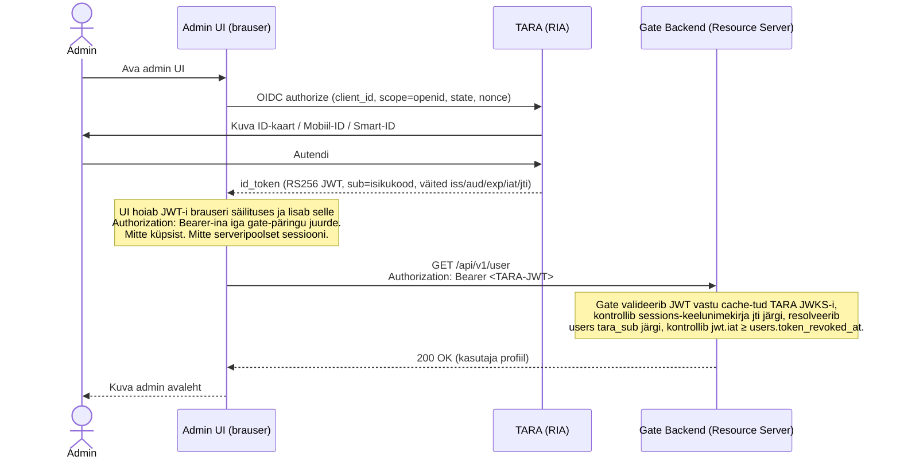
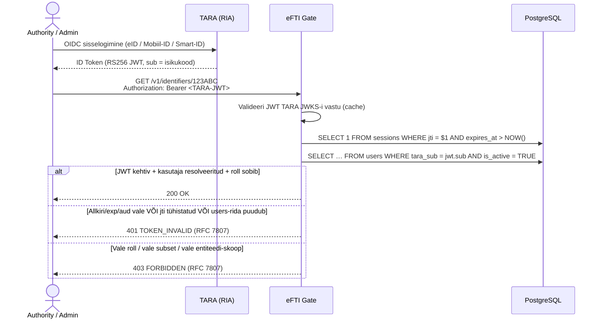
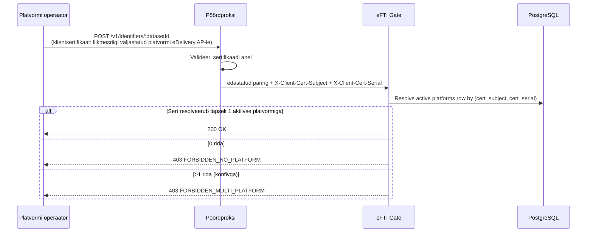
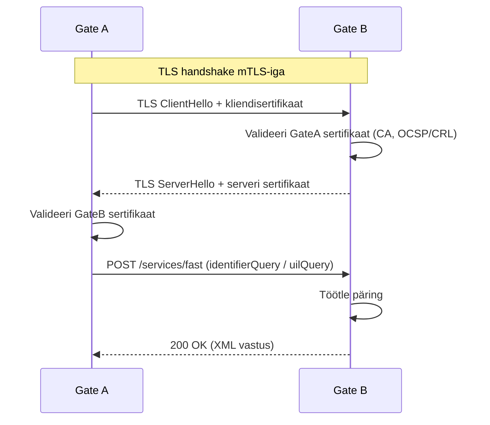
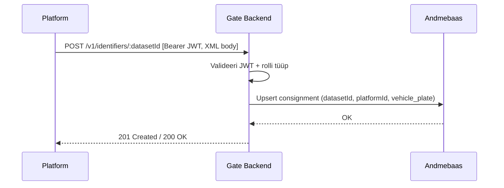
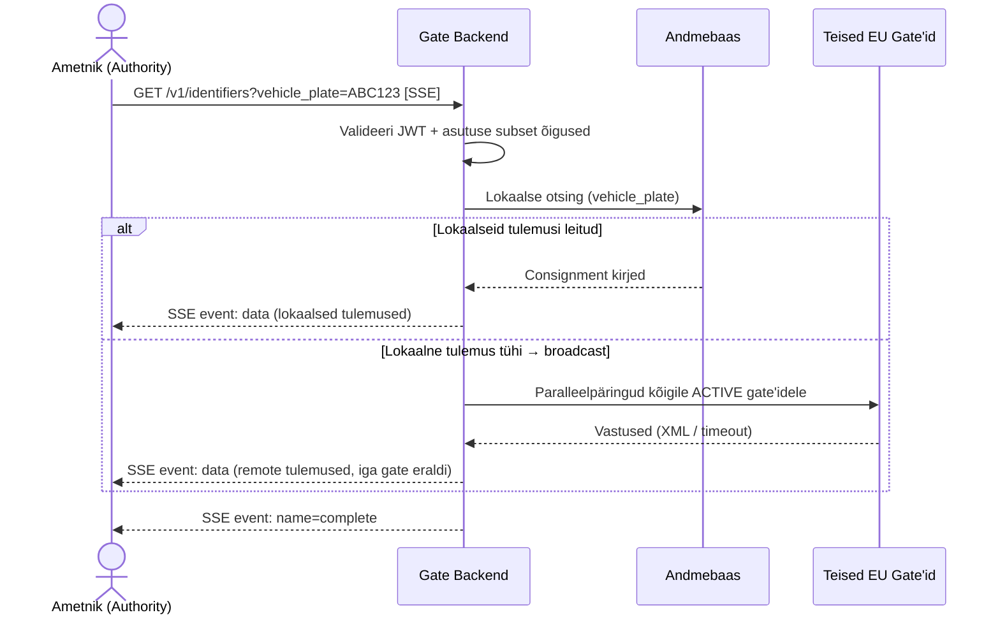
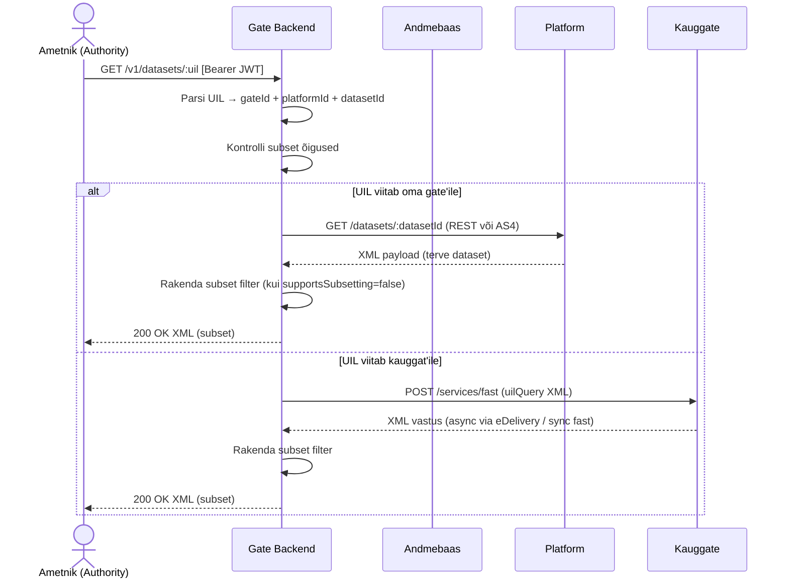
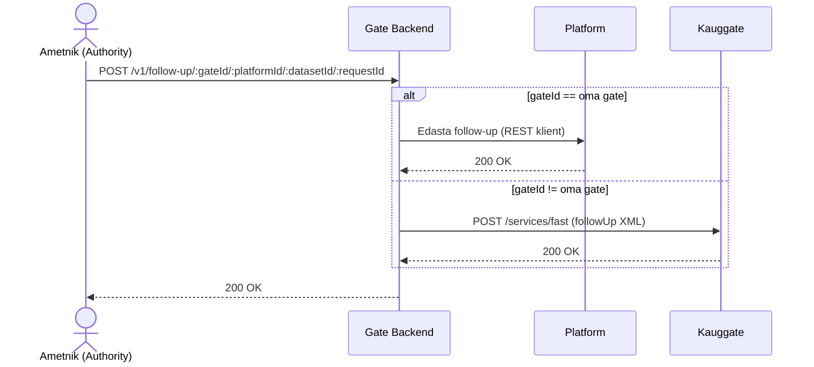
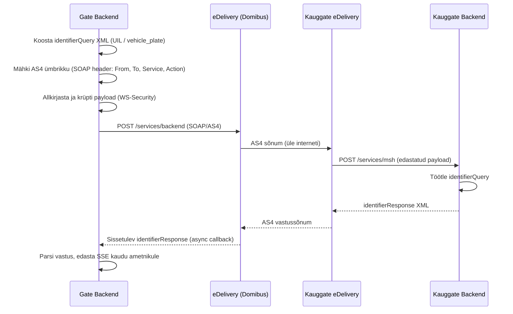
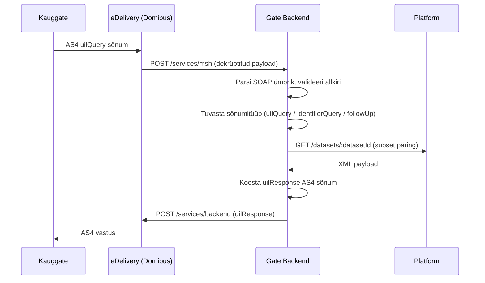

# eFTI Gate

> Referentsdokument eFTI Gate süsteemi ehitamiseks. Alus: [eFTI Gate Reference Architecture](architecture/eFTI-Gate-Reference-Architecture.md) (v2.0, 2026-04-02) ning EU regulatsioonid 2024/1942 ja 2025/2243.  
> Iga epik sisaldab kõik vastuvõtutingimused, mille alusel saab funktsionaalsust implementeerida ja testida.

---

## Ülevaade

eFTI Gate on Euroopa Liidu eFTI (Electronic Freight Transport Information) võrgustiku sõlmpunkt, mis:
1. **Salvestab identifikaatoreid** — platvormid registreerivad kaubaveo identifikaatoreid (sõiduki numbrimärgid, konteinerid, haagised)
2. **Otsib identifikaatoreid** — asutused saavad otsida nii lokaalselt kui ka teistelt EU gate'idelt (broadcast ainult kui lokaalne tulemus on tühi)
3. **Vahendab dataset'e** — asutused pärgivad täisandmestikke UIL (Unique Identifier Locator) alusel
4. **Edastab follow-up sõnumeid** — asutused saadavad tagasiside sõnumeid platvormidele

**Protokollid ja standardid:** REST, eDelivery AS4 (SOAP), OpenAPI, JWT (RFC 7519), RFC 7807, XSD/XML

> **Moodulipiirid:** Dokument eristab kahte kategooriat:
> - **EU tuum** — riigi-neutraalne, kehtib kõigile liikmesriikidele
> - **EE laiendus** — Eesti-spetsiifiline, rakendatav eraldi moodulis ilma tuumkoodi muutmata

> **Tehnoloogiavaliku märkus:** Käesolevas dokumendis viidatud tehniline virn (Svelte UI, Klite raamistik, Kotlin/JVM, PostgreSQL) põhineb **olemasoleva PoC lahenduse** valikutel. Uue arendusetapi jaoks ei ole tehnoloogiavaliku lõplikke otsuseid veel tehtud — need kuuluvad hanke ja tehnilise analüüsi käigus täpsustamisele. Kõiki tehnilistelt artefaktidelt nõutavaid omadusi (ECS logimine, RFC 7807 veaformaat, Flyway/Liquibase jms) tuleb lugeda **tulemuse nõuetena**, mitte konkreetsete raamistike ettekirjutusena.

### Põhiprintsiibid (Reference Architecture §6)

> **eFTI Gate on sisu-agnostiline marsruuter minimaalse persistentsiga** (ainult identifikaatorid).

| eFTI Gate **TEEB** | eFTI Gate **EI TEE** |
|---|---|
| Salvestab identifikaatorid | Salvesta täisandmestikke (ainult eFTI platvorm) |
| Suunab päringuid UIL-i alusel | Parsi/valideeri payload sisu |
| Broadcast-i otsinguid teistele gate'idele | Jõusta subset-i filtreid (eFTI platvorm teeb) |
| Agregeerib tulemusi mitmest allikast | Transformeeri andmeformaate |
| Haldab autentimist/autoriseerimist | Rakenda äriloogikat |
| Haldab registreid (gate'id, platvormid, asutused) | Hoia päringuajalugu |
| eDelivery AS4 protokoll (allkirjastamine, krüptimine) | — |
| AAP (Authority Access Point) REST liides asutustele | — |

### Põhiterminid

- **identifier:** Otsitav väärtus, mida kasutatakse consignment'i leidmiseks (sõiduki numbrimärk, konteineri number, haagise ID). UIL on identifikaatori täielik URL-vorm.
- **UIL (Unique Identifier Locator):** `<gateURL>/<platformURL>/<datasetId>` — globaalselt unikaalne viide konkreetsele kaubaveo andmestikule. Näide: `https://eu-ee31.eftisandbox.eu/https://demo-platform.eu-ee31.eftisandbox.eu/v1/550e8400-e29b-41d4-a716-446655440000`
- **AAP (Authority Access Point):** Gate'i asutustele suunatud REST API liides (nii H2M kui M2M kasutuseks)
- **CMDS (eFTI Common Data Set):** Täielik transpordidokumentatsioon — asub eFTI platvormil, mitte eFTI gate'il
- **H2M:** Human-to-Machine (brauser/rakendus)
- **M2M:** Machine-to-Machine (API/AS4)
- **G2G:** Gate-to-Gate suhtlus (eDelivery AS4)
- **G2P:** Gate-to-Platform suhtlus (REST või AS4)

---

## TEEMA 1 — Identiteet ja ligipääs

**Eesmärk:** Tagada, et kõik gate'iga suhtlevad osapooled autenditakse turvaliselt ning pääsevad ligi ainult neile lubatud ressurssidele.

**Lahendamist vajavad probleemid:**

| Valdkond | Praegune olukord | Nõue |
|----------|-----------------|-------|
| Admin autentimine | HTTP Basic Auth | TARA (ID-kaart, Mobiil-ID, Smart-ID) |
| Paroolipõhine sisselogimine | Lubatud | Tootmises keelatud |
| X-tee | Puudub | Vajalik riigiasutustega suhtlemiseks |
| Platform API auth | `base64(id:password)` | RFC 7519 JWT |
| Saladuste haldus | Selgetekst `.env` failides | Käitusaegne laadimine (K8s Secret / vault) |
| Kirjutusõiguse kontroll | `checkWriteAccess()` ei kontrolli rolli tüüpi | Rolli tüübi kontroll jõustatult |

**Äriline väärtus:**
- TARA autentimine kõrvaldab paroolihalduse koormuse ja vastab e-riigi standardile (kohustuslik tootmiseks)
- Võimaldab tsentraliseeritud identiteedihaldust
- GDPR Art. 30 vastavus — töötlemise register koos audit logiga

**Teema on valmis, kui:**
- [ ] EPIC 1 (RBAC): kõik rollid jõustatud, kirjutusõiguse tüübikontroll parandatud
- [ ] EPIC 2 (Autentimine): TARA sisselogimine töötab, Basic Auth tootmises keelatud, mTLS G2G jaoks
- [ ] EPIC 23 (Autentimisvood): kõik kolm autentimismustrit dokumenteeritud sequence diagrammina

### EPIC 1 — Kasutajahaldus ja RBAC

**AS A** süsteemi administraator  
**I WANT** rollipõhist ligipääsu kontrolli koos ressursipõhise filtreerimisega  
**SO THAT** iga kasutaja näeb ja haldab ainult talle lubatud ressursse

**Viide:** [Õiguste maatriks](specs/permissions-matrix.md) — Täielik autorisatsiooni mudel ja rollipõhine ligipääsu kontroll

#### Acceptance Criteria

##### Rollide loomine ja haldamine

**Happy path:**
- [ ] `POST /api/v1/users` — admin loob kasutaja; uus kasutaja saab ainult looja rollid (v.a. Super Admin); vastus `201 Created` kasutaja ID-ga
- [ ] `GET /api/v1/users` — Super Admin näeb kõiki kasutajaid; tavaline admin ainult oma rollide kasutajaid; vastus pagineeritud (`limit`, `offset`, `X-Total-Count`)
- [ ] `DELETE /api/v1/users/:userId` — admin kustutab teise tema nähtava kasutaja; vastus `204 No Content`
- [ ] Kasutajale saab määrata mitu rolli ja mitu Party ID-d ühe rolli all
- [ ] Authority kasutaja loomisel: `subsets` on Authority `subsets` alamhulk → `201 Created`

**Edge cases:**
- [ ] Admin üritab määrata Super Admin rolli → `403 Forbidden` teatega `"detail": "Super Admin rolli ei saa tavaadmin määrata"`
- [ ] Admin üritab kustutada oma kontot → `400 Bad Request` koodiga `BAD_REQUEST_GENERAL`, teatega `"detail": "Ei saa kustutada oma kontot"`
- [ ] Authority kasutaja loomisel `subsets` ei ole Authority lubatud nimekirjas → `400 Bad Request` teatega `"detail": "Subset 'EU04' ei ole lubatud asutusele 'mta@mta.ee'"`
- [ ] `POST /api/v1/users` `taraSub`-iga, mida juba kasutab aktiivne rida → `409 Conflict`

**Veakäsitlus:**
- [ ] `POST /api/v1/users` puuduva kohustusliku väljaga (nt `roles` puudub) → `400 Bad Request` RFC 7807 koos väljapõhise kirjeldusega
- [ ] Kõik autoriseerimise keeldumised logitakse: kasutaja ID, endpoint, põhjus, IP-aadress, ajatempel

**Tehnilised piirangud:**
- [ ] Esmane autentimine on TARA OIDC JWT (RS256, JWKS aadressilt `TARA_OIDC_DISCOVERY_URL`); aegumispoliitika kuulub TARAle. Õigused (`roles`, `subsets`, scope) loetakse resolveeritud `users` reast, mitte JWT-st.
- [ ] Kasutaja `taraSub` (= JWT `sub`, eesti isikukood) on autentimisidentifikaator. Admin POST loob rea; esmasel sissetuleval JWT-l on gate'l olemas vastav rida.
- [ ] Break-glass `/api/v1/auth/local-token` väljastab gate-allkirjastatud JWT-i fikseeritud 600s TTL-iga (vaikimisi keelatud `LOCAL_ADMIN_FALLBACK_ENABLED=false`); bcrypt kasutusel ainult ühe break-glass rea jaoks.
- [ ] Tühistamine: JWT `jti` kantakse `sessions` keelunimekirja; AccessChecker keeldub iga JWT-st mille `jti` on nimekirjas JA `exp` on tulevikus.

**Tehnilised artefaktid:**
- [ ] OpenAPI: `POST /api/v1/users`, `GET /api/v1/users`, `GET /api/v1/users/{userId}`, `PUT /api/v1/users/{userId}`, `DELETE /api/v1/users/{userId}`, `POST /api/v1/users/{userId}/revoke-token`
- [ ] DB skeem: `users` tabel veergudega `tara_sub TEXT`, `roles JSONB` (ainult `AUTHORITY` ja `ADMIN` võtmed), `subsets TEXT[]`, `secret_hash TEXT NULL`; partial-index `(tara_sub, created_at DESC) WHERE tara_sub IS NOT NULL`.

##### Ligipääsu kontroll

**Happy path:**
- [ ] `/api/v1/...` endpointid on kättesaadavad ainult JWT-dele, mille resolveeritud `users` real on `roles ∋ ADMIN` → `200 OK`
- [ ] `/v1/identifiers/{identifier}`, `/v1/dataset/...`, `/v1/follow-up/...` on kättesaadavad ainult JWT-dele, mille resolveeritud `users` real on `roles ∋ AUTHORITY` → `200 OK`
- [ ] `/v1/identifiers/{datasetId}` (ja teised `/v1/...` Platform endpointid) on kättesaadavad ainult mTLS-iga, kus sertifikaadi subjekt + seerianumber resolveeruvad täpselt ühe aktiivse `platforms` reaga → `200 OK`
- [ ] Admin kirjutamine kontrollib, et JWT-kasutajal on `ADMIN` roll JA et sihtentiteedi id on `users.roles[ADMIN]` skoobis (`checkWriteAccess`)

**Edge cases:**
- [ ] AUTHORITY-rolliga JWT kutsub Admin endpointi → `403 FORBIDDEN`
- [ ] Päring ilma `Authorization` päiseta JWT-kaitstud route'il → `401 Unauthorized` RFC 7807
- [ ] Aegunud JWT (TARA `exp` minevikus) → `401 TOKEN_INVALID`
- [ ] Muudetud JWT allkiri → `401 TOKEN_INVALID` — sisemist infot ei avaldata
- [ ] JWT `sub` ei resolveeru ühegi aktiivse `users` reaga → `401 TOKEN_INVALID` teatega `detail: "kasutaja pole provisioneeritud"`; admin peab esmalt POST-ima `/api/v1/users`
- [ ] Platvormi mTLS sertifikaat esitatud, kuid `platforms.cert_subject` otsing tagastab 0 rida → `403 FORBIDDEN_NO_PLATFORM`
- [ ] Platvormi mTLS sertifikaat resolveerub >1 aktiivse `platforms` reaga (konfivga) → `403 FORBIDDEN_MULTI_PLATFORM`

**Põhjendus:** Identiteet tuleb sertifikaadist (Platform), TARA `sub` väitest (Authority/Admin) või staatilisest ops-tokenist (CronManager). Õigused tulevad resolveeritud DB-reast (`platforms.id` Platformile; `users.roles` / `users.subsets` Authoritile/Adminile); mitte kunagi otse JWT-st, sest gate'i õiguste-snapshot võib pärast JWT väljastamist muutuda.

### EPIC 2 — Autentimine

**AS AN** admin kasutaja  
**I WANT** autentida turvalise mehhanismiga  
**SO THAT** admin liides on kaitstud ning toetab liikmesriigi autentimisinfrastruktuuri

**Viide:** [Õiguste maatriks](specs/permissions-matrix.md) — Autentimisvoog ja autoriseerimiskontrollid

#### Acceptance Criteria

##### Admin UI autentimine (TARA OIDC → JWT, gate on Resource Server)

Gate on **stateless OAuth 2.0 Resource Server**. TARA OIDC code-vahetus toimub admini brauseris (või õhukeses kliendi-poolses login-abilises) ning annab ID Token / Access Token; UI lisab seejärel selle JWT iga järgneva päringu juurde `Authorization: Bearer <token>`-ina. Gate ei säilita serveripoolseid admin-sessioone.

**Happy path:**
- [ ] Admin avab UI; UI TARA login-voog tagastab ID Token-i (RS256 JWT, väited `iss`, `aud`, `exp`, `iat`, `sub` = isikukood, `jti`).
- [ ] UI kutsub gate API-t `Authorization: Bearer <TARA-JWT>`-ga. Gate valideerib allkirja vastu cache-tud TARA JWKS-i; kontrollib `sessions` keelunimekirja `jti` järgi; resolveerib `users` rea `tara_sub = jwt.sub` järgi; lükkab tagasi kui `jwt.iat < users.token_revoked_at`.
- [ ] Mitte `session_id` küpsist. Mitte DB-poolset admin-sessioonihoidlat. Gate-poolne `sessions` tabel on **JWT keelunimekiri** (`jti, revoked_at, reason`); `users.token_revoked_at` on per-kasutaja broadcast-tühistamise marker.
- [ ] Mitmenoodiline juurutus ei vaja sessiooniafiinsust (JWT ON sessioon).

**Edge cases:**
- [ ] JWT allkiri vigane → `401 TOKEN_INVALID`.
- [ ] `iss` ei ole konfigureeritud TARA → `401 TOKEN_INVALID`.
- [ ] `aud` ei ole gate'i TARA `client_id` → `401 TOKEN_INVALID`.
- [ ] `exp` minevikus → `401 TOKEN_INVALID`.
- [ ] `jti` `sessions` keelunimekirjas (admin- või enese-tühistamine) → `401 TOKEN_INVALID` teatega `detail: "token revoked"`.
- [ ] `jwt.iat < users.token_revoked_at` (broadcast-tühistamine) → `401 TOKEN_INVALID` teatega `detail: "token revoked"`.
- [ ] JWT `sub` ei resolveeru ühegi aktiivse `users` reaga → `401 TOKEN_INVALID` teatega `detail: "no provisioned user"`.

**Veakäsitlus:**
- [ ] Väljalogimine: `POST /api/v1/auth/logout` kirjutab `(jti, revoked_at, reason='logout')` `sessions`-tabelisse; edaspidised päringud sama JWT-ga lükatakse tagasi.
- [ ] Per-kasutaja revoke: `POST /api/v1/users/{userId}/revoke-token` lisab `users` rea `token_revoked_at = NOW()`-iga; iga `iat`-ga seda eelnenud JWT lükatakse järgmisel kasutamisel tagasi.
- [ ] Break-glass: `POST /api/v1/auth/local-token` väljastab gate-allkirjastatud JWT-i (RS256, fikseeritud 600s TTL) verifitseerituna bcrypt local-admin rea vastu; vaikimisi keelatud (`LOCAL_ADMIN_FALLBACK_ENABLED=false`).

**Tehnilised piirangud:**
- [ ] `TARA_OIDC_DISCOVERY_URL`, `TARA_CLIENT_ID`, `TARA_CLIENT_SECRET` (UI-poolt, valikuline gate'i RS-rolli jaoks), `TARA_JWKS_CACHE_SECONDS`, `ARCHIVE_OPS_TOKEN`, `LOCAL_ADMIN_FALLBACK_ENABLED`, `BREAK_GLASS_JWT_SIGNING_KEY`, `BREAK_GLASS_JWT_TTL_SECONDS` per `non-functional.md` §4.1.
- [ ] Konkreetset OAuth-teeki ei nõuta; leping on "valideerige OAuth 2.0 Resource Serverina nimetatud väitega".

**Tehnilised artefaktid:**
- [ ] OpenAPI: `POST /api/v1/auth/logout`, `POST /api/v1/auth/local-token` (vaikimisi keelatud), `POST /api/v1/users/{userId}/revoke-token`.
- [ ] Diagramm: `seq-12-user-authentication.mmd`, `flow-02-authorization-check.mmd`.

##### Platform/Authority API autentimine

**Happy path:**
- [ ] Admin loob authority/admin kasutaja `POST /api/v1/users` kaudu — kehas `taraSub` → `201 Created`. Tokenit ei väljastata — autentimine kuulub TARAle.
- [ ] Authority / admin kutsub API-t `Authorization: Bearer <TARA-JWT>` → gate valideerib allkirja TARA JWKS-i vastu, `iss`, `aud`, `exp`, keelunimekirja; resolveerib `users` rea `tara_sub = jwt.sub` järgi; `200 OK` kui aktiivne ja vajalik roll olemas.
- [ ] Platvorm kutsub API-t **mTLS**-iga — pöördproksi suunab `X-Client-Cert-Subject` / `X-Client-Cert-Serial`; gate resolveerib `platforms` rea → `200 OK`.

**Edge cases:**
- [ ] JWT välja antud muu kui konfigureeritud TARA poolt (`iss` ei sobi) → `401 TOKEN_INVALID`.
- [ ] JWT subjekt ei resolveeru ühegi aktiivse `users` reaga → `401 TOKEN_INVALID` teatega `"detail": "kasutaja pole provisioneeritud"`.
- [ ] Platvormi mTLS-sertifikaadi subjekt + seerianumber resolveerub >1 aktiivse `platforms` reaga (konfivga) → `403 FORBIDDEN_MULTI_PLATFORM`.

**Veakäsitlus:**
- [ ] Kompromiteeritud token: `POST /api/v1/users/:userId/revoke-token` → JWT `jti` kantakse `sessions` keelunimekirja; edaspidised päringud selle JWT-ga → `401 TOKEN_INVALID`.

**Tehnilised piirangud:**
- [ ] Allkirjastamine: RS256; gate'i privaatvõti laaditakse K8s Secret'ist käivitumisel — mitte konteinerpildis
- [ ] Tokeni mustanimekirja TTL = tokeni `exp`; puhastatakse automaatselt

**Tehnilised artefaktid:**
- [ ] Diagramm: `seq-12-user-authentication.mmd`

##### Gate-to-gate fast protocol

**Happy path:**
- [ ] Gate A kutsub `POST /services/fast` Gate B-l mTLS kliendisertifikaadiga; Gate B verifitseerib usaldatud CA vastu → `200 OK`

**Edge cases:**
- [ ] Gate A esitab tundmatult CA-lt sertifikaadi → TLS kätlus ebaõnnestub; sündmus logitakse WARN-iga Gate A IP-ga
- [ ] Gate A esitab tühistatud sertifikaadi (OCSP kontroll ebaõnnestub) → ühendus keeldutakse; sündmus logitakse

**Veakäsitlus:**
- [ ] Ainult `X-API-Key` header (mTLS puudub) → `401 Unauthorized`; `X-API-Key` ei ole aktsepteeritud autentimismeetodina

**Tehnilised piirangud:**
- [ ] mTLS sertifikaadid laaditakse K8s Secret'ist runtime'il — sertifikaadid ei ole konteinerpildis
- [ ] `X-API-Key` eemaldatakse `/services/fast` endpointilt täielikult

**Tehnilised artefaktid:**
- [ ] Diagramm: [`specs/diagrams/seq-16-mtls-fast-protocol.mmd`](specs/diagrams/seq-16-mtls-fast-protocol.mmd)

### EPIC 23 — Autentimis- ja ligipääsuvoog

**AS A** tehniline arhitekt  
**I WANT** dokumenteeritud autentimis- ja ligipääsuvoogusid koos sequence diagrammidega  
**SO THAT** integratsioonpartnerid ja arendajad mõistavad täpselt, kuidas autentimine toimib igas kanalitüübis

#### Acceptance Criteria

- [ ] Kõik kolm autentimismustrit on dokumenteeritud sequence diagrammina (vt allpool)
- [ ] Iga voog katab: autentimise, autoriseerimise kontrolli, veajuhtumid
- [ ] Diagrammid on lisatud GitHub dokumentatsiooni

##### Voog 1 — Admin UI sisselogimine (UI-poolne OIDC → JWT gate'ile)

Väljalogimine on `POST /api/v1/auth/logout` sama Bearer-iga; gate kirjutab JWT `jti` `sessions` keelunimekirja `reason='logout'`-iga. Edaspidised päringud sama JWT-ga tagastavad `401 TOKEN_INVALID`.

##### Voog 2 — Authority / Admin API (TARA OIDC JWT)

##### Voog 2b — Platform API (mTLS)

##### Voog 3 — Gate-to-gate fast protocol (mTLS)

---

## TEEMA 2 — Põhifunktsioonid

**Eesmärk:** Implementeerida eFTI Gate'i neli tuumfunktsiooni vastavalt EU regulatsioonidele 2020/1056 ja 2024/1942: identifikaatorite registreerimine (Platform), otsing (Authority), andmestike pärimine UIL alusel ning follow-up sõnumite edastamine.

**Äriline tähtsus:** Need funktsioonid moodustavad gate'i põhiväärtuse — ilma nendeta pole eFTI Gate tähenduslik. EU regulatsioon nõuab liikmesriikidelt töökorras gate'i olemasolu hiljemalt 9. juuliks 2027.

**Teema on valmis, kui:**
- [ ] EPIC 3 (Identifikaatorite registreerimine): platvormid saavad registreerida/uuendada identifikaatoreid REST kaudu
- [ ] EPIC 4 (Identifikaatorite otsing): lokaalne + broadcast otsing toimib, SSE streaming lõplik
- [ ] EPIC 5 (Dataset + follow-up): UIL-põhine dataset'i pärimine ja follow-up edastamine toimib

### EPIC 3 — Identifikaatorite haldus (Platform API)

**AS A** eFTI platvormi operaator  
**I WANT** registreerida kaubaveo identifikaatoreid gate'is  
**SO THAT** pädevad asutused saavad neid hiljem otsida

#### Acceptance Criteria

##### Registreerimine

**Happy path:**
- [ ] `POST /v1/identifiers/:datasetId` võtab vastu XML keha `Content-Type: application/xml`; kehtiv `consignment-identifier.xsd` vastu; kasutajal täpselt 1 PLATFORM roll → `201 Created` koos `Location: /v1/identifiers/:datasetId`
- [ ] Sama `datasetId` saatmine uuendatud andmetega → INSERT uus `consignments` rida sama `dataset_id`-ga (append-only; eelmine rida jääb tabelisse, kuid pole enam viimane). Authority viimase-rea lugemine tagastab uue rea → `200 OK`
- [ ] Salvestatavad otsitavad väljad: `vehicle_plate`, `transport_date`, `origin_country`, `destination_country`, `mode_code`, `dangerous_goods_indicator`
- [ ] Toetatud identifikaatori tüübid: `means` (sõiduk/veovahend), `equipment` (konteiner/haagis), `carried` (koormus)
- [ ] Transpordirežiimid: `1`=merendus, `2`=raudtee, `3`=maantee, `4`=õhk — ilma režiimi-spetsiifilise marsruutimisloogiketa

**Edge cases:**
- [ ] Platvorm jätab `vehicle_plate` ära (eel-registreerimine) → kirje salvestatakse tühja `vehicle_plate`-ga; hilisem `POST` sama `datasetId`-ga lisab/uuendab numbrimärgi
- [ ] Numbrimärgi järgi otsing ei tagasta kirjeid, kus `vehicle_plate` on tühi või null
- [ ] Mitme platvormi kasutaja (>1 PLATFORM roll) saadab ilma `platformId`-ta → `400 Bad Request` teatega `"detail": "Mitu platvormi tuvastatud: täpsusta platformId parameeter"`
- [ ] Mitme platvormi kasutaja määrab kehtiva `platformId` → töödeldakse ühe platvormina
- [ ] `countryCode` ei vasta ISO 3166-1 alpha-2 formaadile (nt `"EST"`) → `400 Bad Request` väljapõhise veateatega
- [ ] `datasetId` ei ole UUID formaat → `400 Bad Request` teatega `"detail": "datasetId peab olema kehtiv UUID v4"`

**Veakäsitlus:**
- [ ] XML vigane `consignment-identifier.xsd` vastu → `400 Bad Request` koos XSD valideerimise vea tee ja rea numbriga
- [ ] `X-Request-ID` header puudub → `400 Bad Request` teatega `"detail": "X-Request-ID header on kohustuslik"`
- [ ] `X-Request-ID` nähtud 600 sekundi jooksul → `400 Bad Request` teatega `"detail": "Duplikaat päringu ID"`
- [ ] Tundmatu eDelivery sõnumitüüp → veateade tagastatakse saatjale; ei ignoreerita vaikselt; sündmus logitakse WARN-iga

**Tehnilised piirangud:**
- [ ] Identifikaatorid salvestatakse `identifiers` tabelisse: üks consignment → mitu identifikaatori rida (1:N)
- [ ] `X-Request-ID` duplikaadi kontroll kasutab ühist andmebaasi tabelit — kontrollitakse üle kõigi sõlmede; TTL 600 sekundit
- [ ] Skeemi migratsioonideks PEAB kasutama Liquibase'i (`non-functional.md` §4 — kinnitatud migratsioonitööriist); kohandatud skripte ei kasutata.

**Tehnilised artefaktid:**
- [ ] OpenAPI: `POST /v1/identifiers/{datasetId}` — päringu keha, kõik veavastused
- [ ] DB skeem: `consignments`, `identifiers` tabelid FK-indeksite ja ingliskeelsete veergude kommentaaridega
- [ ] XSD: `consignment-identifier.xsd`

### EPIC 4 — Identifikaatorite otsing (Authority API)

**AS A** pädeva asutuse töötaja  
**I WANT** otsida kaubaveo identifikaatoreid (nt numbrimärgi järgi) kõigist EU gate'idest  
**SO THAT** saan kontrollida veose vastavust eFTI regulatsioonile

#### Acceptance Criteria

##### Lokaalne otsing

**Happy path:**
- [ ] `GET /v1/identifiers/:identifier` otsib `identifiers` tabelist; kõik filtrid rakendatakse andmebaasi tasemel: `modeCode`, `identifierTypes`, `registrationCountryCode`, `dangerousGoodsIndicator`
- [ ] Tagastatakse ainult `active` staatusega identifikaatorid
- [ ] Tulemused pagineeritud: `limit` (vaikimisi 20, max 100), `offset`; vastuses `X-Total-Count`
- [ ] Tühi tulemus → `200 OK` koos `{"identifiers": []}` — mitte `404`
- [ ] Lokaalse andmebaasi päringu vastusaeg < 50 ms p95-l (nõuab `pg_trgm` indeksit)

**Edge cases:**
- [ ] `limit` ületab 100 → `400 Bad Request` teatega `"detail": "limit ei tohi ületada 100"`
- [ ] `dateFrom` on pärast `dateTo` → `400 Bad Request` teatega `"detail": "dateFrom peab olema enne dateTo"`
- [ ] `dateFrom`/`dateTo` ilma `modeCode=3`-ta → `400 Bad Request` teatega `"detail": "dateFrom/dateTo nõuab modeCode=3"`

**Veakäsitlus:**
- [ ] Puuduv Bearer token → `401 Unauthorized` RFC 7807
- [ ] Authority kasutajal puudub otsigu õigus → `403 Forbidden` teatega `"detail": "Ebapiisavad õigused identifikaatorite otsinguks"`

**Tehnilised piirangud:**
- [ ] PostgreSQL 14+; PEAB kasutama `pg_trgm` laiendust hägusa numbrimärgi otsinguks — jõudlusnõue: < 50 ms lokaalne päring
- [ ] DB indeks: `CREATE INDEX CONCURRENTLY idx_identifiers_plate_trgm ON identifiers USING GIN (vehicle_plate gin_trgm_ops)`

**Tehnilised artefaktid:**
- [ ] OpenAPI: `GET /v1/identifiers/{identifier}` — kõik query parameetrid, vastuse skeem, kõik veavastused
- [ ] Diagramm: `seq-02-identifier-search-local-only.mmd`

##### Kabotaažkontroll

**Happy path:**
- [ ] `dateFrom`–`dateTo` vahemiku filter tagastab `inactive` maanteetranspordi (`modeCode=3`) kirjeid kuupäevavahemikus
- [ ] Maanteetranspordi UIL jääb `inactive` staatusse 14 päeva pärast `delivered_at` (art. 11 lg 4 Reg 2024/1942)
- [ ] Tulemuste loend näitab kirje staatust (`active` / `inactive`) iga kirje kohta

**Tehnilised artefaktid:**
- [ ] OpenAPI: `dateFrom`, `dateTo` query parameetrid `GET /v1/identifiers/{identifier}`-l

##### Broadcast teistele gate'idele

**Happy path:**
- [ ] Broadcast käivitub **ainult** kui lokaalne otsing tagastab 0 tulemust — vältimaks tarbetut koormust ja privaatsuse rikkumist
- [ ] Broadcast saadab paralleelpäringud kõigile `ACTIVE` staatusega gate'idele; `DISABLED` ja `OFFLINE` gate'id jäetakse vahele
- [ ] Iga gate'i vastuse metaandmed: `gateId`, `responseTimeMs`, `success`, `failure`
- [ ] Iga gate'i interaktsioon logitakse: gate ID, vastuse aeg ms, õnnestumine/ebaõnnestumine

**Edge cases:**
- [ ] 3 gate'i 15-st aegub 8 sekundi pärast → osalised tulemused tagastatakse; aegunud gate'id `failures[]`-s; SSE voog lõpeb ikkagi `event: complete`-ga
- [ ] Kõik gate'id offline → `200 OK` tühja identifikaatorite loendiga ja täidetud `failures[]`-ga — mitte 5xx viga
- [ ] Üks gate tagastab ootamatu formaadi → see gate märgitakse `failure`-ks; teised ei ole mõjutatud

**Tehnilised piirangud:**
- [ ] Broadcast'i timeout: 8 sekundit (konfigureeritav `BROADCAST_TIMEOUT_SECONDS` kaudu)
- [ ] Kõiki aktiivseid gate'e küsitletakse paralleelselt — mitte järjestikku

**Tehnilised artefaktid:**
- [ ] Diagramm: `seq-03-identifier-search-broadcast.mmd`

##### SSE (streaming)

**Happy path:**
- [ ] Päring `Accept: text/event-stream` → vastus `Content-Type: text/event-stream`
- [ ] Iga gate'i tulemus: `event: gate` SSE sündmus
- [ ] Iga consignment: `event: consignment` koos `id: <UIL>`
- [ ] Voog lõpeb `event: complete` sündmusega — klient teab, et kõik tulemused on kätte toimetatud
- [ ] Ilma SSE-ta (`Accept: application/json`) → kõik tulemused tagastatakse korraga pärast kõigi gate'ide vastuseid

**Edge cases:**
- [ ] Klient katkestab ühenduse voo keskel → gate lõpetab saatmise ja vabastab ressursid (ressursilekketa)
- [ ] Voog avatud > 60 sekundit (kõik gate'id aegusid) → `event: complete` saadetakse; ühendus suletakse

**Tehnilised artefaktid:**
- [ ] OpenAPI: `GET /v1/identifiers/{identifier}` koos `Accept: text/event-stream` variandiga dokumenteerituna

### EPIC 5 — Dataset'i pärimine ja follow-up

**AS A** pädeva asutuse töötaja  
**I WANT** pärida konkreetse consignment'i täisandmestikku ja saata järelteadet platvormile  
**SO THAT** saan täita oma õiguslikku kohustust kaubavedude kontrollimisel

#### Acceptance Criteria

##### Dataset'i pärimine

**Happy path:**
- [ ] `GET /v1/dataset/:gateId/:platformId/:datasetId` vähemalt 1 `subsetId`-ga → JWT valideeritakse, subset õigused kontrollitakse
- [ ] Lokaalne päring (oma gate'i platvorm): suunab platvormi kliendile; tagastab `Content-Type: application/xml` muutmata
- [ ] `X-Request-ID` kajastub vastuse headeris
- [ ] Lokaalse dataset'i pärimise vastusaeg < 5 sekundit p95-l

**Edge cases:**
- [ ] `subsetId` parameeter puudub → `400 Bad Request` teatega `"detail": "Vähemalt üks subsetId on nõutav"`
- [ ] UIL viitab kauggate'ile staatusega `OFFLINE` → `502 Bad Gateway` teatega `"detail": "Gate 'eu-fi01.efti.fi' on offline — andmestik pole kättesaadav"` — kontrollitakse enne päringu saatmist

**Veakäsitlus:**
- [ ] Kasutaja `subsets` ei sisalda soovitud `subsetId`-d → `403 Forbidden` teatega `"detail": "Subset 'EU04' ei ole sinu lubatud subset'ide hulgas"`
- [ ] Platvormi klient tagastab mitte-200 → `502 Bad Gateway`; gate ei vahemälusta ega muuda andmestikku
- [ ] eFTI Gate on sisu-agnostiline: dataset XML edastatakse muutmata kujul olenemata sisust

**Tehnilised artefaktid:**
- [ ] OpenAPI: `GET /v1/dataset/{gateId}/{platformId}/{datasetId}`
- [ ] Diagrammid: `seq-05-dataset-request.mmd`, `seq-06-dataset-request-denied.mmd`

##### Subsetter moodul

**Happy path:**
- [ ] Platvormi `supportsSubsetting=false` korral: gate rakendab XSLT-põhist filtrit; asutusele tagastatakse ainult lubatud subset'id
- [ ] Filter rakendatakse enne vastuse saatmist — asutus ei saa kunagi rohkem andmeid kui on lubatud

**Edge cases:**
- [ ] XSLT toodab tühja väljundi → `200 OK` tühja XML kehaga; mitte `404`
- [ ] Andmestik > 10 MB → kasutatakse SAX-põhist streaming-parserit; andmestikku ei laadita täielikult JVM mällu

**Tehnilised piirangud:**
- [ ] Subsetter PEAB kasutama SAX streaming-i — suurtele payloadidele ei kasutata DOM mälu-parserit
- [ ] Põhjendus: väldib OutOfMemory vigu suurte kaubadokumentide puhul

##### Follow-up

**Happy path:**
- [ ] `POST /v1/follow-up/:gateId/:platformId/:datasetId/:datasetRequestId` → JWT valideeritakse; suunatakse `gateId` alusel
- [ ] `gateId == oma gate` → edastatakse platvormi kliendile (REST) → `200 OK`
- [ ] `gateId != oma gate` → edastatakse gate-to-gate kliendile → `200 OK`
- [ ] Follow-up logitakse: follow-up ID, pärija kasutaja ID, `datasetRequestId`, ajatempel, sihtkoht

**Edge cases:**
- [ ] Platvormil on `eDeliveryCert` → follow-up saadetakse ka eDelivery AS4 kaudu
- [ ] `datasetRequestId` ei viita ühelegi varasemale päringule → edastatakse ikkagi; logitakse DEBUG-iga

**Veakäsitlus:**
- [ ] Kauggate offline → `502 Bad Gateway` teatega `"detail": "Gate 'eu-de01.efti.de' on offline"`
- [ ] Platvormi kliendi viga → `502 Bad Gateway`; ebaõnnestumine logitakse ERROR-iga koos täieliku jäljega

**Tehnilised piirangud:**
- [ ] Follow-up logikirje (Art 6(2)(c) Reg 2024/1942): follow-up ID, AAP/pärija gate'i ID, vastuvõtmise kuupäev ja kellaaeg — kohustuslikud väljad

**Tehnilised artefaktid:**
- [ ] OpenAPI: `POST /v1/follow-up/{gateId}/{platformId}/{datasetId}/{datasetRequestId}`
- [ ] DB skeem: `follow_up_log` tabel Art 6(2)(c) kohustuslike väljadega

### EPIC 24 — Identifikaatorite otsingu ja dataset'i voog

**AS A** tehniline arhitekt  
**I WANT** dokumenteeritud andmevoogusid koos sequence diagrammidega  
**SO THAT** arendajad ja integratsioonpartnerid mõistavad täpselt, kuidas identifikaatorite otsing, broadcast ja dataset'i pärimine toimib

#### Acceptance Criteria

- [ ] Kõik neli põhivoogu on dokumenteeritud sequence diagrammina (vt allpool)
- [ ] Iga voog katab ka veajuhtumid (gate offline, tühi tulemus, volitamata ligipääs)
- [ ] Diagrammid on lisatud GitHub dokumentatsiooni

##### Voog 1 — Identifikaatori registreerimine (Platform → Gate)

##### Voog 2 — Identifikaatori otsing (Authority → Gate → Broadcast)

##### Voog 3 — Dataset'i pärimine UIL alusel

##### Voog 4 — Follow-up sõnumi edastamine

---

## TEEMA 3 — Registrite haldus

**Eesmärk:** Pakkuda administraatoritele täielikku kontrolli gate'i töö alusandmete üle — EU gate'ide nimekiri, registreeritud platvormid, pädevad asutused ja salvestatud consignment'id — kõik hallatav Admin API kaudu ilma otsese andmebaasijuurdepääsuta.

**Äriline tähtsus:** Registrid on gate'i tegevuse alus. Vigased või puuduvad registriandmed põhjustavad otsingute ebaõnnestumise, vale broadcast'i või volitamata ligipääsu. Andmemuudatused peavad sünkroniseeruma reaalajas kõigile töötavatele node'idele.

**Teema on valmis, kui:**
- [ ] EPIC 6 (Gate'id): gate'i CRUD + ping + LISTEN/NOTIFY sünkroonimine valmis
- [ ] EPIC 7 (Platvormid): platvormi CRUD + ühenduvuse ping + subsetting lipp valmis
- [ ] EPIC 8 (Asutused): asutuse CRUD + subset'ide määramine valmis
- [ ] EPIC 9 (Consignment'id): identifikaatori aegumine + CMDS elutsükkel valmis

### EPIC 6 — Gate'ide haldus (Admin API)

**AS A** süsteemi administraator  
**I WANT** hallata EU eFTI gate'ide nimekirja ja monitoorida nende staatust  
**SO THAT** broadcast päringud jõuavad ainult töötavatesse gate'idesse

#### Acceptance Criteria

##### CRUD

**Happy path:**
- [ ] `GET /api/v1/gates` — Super Admin näeb kõiki gate'e; tavaline Admin ainult oma `roles[ADMIN]` skoobi gate'e; pagineeritud
- [ ] `POST /api/v1/gates` — lisab uue gate'i `baseUrl`, `eDeliveryUrl`, sertifikaadi infoga; kirjutusrõigus nõuab ühtivat Party ID-d → `201 Created`
- [ ] `DELETE /api/v1/gates/:gateId` — kirjutusrõigus kontrollitud → `204 No Content`
- [ ] `GET /api/v1/gates/own` — tagastab oma gate'i konfiguratsiooni

**Edge cases:**
- [ ] Admin kustutab oma gate'i → `409 Conflict` teatega `"detail": "Ei saa kustutada oma gate'i"`
- [ ] `POST /api/v1/gates` juba registreeritud `baseUrl`-ga → `409 Conflict`
- [ ] `DELETE` olematule gate'ile → `404 Not Found`

**Veakäsitlus:**
- [ ] Kirjutamine mitteühtivatest Party ID-ga → `403 Forbidden`

**Tehnilised artefaktid:**
- [ ] OpenAPI: `GET /api/v1/gates`, `POST /api/v1/gates`, `DELETE /api/v1/gates/{gateId}`, `GET /api/v1/gates/own`

##### Ping

**Happy path:**
- [ ] `POST /api/v1/gates/:gateId/ping` → fast protocol ping (`POST {eDeliveryUrl}` mTLS-iga) → `200 OK` koos `responseTimeMs`-ga
- [ ] eDelivery ping: SOAP ping päring → `200 OK` või `502`
- [ ] Ping tulemus uuendab gate'i staatust andmebaasis ja in-memory registris kõigil node'idel (NOTIFY kaudu)

**Edge cases:**
- [ ] Gate ei vasta 10 sekundi jooksul → staatus seatakse `OFFLINE`; `502 Bad Gateway` teatega `"detail": "Gate 'eu-fi01.efti.fi' ei vastanud 10 sekundi jooksul"`
- [ ] Gate oli `OFFLINE`, ping õnnestub → staatus muutub `ONLINE`-ks; staatuse muutus logitakse INFO-ga

**Tehnilised piirangud:**
- [ ] Ping'i timeout: 10 sekundit (konfigureeritav `PING_TIMEOUT_SECONDS` kaudu)

##### Automaatne seire

**Happy path:**
- [ ] Korduv peer-gate health-probe käivitatakse **CronManageri** poolt: `POST /api/v1/admin/ping-gates` (vaikimisi iga 5 min; YAML asub `docs/specs/deploy/cronmanager-ping-gates.yaml`). Gate-il `PING_INTERVAL_MINUTES` env-muutujat ei ole.
- [ ] `DISABLED` staatusega gate'e automaatne töö ei pingita
- [ ] Staatuse muutus logitakse INFO-ga: gate ID, vana staatus, uus staatus, ajatempel

**Edge cases:**
- [ ] Ping töö üritab käivituda 2 node'il → andmebaasi nõuandelukk tagab, et ainult 1 node töötab

**Tehnilised piirangud:**
- [ ] Liidri valimine: CronManageri admin-otspunkt jõustab mitmenoodilise mutexi (üks töös olev kõne võidab; teised saavad 409). Realiseerimine võib kasutada andmebaasi nõuandelukke või muud samaväärset mehhanismi.

**Tehnilised artefaktid:**
- [ ] OpenAPI: `POST /api/v1/gates/{gateId}/ping`

### EPIC 7 — Platvormide haldus (Admin API)

**AS A** süsteemi administraator  
**I WANT** hallata eFTI platvormide registrit  
**SO THAT** platvormid saavad identifikaatoreid registreerida ja asutused saavad dataset'e pärida

#### Acceptance Criteria

**Happy path:**
- [ ] `GET /api/v1/platforms` — Super Admin näeb kõiki; Admin näeb ainult oma `roles[ADMIN]` gate-skoobi platvorme; pagineeritud
- [ ] `POST /api/v1/platforms` — loob platvormi väljadega `id`, `baseUrl`, `supportsSubsetting`, `certSubject`, `certSerial`, valikuline `eDeliveryCert` → `201 Created` (409 kui `id` on juba olemas)
- [ ] `PUT /api/v1/platforms/{platformId}` — uuendab olemasolevat platvormi (append-only INSERT) → `200 OK` (404 kui `id` puudub)
- [ ] `DELETE /api/v1/platforms/{platformId}` — pehme kustutus (uusim rida `is_active=FALSE`) → `204 No Content`
- [ ] `POST /api/v1/platforms/:platformId/ping` — kontrollib HTTP ühendust `baseUrl`-le → `200 OK` koos `responseTimeMs`-ga või `502`
- [ ] Platvorm ilma `eDeliveryCert`-ita: ainult REST; sertifikaadiga: saab ka eDelivery AS4 kaudu kutsuda
- [ ] `supportsSubsetting=false` platvorm: gate rakendab XSLT subsetter'it enne dataset'i tagastamist

**Edge cases:**
- [ ] `POST /api/v1/platforms` juba registreeritud `baseUrl`-ga → `409 Conflict`
- [ ] `DELETE` platvormil aktiivsete identifikaatoritega → `409 Conflict` teatega `"detail": "Platvormil on 42 aktiivset identifikaatorit — kustuta need esmalt või kasuta force=true"`
- [ ] Ping — platvorm ei vasta 10 sekundi jooksul → `502 Bad Gateway` teatega `"detail": "Platvorm 'mta-platform-1' ei vastanud 10 sekundi jooksul"`

**Veakäsitlus:**
- [ ] Kirjutamine mitteühtivatest Party ID-ga → `403 Forbidden`

**Tehnilised piirangud:**
- [ ] Registrimuudatused levivad kõigile node'idele LISTEN/NOTIFY kaudu 500 ms jooksul

**Tehnilised artefaktid:**
- [ ] OpenAPI: `GET /api/v1/platforms`, `POST /api/v1/platforms`, `DELETE /api/v1/platforms/{platformId}`, `POST /api/v1/platforms/{platformId}/ping`

### EPIC 8 — Asutuste haldus (Admin API)

**AS A** süsteemi administraator  
**I WANT** hallata pädevate asutuste (Competent Authorities) registrit  
**SO THAT** asutuste kasutajatel oleks kontrollitud ligipääs eFTI andmetele

#### Acceptance Criteria

**Happy path:**
- [ ] `GET /api/v1/authorities` — Super Admin näeb kõiki; Admin ainult oma asutusi (`roles[AUTHORITY]` Party ID-d); pagineeritud
- [ ] `GET /api/v1/authorities/:authorityId` — tagastab asutuse detailid: nimi, `subsets[]`, kontakt
- [ ] `POST /api/v1/authorities` — lisab asutuse lubatud `subsets[]`-ga → `201 Created`
- [ ] `DELETE /api/v1/authorities/:authorityId` → `204 No Content`

**Edge cases:**
- [ ] `DELETE` asutusel aktiivsete kasutajatega → `409 Conflict` teatega `"detail": "Asutusel on 3 aktiivset kasutajat — kustuta või määra ümber esmalt"`
- [ ] `POST` tundmatu subset koodiga → `400 Bad Request` teatega `"detail": "Tundmatu subset: 'EU99'"`
- [ ] Asutuse `subsets[]` uuendatakse subset'i eemaldamisega → olemasolevad kasutajad kaotavad ligipääsu kohe (reaalajas, mitte järgmisel sisselogimisel)
- [ ] `GET /api/v1/authorities/:authorityId` olematule asutusele → `404 Not Found`

**Veakäsitlus:**
- [ ] Kirjutamine mitteühtivatest Party ID-ga → `403 Forbidden`

**Tehnilised piirangud:**
- [ ] Subset'i ligipääsu muutus levitatakse LISTEN/NOTIFY kaudu 500 ms jooksul

**Tehnilised artefaktid:**
- [ ] OpenAPI: `GET /api/v1/authorities`, `POST /api/v1/authorities`, `DELETE /api/v1/authorities/{authorityId}`

### EPIC 9 — Consignment'ide haldus (Admin API)

**AS A** süsteemi administraator  
**I WANT** vaadata ja hallata salvestatud consignment andmeid  
**SO THAT** saan auditeerida andmeid ja eemaldada vigaseid kirjeid

#### Acceptance Criteria

##### Vaatamine ja kustutamine

**Happy path:**
- [ ] `GET /api/v1/consignments` — Super Admin näeb kõiki; Admin ainult oma gate-skoobi consignment'e; loend tagastab viimase rea `dataset_id` kohta (kanooniline read-pattern `db/README.md`-s) järjestatuna `created_at DESC` järgi; pagineeritud
- [ ] `DELETE /api/v1/consignments/:datasetId` — ainult Super Admin; soft delete (staatus → `deleted`) → `204 No Content`

**Edge cases:**
- [ ] Tavaline admin üritab `DELETE`-d → `403 Forbidden` teatega `"detail": "Ainult Super Admin saab consignment'e kustutada"`
- [ ] `DELETE` juba kustutatud kirjele → `404 Not Found`

**Tehnilised artefaktid:**
- [ ] OpenAPI: `GET /api/v1/consignments`, `DELETE /api/v1/consignments/{datasetId}`

##### Identifikaatorite staatuste haldus (Regulatsioon 2025/2243)

**Happy path:**
- [ ] Staatuste elutsükkel: `active` (otsitav) → `inactive` (ainult ajaloolised päringud) → `deleted` (tagastab "not found")
- [ ] Platvorm saadab uuendatud andmed sama `datasetId`-ga → INSERT uus consignments-rida (append-only; eelmine rida jääb, kuid pole enam viimane). Olek "uuenduse" jaoks pole eraldi staatus — viimane rida võidab.
- [ ] Platvorm saadab DELETE päringu → staatus → `deleted` (soft delete; füüsiliselt kohe ei kustutata)
- [ ] `deleted` kirjed kustutatakse füüsiliselt pärast säilitusaja möödumist

**Edge cases:**
- [ ] Platvorm registreerib uuesti pärast `deleted` staatust → luuakse uus `active` kirje; vana `deleted` säilib kuni säilitusaja lõpuni

**Tehnilised piirangud:**
- [ ] DB: `status` enum (`active`, `inactive`, `deleted`); `expires_at` ajatempel iga kirje kohta
- [ ] Skeemi migratsioonideks PEAB kasutama Liquibase'i (`non-functional.md` §4 — kinnitatud migratsioonitööriist); kohandatud skripte ei kasutata.

##### Säilitusreeglid (Regulatsioon 2024/1942)

**Happy path:**
- [ ] Kõik andmetele ligipääsu logid (authority päringud, dataset päringud) säilitatakse **vähemalt 7 aastat** `audit_log`-is (säilib live-DB-s tähtajatult; ei arhiveerita).
- [ ] Maanteetransport (`mode='road'`): identifikaator deaktiveeritakse (`active → inactive`) **14 päeva** pärast `transport_date` (kabotaaži kontroll, Reg 2024/1942 Art 11(4)). Käivitatakse CronManageri poolt: `POST /api/v1/admin/expire-identifiers`.
- [ ] Muud transpordirežiimid: deaktiveeritakse kohe pärast `delivered_at`.
- [ ] **Mitte-viimased consignments-read arhiveeritakse igal öösel** CronManageri poolt `POST /api/v1/admin/archive` kaudu; `db_archiver` PostgreSQL roll DELETE-b need pärast külmsalvestusse kopeerimist. Töökeskkonna `app` roll ei kustuta kunagi midagi.
- [ ] Süsteem toetab 5-aastase seiraruandluse andmete eksporti Euroopa Komisjonile.

**Edge cases:**
- [ ] `transport_date` ei ole seatud või on tulevikus → identifikaator jääb `active`-ks; aegumistöö jätab vahele.
- [ ] Samaaegsed CronManageri kutsed `/admin/expire-identifiers`-le → mitmenoodiline mutex teisel kõnel ebaõnnestub; gate vastab `409 Conflict`.

**Tehnilised piirangud:**
- [ ] Aegumistöö ajakava elab CronManageri YAML-is (`docs/specs/deploy/cronmanager-expire.yaml`), vaikimisi `0 45 3 * * ?`. Gate-il `EXPIRY_JOB_WINDOW_*` env-muutujat ei ole.
- [ ] Konkurentsikaitse handler-sissepääsul: mitmenoodiline mutex eraldi identiteediga aegumistöö jaoks; kui võetud, tagastab `409 Conflict`.
- [ ] Aegumistöö logib `event.action: identifier.expire` koos `efti.expired_count`-iga ühe käivituse kohta.

**Tehnilised artefaktid:**
- [ ] DB indeks: `CREATE INDEX idx_consignments_dataset_latest ON consignments (dataset_id, created_at DESC)` — kanooniline viimase-rea indeks, mida kasutavad lugemised, aegumis- ja arhiveerimissweepid.
- [ ] Ühiktest: aegumisloogika — `mode='road'` vs muud režiimid, `transport_date` seatud / seadmata / tulevikus, idempotentsus teisel käivitusel.

---

## TEEMA 4 — Integratsioonid

**Eesmärk:** Tagada gate'i koostalitlusvõime nii EU tasandil (eDelivery AS4) kui ka Eesti riiklikul tasandil (X-tee, ANTS ja riiklike pädevate asutuste infosüsteemid).

**Äriline tähtsus:** eDelivery AS4 on EU-kohustuslik andmevahetus protokoll eFTI gate'ide vahel. X-tee integratsioon on nõutav, kuna Eesti riigiasutused kasutavad riiklikuks andmevahetuseks X-teed — ilma selleta ei ole neil võimalik gate'iga standardselt suhelda. ANTS integratsioon võimaldab piirivalve kiiret numbrimärgi kontroll.

**Teema on valmis, kui:**
- [ ] EPIC 10 (eDelivery AS4): sissetulevad/väljaminevad AS4 sõnumid käideldud; async vastused edastatud
- [ ] EPIC 11 (X-tee, EE): platvormi registreerimine saadaval X-tee teenusena; tuumkood muutmata

### EPIC 10 — eDelivery AS4 integratsioon

**AS A** eFTI Gate  
**I WANT** suhelda teiste EU gate'idega eDelivery AS4 protokolli kaudu  
**SO THAT** cross-border eFTI andmevahetus toimub standardse EU infrastruktuuri kaudu

#### Acceptance Criteria

##### Sissetulevad sõnumid

**Happy path:**
- [ ] `POST /services/msh` võtab vastu SOAP/AS4 sõnumeid; dekrüpteerib ja parsib AS4 profiili järgi
- [ ] `identifierQuery` → töötleb otsingu; tagastab `identifierResponse`
- [ ] `uilQuery` → hangib dataset'i platvormilt; tagastab `uilResponse`
- [ ] `postFollowUpRequest` → edastab järelpäringu platvormile; tagastab kinnituse
- [ ] `saveIdentifiersRequest` → salvestab identifikaatorid

**Edge cases:**
- [ ] Tundmatu `Action` väli → veateade tagastatakse saatjale; sündmus logitakse WARN-iga; ei ignoreerita vaikselt
- [ ] Tundmatu `CompressionType` → veateade tagastatakse; ei lahtipakita vaikselt
- [ ] Sissetulev sõnum vigase AS4 allkirjaga → lükatakse tagasi; sündmus logitakse WARN-iga koos saatja Party ID-ga

**Veakäsitlus:**
- [ ] SOAP parsimise tõrge → AS4 viga tagastatakse koos veakoodiga ja kirjeldusega

**Tehnilised piirangud:**
- [ ] PEAB kasutama protokolliga ühilduvat AS4 access pointi — kas sisseehitatud AS4-rakendust (Askendi alusversioon) või Domibust. Operaatori valik (`non-functional.md` §4).

**Tehnilised artefaktid:**
- [ ] Diagramm: `seq-14-gate-to-gate-search.mmd`

##### Väljaminevad sõnumid

**Happy path:**
- [ ] Gate-to-gate klient logib iga väljamineva: gate ID, protokoll (Fast/eDelivery), URL, kestus ms, HTTP staatus, viga
- [ ] eDelivery klient logib: sihtkoht Party ID, requestId, kestus ms, vastuse staatus
- [ ] Fast protocol: `POST {gate.eDeliveryUrl}` koos mTLS-iga (X-API-Key eemaldatud)
- [ ] eDelivery AS4: SOAP sõnum krüpteeritakse ja allkirjastatakse (WS-Security) enne saatmist

**Veakäsitlus:**
- [ ] Väljaminev eDelivery tõrge → logitakse ERROR koos täieliku kontekstiga; kutsuja saab `502 Bad Gateway`

##### Protokolliümbrik ja päringute genereerimine

**Happy path:**
- [ ] eFTI Gate genereerib päringute ümbriku (identifierQuery, uilQuery XML) vastavalt `xsd/edelivery.xsd` skeemile
- [ ] Dataset'i sisu edastatakse **muutmata** kujul — eFTI Gate on sisu-agnostiline
- [ ] Iga väljuv päring sisaldab `requestId` (UUID v4) auditi jälgimiseks
- [ ] Ümbrik valideeritakse XSD vastu enne saatmist — vigane XML tagastab veateate, mitte vaikse tõrke
- [ ] Toimib kõigi transpordirežiimidega ilma režiimi-spetsiifilise loogiketa

**Edge cases:**
- [ ] Genereeritud ümbriku XSD valideerimine ebaõnnestub → `500` logitakse ERROR-iga; ei edastata kliendile

**Tehnilised piirangud:**
- [ ] WS-Security allkirjastamise sertifikaat laaditakse K8s Secret'ist runtime'il — ei ole konteinerpildis

##### Asünkroonne vastuste haldus

**Happy path:**
- [ ] Async vastused (uilResponse, identifierResponse) edastatakse PostgreSQL LISTEN/NOTIFY kaudu — session affinity pole vajalik
- [ ] Haldur töötab kõigil node'idel; iga node töötleb ainult oma `requestId`-ga vastused

**Edge cases:**
- [ ] Async vastus saabub pärast SSE voo sulgemist → unustatakse; logitakse DEBUG-iga

**Tehnilised artefaktid:**
- [ ] DB skeem: `async_responses (request_id, gate_id, payload, received_at)`

### EPIC 11 — X-tee integratsioon (EE laiendus)

> X-tee spetsiifiline kood asub eraldi moodulis. Tuumkood ei sisalda X-tee viiteid.

**AS AN** Eesti valitsussüsteem või transpordiplatvorm  
**I WANT** suhelda eFTI gate'iga X-tee kaudu  
**SO THAT** integratsioon kasutab standardset Eesti riiklikku andmevahetuskihti

#### Acceptance Criteria

**Happy path:**
- [ ] X-tee teenuse endpoint on implementeeritud `ee-adapter` moodulis — tuumkoodis puuduvad X-tee viited täielikult
- [ ] Platvormi registreerimine kättesaadav X-tee teenusena: `EE/GOV/70003158/efti-gate/registerPlatform/v1`
- [ ] X-tee sõnumi headerid valideeritakse: `client`, `service`, `id`, `protocolVersion`
- [ ] Registreerimispäring edastatakse tuumkoodi Admin REST API-le
- [ ] Vastus tagastatakse kehtiva X-tee SOAP ümbrikuna
- [ ] Toimib X-tee Security Server v6.x testikeskkonnaga

**Edge cases:**
- [ ] Tundmatu `protocolVersion` → SOAP viga `"faultCode": "Client.unknownVersion"`
- [ ] `client` identiteet pole volitatud → `403 Forbidden` SOAP viga

**Veakäsitlus:**
- [ ] Tuumkoodi REST API tagastab `4xx/5xx` → viga mähitakse X-tee SOAP vigasse

**Tehnilised piirangud:**
- [ ] `ee-adapter` moodul kutsub tuumkoodi ainult avaldatud REST API kaudu — tuumkoodi moodulist ei ole sisemisi sõltuvusi
- [ ] EI TOHI muuta `core` moodulit X-tee toe lisamiseks

**Tehnilised artefaktid:**
- [ ] WSDL: `efti-xroad.wsdl`
- [ ] Diagramm: `seq-10-platform-registration.mmd`

##### Eesti pädevad asutused

**Happy path:**
- [ ] Iga asutus valib: eDelivery AS4 või X-tee — mõlemad toetatud
- [ ] X-tee kliendi identiteet valideeritakse X-tee Security Serveri poolt — eraldi Bearer token pole X-tee päringutele vajalik
- [ ] Subset'i ligipääs asutuspõhine: TRAM/LOIS2 saab pärida ainult AWB/manifesti subset'e — maanteetransport filtreeritakse gate'is

**Edge cases:**
- [ ] TRAM pärib maanteetranspordi subset'i `EU02` X-tee kaudu → `403 Forbidden` SOAP viga teatega `"detail": "Subset EU02 ei ole lubatud asutusele 'TRAM'"`

##### ANTS integratsioon

**Happy path:**
- [ ] eFTI Gate eksponeerib kõrgjõudlusega endpointi ANTS-ile: ainult eksisteerimise kontroll — täisandmeid ei tagastata
- [ ] ANTS vastus: `{"registered": true}` või `{"registered": false}`; vastusaeg < 1 sekund p95-l
- [ ] ANTS integratsioon toimib X-tee kaudu NES vahendusüksuse kaudu (MTA siselahendus)

**Edge cases:**
- [ ] ANTS päring numbrimärgi kohta, mida pole lokaalses registris → `{"registered": false}` — EI käivita broadcast'i (ANTS on ainult lokaalne)

**Tehnilised piirangud:**
- [ ] ANTS endpoint: kirjutuskaitstud, ainult eksisteerimise kontroll, indeks-ainult skannimine `vehicle_plate` peal
- [ ] Põhjendus: ANTS võib piirivalveoperatsioonide ajal saata > 10 000 päringut tunnis

##### ADR 1000-punktireegel

**Happy path:**
- [ ] eFTI Gate arvutab ADR 1.1.3.6 ohtlike kaupade punktisumma sõiduki kohta (UN number × ohtlikkuse klass × netomass)
- [ ] Punktisumma ≥ 1000: täis-ADR; < 1000: osaline (ADR 1.1.3.6 vabastused); = 0: täielik vabastus
- [ ] ADR punktisumma lisatakse `EU05` subset'i vastusele

**Edge cases:**
- [ ] `supportsAdrCalculation=true` platvormil → gate jätab arvutuse vahele; kasutatakse platvormi väärtust
- [ ] `supportsAdrCalculation=false` → gate teostab arvutuse ja lisab tulemuse

### EPIC 25 — eDelivery AS4 sõnumivoog

**AS A** tehniline arhitekt  
**I WANT** dokumenteeritud eDelivery AS4 sõnumivoogusid koos sequence diagrammidega  
**SO THAT** arendajad mõistavad täpselt, kuidas gate'idevahelised sõnumid liiguvad läbi AS4 protokolli

#### Acceptance Criteria

- [ ] Mõlemad AS4 vooge (väljaminev identifierQuery ja sissetulev uilResponse) on dokumenteeritud
- [ ] Diagrammid katavad: SOAP ümbriku loomise, allkirjastamise, krüptimise, ebaedu käsitlemise
- [ ] Diagrammid on lisatud GitHub dokumentatsiooni

##### Voog 1 — Väljaminev identifikaatoriotsing (Gate → eDelivery → kaugGate)

##### Voog 2 — Sissetulev UIL-päring (kaugGate → Gate → Platform)

---

## TEEMA 5 — Infrastruktuur ja töökindlus

**Eesmärk:** Tagada, et gate töötab tootmiskeskkonna nõuetele vastavalt: horisontaalselt skaleeritav mitme node'iga, talub üksiku node'i rikke ilma andmekaduta, ning integreerib sujuvalt Kubernetes elutsüklihaldusega.

**Probleem:** Praegune arhitektuur kasutab jagatud mälus registreid (in-memory) — see tähendab, et mitme node'i käivitamisel on registrid desünkroniseeritud. Request ID duplikaadituvastus töötab ainult ühe node'i piires. Taustatööd (ping, expiry) käivituvad kõigil node'idel korraga. Sertifikaadid ja saladused on küpsetatud kontaineripilti — keskkondade vaheline taaskasutus ei ole võimalik.

**Äriline väärtus:**
- N+1 redundants (nõutav tootmise SLA täitmiseks)
- Load balanceril ei ole vaja session affinity-t — lihtsam infrastruktuur
- Nullist andmekadu node'i rikke korral
- Zero-downtime rolling update'id Kubernetes'es
- Kubernetes auto-healing: ebaõnnestunud pod taaskäivitatakse automaatselt

**Teema on valmis, kui:**
- [ ] EPIC 12 (Skaleeritavus): 2+ node'i töötab ilma ühise mäluta; registrid sünkroniseeritud LISTEN/NOTIFY kaudu
- [ ] EPIC 13 (Tervisekontroll): liveness/readiness proobid läbitud; graceful shutdown ≤30s; `/health` avalik

### EPIC 12 — Skaleeritavus ja staatusetus

**AS A** DevOps insener  
**I WANT** gate'i töötama mitmel node'il ilma ühise mäluta  
**SO THAT** süsteem on horisontaalselt skaleeritav ja talub üksiku node'i rikke

#### Acceptance Criteria

##### Registry sünkroonimine

**Happy path:**
- [ ] Registrimuudatused → PostgreSQL NOTIFY; kõik node'id uuendavad oma in-memory koopiat 500 ms jooksul
- [ ] Node'i taaskäivituse järel laadib registry andmebaasist — andmekadu puudub

**Edge cases:**
- [ ] Node saab NOTIFY tundmatu registrikirje kohta → laadib andmebaasist
- [ ] Andmebaas on käivitumisel kättesaamatu → node ei käivitu; readiness probe tagastab `503`

**Tehnilised piirangud:**
- [ ] PEAB kasutama PostgreSQL LISTEN/NOTIFY — Redis, Hazelcast ega muud jagatud mälu sõltuvusi ei kasutata
- [ ] Põhjendus: minimeerib infrastruktuuri sõltuvusi (PostgreSQL on juba nõutud)

##### Request ID duplikaatide kontroll

**Happy path:**
- [ ] `X-Request-ID` unikaalsust kontrollitakse jagatud andmebaasi tabelis — kontrollitakse üle kõigi node'ide
- [ ] Duplikaadi tuvastamise aken: 600 sekundit
- [ ] Duplikaat mis tahes node'ilt → `400 Bad Request` teatega `"detail": "Duplikaat X-Request-ID 600 sekundi jooksul"`

**Edge cases:**
- [ ] Sama ID saabub 2 node'ile 1 ms jooksul → andmebaasi unikaalsuspiirang takistab mõlemal õnnestumast; üks saab `400`

**Tehnilised piirangud:**
- [ ] DB: `request_id_cache (request_id VARCHAR PK, seen_at TIMESTAMPTZ, expires_at TIMESTAMPTZ)` 10-minutilise TTL-iga (vt `schema.sql`)

##### Admin auth state

**Happy path:**
- [ ] Admin autentimine on **stateless** — iga päring kannab TARA-väljastatud JWT; gate valideerib selle OAuth 2.0 Resource Serverina. Mitte DB-salvestatud admin-sessiooni, mitte `session_id` küpsist, mitte sticky-session nõuet.
- [ ] Tühistamine on mitmenoodiliselt järjepidev, sest `sessions` (JWT keelunimekiri: `jti, revoked_at, reason`) ja `users.token_revoked_at` on jagatud DB-olek. Iga node näeb järgmisel päringul sama tühistamisseisu.

**Edge cases:**
- [ ] JWT `exp` minevikus → `401 TOKEN_INVALID`; UI käivitab uuesti TARA OIDC sisselogimisvoo.
- [ ] JWT `jti` lisatud keelunimekirja `POST /api/v1/auth/logout` kaudu, VÕI `jwt.iat < users.token_revoked_at` pärast `POST /api/v1/users/{userId}/revoke-token` → kõik node'id lükkavad sama JWT järgmisel päringul tagasi.

##### CronManageri-juhitavad ajakava-tööd

**Happy path:**
- [ ] Arhiveerimine (`/api/v1/admin/archive`), aegumine (`/api/v1/admin/expire-identifiers`) ja peer-gate ping (`/api/v1/admin/ping-gates`) on kõik juhitud välimise CronManageri poolt (Epic 26). Gate-protsess ei käivita ise ühtegi ajastatud tööd.
- [ ] Mitmenoodiline konkurentsikaitse: iga handler võtab sissepääsul eraldi advisory-luku. Kui lukk on hõivatud, tagastab `409 Conflict`. Lukk vabaneb automaatselt, kui ühendus katkeb (PostgreSQL'is per-connection).

**Edge cases:**
- [ ] Kaks CronManageri instantsi jooksevad samale admin-otspunktile → teine kõne saab kohe 409; CronManageri retry-poliitika perekontrollib.

##### Andmebaasi migratsioonid

**Happy path:**
- [ ] `schema.sql` on v0 alusversioon, mis rakendatakse korra tühja andmebaasi vastu; järgnevad muudatused käivad läbi Liquibase'i changeset'ide aadressil `gate/db/changelog/`.
- [ ] Migratsioonilukk vabastatakse isegi kui rakendus jookseb kokku (Liquibase'i sisseehitatud lukusemantika).

**Tehnilised piirangud:**
- [ ] PEAB kasutama **Liquibase'i** (`non-functional.md` §4 — kinnitatud migratsioonitööriist).

##### Andmebaasi kujundus

**Happy path:**
- [ ] Kõigil tabelitel ja väljadel on ingliskeelsed kommentaarid — skeem on kõigile arendajatele arusaadav
- [ ] Kõik võõrvõtme väljad on indekseeritud
- [ ] `audit_log` tabel (toimingute auditijälg): row_id, user_id, action, resource, resource_id, recorded_at

**Tehnilised artefaktid:**
- [ ] DB skeemi ERD dokumentatsioonis
- [ ] Tehnilised piirangud: PostgreSQL 14+, `pg_trgm` laiendus häguse numbrimärgi otsinguks

### EPIC 13 — Terviseseire ja graceful shutdown

**AS A** orkestreeritud juurutuskeskkond  
**I WANT** et gate eksponeerib terviseseire endpointid ja käsitleb graceful shutdown'i  
**SO THAT** juurutusplatvorm saab hallata rakenduse elutsüklit õigesti (rolling update, auto-healing)

#### Acceptance Criteria

**Happy path:**
- [ ] `GET /health/live` — `200 OK` töötamise ajal; `503` kui on jooksnud kokku
- [ ] `GET /health/ready` — `200 OK` ainult kui: andmebaasi ühendus OK, Flyway migratsioonid lõpetatud, registrid laaditud; muul juhul `503`
- [ ] Liveness ja readiness on **eraldi** endpointid — mitte sama `/health`
- [ ] `SIGTERM` saabub → lõpetab uute ühenduste vastuvõtu; ootab pooleliolevaid päringuid (maks 30 sekundit); seejärel sulgub
- [ ] Graceful shutdown ajal tagastab readiness `503` — load balancer eemaldab sõlme liiklusest

**Edge cases:**
- [ ] Andmebaasi ühendus katkeb töö ajal → readiness `503`; liveness ikkagi `200` (rakendus töötab, kuid degradeeritud)
- [ ] Pooleliolev päring võtab > 30 sekundit → jõuline sulgemine pärast 30 s; päring saab ühenduse katkestuse

**Tehnilised piirangud:**
- [ ] Graceful shutdown'i timeout: 30 sekundit (konfigureeritav `SHUTDOWN_TIMEOUT_SECONDS` kaudu)
- [ ] Kubernetes: `livenessProbe` → `/health/live`, `readinessProbe` → `/health/ready`, `terminationGracePeriodSeconds: 35`

**Tehnilised artefaktid:**
- [ ] OpenAPI: `GET /health/live`, `GET /health/ready`
- [ ] Kubernetes deployment manifest proovi ja graceful shutdown konfiguratsiooniga

### EPIC 26 — Append-only arhiveerimine CronManageriga

**KASUTAJANA** gate-i operaator
**SOOVIN** et iga operatsiooni-tabeli mitte-viimased read viidaks regulaarselt arhiivi
**ET** live-andmebaas püsiks kompaktne, kuid täielik sündmusajalugu säiliks auditiks

**Viited:**
- DB skeem (append-only reegel) — `specs/db/README.md`
- CronManager — https://github.com/Buerostack/CronManager (Quartz-põhine välimine planeerija)
- Funktsionaalsed nõuded — `specs/non-functional.md`

**Vastuvõtukriteeriumid:**

CronManageri integreerimine:
- [ ] CronManageri YAML töömäärang (`DSL/jobs/efti-gate-archive.yaml`) defineerib HTTP töö cron-ajakavaga `"0 0 3 * * ?"` (vaikimisi 03:00 päevas; operaator võib üle kirjutada). Sihtmärk: `POST {GATE_BASE_URL}/api/v1/admin/archive`.
- [ ] Autentimine: ops-rolli Bearer token Kubernetes Secretist; mitte kunagi avatekstis YAML-is.
- [ ] Veatöötlus: CronManager proovib uuesti järgmisel cron-tähtajal eksponentsiaalselt aeglustudes; vead salvestatakse CronManageri enda logisse.

Arhiivi-otspunkt (gate'i poolel):
- [ ] `POST /api/v1/admin/archive` defineeritud `openapi.yaml`-is. Auth: `opsToken` security scheme (staatiline `ARCHIVE_OPS_TOKEN` Bearer võrreldakse otse env-muutujaga); mittevastavus → `403 FORBIDDEN`.
- [ ] Valikuline keha `{ "tables": [...], "batch_size": 1000, "max_runtime_seconds": 600 }` (vaikimisi: kõik 11 arhiveeritavat tabelit — `audit_log` on välja jäetud ja säilib live-DB-s tähtajatult; batch_size 1000; runtime 600s).
- [ ] Vastus: `200 OK` arhiveeritud ridade arvuga tabeli kohta + kestus + `next_archivable_count_estimate`.
- [ ] Arhiivitöö juba käib → `409 Conflict` koodiga `ARCHIVE_IN_PROGRESS`.
- [ ] Arhiivisihtkoht kättesaamatu vooru keskel → `502 Bad Gateway` koodiga `ARCHIVE_STORAGE_UNAVAILABLE`; live-DB ei muutu (paketipõhine transaktsionaalsus).
- [ ] `max_runtime_seconds` kätte ületamata → vastus `200 OK` koos `partial: true`; ülejäänud read võetakse järgmisel käivitusel.
- [ ] Idempotentne: koheselt järgnev käivitamine annab nullkogused.

Tehnilised piirangud:
- [ ] Arhiivi valik skanneerib ainult need read, mis EI ole viimased oma loogilise id kohta (read-pattern dokumenteeritud `db/README.md`-s); kuidas realisatsioon seda väljendab append-only skeemi vastu, on tema valik. JOIN-e operatsioonitabelite vahel ei kasutata.
- [ ] DELETE live-DB-s teostab eraldi DB-roll `db_archiver`, MITTE töökeskkonna `app` roll. `app` rollil säilib oma `SELECT, INSERT` ainsus — Epic 26 ei nõrgesta Reeglit 1.
- [ ] Arhiivisihtkoht operaatori poolt valitav: S3-ühilduv objektihoidla, sekundaarne Postgres teises klastris või append-only failihoidla. Andmevorming: JSON-Lines, partitsioneeritud `(table, year, month)` järgi.
- [ ] Arhiivi säilitamine: vähemalt 7 aastat (vastavusnõue); piiramatu vastuvõetav.
- [ ] Keskkondade võrdsus: sama tarkvara dev/test/stage/prod (ei Redis-vs-Postgres jagunemisi, ei LocalStack-ainult-dev'is kui prod ei ole samuti S3-ühilduv).

Operaatori juurutus:
- [ ] CronManager juurutatud gate'i kõrvalkonteinerina/Pod'ina; oma Postgres Quartzi olekule (gate'i DB-st eraldi).
- [ ] Sisemine ainult juurdepääs nii CronManagerile (`:9010`) kui ka gate'i `/api/v1/admin/archive` otspunktile.

Tehnilised artefaktid:
- [ ] OpenAPI: `POST /api/v1/admin/archive` operatsioon + `ARCHIVE_IN_PROGRESS`, `ARCHIVE_STORAGE_UNAVAILABLE` veakoodid.
- [ ] DB roll: `db_archiver` DELETE-õigusega operatsioonitabelitele; dokumenteeritud failis `db/README.md`.
- [ ] CronManager YAML-i näide: `docs/specs/deploy/cronmanager-archive.yaml`.
- [ ] Logimine: `event.action: archive.run`, audit-meaningful, salvestab arhiveeritud ridade arvu tabeli kohta.

---

## TEEMA 6 — Turvalisus ja vastavus

**Eesmärk:** Täita tootmiskeskkonna turvanõuded, regulatoorsed kohustused (GDPR Art. 30, EU Reg. 2024/1942 Art. 5(4)) ning tagada auditijälg kõigile tundlikele tegevustele.

**Lahendamist vajavad probleemid:**

| Valdkond | Praegune olukord | Nõue |
|----------|-----------------|-------|
| Saladuste haldus | Selgetekst `.env` failides | Käitusaegne laadimine (K8s Secret / vault) |
| TLS sertifikaadid | Küpsetatud kontaineripilti | Käitusaegne laadmine, rotatsioon ilma redeployment'ita |
| Gate-to-gate auth | `X-API-Key` | Mutual TLS (mTLS) |
| Audit logi | Puudub | Asutuste päringud logitakse — GDPR Art. 30 |
| Rate limiting | Puudub | Reverse proxy tasemel limiidid |
| Kirjutusõiguse kontroll | Rolli tüüpi ei kontrollita | Rolli tüübi kontroll jõustatult |

**Äriline väärtus:**
- Sertifikaatide rotatsioon on võimalik ilma rakendust taaskäivitamata
- Gate-to-gate side on kaitstud võltsimisvastaselt
- GDPR Art. 30 vastavus (kohustuslik tootmiseks)
- Turvaincidentide uurimine on võimalik auditilogi alusel

**Teema on valmis, kui:**
- [ ] EPIC 14 (Turvalisus): saladused K8s Secret'is, mTLS jõustatud, rate limiting aktiivne, RFC 7807 vead
- [ ] EPIC 15 (Audit/GDPR): auditilogi muutmatu, asutuste päringud logitud 7-aastase säilitusega

### EPIC 14 — Turvalisus

**AS A** turvaaudiitor  
**I WANT** et gate täidab tootmiskeskkonna turvanõudeid  
**SO THAT** süsteem läbib turvaauditi ja vastab Eesti e-riigi standarditele

#### Acceptance Criteria

##### Saladuste haldus

**Happy path:**
- [ ] Ükski saladus (parool, API võti, privaatvõti) ei ole konfiguratsioonifailis ega build artefaktis
- [ ] Saladused laaditakse käitusajal välisest saladuste hoidlast (K8s Secret / vault); keskkonna muutujate süstimine toetatud
- [ ] Saladuste haldur toetab mitut backendit (arendus vs tootmine) ilma koodi muutmata
- [ ] TLS sertifikaadid laaditakse ühendatud mahust või saladuste hoidlast — mitte ehitusartefakti sisse ehitatud
- [ ] Sertifikaatide rotatsioon on võimalik ilma rakenduse taaskäivituseta
- [ ] Demo/testsertifikaadid ei eksisteeri tootmiseks käivitatava koodi kõrval; repositoorium pakub ainult sertifikaatide genereerimisjuhiseid
- [ ] Süsteemi loodud paroolid ja API tokenid kuvatakse kasutajale **ainult üks kord** ("Show Once") — seejärel salvestatakse ainult räsi
- [ ] API Bearer tokeneid saab tühistada ilma kasutajat kustutamata; uus token genereeritakse asenduseks

**Edge cases:**
- [ ] Saladuste hoidla pole käivitumisel kättesaadav → rakendus keeldub käivitumast; logib ERROR koos puuduva saladuse nimega (mitte väärtusega)

**Tehnilised piirangud:**
- [ ] Demo sertifikaadid (`*.p12`, `*.pem`, `*.crt` testfailid) EI TOHI eksisteerida tootmise build teel
- [ ] Põhjendus: Askendi turvaaudit

##### Sertifikaatide kehtivuse kontroll (Art 5(4) 2024/1942)

**Happy path:**
- [ ] Väljaminevad eDelivery ühendused kontrollivad sihtkoha sertifikaadi staatust (OCSP või CRL) enne saatmist
- [ ] Tühistatud/aegunud/mittevastavasse sertifikaat → ühendus katkestada; sündmus logitakse koos partneri identiteediga

**Edge cases:**
- [ ] OCSP vastaja pole kättesaadav → fail closed (ühendus keeldutakse), mitte fail open; sündmus logitakse WARN-iga
- [ ] Sissetulev AS4 sõnum tühistatud allkirjasertifikaadiga → lükatakse tagasi; sündmus logitakse WARN-iga koos saatja Party ID-ga

**Põhjendus:** Art 5(4) Reg 2024/1942 nõuab sertifikaatide kehtivuse kontrolli kõigis gate'idevahelistes ühendustes.

##### Platvormi vastavuse kontroll (Art 7 + Art 12 Reg 2020/1056)

**Happy path:**
- [ ] eFTI Gate kontrollib, et suhtluspartner-platvorm on registreeritud EU eFTI platvormide keskregistris
- [ ] Konfiguratsioon sisaldab EU registri päringu URL-i ja uuendamise ajakava

**Edge cases:**
- [ ] Platvorm eemaldatakse EU registrist → päringud logitakse ja vastatakse hoiatusega; ei blokeerita kohe

**Tehnilised piirangud:**
- [ ] EU registri URL konfigureeritav `EU_PLATFORM_REGISTRY_URL` kaudu; uuendamise intervall `EU_PLATFORM_REGISTRY_REFRESH_MINUTES` kaudu

##### Kiirprotokoll (fast adapter)

**Happy path:**
- [ ] `/services/fast` endpoint kasutab mTLS — `X-API-Key` eemaldatakse
- [ ] eFTI Gate identiteet verifitseeritakse TLS sertifikaadi alusel

##### Rate limiting

**Happy path:**
- [ ] Rate limiting on konfigureeritud reverse proxy tasemel
- [ ] `/v1/` endpointid: max 100 req/min per IP (konfigureeritav `RATE_LIMIT_PER_MINUTE` kaudu)
- [ ] Rate limit ületamine → `429 Too Many Requests` RFC 7807 formaadis

**Edge cases:**
- [ ] 101 päringut 1 minuti jooksul samalt IP-lt → 101. päring tagastab `429`; esimesed 100 töödeldakse normaalselt

##### Veaformaadid

**Happy path:**
- [ ] Kõik REST API vead RFC 7807 JSON formaadis: `{type, title, status, detail, instance, requestId}`
- [ ] Veateated ei paljasta sisemisi stacktrace'e ega süsteemi teavet
- [ ] XML API vead (`/services/`) tagastatakse XML formaadis
- [ ] `robots.txt` on olemas ja keelab otsingurobotite ligipääsu kõigile endpoint'idele

**Edge cases:**
- [ ] Käsitlemata erand → `500 Internal Server Error` üldise teatega; täielik stacktrace logitakse ainult serveri poolel; vastuses on `requestId` intsidendi korreleerimiseks

### EPIC 15 — Audit ja GDPR vastavus

**AS A** GDPR vastutav töötleja  
**I WANT** et andmete muutmised ja admin tegevused on logitud ning authority päringute audit on konfigureeritav  
**SO THAT** Gate vastab GDPR Artikkel 30 nõuetele ja jurisdiktsiooni-spetsiifilistele nõuetele

**Viited:**
- [Õiguste maatriks](specs/permissions-matrix.md) — Autoriseerimisotsused ja auditilogimise nõuded
- [Logimise spetsifikatsioon](specs/logging-spec.md) — Täielik logimisvorming ja auditijälg

> **Märkus:** EU regulatsioonid 2024/1942 ja 2025/2243 ei nõua eksplitsiitselt authority päringute püsivat auditlogimist gate tasemel. Liikmesriigid peavad ise otsustama jurisdiktsiooni nõuete põhjal. Käesolev epikas rakendab mõistlikku vaikekäitumist koos konfigureeritavusega.

#### Acceptance Criteria

##### Kohustuslik auditilogi (andmete muutmised)

**Happy path:**
- [ ] `audit_log` tabel: `id`, `userId`, `action`, `resource`, `resourceId`, `timestamp`, `ipAddress`, `details`
- [ ] Auditilogi on muutmatu — append-only (rakenduse kasutajale puuduvad UPDATE/DELETE õigused)
- [ ] Alati logitavad sündmused:
  - Edukas ja ebaõnnestunud sisselogimine (kasutaja ID, IP, meetod)
  - Admin tegevused: kasutaja loomine/muutmine/kustutamine
  - Gate/Platform/Authority loomine/muutmine/kustutamine
  - Identifikaatori salvestamine ja kustutamine (platvormi poolt)
- [ ] `GET /api/v1/audit` — Super Admin saab pärida auditilogi (pagineeritud)
- [ ] Tundlik info (paroolid, tokenid) ei salvestata auditilogi

**Edge cases:**
- [ ] Auditilogi kirjutamine ebaõnnestub → rakendus logib ERROR serveri poolel; käivitav operatsioon EI TAGASTA (auditi tõrge ei tohi põhjustada teenuse tõrget)
- [ ] Auditilogi päring suure kuupäevavahemikuga → vastus pagineeritud; maks 1000 rida lehe kohta

**Tehnilised piirangud:**
- [ ] `audit_log` tabel: PostgreSQL reatasemel turvalisus või eraldi DB kasutaja INSERT-only õigusega
- [ ] Põhjendus: GDPR Art. 30 nõuab muutumatut töötlemisrekordit

##### Konfigureeritav authority päringute audit

**Happy path:**
- [ ] Authority päringute logimine lülitatav `AUTHORITY_QUERY_AUDIT=enabled|disabled` keskkonna muutujaga
- [ ] Lubatud olekus logitavad väljad: kasutaja ID, UIL, subsetid, ajatempel, IP-aadress
- [ ] Liikmesriigi operaator vastutab jurisdiktsiooninõuete täitmise eest

**Edge cases:**
- [ ] `AUTHORITY_QUERY_AUDIT` on seadmata → vaikimisi `enabled` (turvalise vaikimisi poliitika alusel)

**Tehnilised artefaktid:**
- [ ] OpenAPI: `GET /api/v1/audit`
- [ ] DB skeem: `audit_log` tabel

---

## TEEMA 7 — Jälgitavus

**Eesmärk:** Tagada, et iga päring on jälgitav algusest lõpuni üle kõigi komponentide, operatiivmeeskond saab intsidentidest teada enne kasutajaid ning 95% intsidentidest lahendatakse 4 tunni jooksul.

**Probleem:** Praegune logimine on ebaühtlane:
- `GateClient`, `EDeliveryClient`, `PlatformClient` väljaminevad päringud pole logitud
- Korrelatsioon ID-d ei kanta üle kõigile logiridadele (MDC puudub)
- Äriloogika otsused (broadcast vs lokaalne routing) pole logides nähtavad
- Autoriseerimiskeeldumised logitakse ilma kasutaja identiteedi ja põhjuseta
- Puudub struktureeritud JSON logimine (ECS) — tsentraliseeritud kogumine on raskendatud
- Prometheus meetrikad, Grafana dashboardid ja alertimine puuduvad täielikult

**Äriline väärtus:**
- Igal ebaõnnestunud päringu saab jälgida läbi kõigi komponentide korrelatsioon ID abil
- Kõigi gate'idega suhtlemine on nähtav logides (milline gate, vastusaeg, õnnestumine)
- Proaktiivne intsidentide tuvastamine vähendab seisakuid
- SLA vastavus: 95% intsidentidest lahendatav 4 tunni jooksul

**Teema on valmis, kui:**
- [ ] EPIC 16 (Logimine): kõik logid ECS JSON formaadis, X-Request-ID propageeritud lõpuni
- [ ] EPIC 17 (Monitooring): Prometheus + Grafana aktiivne, alert reeglid konfigureeritud

### EPIC 16 — Logimine ja jälgitavus

**AS AN** operatiivinsener  
**I WANT** struktureeritud logimist koos korrelatsioon ID-dega  
**SO THAT** iga päringu saab jälgida läbi kõigi komponentide

**Viide:** [Logimise spetsifikatsioon](specs/logging-spec.md) — Täielik logimisvorming, ECS skeem ja auditijälg

#### Acceptance Criteria

##### Struktureeritud logimine

**Happy path:**
- [ ] Kõik logi read on JSON formaadis vastavalt Elastic Common Schema (ECS) standardile
- [ ] Kohustuslikud väljad: `@timestamp`, `log.level`, `trace.id` (requestId), `service.name`, `user.id`, `url.path`, `client.ip`, `http.response.status_code`, `event.duration`
- [ ] JSON/tekst formaat vahetatav `LOG_FORMAT=json|text` kaudu

**Edge cases:**
- [ ] `user.id` pole kättesaadav (autentimata päring) → väli seatakse `"anonymous"`; ei jäeta ära
- [ ] `event.duration` pole arvutatav (ühendus katkes) → väli seatakse `-1`; ei jäeta ära

**Tehnilised piirangud:**
- [ ] PEAB kasutama Logback'i või Log4j2-d koos ECS enkooderuga — kohandatud JSON vormindust ei kasutata

##### Request ID propageerimine

**Happy path:**
- [ ] `X-Request-ID` header lisatakse MDC-sse iga päringu alguses
- [ ] Kõik sama päringu logi read sisaldavad sama `trace.id` väärtust
- [ ] Logi kontekst puhastatakse päringu lõpus (thread safety)

**Edge cases:**
- [ ] Sissetulev päring ilma `X-Request-ID`-ta → gate genereerib UUID ja kasutab seda; logib seda koos `generated=true`-ga

##### Väljaminevate päringute logimine

**Happy path:**
- [ ] Gate-to-gate klient logib iga kutsutava gate'i: gate ID, protokoll, URL, kestus ms, HTTP staatuskood, viga (kui esineb)
- [ ] eDelivery klient logib: saaja Party ID, requestId, kestus ms, vastuse staatus
- [ ] Platvormi klient logib REST ja eDelivery variandid: platvormi ID, URL, kestus ms, HTTP staatus

**Edge cases:**
- [ ] Väljaminev päring aegub → logitakse WARN-iga koos gate ID ja konfigureeritud timeout väärtusega

##### Äriloogika logimine

**Happy path:**
- [ ] Identifikaatorite otsing logib: lokaalne tulemus, broadcast gate'ide arv, iga gate'i tulemus, `broadcastTriggered: true/false`
- [ ] Dataset päring logib: UIL, routing otsus (lokaalne vs remote), kestus ms
- [ ] Autoriseerimise keeldumised: kasutaja ID, endpoint, keeldumise põhjus

**Tehnilised artefaktid:**
- [ ] Logimise konfiguratsioon: `logback-spring.xml` ECS enkooderuga
- [ ] Keskkonna muutuja: `LOG_FORMAT=json|text`

### EPIC 17 — Monitooring ja alertimine

**AS AN** operatiivinsener  
**I WANT** reaalajas meetrikaid, dashboarde ja automaatseid teavitusi  
**SO THAT** saan tuvastada ja lahendada intsidendid enne kui kasutajad märkavad

#### Acceptance Criteria

**Happy path:**
- [ ] Meetrikate endpoint eksponeerib: HTTP päringute arv/kestus/vead, eDelivery sõnumite arv, identifikaatorite koguarv, gate'ide ONLINE/OFFLINE staatus
- [ ] Reaalajas dashboard: req/min, latentsus (p50/p95/p99), vearäär, gate'ide staatus
- [ ] Tsentraliseeritud logikogumine — kõigi pod'ide logid kogutakse kesksesse süsteemi (Loki/ELK)
- [ ] Alertid konfigureeritud:
  - Gate'i error rate > 5% viimase 5 minuti jooksul
  - Rakenduse sõlm taaskäivitub korduvalt (> 3 korda 10 minuti jooksul)
  - Andmebaasi ühenduse tõrge
  - Kettakasutus > 90%
  - eDelivery sõnumite töötlus peatunud > 15 minutit

**Edge cases:**
- [ ] Meetrikate endpoint kättesaamatu (rakendus jooksis kokku) → Prometheus märgib sihtmärgi DOWN-iks; alert käivitub pärast 2 puuduvat scrapimist

**Tehnilised piirangud:**
- [ ] Prometheuse scrape intervall: 15 sekundit (konfigureeritav)
- [ ] Grafana dashboard eksporditud JSON-ina ja commititud repositooriumisse

##### Jõudlus ja SLA

**Happy path:**
- [ ] Süsteem suudab töödelda **> 1 miljonit päringut aastas** ilma jõudluse halvenemiseta
- [ ] Ühe sõlme võimekus: **≥ 100 päringut/sek** ilma p95 latentsuse piiri ületamiseta
- [ ] Tee-äärsete kontrollide end-to-end vastusaeg **< 60 sekundit** (EU Reg 2024/1942)
- [ ] Teenuse kättesaadavus **≥ 99.9%** tööajal (10:00–16:00 CET minimaalne aken — Art 8(3) Reg 2024/1942)
- [ ] Jõudlustestid käitatakse CI/CD pipeline'is — regressioonid põhjustavad build'i ebaõnnestumise
- [ ] Intsidentide lahendamise SLA: 95% intsidentidest lahendatav 4 tunni jooksul

**Tehnilised artefaktid:**
- [ ] Grafana dashboard JSON `monitoring/` kataloogis
- [ ] Prometheuse alert reeglid `monitoring/alerts.yaml`-s

---

## TEEMA 8 — Tarkvara kvaliteet

**Eesmärk:** Tagada, et iga muudatus on automaatselt testitud, dokumenteeritud, turvaliselt pakendatud ja auditeeritavalt juurutatud. See on KeMIT MFN (Mittefunktsionaalsed Nõuded) vastavuse alus.

**Äriline tähtsus:**
- Automatiseeritud testid tagavad regressioonide tuvastamise enne tootmist — suurendab väljalasete kindlust
- CI/CD automatiseerimine vähendab juurutusriski ja võimaldab kiiret tagasipööramist (minutite jooksul)
- SonarQube quality gates, SBOM ja Trivy skaneerimine on KeMIT projekti tarneahela turvalisusnõuded
- OpenAPI spetsifikatsioon ja API versioonimine võimaldab partneritel integreerida ilma otse tehnilise toeta
- Semantiline versioonimine koos CHANGELOG'iga tagab jälgitava väljalasete ajaloo

**Teema on valmis, kui:**
- [ ] EPIC 18 (Testid): ühikukatvus ≥80%, E2E gate-to-gate voog CI-s läbitud
- [ ] EPIC 19 (API dok): OpenAPI 3.0 spetsifikatsioon avaldatud, Swagger UI töötab, versioonimine `/v1/` paigas
- [ ] EPIC 20 (CI/CD): iga PR ehitatakse + testitakse + skaneeritakse; `main` → staging automaatne; git tag → tootmine

### EPIC 18 — Testkatvus ja kvaliteet

**AS A** arendaja  
**I WANT** automatiseeritud testid mis katavad põhilise äriloogika  
**SO THAT** regressioonid tabatakse enne tootmist jõudmist

#### Acceptance Criteria

##### Unit testid

**Happy path:**
- [ ] Äriloogika kihi testkatvus ≥ 80%: lokaalne vs remote routing, broadcast parallelism, veakäsitlus (gate offline, vigane XML, timeout)
- [ ] Ligipääsukontrolli unit testid: kõik rolli kombinatsioonid × endpointid, Super Admin, tavaline Admin, keeldumine
- [ ] Kasutajahalduse unit testid: rollide piiramine, subsettide valideerimine, ise-kustutamine keelamine
- [ ] Request ID validaatori unit testid: duplikaadi tuvastamine, TTL aegumise käitumine
- [ ] eDelivery sõnumi parsimine: kõik sõnumitüübid, vigane pakkimistüüp, tundmatu rootTag

**Testitud edge cases:**
- [ ] `broadcast-only-when-empty`: test kontrollib, et broadcast EI käivitu kui lokaalseid tulemusi on > 0
- [ ] Mitu-platvormi kasutaja `platformId`-ga ja ilma
- [ ] Aegumistöö ROAD mode ja `delivered_at + 14 päeva` piiriga

**Tehnilised piirangud:**
- [ ] Testimise raamistik: JUnit 5 + Mockito; kohandatud testimise raamistikke ei kasutata

##### Integratsioon testid

**Happy path:**
- [ ] Platvormi kliendi testid: REST vs eDelivery valik, subsetting, timeout, veakäsitlus
- [ ] Identifikaatorite repositooriumi testid: otsingufilttrid andmebaasi tasemel, rollipõhine filtreerimine
- [ ] Aegumistöö testid: 14-päevane aegumisloogika, ainult ROAD mode

##### E2E testid

**Happy path:**
- [ ] Gate-to-gate identifikaatori päring (2 gate instansi vahel)
- [ ] eFTI platvorm → eFTI Gate identifier save → Authority query → SSE stream
- [ ] Follow-up sõnumi edastus lokaalne ja remote

**Tehnilised artefaktid:**
- [ ] CI: testikatvuse aruanne avaldatud artefaktina
- [ ] Test: subsetter 10 MB XML-ga, kasutatav mälu < 256 MB

### EPIC 19 — API standardiseerimine

**AS A** integratsioonpartner  
**I WANT** hästi dokumenteeritud, versioonihaldusel põhinevat API-d  
**SO THAT** saan integreerida gate'iga ilma otsese tehnilise toeta

#### Acceptance Criteria

**Happy path:**
- [ ] OpenAPI 3.0+ spetsifikatsioon on automaatselt genereeritud lähtekoodist
- [ ] Swagger UI kättesaadav `/api/openapi` ja `/v1/openapi` — koos autentimise testimise võimalusega
- [ ] URL-põhine API versioonimine: `/api/v1/` (admin), `/v1/` (eFTI)
- [ ] Versiooni aegumispoliitika: vana versioon toetatud min 6 kuud pärast uue väljalaskmist
- [ ] CORS poliitika konfigureeritud: `ALLOWED_ORIGINS` env muutuja; default same-origin tootmises
- [ ] Identifikaatori otsingutulemused pagineeritud: `limit`, `offset`; vastuses `X-Total-Count`

**Edge cases:**
- [ ] `ALLOWED_ORIGINS` ei ole seatud → CORS vaikimisi same-origin; mitte `*` (avatud)
- [ ] Klient pärib aegunud API versiooni → `200 OK` koos `Deprecation: true` response headeriga ja migratsioonilinkiga

**Tehnilised piirangud:**
- [ ] OpenAPI spec genereeritakse build-ajal lähtekoodist annoteerimisel — käsitsi kirjutatud YAML faile ei kasutata

**Tehnilised artefaktid:**
- [ ] OpenAPI spec lisatud repositooriumisse `openapi.yaml`-na

### EPIC 20 — CI/CD ja tarneahela turvalisus

**AS A** DevOps insener  
**I WANT** automatiseeritud ehituse, testide, turvaanalüüsi ja deploy pipeline'i  
**SO THAT** iga väljalase on korratav, auditeeritav ja turvaline

#### Acceptance Criteria

##### CI pipeline (iga PR)

**Happy path:**
- [ ] Build + unit testid läbivad
- [ ] Staatiline analüüs quality gate: 0 kriitilist/kõrget viga, katvus ≥ 80%
- [ ] Kontaineripiltide turvaskanneerimine Trivy'ga: blokeerib CRITICAL/HIGH CVE-d
- [ ] XSD valideerimine: XML näidisfailid valideeritakse `xsd/` skeemide vastu CI-s
- [ ] SBOM (CycloneDX) genereeritakse iga artefakti kohta

**Edge cases:**
- [ ] Turvamodul leiab CRITICAL haavatavuse → build ebaõnnestub; arendajale kuvatakse CVE ID ja kirjeldus

**Tehnilised piirangud:**
- [ ] CI platvorm: GitHub Actions; kohandatud CI platvorme ei kasutata
- [ ] Trivy skaneerimine käitatakse igal PR-il — mitte ainult tootmise build'il

##### CD pipeline

**Happy path:**
- [ ] `main` haru uuendus → automaatne deploy staging'usse
- [ ] Git tag `vX.Y.Z` → automaatne deploy tootmiskeskkonda
- [ ] Kontaineripilt märgendatakse: commit hash, semantiline versioon, `latest`
- [ ] Pildid publitseeritakse kontainerite registrisse
- [ ] Rolling update: uus versioon käivitatakse enne vana eemaldamist — nullist katkestust
- [ ] Ühe toiminguga rollback eelmisele versioonile (`kubectl rollout undo`)

**Edge cases:**
- [ ] Staging deploy ebaõnnestub → tootmis deploy blokeeritakse; tiimile saadetakse teavitus

##### Versioonimine

**Happy path:**
- [ ] SemVer `MAJOR.MINOR.PATCH` protsess kehtestatud
- [ ] `CHANGELOG.md` vastavalt Keep a Changelog 1.1.0 standardile
- [ ] Git tag'id formaadis `vX.Y.Z` iga tootmise väljalase kohta

**Tehnilised artefaktid:**
- [ ] GitHub Actions workflow failid `.github/workflows/` all
- [ ] `CHANGELOG.md` repositooriumi juurel

---

## TEEMA 9 — Kasutajaliidesed

**Eesmärk:** Pakkuda kasutatavaid, ligipääsetavaid ja Eesti e-riigi standarditele vastavaid veebiliideseid nii asutuse ametnikele (teeäärne kontroll) kui ka süsteemi administraatoritele (registrite haldus).

**Äriline tähtsus:**
- Asutuse ametnikud (PPA, MTA, TRAM, KeA) vajavad mobiilset, kiiret ja intuitiivset liidest teeäärsel kontrollimisel — ilma eraldi IT-süsteemita
- Administraatorid vajavad turvalise haldusliidest TARA autentimisega (nõutav tootmiseks)
- TEDI disainisüsteem tagab konsistentsuse teiste Eesti riigiasutuste teenustega
- WCAG 2.2 AA vastavus on seaduslik nõue (ligipääsetavus kõigile)
- Mitu rolli omavad kasutajad saavad vahetada aktiivset rolli ilma uuesti sisse logimata
- Vormimustandite automaatne salvestamine vähendab kasutajate vigu

**Teema on valmis, kui:**
- [ ] EPIC 21 (Authority UI): identifikaatorite otsing reaalajas SSE tulemustega toimib; WCAG 2.2 AA
- [ ] EPIC 22 (Admin UI): kõik registrite CRUD-toimingud UI kaudu ligipääsetavad; TARA sisselogimine töötab

### EPIC 21 — Authority UI (AAP — H2M liides)

**AS AN** pädeva asutuse ametnik  
**I WANT** veebipõhist liidest identifikaatorite otsimiseks ja dataset'ide vaatamiseks  
**SO THAT** saan teostada teeäärset kontrolli ilma eraldi IT-süsteemita

#### Acceptance Criteria

##### Autentimine

**Happy path:**
- [ ] Authority UI kasutab OIDC autentimist TARA kaudu; toetatud meetodid: ID-kaart, Mobiil-ID, Smart-ID
- [ ] Autentimise järel TARA isikukood kaardistub asutuse kasutajakontole (nt PPA töötaja → PPA Authority roll)
- [ ] M2M ligipääs: Bearer token (JWT RFC 7519) — OIDC ei rakendu API klientidele
- [ ] Sessioon aegub pärast konfigureeritavat tegevusetuse perioodi
- [ ] Väljalogimine tühistab sessiooni ja teavitab TARA-t

**Edge cases:**
- [ ] TARA isikukood ei vasta ühelegi kasutajakontole → `403 Forbidden` selge teatega; admin tegevuse kaudu on võimalik konto luua

##### Disain ja keel

**Happy path:**
- [ ] UI kasutab TEDI (Tehik) disainisüsteemi komponente (https://tedi.tehik.ee/)
- [ ] UI kasutab i18n tõlkefaile; vaikimisi eesti keel
- [ ] WCAG 2.2 AA vastavus
- [ ] Mobiiliseadmete tugi — kasutatav teeäärsel kontrollimisel

**Tehnilised piirangud:**
- [ ] TEDI komponendid integreeritakse UI raamistiku sõltumatult — mitte kohandatud CSS-i abil

##### Funktsionaalsus

**Happy path:**
- [ ] Otsinguvaade: identifikaatori sisestamine (nt numbrimärk), filtrid (mode, riik, DGI), tulemused reaalajas (SSE)
- [ ] Identifikaatorit saab sisestada käsitsi, QR-koodiga või NFC-ga
- [ ] Tulemuskirjele klikkides saab pärida dataset'i — subset valik vastavalt kasutaja lubatud subsettidele
- [ ] Dataset kuvatakse inimloetaval kujul (XML renderdatuna)
- [ ] Follow-up sõnumi saatmine otse UIL-ile
- [ ] AAP pakub H2M (veebiliides) ja M2M (REST API) ligipääsu — sama backend endpoint
- [ ] Mitme UIL-i korral kuvatakse kõik — ametnik valib relevantseima
- [ ] Otsingutulemused on pagineeritud

**Edge cases:**
- [ ] SSE voog kestab > 30 sekundit → UI näitab edenemisindikaatorit; osalised tulemused kuvatakse koos kui need saabuvad
- [ ] Dataset XML renderdamine ebaõnnestub (vigane XML platvormilt) → UI näitab raw XML-i koos hoiatusega; ei jookse kokku

**Tehnilised artefaktid:**
- [ ] UI komponent: numbrimärgi otsing reaalajas SSE tulemuste kuvamisega
- [ ] Ligipääsetavus: automaatne skaneering (axe-core) CI-s

### EPIC 22 — Admin UI

**AS AN** administraator  
**I WANT** veebipõhist haldusliidest kasutajate, registrite ja konfiguratsioonide haldamiseks  
**SO THAT** saan süsteemi hallata ilma otsese andmebaasi ligipääsuta

#### Acceptance Criteria

##### Autentimine

**Happy path:**
- [ ] Admin UI kasutab OIDC autentimist TARA kaudu; toetatud meetodid: ID-kaart, Mobiil-ID, Smart-ID
- [ ] Basic Auth (email:parool) on tootmiskeskkonnas keelatud
- [ ] Sessioon aegub pärast konfigureeritavat tegevusetuse perioodi; 5 ebaõnnestunud katset → ajutine lukustus
- [ ] Väljalogimine tühistab sessiooni ja teavitab TARA-t

**Edge cases:**
- [ ] 5 ebaõnnestunud sisselogimist → konto lukustatud 15 minutiks; sündmus logitakse INFO-ga

##### Disain ja keel

**Happy path:**
- [ ] UI kasutab TEDI (Tehik) disainisüsteemi komponente (https://tedi.tehik.ee/)
- [ ] UI kasutab i18n tõlkefaile; vaikimisi eesti keel
- [ ] WCAG 2.2 AA vastavus: icon-only nuppudel `aria-label`, modalitel `aria-labelledby`, skip navigation link, värvikontrastsus min 4.5:1

##### Rollivalik ja navigatsioon

**Happy path:**
- [ ] Mitme rolliga kasutajale kuvatakse rollivalik pärast sisselogimist
- [ ] Aktiivne roll on selgelt nähtav UI-s kogu sessiooni vältel
- [ ] Rolli saab vahetada ilma uuesti autentimiseta

**Edge cases:**
- [ ] Ainult üks roll → rollivalikut ei kuvata; automatiseeritult kasutatakse ainsust rolli

##### Vormid

**Happy path:**
- [ ] Reaalajas valideerimine enne vormi saatmist
- [ ] Pikkade vormide automaatne draft salvestamine perioodiliselt (intervall konfigureeritav `DRAFT_SAVE_INTERVAL_SECONDS` kaudu, vaikimisi 30)
- [ ] Draft taastatakse kui kasutaja naaseb pooleli jäetud vormi juurde

**Edge cases:**
- [ ] Draft salvestamine ebaõnnestub (võrgu viga) → UI näitab blokeerimatu hoiatust `"Draft save failed — your data is not lost, but will not be restored on refresh"`

##### Veakäsitlus

**Happy path:**
- [ ] JS vead logitakse `POST /api/js-error` kaudu serverisse
- [ ] Kasutajale kuvatakse arusaadav veateade — mitte tehniline stacktrace

**Tehnilised artefaktid:**
- [ ] OpenAPI: `POST /api/js-error`

---

## Prioriteetide kokkuvõte

| Faas | Teema | Epikud | Põhjendus |
|------|-------|--------|-----------|
| **1 — Tootmisvalmidus** | T1, T5, T6 | 2 (Autentimine), 12 (Skaleeritavus), 13 (Health), 14 (Turvalisus) | Ilma nendeta ei saa tootmisesse minna |
| **2 — Põhifunktsioonid** | T1, T2, T3 | 1 (RBAC), 3–5 (Platform/Authority API), 6–9 (Admin CRUD) | Süsteemi põhiäriloogika |
| **3 — Integratsioonid** | T4 | 10 (eDelivery), 11 (X-tee) | EU ja riiklik koostalitlusvõime |
| **4 — Kvaliteet** | T6, T7 | 15 (Audit), 16 (Logimine), 17 (Monitooring) | Operatiivne küpsus |
| **5 — Standardid ja UI** | T8, T9 | 18–20 (Testid/API/CI/CD), 21–22 (UI) | KeMIT MFN vastavus |

---

## Reference Architecture vastavuse kontroll

| RA Printsiip | Epik | Staatus |
|---|---|---|
| Gate on content-agnostic marsruuter | EPIC 3, 4, 5, 10 | ✅ Kaetud |
| Broadcast ainult 0 tulemusel | EPIC 4 | ✅ Kaetud |
| Platform filtreerib subset'e | EPIC 5 | ✅ Täpsustatud |
| Gate ei salvesta täisandmestikke | EPIC 5, 9 | ✅ Kaetud |
| UIL = URL-põhine struktuur | EPIC 3, 4, 5 | ✅ Kaetud |
| CMDS staatused active/inactive/deleted | EPIC 9 | ✅ Kaetud |
| AAP = authority REST liides (H2M + M2M) | EPIC 21 | ✅ Kaetud |
| Identifier `expires_at` väli | EPIC 9 | ✅ Kaetud |
| Audit logging jurisdiktsiooni küsimus | EPIC 15 | ✅ Täpsustatud |
| Multimodaalne tugi (road/sea/rail/air) | EPIC 3, 10 | ✅ Kaetud |

> **Arhitektuuri viide:** Komponentdiagrammid, turvakihid ja täielik disaini põhjendus on toodud [eFTI Gate Reference Architecture](architecture/eFTI-Gate-Reference-Architecture.md) dokumendis.
