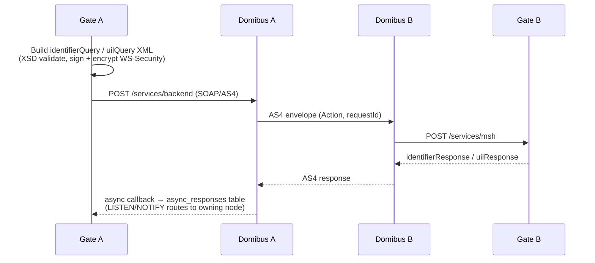

# EPIC 10 — eDelivery AS4 Integration

> Part of [Theme 4](theme_4_en.md)

**AS A** eFTI Gate  
**I WANT** to communicate with other EU gates via the eDelivery AS4 protocol  
**SO THAT** cross-border eFTI data exchange uses the standard EU infrastructure

**References:**
- [eDelivery XSD](../efti-analysis/xsd/edelivery/gate.xsd) — eDelivery message schema
- [DB Schema](../specs/db/README.md) — async_responses table schema
- [Data Transformations](../specs/data-transformations.md) — JSON ↔ AS4 envelope wrapping; SOAP fault handling
- [Diagrams](../specs/diagrams/seq-14-gate-to-gate-search.mmd) — Gate-to-gate AS4 search; [seq-16](../specs/diagrams/seq-16-mtls-fast-protocol.mmd) — mTLS fast-protocol alternative
- [Errors](../specs/errors.json) — `GATEWAY_UNAVAILABLE`, `GATE_TIMEOUT`, `EDELIVERY_ERROR`
- [RA §4 Protocol Architecture](../architecture/eFTI-Gate-Reference-Architecture.md#4-protocol-architecture-generic-envelope--variable-payload) — Generic envelope and AS4 protocol model
- [RA §5.1 Identifier Query](../architecture/eFTI-Gate-Reference-Architecture.md#51-identifier-query-cross-border-search) — Cross-border AS4 message flow

**AS4 message exchange at a glance:**

See `seq-14-gate-to-gate-search.mmd` and `seq-16-mtls-fast-protocol.mmd` for full detail.

#### Acceptance Criteria

##### Inbound messages

**Happy path:**
- [ ] `POST /services/msh` accepts SOAP/AS4 message; decrypts and parses per AS4 profile
- [ ] `identifierQuery` → processes search; returns `identifierResponse`
- [ ] `uilQuery` → retrieves dataset from platform; returns `uilResponse`
- [ ] `postFollowUpRequest` → forwards follow-up to platform; returns acknowledgement
- [ ] `saveIdentifiersRequest` → stores identifiers

**Edge cases:**
- [ ] Unknown `Action` field → error returned to sender; event logged WARN; not silently ignored
- [ ] Unknown `CompressionType` → error returned; not silently decompressed
- [ ] Incoming message with invalid AS4 signature → rejected; event logged WARN with sender Party ID

**Error handling:**
- [ ] SOAP parsing failure → AS4 fault returned with error code and description

**Technical constraints:**
- [ ] MUST use a protocol-compatible AS4 access point — either the embedded AS4 implementation (Askend baseline) or [Domibus](https://ec.europa.eu/digital-building-blocks/sites/display/DIGITAL/Domibus). Operator's choice per `non-functional.md` §4. No bespoke / non-conformant AS4 stack.

**Technical artifacts:**
- [ ] Diagram: `seq-14-gate-to-gate-search.mmd`

##### Outbound messages

**Happy path:**
- [ ] Gate-to-gate client logs each outbound: gate ID, protocol (Fast/eDelivery), URL, duration ms, HTTP status, error
- [ ] eDelivery client logs: destination Party ID, requestId, duration ms, response status
- [ ] Fast protocol: `POST {gate.eDeliveryUrl}` with mTLS (X-API-Key removed)
- [ ] eDelivery AS4: SOAP message encrypted and signed (WS-Security) before sending

**Error handling:**
- [ ] Outbound eDelivery failure → logged ERROR with full context; caller receives `502 Bad Gateway`

##### Protocol envelope and request generation

**Happy path:**
- [ ] eFTI Gate generates request envelope (identifierQuery, uilQuery XML) conforming to `xsd/edelivery.xsd`
- [ ] Dataset content forwarded **unchanged** — eFTI Gate is content-agnostic
- [ ] Every outbound request includes `requestId` (UUID v4) for audit trail
- [ ] Envelope validated against XSD before sending — invalid XML returns error, not silent failure
- [ ] Operates across all transport modes without mode-specific logic

**Edge cases:**
- [ ] XSD validation of generated envelope fails → `500` logged ERROR; not forwarded to client

**Technical constraints:**
- [ ] WS-Security signing certificate loaded from K8s Secret at runtime — never in container image

##### Asynchronous response handling

**Happy path:**
- [ ] Async responses (uilResponse, identifierResponse) delivered via PostgreSQL LISTEN/NOTIFY — no session affinity needed
- [ ] Handler runs on all nodes; each node processes only responses matching its `requestId`

**Edge cases:**
- [ ] Async response arrives after SSE stream closed → discarded; logged DEBUG

**Technical artifacts:**
- [ ] DB schema: `async_responses (request_id, gate_id, payload, received_at)`
