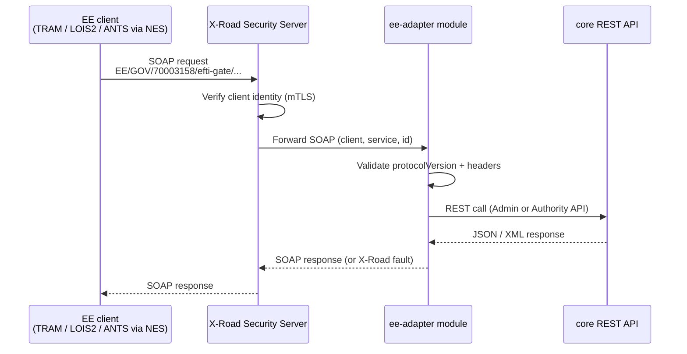

# EPIC 11 — X-Road Integration (EE extension)

> Part of [Theme 4](theme_4_en.md)

**AS AN** Estonian government system or transport platform  
**I WANT** to communicate with the eFTI gate via X-Road  
**SO THAT** the integration uses the standard Estonian national data exchange layer

**References:**
- [RA §9.1 Platform API](../architecture/eFTI-Gate-Reference-Architecture.md#91-platform-api) — Platform API endpoints exposed via X-Road
- [RA §1 System Actors](../architecture/eFTI-Gate-Reference-Architecture.md#1-system-actors--components) — EE-specific actor roles (X-Road, ANTS)

**X-Road integration at a glance:**

`ee-adapter` calls `core` only via the published REST API; no internal core dependency.

#### Acceptance Criteria

**Happy path:**
- [ ] X-Road service endpoint implemented in `ee-adapter` module — zero X-Road references in core module
- [ ] eFTI platform registration available as X-Road service: `EE/GOV/70003158/efti-gate/registerPlatform/v1`
- [ ] X-Road message headers validated: `client`, `service`, `id`, `protocolVersion`
- [ ] Registration request forwarded to core Admin REST API
- [ ] Response returned as valid X-Road SOAP envelope
- [ ] Works with X-Road Security Server v6.x test environment

**Edge cases:**
- [ ] Unknown `protocolVersion` → SOAP fault `"faultCode": "Client.unknownVersion"`
- [ ] `client` identity not authorised → `403 Forbidden` SOAP fault

**Error handling:**
- [ ] Core REST API returns `4xx/5xx` → error wrapped in X-Road SOAP fault

**Technical constraints:**
- [ ] `ee-adapter` module calls core only via published REST API — no internal dependency on core module code
- [ ] MUST NOT modify `core` module to add X-Road support

**Technical artifacts:**
- [ ] WSDL: `efti-xroad.wsdl`
- [ ] Diagram: `seq-10-platform-registration.mmd`

##### Estonian competent authorities

**Happy path:**
- [ ] Each authority chooses: eDelivery AS4 or X-Road — both supported
- [ ] X-Road client identity validated by X-Road Security Server — no separate Bearer token needed
- [ ] Subset access authority-specific: TRAM/LOIS2 may only query AWB/manifest subsets — road transport filtered out at gate

**Edge cases:**
- [ ] TRAM queries road transport subset `EU02` via X-Road → `403 Forbidden` SOAP fault with `"detail": "Subset EU02 not permitted for authority 'TRAM'"`

##### ANTS integration

**Happy path:**
- [ ] eFTI Gate exposes high-throughput endpoint for ANTS: existence check only — no full data returned
- [ ] ANTS response: `{"registered": true}` or `{"registered": false}`; response time < 1 second at p95
- [ ] ANTS integration via X-Road through NES intermediary (MTA internal system)

**Edge cases:**
- [ ] ANTS query for plate not in local registry → `{"registered": false}` — does NOT trigger broadcast (ANTS is local-only)

**Technical constraints:**
- [ ] ANTS endpoint: read-only, existence check, index-only scan on `vehicle_plate`
- [ ] Rationale: ANTS may send > 10 000 queries/hour during border operations

##### ADR 1000-point rule

**Happy path:**
- [ ] eFTI Gate calculates ADR 1.1.3.6 dangerous goods point total per vehicle (UN number × hazard class × net mass)
- [ ] Score ≥ 1000: full ADR; < 1000: partial (ADR 1.1.3.6 exemptions); = 0: full exemption
- [ ] ADR score appended to `EU05` subset response

**Edge cases:**
- [ ] `supportsAdrCalculation=true` on platform → gate skips calculation; platform value used as-is
- [ ] `supportsAdrCalculation=false` → gate performs calculation and appends
