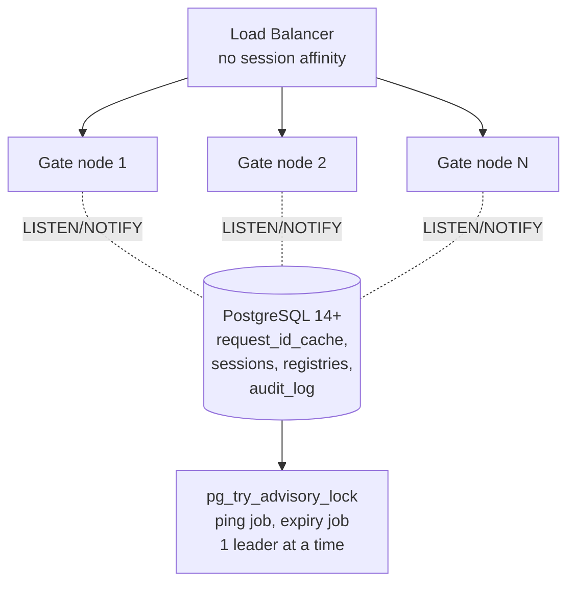

# EPIC 12 — Scalability and Statelessness

> Part of [Theme 5](theme_5_en.md)

**AS A** DevOps engineer  
**I WANT** the gate to run on multiple nodes without shared memory  
**SO THAT** the system is horizontally scalable and tolerates a single node failure

**References:**
- [DB Schema](../specs/db/README.md) — `request_id_cache` deduplication table, `audit_log` table
- [RA §7.1 Logical Component Layers](../architecture/eFTI-Gate-Reference-Architecture.md#71-logical-component-layers) — Stateless application layer and shared database architecture

**Multi-node topology at a glance:**

See `arch-01-multi-node-deployment.mmd` and `seq-15-gate-registry-sync.mmd` for full detail.

#### Acceptance Criteria

##### Registry synchronisation

**Happy path:**
- [ ] Registry changes → PostgreSQL NOTIFY; all nodes update in-memory copy within 500 ms
- [ ] After node restart, registry loaded from database — no data loss

**Edge cases:**
- [ ] Node receives NOTIFY for unknown registry entry → loads from database
- [ ] Database unreachable on startup → node does not start; readiness probe returns `503`

**Technical constraints:**
- [ ] MUST use PostgreSQL LISTEN/NOTIFY — no Redis, Hazelcast, or other shared-memory dependencies
- [ ] Rationale: minimises infrastructure dependencies (PostgreSQL already required)

##### Request ID duplicate checking

**Happy path:**
- [ ] `X-Request-ID` uniqueness checked in shared database table — checked across all nodes
- [ ] Duplicate detection window: 600 seconds
- [ ] Duplicate from any node → `400 Bad Request` with `"detail": "Duplicate X-Request-ID within 600 seconds"`

**Edge cases:**
- [ ] Same ID arrives at 2 nodes within 1 ms → database unique constraint prevents both succeeding; one gets `400`

**Technical constraints:**
- [ ] DB: `request_id_cache (request_id VARCHAR PK, seen_at TIMESTAMPTZ, expires_at TIMESTAMPTZ)` with 10-minute TTL (per `schema.sql`)

##### Admin auth state

**Happy path:**
- [ ] Admin session stored in database — not node-local memory; works correctly behind load balancer

**Edge cases:**
- [ ] Session expires → `401 Unauthorized` on next request; admin redirected to login page

##### Leader election

**Happy path:**
- [ ] Ping job runs on exactly 1 node (database advisory lock)
- [ ] Expiry job runs on exactly 1 node

**Edge cases:**
- [ ] Leader node fails mid-job → lock released; another node takes over within next scheduling interval

**Technical constraints:**
- [ ] Leader election: `pg_try_advisory_lock` database advisory lock

##### Database migrations

**Happy path:**
- [ ] Migrations use Flyway locking — no conflicts when multiple nodes start simultaneously
- [ ] Migration lock released even if application crashes

**Technical constraints:**
- [ ] MUST use Flyway OR Liquibase — no custom migration scripts
- [ ] Rationale: procurement requirement "Tarkvara tehnilise analüüsi nõuded"

##### Database design

**Happy path:**
- [ ] All tables and fields have English comments — schema understandable to all developers
- [ ] All foreign key fields are indexed
- [ ] `audit_log` table (action-level audit trail): row_id, user_id, action, resource, resource_id, recorded_at

**Technical artifacts:**
- [ ] DB schema ERD in documentation
- [ ] Technical constraints: PostgreSQL 14+, `pg_trgm` extension for fuzzy plate search
