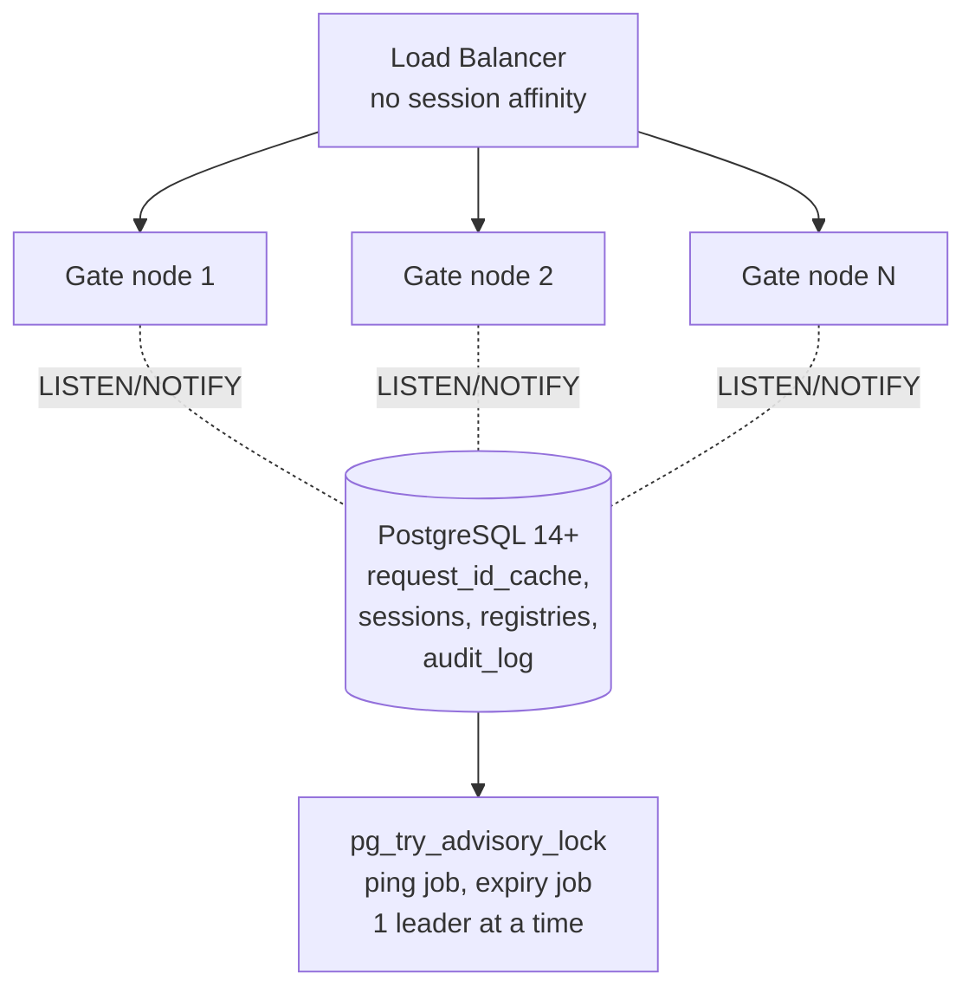

# EPIC 12 — Scalability and Statelessness

> Part of [Theme 5](theme_5_en.md)

**AS A** DevOps engineer  
**I WANT** the gate to run on multiple nodes without shared memory  
**SO THAT** the system is horizontally scalable and tolerates a single node failure

**References:**
- [DB Schema](../specs/db/README.md) — `request_id_cache` deduplication table, `audit_log` table
- [RA §7.1 Logical Component Layers](../architecture/eFTI-Gate-Reference-Architecture.md#71-logical-component-layers) — Stateless application layer and shared database architecture

**Multi-node topology at a glance:**

See `arch-01-multi-node-deployment.mmd` and `seq-15-gate-registry-sync.mmd` for full detail.

#### Acceptance Criteria

##### Registry synchronisation

**Happy path:**
- [ ] Registry changes → PostgreSQL NOTIFY; all nodes update in-memory copy within 500 ms
- [ ] After node restart, registry loaded from database — no data loss

**Edge cases:**
- [ ] Node receives NOTIFY for unknown registry entry → loads from database
- [ ] Database unreachable on startup → node does not start; readiness probe returns `503`

**Technical constraints:**
- [ ] MUST use PostgreSQL LISTEN/NOTIFY — no Redis, Hazelcast, or other shared-memory dependencies
- [ ] Rationale: minimises infrastructure dependencies (PostgreSQL already required)

##### Request ID duplicate checking

**Happy path:**
- [ ] `X-Request-ID` uniqueness checked in shared database table — checked across all nodes
- [ ] Duplicate detection window: 600 seconds
- [ ] Duplicate from any node → `400 Bad Request` with `"detail": "Duplicate X-Request-ID within 600 seconds"`

**Edge cases:**
- [ ] Same ID arrives at 2 nodes within 1 ms → database unique constraint prevents both succeeding; one gets `400`

**Technical constraints:**
- [ ] DB: `request_id_cache (request_id VARCHAR PK, seen_at TIMESTAMPTZ, expires_at TIMESTAMPTZ)` with 10-minute TTL (per `schema.sql`)

##### Admin auth state

**Happy path:**
- [ ] Admin auth is **stateless** — every request carries a TARA-issued JWT; the gate validates it as an OAuth 2.0 Resource Server. No DB-stored admin session, no `session_id` cookie, no sticky-session requirement.
- [ ] Revocation is multi-node-consistent because `sessions` (the JWT denylist: `jti, revoked_at, reason`) is a shared DB table. Every node sees the same denylist on the next request without coordination.

**Edge cases:**
- [ ] JWT `exp` past → `401 TOKEN_INVALID` on next request; the UI re-runs the TARA OIDC login flow.
- [ ] JWT `jti` added to denylist via `POST /api/v1/auth/logout` or `POST /api/v1/users/{userId}/revoke-token` → all nodes reject the same JWT on the next request.

##### CronManager-driven scheduled jobs

**Happy path:**
- [ ] Archive (`/api/v1/admin/archive`), expire (`/api/v1/admin/expire-identifiers`), and ping-gates (`/api/v1/admin/ping-gates`) are all driven by external CronManager (Epic 26). The gate process never schedules its own jobs.
- [ ] Multi-node concurrency guard: each handler takes a distinct `pg_try_advisory_lock(<job-key>)` at entry. If the lock is held, return `409 Conflict`. Lock survives node crashes (per-connection in PostgreSQL).

**Edge cases:**
- [ ] Two CronManager instances racing the same admin endpoint → second call gets 409 immediately; CronManager's retry policy backs off.

**Technical constraints:**
- [ ] Concurrency: `pg_try_advisory_lock` with one distinct numeric key per job (archive / expire / ping-gates).

##### Database migrations

**Happy path:**
- [ ] `schema.sql` is the v0 baseline applied once against an empty database; subsequent changes go through Liquibase changesets at `gate/db/changelog/`.
- [ ] Migration lock released even if the application crashes (Liquibase's built-in lock semantics).

**Technical constraints:**
- [ ] MUST use **Liquibase** (per `non-functional.md` §4 — pinned migration tool).

##### Database design

**Happy path:**
- [ ] All tables and fields have English `COMMENT ON …` (schema.sql).
- [ ] Append-only: every operational table is INSERT-only at the GRANT layer. No `_history` companion tables; the operational table itself is its own change log.
- [ ] Every logical foreign-key column (`created_by`, `dataset_id`, `gate_id`, `platform_id`, `user_id`) carries a btree index on `(logical_id, created_at DESC)` for the canonical `SELECT DISTINCT ON` lookup pattern. There are no DB-level FK CONSTRAINTs between operational tables (the schema is FK-light by design — see `db/README.md` §Foreign keys).
- [ ] `audit_log` table (action-level audit trail): row_id, user_id, action, resource, resource_id, ip_address, details JSONB, recorded_at; preserved indefinitely on the live DB (≥ 7 years; never archived).

**Technical artifacts:**
- [ ] DB schema canonical: `docs/specs/db/schema.sql` with full `COMMENT ON` coverage.
- [ ] Technical constraints: PostgreSQL 14+, extensions `uuid-ossp`, `citext`, `pg_trgm`, `btree_gin`.
