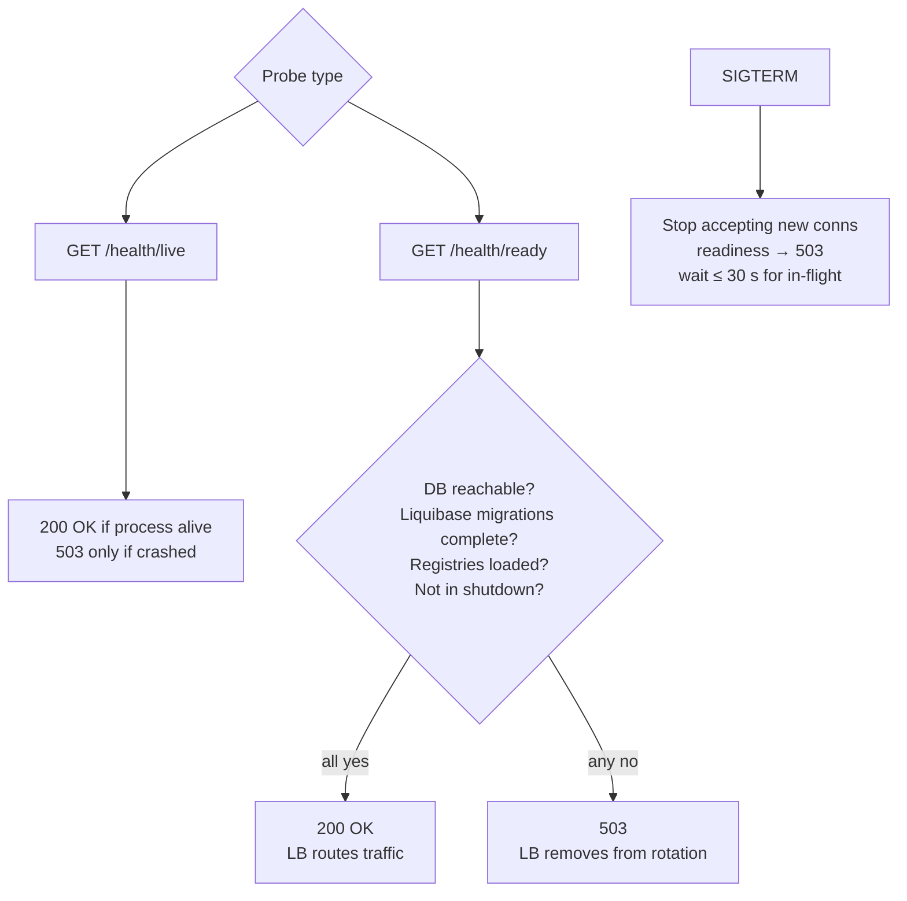

# EPIC 13 — Health Checks and Graceful Shutdown

> Part of [Theme 5](theme_5_en.md)

**AS A** orchestrated deployment environment  
**I WANT** the gate to expose health check endpoints and handle graceful shutdown  
**SO THAT** the deployment platform can manage the application lifecycle correctly

**Reference:** [RA §7.1 Logical Component Layers](../architecture/eFTI-Gate-Reference-Architecture.md#71-logical-component-layers) — Health check endpoints in application layer

**Liveness vs readiness at a glance:**

#### Acceptance Criteria

**Happy path:**
- [ ] `GET /health/live` — `200 OK` when running; `503` if crashed
- [ ] `GET /health/ready` — `200 OK` only when: database connection OK, **Liquibase migrations complete** (per `non-functional.md` §4 — pinned migration tool), in-memory registries (`gates`, `platforms`, `authorities`) loaded from latest rows, application not in shutdown; `503` otherwise
- [ ] Liveness and readiness are **separate** endpoints — not the same `/health`
- [ ] `SIGTERM` received → stop accepting new connections; wait for in-flight requests (max 30 seconds); then shut down
- [ ] During graceful shutdown, readiness returns `503` — load balancer removes node from traffic

**Edge cases:**
- [ ] Database connection lost mid-run → readiness `503`; liveness still `200` (app running but degraded)
- [ ] In-flight request takes > 30 seconds → force-shutdown after 30 s; request receives connection reset

**Technical constraints:**
- [ ] Graceful shutdown timeout: 30 seconds (configurable via `SHUTDOWN_TIMEOUT_SECONDS`)
- [ ] Kubernetes: `livenessProbe` → `/health/live`, `readinessProbe` → `/health/ready`, `terminationGracePeriodSeconds: 35`

**Technical artifacts:**
- [ ] OpenAPI: `GET /health/live`, `GET /health/ready`
- [ ] Kubernetes deployment manifest with probe and graceful shutdown config

---
