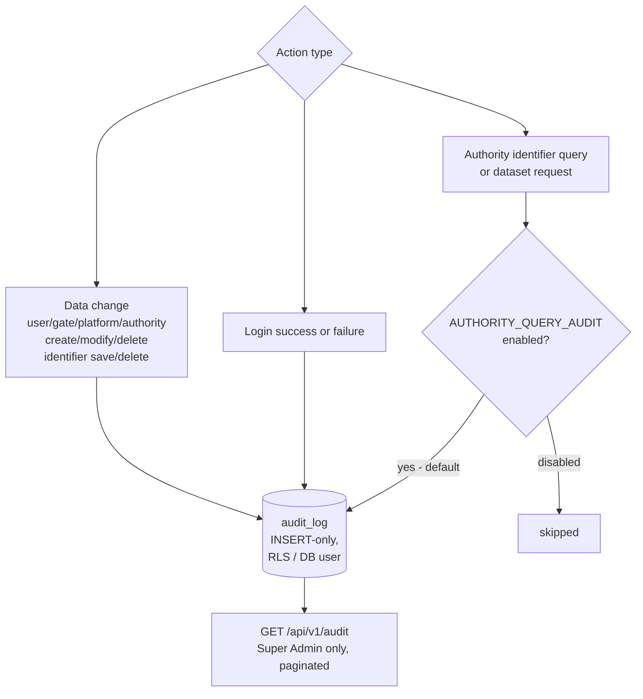

# EPIC 15 — Audit and GDPR Compliance

> Part of [Theme 6](theme_6_en.md)

**AS A** GDPR data controller  
**I WANT** data changes and admin actions to be logged, and authority query auditing to be configurable  
**SO THAT** the Gate complies with GDPR Article 30 requirements and jurisdiction-specific obligations

**References:** 
- [Permissions Matrix](../specs/permissions-matrix.md) — Authorization decisions and audit logging requirements
- [Logging Specification](../specs/logging-spec.md) — Complete logging format and audit trail specification

> **Note:** EU Regulations 2024/1942 and 2025/2243 do not explicitly require persistent audit logging of authority queries at the gate level. Member states must decide based on their own jurisdictional requirements. This epic implements a reasonable default behaviour with configurability.

**Audit write paths at a glance:**

#### Acceptance Criteria

##### Mandatory audit log (data changes)

**Happy path:**
- [ ] `audit_log` table: `id`, `userId`, `action`, `resource`, `resourceId`, `timestamp`, `ipAddress`, `details`
- [ ] Audit log is immutable — append-only (no UPDATE/DELETE rights for the application user)
- [ ] Always-logged events:
  - Successful and failed logins (user ID, IP, method)
  - Admin actions: user creation/modification/deletion
  - Gate/Platform/Authority creation/modification/deletion
  - Identifier save and deletion (by platform)
- [ ] `GET /api/v1/audit` — Super Admin can query the audit log (paginated)
- [ ] Sensitive data (passwords, tokens) never stored in audit log

**Edge cases:**
- [ ] Audit log write fails → application logs ERROR server-side; the triggering operation is NOT rolled back (audit failure must not cause service failure)
- [ ] Audit log query with large date range → response paginated; max 1000 rows per page

**Technical constraints:**
- [ ] `audit_log` table: PostgreSQL row-level security or separate DB user with INSERT-only permission
- [ ] Rationale: GDPR Art. 30 requires immutable processing record

##### Configurable authority query audit

**Happy path:**
- [ ] Logging of authority requests toggled via `AUTHORITY_QUERY_AUDIT=enabled|disabled` environment variable
- [ ] When enabled, logged fields: user ID, UIL, subsets, timestamp, IP address
- [ ] Member state operator responsible for meeting jurisdictional requirements

**Edge cases:**
- [ ] `AUTHORITY_QUERY_AUDIT` not set → defaults to `enabled` (fail-safe default)

**Technical artifacts:**
- [ ] OpenAPI: `GET /api/v1/audit`
- [ ] DB schema: `audit_log` table

---
