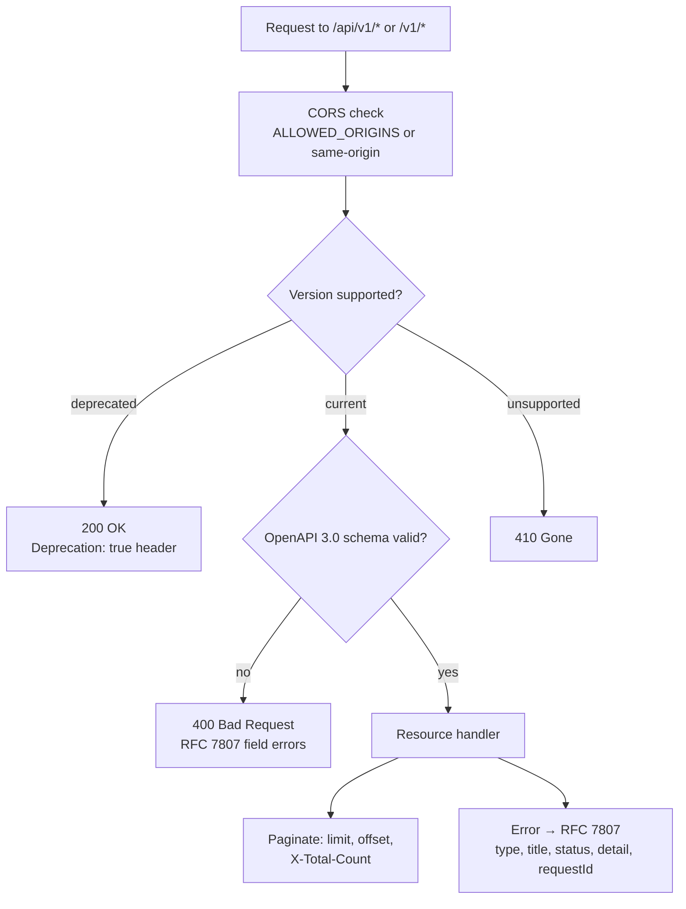

# EPIC 19 — API Standardisation

> Part of [Theme 8](theme_8_en.md)

**AS A** integration partner  
**I WANT** a well-documented, versioned API  
**SO THAT** I can integrate with the gate without direct technical support

**References:**
- [Error formats](../specs/errors.json) — RFC 7807 error catalogue used across all endpoints
- [RA §9 API Reference](../architecture/eFTI-Gate-Reference-Architecture.md#9-api-reference) — API endpoint reference for versioning and standardisation

**Request handling at a glance:**

Swagger UI: `/api/openapi`, `/v1/openapi`.

#### Acceptance Criteria

**Happy path:**
- [ ] OpenAPI 3.0+ specification automatically generated from source code
- [ ] Swagger UI available at `/api/openapi` and `/v1/openapi` — including ability to test authentication
- [ ] URL-based API versioning: `/api/v1/` (admin), `/v1/` (eFTI) — existing URLs redirected
- [ ] Version deprecation policy: old version supported ≥ 6 months after new version released
- [ ] CORS policy configured: `ALLOWED_ORIGINS` environment variable; default same-origin in production
- [ ] Identifier search results paginated: `limit`, `offset` parameters; response includes `X-Total-Count`

**Edge cases:**
- [ ] `ALLOWED_ORIGINS` not set → CORS defaults to same-origin; not `*` (open)
- [ ] Client requests deprecated API version → `200 OK` with `Deprecation: true` response header and migration link

**Technical artifacts:**
- [ ] OpenAPI spec committed to repository as `openapi.yaml`
