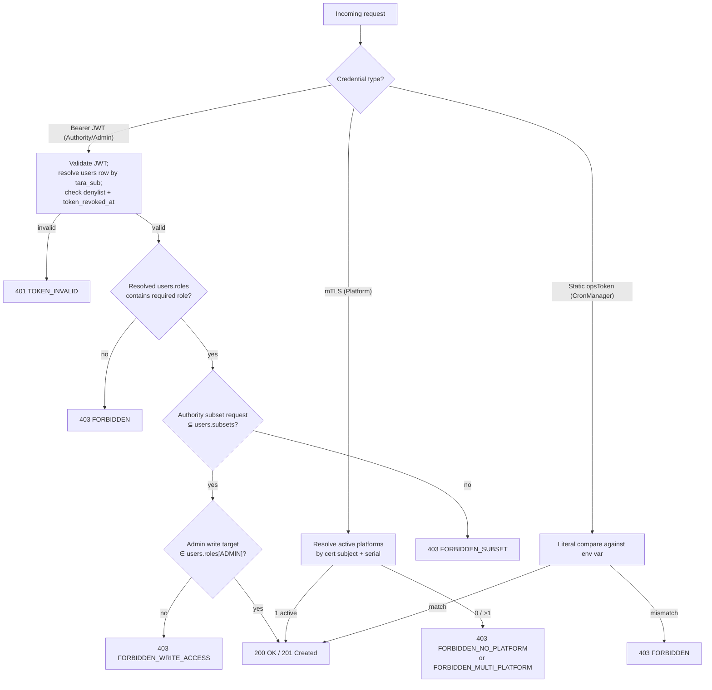

# EPIC 1 — User Management and RBAC

> Part of [Theme 1](theme_1_en.md)

**AS A** system administrator  
**I WANT** role-based access control with resource-level filtering  
**SO THAT** each user can only see and manage the resources they are permitted to access

## Spec anchors

| Contract surface | Reference |
|---|---|
| **API operations** | `POST/GET/PUT/DELETE /api/v1/users[/{userId}]` |
| | `POST /api/v1/users/{userId}/revoke-token` |
| | `POST /api/v1/auth/logout` |
| | `POST /api/v1/auth/local-token` |
| | Full request / response / error shapes: [`openapi.yaml`](../specs/openapi.yaml) |
| **Schema** | `users` (`tara_sub`, `roles JSONB` restricted to `AUTHORITY` / `ADMIN`, `subsets TEXT[]`, `secret_hash TEXT NULL`, `token_revoked_at TIMESTAMPTZ`) |
| | `sessions` (JWT denylist) |
| | Partial index `(tara_sub, created_at DESC) WHERE tara_sub IS NOT NULL` |
| | Full schema: [`db/schema.sql`](../specs/db/schema.sql) |
| **Error codes** | `TOKEN_INVALID` |
| | `FORBIDDEN` |
| | `FORBIDDEN_SUBSET` |
| | `FORBIDDEN_WRITE_ACCESS` |
| | `FORBIDDEN_NO_PLATFORM` |
| | `FORBIDDEN_MULTI_PLATFORM` |
| | `BAD_REQUEST_GENERAL` |
| | Full catalog: [`errors.json`](../specs/errors.json) |
| **Access-check rules** | Full path × role × subset matrix: [`permissions-matrix.md`](../specs/permissions-matrix.md) |
| **Auth flow** | [`flow-02-authorization-check.mmd`](../specs/diagrams/flow-02-authorization-check.mmd) (full decision tree) |

## Authorisation at a glance

## Acceptance Criteria

### Role management

**Business rules:**
- [ ] A new user inherits **only** the creator's roles. Exception: the Super Admin role can be granted only by an existing Super Admin.
- [ ] Listing users: Super Admin sees all; regular admin sees only users whose roles intersect their own.
- [ ] Deleting a user requires the target to be visible to the admin (same scope as listing).
- [ ] A user may be assigned multiple roles, and multiple Party IDs (`scope-IDs`) under a single role.
- [ ] An authority user's `subsets` must be a subset of the parent authority's `subsets`.
- [ ] An admin cannot delete their own account.
- [ ] `taraSub` is unique across **active** rows: creating a user with an already-active `taraSub` is rejected.

**Audit:**
- [ ] Every authorisation denial is logged with: caller user id, endpoint, denial reason, source IP, timestamp.

### Access control

**Path → role mapping** (canonical table in [`permissions-matrix.md`](../specs/permissions-matrix.md) §1; summary here):

- [ ] `/api/v1/...` (Admin API) — caller's resolved `users.roles` must contain `ADMIN`.
- [ ] `/v1/identifiers/{identifier}`, `/v1/dataset/...`, `/v1/follow-up/{gateId}/...` (Authority API) — caller's resolved `users.roles` must contain `AUTHORITY`.
- [ ] `/v1/identifiers/{datasetId}` and the other Platform-API routes — mTLS-only; the cert subject DN + serial must resolve to exactly one active `platforms` row.
- [ ] Admin write operations check **both** that the caller has `ADMIN` AND that the target entity id is in the caller's `users.roles[ADMIN]` scope-IDs.

**Denial scenarios** (status codes and `efti.error.code` values in [`errors.json`](../specs/errors.json)):

- [ ] Authority-role JWT calling an Admin endpoint.
- [ ] Missing `Authorization` header on a JWT-protected route.
- [ ] Expired JWT (TARA-side `exp` past).
- [ ] Tampered JWT signature — no internal detail leaked to the caller.
- [ ] JWT `sub` does not resolve to any active `users` row — caller must be provisioned by an admin first.
- [ ] JWT `jti` is in the `sessions` denylist (per-token revocation).
- [ ] `jwt.iat` predates the resolved user's `users.token_revoked_at` (per-user broadcast revocation).
- [ ] Platform mTLS cert subject + serial resolve to 0 active rows.
- [ ] Platform mTLS cert subject + serial resolve to >1 active row (operator misconfiguration).

## Authentication contract

- [ ] Primary authentication is **TARA OIDC JWT** (Estonian state authentication broker), validated as an OAuth 2.0 Resource Server: RS256, JWKS fetched from `TARA_OIDC_DISCOVERY_URL`, claims checked: `iss`, `aud`, `exp`, `sub` (Estonian PIC). **Permission claims come from the resolved `users` row, not from the JWT** — the gate's authorisation snapshot can change after the token was minted.
- [ ] `users.tara_sub` (= JWT `sub`) is the auth identifier. An admin `POST` creates the row first; the gate has a row to bind to on the user's first inbound JWT.
- [ ] No gate-issued JWTs on the primary (TARA) path; TARA owns expiry. The gate carries no `JWT_EXPIRY_SECONDS` setting on the TARA path. The break-glass endpoint `POST /api/v1/auth/local-token` issues a gate-signed JWT with a hard-coded 600 s TTL (`BREAK_GLASS_JWT_TTL_SECONDS`); default-disabled.
- [ ] Bcrypt is used **only** on the single break-glass local-admin row's `users.secret_hash`. All other users have `secret_hash IS NULL`.

## Break-glass and revocation contract

- [ ] The break-glass local-admin row in `users` carries the reserved literal `tara_sub='local-admin'` (lower-case; never collides with a PIC). The break-glass JWT issued by `POST /api/v1/auth/local-token` carries `sub='local-admin'`, so the gate's `tara_sub` lookup is uniform across TARA and break-glass paths.
- [ ] `POST /api/v1/auth/logout` revokes one specific JWT by appending its `jti` to the `sessions` denylist; idempotent.
- [ ] `POST /api/v1/users/{userId}/revoke-token` revokes every currently-issued JWT for that user by appending a new `users` row carrying `token_revoked_at = NOW()`. Append-only: the previous row is unchanged. The user's next request requires re-authentication via TARA (or break-glass).

## Rationale

Identity comes from the cert (Platform), the TARA `sub` claim resolved against `users.tara_sub` (Authority / Admin / break-glass), or the static ops token (CronManager). Authorisation comes from the resolved DB row (`platforms.id` for Platform; `users.roles` / `users.subsets` for Authority / Admin) — never from the JWT directly, because the gate's authorisation snapshot can change after the JWT was minted.
