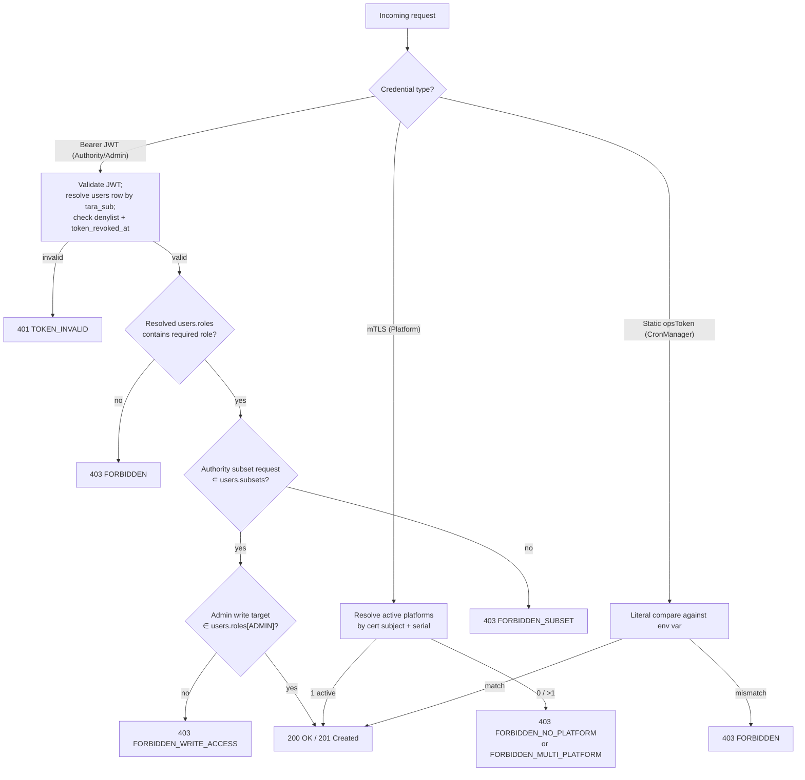

# EPIC 1 — User Management and RBAC

> Part of [Theme 1](theme_1_en.md)

**AS A** system administrator  
**I WANT** role-based access control with resource-level filtering  
**SO THAT** each user can only see and manage the resources they are permitted to access

**Reference:** [Permissions Matrix](../specs/permissions-matrix.md) — Complete authorization model and role-based access control specification

**Authorisation at a glance:**

See `flow-02-authorization-check.mmd` for the full decision tree.

#### Acceptance Criteria

##### Role management

**Happy path:**
- [ ] `POST /api/v1/users` — admin creates user; new user receives only creator's roles (except Super Admin); response `201 Created` with user ID
- [ ] `GET /api/v1/users` — Super Admin sees all users; regular admin sees only users within their own roles; response paginated (`limit`, `offset`, `X-Total-Count`)
- [ ] `DELETE /api/v1/users/:userId` — admin deletes another user visible to them; response `204 No Content`
- [ ] A user can be assigned multiple roles and multiple Party IDs under a single role
- [ ] Creating authority user with `subsets` that are subset of Authority's `subsets` → `201 Created`

**Edge cases:**
- [ ] Admin attempts to assign Super Admin role → `403 Forbidden` with `"detail": "Super Admin role cannot be assigned by regular admin"`
- [ ] Admin attempts to delete own account → `400 Bad Request` with `code: BAD_REQUEST_GENERAL`, `"detail": "Cannot delete your own account"`
- [ ] Creating authority user with `subsets` not in Authority's allowed list → `400 Bad Request` with `"detail": "Subset 'EU04' not permitted for authority 'mta@mta.ee'"`
- [ ] `POST /api/v1/users` with `taraSub` already used by an active row → `409 Conflict`

**Error handling:**
- [ ] `POST /api/v1/users` with missing required field (e.g. no `roles`) → `400 Bad Request` RFC 7807 with field-level detail
- [ ] All authorisation denials logged: user ID, endpoint, reason, IP address, timestamp

**Technical constraints:**
- [ ] Primary auth is **TARA OIDC JWT** (Estonian state authentication broker). Validated as OAuth 2.0 Resource Server: RS256, JWKS from `TARA_OIDC_DISCOVERY_URL`, claims `iss`, `aud`, `exp`, `sub` (Estonian PIC); permission claims read from the resolved `users` row, not from JWT.
- [ ] User `taraSub` (= JWT `sub` claim) is the auth identifier. Admin POST creates the row carrying `taraSub`; on first inbound JWT the gate has a row to bind to.
- [ ] No gate-issued JWTs on the primary path; TARA owns expiry. The gate does NOT carry a `JWT_EXPIRY_SECONDS` configuration on the TARA path. Break-glass `/api/v1/auth/local-token` issues a gate-signed JWT with hardcoded 600 s TTL (`BREAK_GLASS_JWT_TTL_SECONDS`); default-disabled.
- [ ] Bcrypt is used **only** on the single break-glass local-admin row in `users.secret_hash`. All other users have `secret_hash IS NULL`.
- [ ] Revocation: JWT `jti` written to `sessions` denylist by `POST /api/v1/auth/logout` or `POST /api/v1/users/{userId}/revoke-token`; the access-check layer rejects any JWT whose `jti` is in the denylist AND whose `exp` is still in the future.

**Technical artifacts:**
- [ ] OpenAPI: `POST /api/v1/users`, `GET /api/v1/users`, `GET /api/v1/users/{userId}`, `PUT /api/v1/users/{userId}`, `DELETE /api/v1/users/{userId}`, `POST /api/v1/users/{userId}/revoke-token`
- [ ] DB schema: `users` table with `tara_sub TEXT`, `roles JSONB` (only `AUTHORITY` and `ADMIN` keys), `subsets TEXT[]`, `secret_hash TEXT NULL`; partial index `(tara_sub, created_at DESC) WHERE tara_sub IS NOT NULL`.

##### Access control

**Happy path:**
- [ ] `/api/v1/...` endpoints accessible only to JWTs whose resolved `users` row has `roles ∋ ADMIN` → `200 OK`
- [ ] `/v1/identifiers/{identifier}`, `/v1/dataset/...`, `/v1/follow-up/...` accessible only to JWTs whose resolved `users` row has `roles ∋ AUTHORITY` → `200 OK`
- [ ] `/v1/identifiers/{datasetId}` (and other `/v1/...` Platform endpoints) accessible only via mTLS where the cert subject DN + serial resolve to exactly one active `platforms` row → `200 OK`
- [ ] Admin write checks both that the JWT user has `ADMIN` role AND that the target entity id is in `users.roles[ADMIN]` (`checkWriteAccess`)

**Edge cases:**
- [ ] Authority-role JWT calls Admin endpoint → `403 FORBIDDEN`
- [ ] Request without `Authorization` header on a JWT-protected route → `401 Unauthorized` RFC 7807
- [ ] Expired JWT (TARA-side `exp` past) → `401 TOKEN_INVALID`
- [ ] Tampered JWT signature → `401 TOKEN_INVALID` — no internal detail exposed
- [ ] JWT `sub` does not resolve to any active `users` row → `401 TOKEN_INVALID` with `detail: "no provisioned user"`; admin must POST `/api/v1/users` first
- [ ] JWT `jti` is in the `sessions` denylist → `401 TOKEN_INVALID` with `detail: "token has been revoked"` (per-token revocation, e.g. via `POST /api/v1/auth/logout`)
- [ ] `jwt.iat` predates the resolved user's `users.token_revoked_at` → `401 TOKEN_INVALID` with `detail: "token has been revoked"` (per-user broadcast revocation, e.g. via `POST /api/v1/users/{userId}/revoke-token`)
- [ ] Platform mTLS cert presented but cert subject + serial resolve to 0 active `platforms` rows → `403 FORBIDDEN_NO_PLATFORM`
- [ ] Platform mTLS cert subject + serial resolve to >1 active `platforms` row (config error) → `403 FORBIDDEN_MULTI_PLATFORM`

**Break-glass and revocation contract:**
- [ ] The break-glass local-admin row in `users` carries the reserved literal `tara_sub='local-admin'` (lower-case; never collides with a PIC). The break-glass JWT issued by `POST /api/v1/auth/local-token` carries `sub='local-admin'` so the gate's `tara_sub` lookup is uniform across TARA and break-glass paths.
- [ ] `POST /api/v1/auth/logout` revokes one specific JWT by appending its `jti` to the `sessions` denylist; idempotent.
- [ ] `POST /api/v1/users/{userId}/revoke-token` revokes every currently-issued JWT for that user by appending a new `users` row carrying `token_revoked_at = NOW()`. Append-only: the previous row is unchanged. The next request from that user requires re-authentication via TARA (or break-glass).

**Rationale:** Identity comes from the cert (Platform), the TARA `sub` claim resolved against `users.tara_sub` (Authority / Admin / break-glass), or the static ops token (CronManager). Authorisation comes from the resolved DB row (`platforms.id` for Platform; `users.roles` / `users.subsets` for Authority / Admin); never from the JWT directly, because the gate's authorisation snapshot can change after the JWT was minted.
