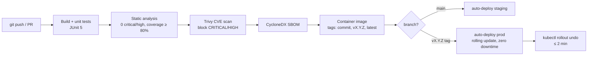

# EPIC 20 — CI/CD and Supply Chain Security

> Part of [Theme 8](theme_8_en.md)

**AS A** DevOps engineer  
**I WANT** automated build, test, security analysis, and deployment pipelines  
**SO THAT** every release is repeatable, auditable, and secure

**Pipeline at a glance:**

#### Acceptance Criteria

##### CI pipeline (per PR)

**Happy path:**
- [ ] Build + unit tests pass
- [ ] Static analysis quality gate: 0 critical/high issues, coverage ≥ 80%
- [ ] Container image security scanning: blocks CRITICAL/HIGH CVE vulnerabilities (Trivy)
- [ ] XSD validation: XML sample files validated against schemas in `xsd/`
- [ ] Software Bill of Materials (SBOM) in CycloneDX format generated for each artefact

**Edge cases:**
- [ ] New dependency introduces HIGH CVE → PR blocked; developer receives CVE details in CI report

##### CD pipeline

**Happy path:**
- [ ] `main` branch update → automatic deployment to staging environment
- [ ] Version tag (e.g. `v1.2.3`) → automatic deployment to production
- [ ] Container image tagged with: commit hash, semantic version, `latest`
- [ ] Images published to container registry
- [ ] Rolling update: new version starts before old one removed (zero downtime)
- [ ] Single-action rollback to previous version

**Edge cases:**
- [ ] Rollback needed → single command: `kubectl rollout undo deployment/efti-gate`; completes within 2 minutes

##### Versioning

**Happy path:**
- [ ] SemVer MAJOR.MINOR.PATCH process established
- [ ] `CHANGELOG.md` following Keep a Changelog 1.1.0 standard
- [ ] Git tags in format `vX.Y.Z` for every production release

---
