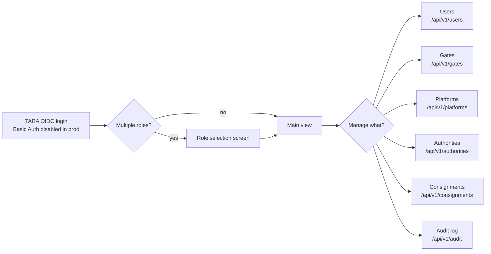

# EPIC 22 — Admin UI

> Part of [Theme 9](theme_9_en.md)

**AS AN** administrator  
**I WANT** a web-based management interface for users, registries and configuration  
**SO THAT** I can administer the system without direct database access

**References:**
- [Permissions Matrix](../specs/permissions-matrix.md) — Admin role capabilities and access control
- [RA §7.1 Logical Component Layers](../architecture/eFTI-Gate-Reference-Architecture.md#71-logical-component-layers) — Admin UI layer in component architecture

**Admin journey at a glance:**

UI uses TEDI (Tehik); WCAG 2.2 AA; draft auto-save every 30 s.

#### Acceptance Criteria

##### Authentication

**Happy path:**
- [ ] Admin UI uses OIDC via TARA; supported: ID card, Mobile-ID, Smart-ID
- [ ] Basic Auth (email:password) disabled in production environments
- [ ] Session expires after configurable period; repeated failures trigger temporary lockout
- [ ] Logout invalidates session and notifies TARA

**Edge cases:**
- [ ] Admin account locked (5 failed attempts) → UI shows `"Account temporarily locked. Try again in 15 minutes."` — not error code

##### Design and language

**Happy path:**
- [ ] UI uses TEDI (Tehik) design system (https://tedi.tehik.ee/)
- [ ] i18n translation files; default language Estonian
- [ ] WCAG 2.2 AA: icon-only buttons have `aria-label`, modals have `aria-labelledby`, skip navigation link, colour contrast minimum 4.5:1

##### Role selection and navigation

**Happy path:**
- [ ] User with multiple roles shown role selection screen after login
- [ ] Active role clearly visible in UI throughout session
- [ ] Role can be switched without re-authenticating

**Edge cases:**
- [ ] User has only 1 role → role selection screen skipped; directly to main view

##### Forms

**Happy path:**
- [ ] Real-time validation before form submission
- [ ] Long forms: periodic automatic draft saving (interval configurable via `DRAFT_SAVE_INTERVAL_SECONDS`, default 30)
- [ ] Draft restored when user returns to unfinished form

**Edge cases:**
- [ ] Draft save fails (network error) → UI shows non-blocking warning `"Draft save failed — your data is not lost, but will not be restored on refresh"`

##### Error handling

**Happy path:**
- [ ] JS errors logged to server via `POST /api/js-error`
- [ ] Users see clear, understandable error message — not a technical stack trace
- [ ] Error page includes `requestId` for support correlation

**Technical artifacts:**
- [ ] OpenAPI: `POST /api/js-error`

---

## Priority Summary

| Phase | Theme | Epics | Rationale |
|-------|-------|-------|-----------|
| **1 — Production readiness** | T1, T5, T6 | 2 (Authentication), 12 (Scalability), 13 (Health), 14 (Security) | Cannot go to production without these |
| **2 — Core functionality** | T1, T2, T3 | 1 (RBAC), 3–5 (Platform/Authority API), 6–9 (Admin CRUD) | Core business logic of the system |
| **3 — Integrations** | T4 | 10 (eDelivery), 11 (X-Road) | EU and national interoperability |
| **4 — Quality** | T6, T7 | 15 (Audit), 16 (Logging), 17 (Monitoring) | Operational maturity |
| **5 — Standards and UI** | T8, T9 | 18–20 (Tests/API/CI/CD), 21–22 (UI) | KeMIT MFN compliance |

---

## Reference Architecture Compliance Check

| RA Principle | Epic | Status |
|---|---|---|
| Gate is a content-agnostic router | EPIC 3, 4, 5, 10 | ✅ Covered |
| Broadcast only on 0 local results | EPIC 4 | ✅ Covered |
| Platform filters subsets | EPIC 5 | ✅ Clarified |
| Gate does not store full datasets | EPIC 5, 9 | ✅ Covered |
| UIL = URL-based structure | EPIC 3, 4, 5 | ✅ Covered |
| CMDS statuses active/inactive/deleted | EPIC 9 | ✅ Addressed |
| AAP = authority REST interface (H2M + M2M) | EPIC 21 | ✅ Covered |
| Identifier `expires_at` field | EPIC 9 | ✅ Addressed |
| Audit logging jurisdiction question | EPIC 15 | ✅ Clarified |
| Multimodal support (road/sea/rail/air) | EPIC 3, 10 | ✅ Covered |

> **Architecture reference:** For component diagrams, security layers, and full design rationale see [eFTI Gate Reference Architecture](../architecture/eFTI-Gate-Reference-Architecture.md).
