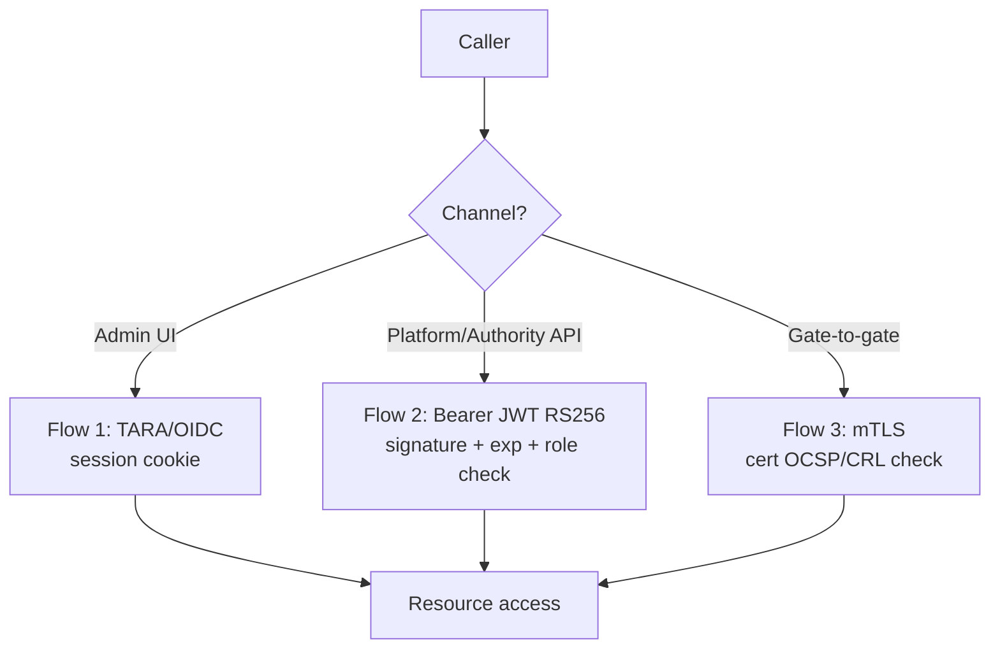
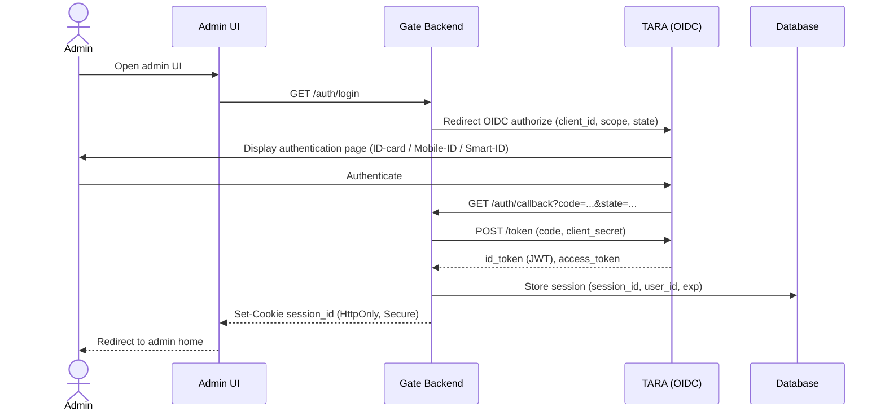
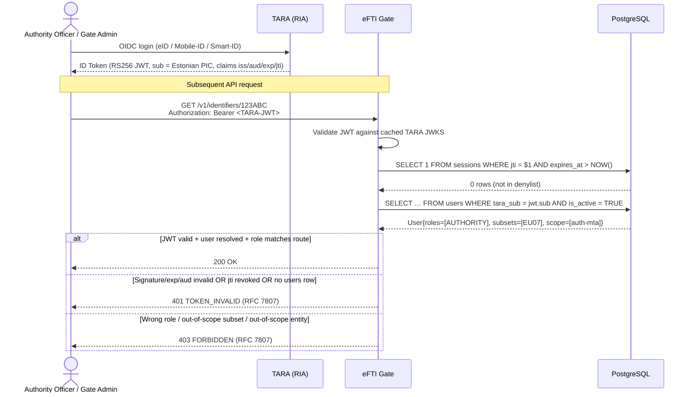
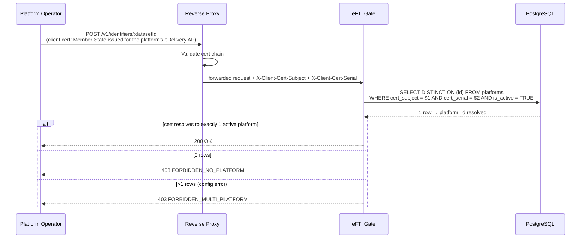
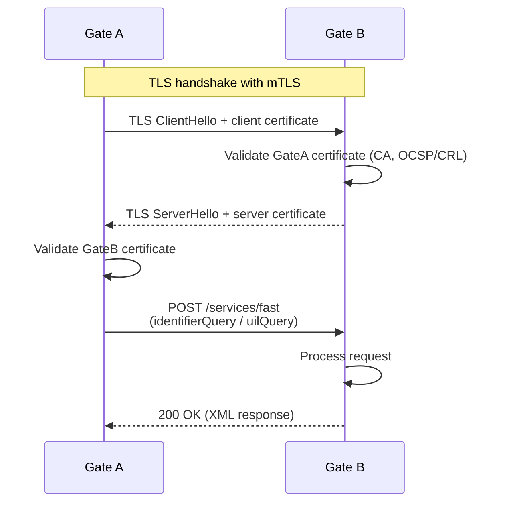

# EPIC 23 — Authentication and Access Flows

> Part of [Theme 1](theme_1_en.md)

**AS A** technical architect  
**I WANT** documented authentication and access flows with sequence diagrams  
**SO THAT** integration partners and developers understand exactly how authentication works in each channel type

**Reference:** [RA §8.1 Security Layers](../architecture/eFTI-Gate-Reference-Architecture.md#81-security-layers) — Authentication architecture for all three flows

**Three authentication channels at a glance:**

Detailed sequences for each flow follow below.

#### Acceptance Criteria

- [ ] All three authentication patterns documented as sequence diagrams (see below)
- [ ] Each flow covers: authentication, authorisation check, error cases
- [ ] Diagrams published in GitHub documentation

##### Flow 1 — Admin UI login (TARA/OIDC)

##### Flow 2 — Authority / Admin API (TARA OIDC JWT)

##### Flow 2b — Platform API (mTLS)

##### Flow 3 — Gate-to-gate fast protocol (mTLS)

---
