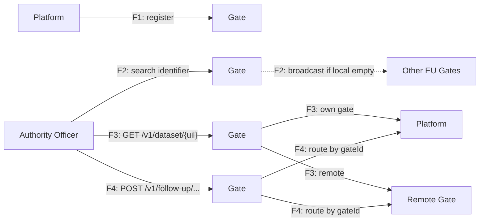
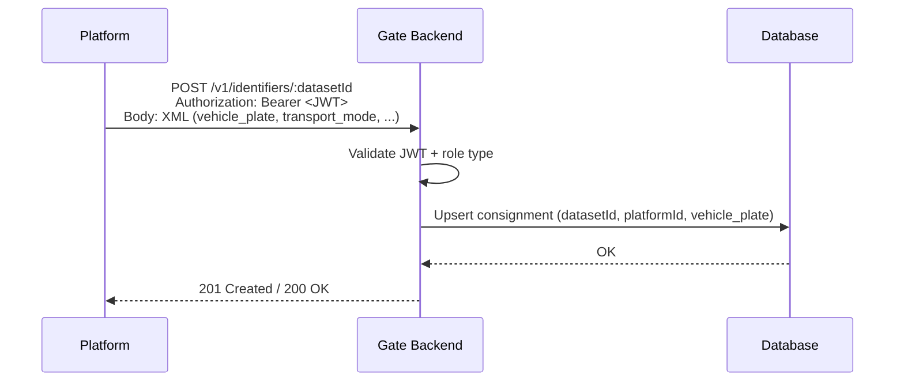
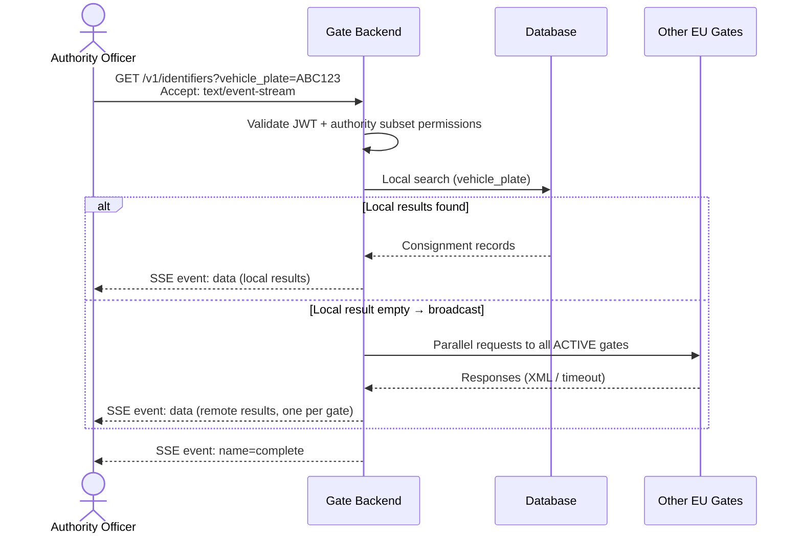
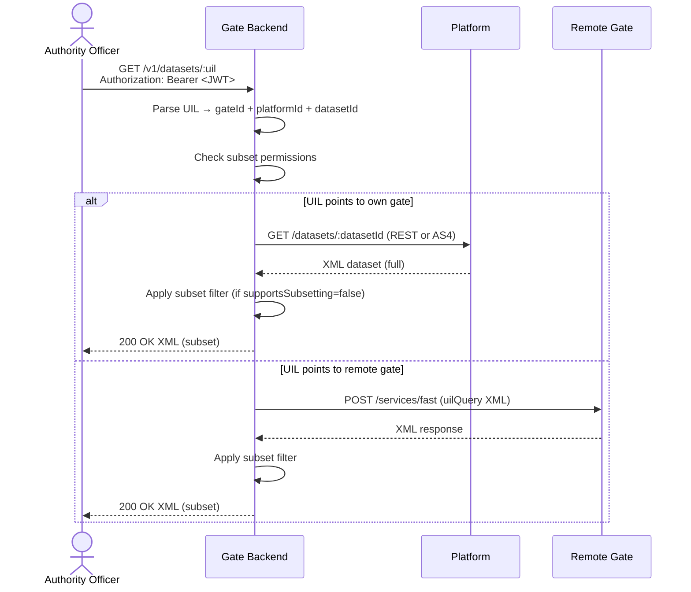
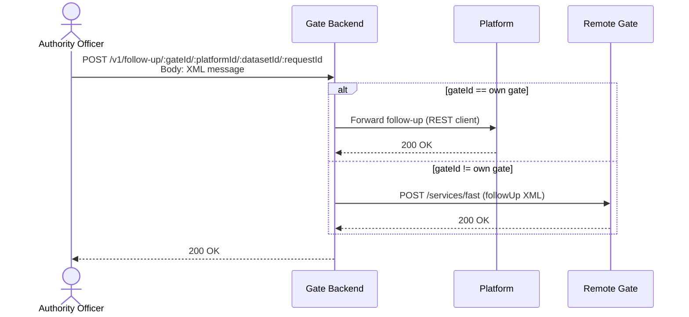

# EPIC 24 — Identifier Search and Dataset Retrieval Flows

> Part of [Theme 2](theme_2_en.md)

**AS A** technical architect  
**I WANT** documented data flows with sequence diagrams  
**SO THAT** developers and integration partners understand exactly how identifier search, broadcast, and dataset retrieval works

**References:**
- [RA §5.1 Identifier Query](../architecture/eFTI-Gate-Reference-Architecture.md#51-identifier-query-cross-border-search) — Identifier search flow diagrams
- [RA §5.2 Dataset Query](../architecture/eFTI-Gate-Reference-Architecture.md#52-dataset-query-request-full-data) — Dataset retrieval flow diagrams

**Four data flows at a glance:**

Detailed sequence diagrams for each flow follow below.

#### Acceptance Criteria

- [ ] All four core flows documented as sequence diagrams (see below)
- [ ] Each flow covers error cases (gate offline, empty result, unauthorised access)
- [ ] Diagrams published in GitHub documentation

##### Flow 1 — Identifier registration (Platform → Gate)

##### Flow 2 — Identifier search (Authority → Gate → Broadcast)

##### Flow 3 — Dataset retrieval by UIL

##### Flow 4 — Follow-up message forwarding

---
