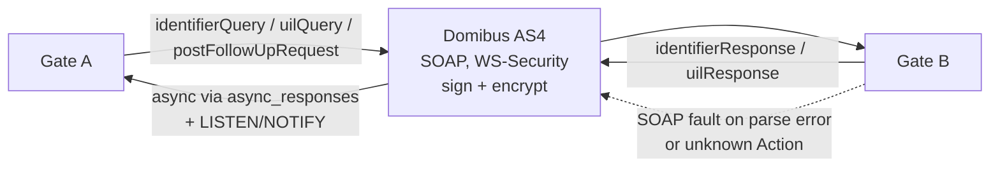
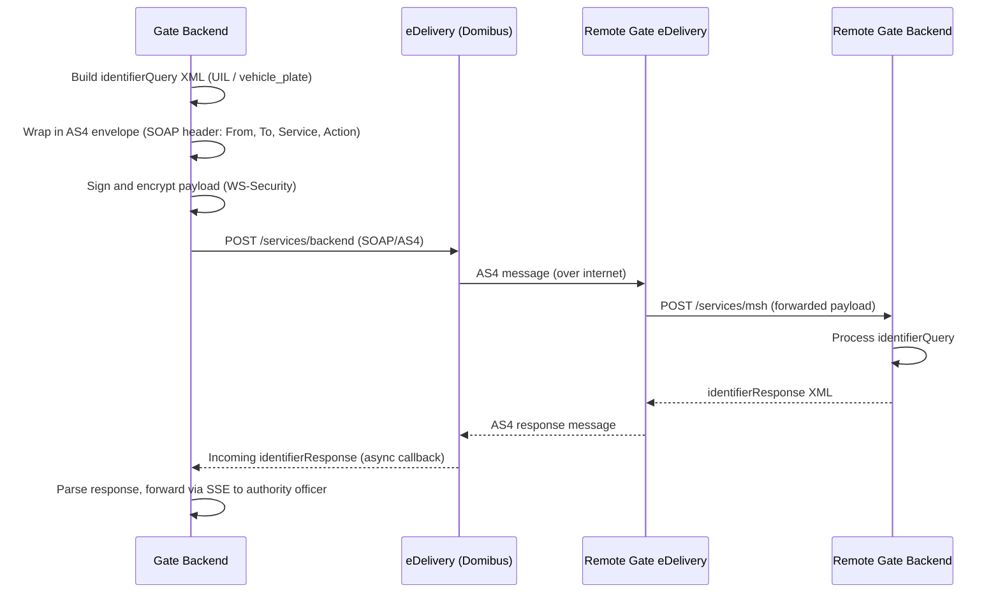
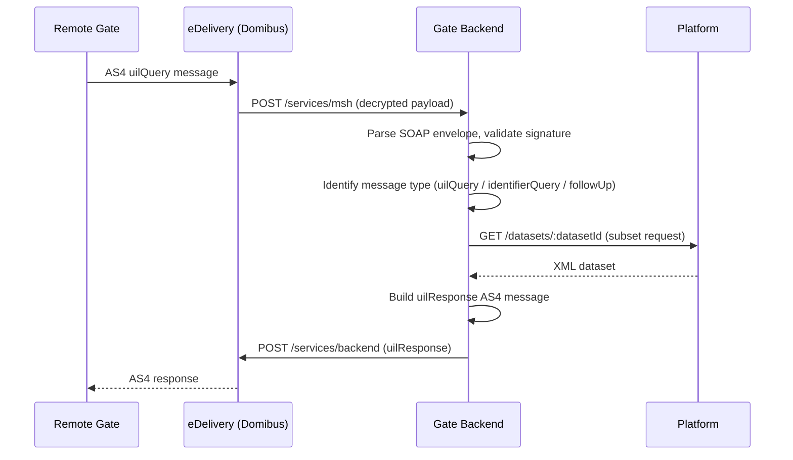

# EPIC 25 — eDelivery AS4 Message Flow

> Part of [Theme 4](theme_4_en.md)

**AS A** technical architect  
**I WANT** documented eDelivery AS4 message flows with sequence diagrams  
**SO THAT** developers understand exactly how inter-gate messages travel through the AS4 protocol

**References:**
- [Data Transformations](../specs/data-transformations.md) — XML→AS4 envelope wrapping; XSD validation; SOAP fault mapping
- [Diagrams](../specs/diagrams/seq-14-gate-to-gate-search.mmd) — Gate-to-gate AS4 search sequence; [seq-16](../specs/diagrams/seq-16-mtls-fast-protocol.mmd) — mTLS fast-protocol alternative
- [eDelivery XSD](../efti-analysis/xsd/edelivery/gate.xsd) — eDelivery message schema
- [RA §4 Protocol Architecture](../architecture/eFTI-Gate-Reference-Architecture.md#4-protocol-architecture-generic-envelope--variable-payload) — AS4 envelope and protocol model
- [RA §5.1 Identifier Query](../architecture/eFTI-Gate-Reference-Architecture.md#51-identifier-query-cross-border-search) — Cross-border search flow

**AS4 message types at a glance:**

Detailed sequence diagrams for outgoing and incoming flows follow below.

#### Acceptance Criteria

- [ ] Both AS4 flows documented (outgoing identifierQuery and incoming uilResponse)
- [ ] Diagrams cover: SOAP envelope construction, signing, encryption, failure handling
- [ ] Diagrams published in GitHub documentation

##### Flow 1 — Outgoing identifier search (Gate → eDelivery → Remote Gate)

##### Flow 2 — Incoming UIL request (Remote Gate → Gate → Platform)

---
