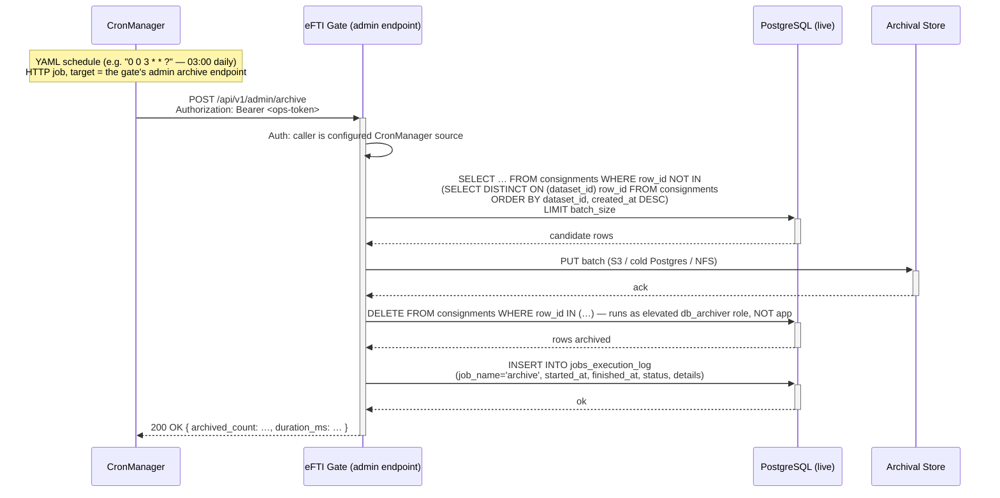

# EPIC 26 — Append-Only Archival via CronManager

> Part of [Theme 5](theme_5_en.md)

**AS A** gate operator
**I WANT** non-latest rows of every operational table moved to archival storage on a regular schedule
**SO THAT** the live database stays lean while the full event history is preserved for audit and forensics

**References:**
- [DB Schema](../specs/db/README.md) — Append-only design rule, latest-row-wins read pattern, two-role model (`app` SELECT+INSERT only / `db_archiver` SELECT+DELETE on operational tables, SELECT-only on `audit_log`)
- [Schema](../specs/db/schema.sql) — All operational tables are append-only and INSERT-only at the GRANT layer. The 11 archivable tables (`gates`, `platforms`, `authorities`, `users`, `consignments`, `identifiers`, `sessions`, `async_responses`, `request_id_cache`, `jobs_execution_log`, `follow_up_log`) have non-latest rows swept by this archival job. `audit_log` is intentionally **excluded** from the sweep — it is preserved indefinitely on the live DB.
- [Non-functional contracts](../specs/non-functional.md) — Retention windows + archival shape
- [CronManager](https://github.com/Buerostack/CronManager) — External Quartz-based job scheduler that drives the archival sweep
- [Permissions Matrix](../specs/permissions-matrix.md) — Admin endpoint authorisation
- [Errors](../specs/errors.json) — Failure-mode codes

**Flow at a glance:**

See `seq-08-identifier-expiration.mmd` for a related job pattern.

#### Acceptance Criteria

##### CronManager integration

**Happy path:**
- [ ] A CronManager YAML job definition (`DSL/jobs/efti-gate-archive.yaml`) is published in CronManager's config volume; the gate operator deploys CronManager alongside the gate.
- [ ] Default schedule: daily at 03:00 local time (`trigger: "0 0 3 * * ?"`); operator-overridable via the YAML.
- [ ] Job type `http`; target `POST {GATE_BASE_URL}/api/v1/admin/archive`; authentication = an ops-only Bearer token sourced from a Kubernetes Secret (NOT in the YAML in plaintext).
- [ ] CronManager logs each invocation; failures retry with exponential backoff (CronManager-native).

**Edge cases:**
- [ ] Archive job already running (previous run not finished) → gate returns `409 Conflict` with `code: ARCHIVE_IN_PROGRESS` and CronManager skips.
- [ ] Network failure between CronManager and gate → CronManager records the failure and retries on the next scheduled tick; no partial run remains in `jobs_execution_log`.

**Technical artifacts:**
- [ ] CronManager YAML example committed at `docs/specs/deploy/cronmanager-archive.yaml` (illustrative; the operator's real config lives outside this repo).
- [ ] Diagram: this epic's inline sequence diagram + `seq-08-identifier-expiration.mmd` (sister job).

##### Archive endpoint (gate side)

**Happy path:**
- [ ] `POST /api/v1/admin/archive` defined in `openapi.yaml`. Auth: `opsToken` security scheme — static `Authorization: Bearer <ARCHIVE_OPS_TOKEN>` compared literally against the env var. Mismatch → `403 FORBIDDEN`. No JWT, no DB user lookup.
- [ ] Request body (optional): `{ "tables": ["consignments", "identifiers", …], "batch_size": 1000, "max_runtime_seconds": 600 }`. Defaults: all operational tables; batch 1000; runtime 10 min.
- [ ] Response: `200 OK` with `{ "archived": { "consignments": 12345, "identifiers": 38912, … }, "started_at": …, "finished_at": …, "duration_ms": …, "next_archivable_count_estimate": … }`.
- [ ] One run per table proceeds in batches of `batch_size` to bound memory; commits per batch.

**Edge cases:**
- [ ] `max_runtime_seconds` reached mid-table → archival stops cleanly between batches; remaining rows are picked up by the next run. Response status is still `200` with `partial: true`.
- [ ] Archive destination unavailable → no rows are deleted from the live DB (atomicity per batch). Returns `502 Bad Gateway` with `code: ARCHIVE_STORAGE_UNAVAILABLE`. Live DB is unchanged.
- [ ] Empty queue (nothing to archive for any table) → `200 OK` with all counts zero.

**Error handling:**
- [ ] Unauthenticated → `401 Unauthorized`.
- [ ] Authenticated but not ops-role → `403 Forbidden` `code: FORBIDDEN`.
- [ ] Archive storage failure mid-batch → batch transaction rolls back; row remains in live DB; failure logged ERROR; next run retries.

**Technical constraints:**
- [ ] Archival query uses the canonical `NOT IN (SELECT DISTINCT ON (logical_id) row_id …)` pattern documented in `db/README.md`; or its `ROW_NUMBER() OVER (…)` equivalent — whichever the implementation chooses, but no JOINs.
- [ ] `DELETE` on the live DB is performed by a separate database role (`db_archiver`), NOT the runtime `app` role. The `app` role still has SELECT, INSERT only on every table — Epic 26 does not weaken Rule 1.
- [ ] Archival destination is operator-configurable (S3-compatible object store, secondary Postgres on a different cluster, append-only file storage). The destination shape is JSON-Lines with one row per line, partitioned by `(table, year, month)`.
- [ ] Retention in archive: 7-year minimum for archived rows of every operational table; indefinite is acceptable (compliance floor is 7 y per `non-functional.md` §5). `audit_log` does not appear in the archive at all — it stays on the live DB for the full retention period.
- [ ] Idempotent: running the archive twice in a row produces zero output on the second run.

**Technical artifacts:**
- [ ] OpenAPI: `POST /api/v1/admin/archive` operation + `ARCHIVE_IN_PROGRESS` and `ARCHIVE_STORAGE_UNAVAILABLE` error codes.
- [ ] DB: a new database role `db_archiver` with `DELETE` on operational tables; documented in `db/README.md`.
- [ ] CronManager YAML: `docs/specs/deploy/cronmanager-archive.yaml`.
- [ ] Logging: `event.action: archive.run`, audit-meaningful (`efti.audit=true`), records archived counts per table.

##### Operator deployment

**Happy path:**
- [ ] CronManager is deployed as a sibling container/Pod to the gate (single Helm chart can include both).
- [ ] CronManager's database is separate from the gate's database (CronManager has its own Postgres for Quartz state).
- [ ] CronManager's `:9010` port is internal only (not exposed); the archive endpoint on the gate is internal only as well.
- [ ] An ops-only Bearer token is provisioned via a Kubernetes Secret and consumed by CronManager at job-execution time (not stored in plaintext in the YAML).

**Technical constraints:**
- [ ] Same software in dev/test/stage/prod (per the project's environment-parity rule). Dev developers run CronManager via `docker-compose up`; stage/prod via the production orchestrator.
- [ ] Archival destination has the same parity: real S3 (or compatible) in test/stage/prod; LocalStack or MinIO acceptable in dev.

**Technical artifacts:**
- [ ] `docs/specs/deploy/README.md` references this epic and notes that CronManager is a deployment-side requirement.
