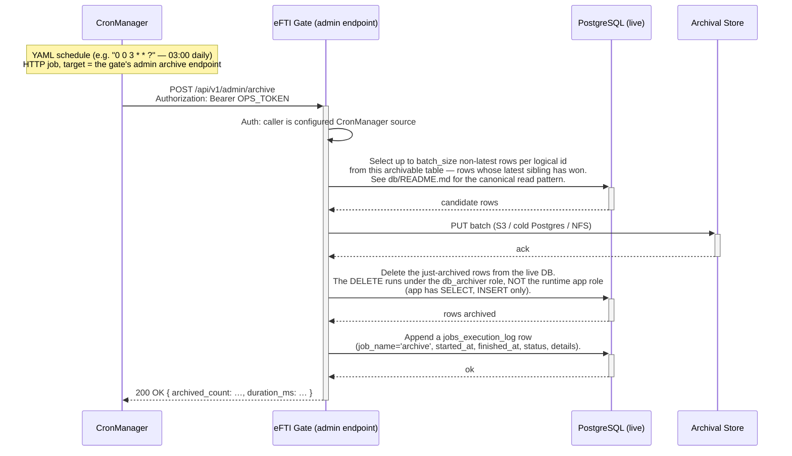

# EPIC 26 — Append-Only Archival via CronManager

> Part of [Theme 5](theme_5_en.md)

**AS A** gate operator
**I WANT** non-latest rows of every operational table moved to archival storage on a regular schedule
**SO THAT** the live database stays lean while the full event history is preserved for audit and forensics

## Spec anchors

| Contract surface | Reference |
|---|---|
| **API operations** | `POST /api/v1/admin/archive` (CronManager-triggered) |
| | Full request / response / error shapes: [`openapi.yaml`](../specs/openapi.yaml) |
| **Schema** | 11 archivable tables: `gates`, `platforms`, `authorities`, `users`, `consignments`, `identifiers`, `sessions`, `async_responses`, `request_id_cache`, `jobs_execution_log`, `follow_up_log` |
| | **`audit_log` is intentionally NOT archived** — preserved indefinitely on the live DB |
| | Two-role model: `app` role = `SELECT, INSERT` only on every table; `db_archiver` role = `SELECT, DELETE` on operational tables, `SELECT`-only on `audit_log` |
| | Full schema: [`db/schema.sql`](../specs/db/schema.sql); design rules + canonical read pattern: [`db/README.md`](../specs/db/README.md) |
| **Error codes** | `ARCHIVE_IN_PROGRESS` (concurrent-run mutex) |
| | `ARCHIVE_STORAGE_UNAVAILABLE` (destination unreachable mid-run) |
| | `FORBIDDEN` (ops-token mismatch) |
| | Full catalog: [`errors.json`](../specs/errors.json) |
| **Retention contract** | 7-year minimum in archive; archival destination shape (S3 / cold Postgres / append-only FS); per-row JSON-Lines layout; environment parity: [`non-functional.md`](../specs/non-functional.md) §3, §5 |
| **CronManager** | [Buerostack/CronManager](https://github.com/Buerostack/CronManager) — external Quartz-based scheduler |
| **CronManager YAML** | [`cronmanager-archive.yaml`](../specs/deploy/cronmanager-archive.yaml) (default schedule `0 0 3 * * ?` — 03:00 daily) |
| **Access-check rules** | `opsToken` security scheme — static Bearer `ARCHIVE_OPS_TOKEN` compared literally against env var; no JWT, no DB lookup: [`permissions-matrix.md`](../specs/permissions-matrix.md) §1.1 |
| **Related diagrams** | [`seq-08-identifier-expiration.mmd`](../specs/diagrams/seq-08-identifier-expiration.mmd) (sister CronManager-driven job) |

## Flow at a glance

## Acceptance Criteria

### CronManager integration

**Business rules:**
- [ ] Recurring archival is driven by CronManager calling `POST /api/v1/admin/archive` on its configured schedule. The gate process never schedules its own jobs.
- [ ] Canonical YAML lives at [`cronmanager-archive.yaml`](../specs/deploy/cronmanager-archive.yaml); the operator deploys CronManager alongside the gate (sibling Pod / container) with its own PostgreSQL for Quartz state.
- [ ] Default schedule: daily at 03:00 local time. Operator-overridable via the YAML.
- [ ] Auth: static Bearer `ARCHIVE_OPS_TOKEN` sourced from a runtime secret (never in YAML plaintext). Token-mismatch → `403 FORBIDDEN`.
- [ ] CronManager retries with exponential backoff on transport failure (CronManager-native behaviour).

**Denial scenarios:**
- [ ] A second invocation while the first is still running → `409 ARCHIVE_IN_PROGRESS` (cluster-wide advisory-lock mutex per Epic 12).

### Archive endpoint behaviour

**Business rules:**
- [ ] Request body (optional): `{ "tables": [...], "batch_size": 1000, "max_runtime_seconds": 600 }`. Defaults: all 11 archivable tables; batch 1000; runtime 10 minutes.
- [ ] One run per table proceeds in batches of `batch_size`; each batch commits to archive + DELETEs from live DB **atomically** (archive failure ⇒ rollback ⇒ row remains in live DB).
- [ ] Response: `200 OK` with `{ "archived": { "<table>": N, ... }, "started_at", "finished_at", "duration_ms", "next_archivable_count_estimate" }`.
- [ ] `max_runtime_seconds` reached → stop cleanly between batches; return `200` with `partial: true`. Remaining rows are picked up by the next run.
- [ ] Empty queue (nothing archivable across all tables) → `200 OK` with all counts zero. Idempotent: a second run within the same window is also zero-output.

**Denial / failure scenarios:**
- [ ] Archive destination unavailable → `502 ARCHIVE_STORAGE_UNAVAILABLE`. No rows have been deleted from the live DB (per-batch atomicity).
- [ ] Storage failure mid-batch → batch transaction rolls back; failure logged ERROR; next run retries.

### Append-only invariants (must not be weakened)

**Business rules:**
- [ ] **Selection.** The archival query scans only rows that are NOT the latest per logical id (per `db/README.md` canonical read pattern). No JOIN across operational tables.
- [ ] **Role separation.** `DELETE` on the live DB is performed by `db_archiver`, **not** by the runtime `app` role. The `app` role retains `SELECT, INSERT` only — Epic 26 does **not** weaken the append-only Rule 1.
- [ ] **`audit_log` is exempt** from the sweep. It is preserved on the live DB indefinitely (≥ 7-year regulatory floor; operator may extend).
- [ ] **Archive destination shape:** JSON-Lines, one row per line, partitioned by `(table, year, month)`. Operator-configurable destination (S3-compatible object store, secondary Postgres, append-only file storage) per `non-functional.md` §3; environment parity (same software in dev / test / stage / prod).
- [ ] **Retention in archive:** 7-year minimum; indefinite acceptable.

### Logging

- [ ] Each run emits `event.action: "archive.run"`, audit-meaningful (`efti.audit=true`), with per-table archived counts.

## Rationale

The gate's append-only design preserves complete history without UPDATE-triggers or `_history` tables — but that history would unboundedly grow the live DB. The CronManager-driven nightly sweep moves non-latest rows to a separate archival destination, keeping the live DB compact while the full history remains queryable from cold storage. The two-role split (`app` cannot DELETE, `db_archiver` can DELETE operational tables but cannot DELETE `audit_log`) means the append-only invariant survives even though the archive job has to delete from the live DB. `audit_log` lives only on the live DB because GDPR Art. 30 audit access must be queryable indefinitely without a cold-storage roundtrip.
