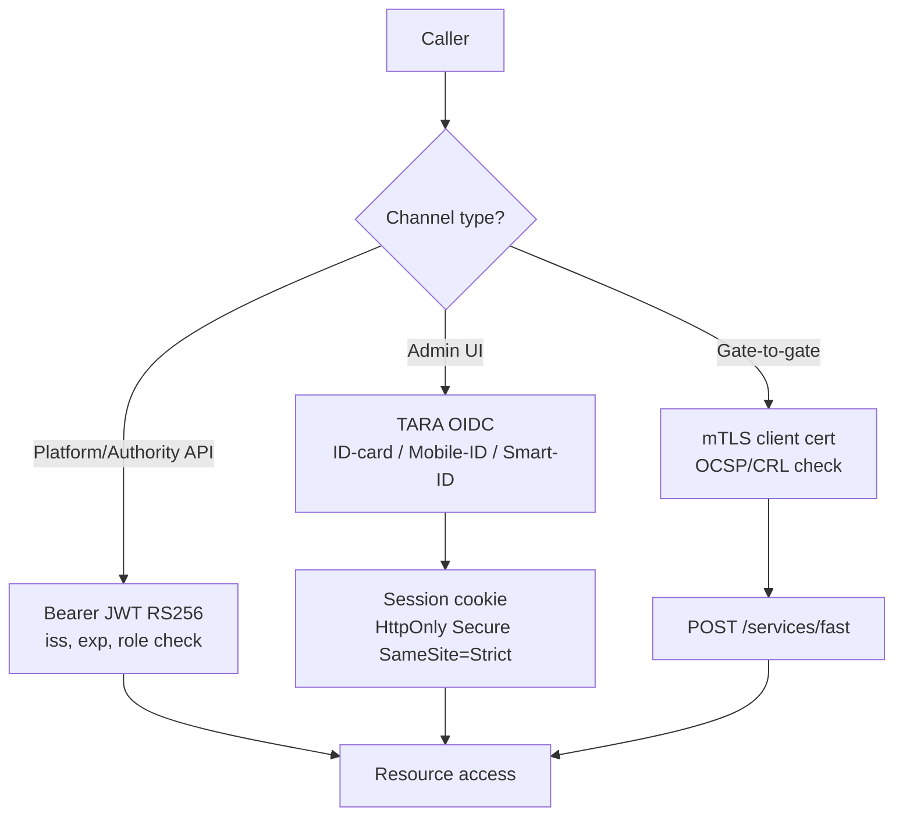

# EPIC 2 — Authentication

> Part of [Theme 1](theme_1_en.md)

**AS A** system administrator or authority user  
**I WANT** secure authentication mechanisms (TARA, JWT, mTLS)  
**SO THAT** only authorized parties can access the gate

**Reference:** [Permissions Matrix](../specs/permissions-matrix.md) — Authentication flow and authorization checks

**Three authentication channels at a glance:**

See `seq-12-user-authentication.mmd` and `seq-16-mtls-fast-protocol.mmd` for full detail.

#### Acceptance Criteria

##### Admin UI authentication (OIDC)

**Happy path:**
- [ ] Admin opens UI → redirected to TARA OIDC authorize endpoint with `client_id`, `scope=openid`, `state` (CSRF token), `redirect_uri`
- [ ] TARA presents ID-card / Mobile-ID / Smart-ID; admin authenticates; TARA redirects to `/auth/callback?code=...&state=...`
- [ ] eFTI Gate exchanges `code` for `id_token` (POST `/token`); validates signature, `iss`, `aud`, `exp`, `nonce`
- [ ] Session created in database; `session_id` cookie set (HttpOnly; Secure; SameSite=Strict)
- [ ] Session validity configurable (`SESSION_EXPIRY_SECONDS`, default 3600)
- [ ] Session state in database — works behind load balancer without session affinity
- [ ] TARA callback URL registered in TARA management console

**Edge cases:**
- [ ] `state` mismatch in callback → `400 Bad Request`; session not created; event logged WARN
- [ ] `id_token` signature invalid → `401 Unauthorized`; session not created
- [ ] Session expired → user redirected to login page (not error stack trace)
- [ ] 5 failed login attempts within 10 minutes → account locked 15 minutes (configurable); event logged

**Error handling:**
- [ ] Logout → session deleted from database; OIDC `end_session_endpoint` called on TARA
- [ ] Basic Auth endpoint returns `405 Method Not Allowed` in production profile

**Technical constraints:**
- [ ] `OIDC_ISSUER_URL`, `OIDC_CLIENT_ID`, `OIDC_CLIENT_SECRET` loaded from runtime secrets — never from committed `.env` file
- [ ] MUST use Spring Security OAuth2 Client — no custom OIDC implementation

**Technical artifacts:**
- [ ] OpenAPI: `GET /auth/login`, `GET /auth/callback`, `POST /auth/logout`
- [ ] Diagram: `seq-12-user-authentication.mmd`

##### Platform/Authority API authentication

**Happy path:**
- [ ] Admin provisions an authority/admin user via `POST /api/v1/users` carrying `taraSub` → `201 Created`. No token is issued — TARA owns auth.
- [ ] Authority / admin calls API with `Authorization: Bearer <TARA-JWT>` → gate validates signature against TARA JWKS, `iss`, `aud`, `exp`, denylist; resolves `users` row by `tara_sub = jwt.sub`; `200 OK` if active and required role present.
- [ ] Platform calls API with **mTLS** — reverse proxy forwards `X-Client-Cert-Subject` / `X-Client-Cert-Serial`; gate resolves `platforms` row → `200 OK`.

**Edge cases:**
- [ ] JWT issued by an issuer other than the configured TARA (`iss` mismatch) → `401 TOKEN_INVALID`.
- [ ] JWT subject does not resolve to any active `users` row → `401 TOKEN_INVALID` with `"detail": "no provisioned user"`.
- [ ] Platform's mTLS cert subject DN + serial resolves to >1 active `platforms` row (config error) → `403 FORBIDDEN_MULTI_PLATFORM`.

**Error handling:**
- [ ] Compromised token: `POST /api/v1/users/:userId/revoke-token` → JWT `jti` added to `sessions` denylist; subsequent requests with that JWT → `401 TOKEN_INVALID`.

**Technical constraints:**
- [ ] Signing: RS256; gate private key loaded from K8s Secret at startup — never in container image
- [ ] Token blacklist TTL = token `exp`; cleaned up automatically

**Technical artifacts:**
- [ ] Diagram: `seq-12-user-authentication.mmd`

##### Gate-to-gate fast protocol

**Happy path:**
- [ ] eFTI Gate A calls `POST /services/fast` on eFTI Gate B with mTLS client certificate; eFTI Gate B verifies against trusted CA → `200 OK`

**Edge cases:**
- [ ] eFTI Gate A presents certificate from unknown CA → TLS handshake fails; event logged WARN with eFTI Gate A IP
- [ ] eFTI Gate A presents revoked certificate (OCSP check fails) → connection refused; event logged

**Error handling:**
- [ ] `X-API-Key` header only (no mTLS) → `401 Unauthorized`; `X-API-Key` not accepted as authentication

**Technical constraints:**
- [ ] mTLS certificates loaded from K8s Secret at runtime — no certificates in container image
- [ ] `X-API-Key` removed from `/services/fast` endpoint entirely

**Technical artifacts:**
- [ ] Diagram: [`../specs/diagrams/seq-16-mtls-fast-protocol.mmd`](../specs/diagrams/seq-16-mtls-fast-protocol.mmd)
