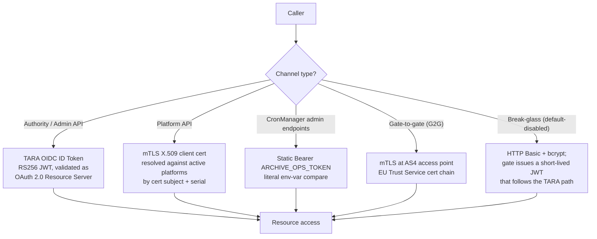

# EPIC 2 — Authentication

> Part of [Theme 1](theme_1_en.md)

**AS A** system administrator or authority user  
**I WANT** secure authentication mechanisms (TARA, JWT, mTLS)  
**SO THAT** only authorized parties can access the gate

## Spec anchors

| Contract surface | Reference |
|---|---|
| **API operations** | `POST /api/v1/auth/logout` |
| | `POST /api/v1/auth/local-token` (default-disabled break-glass) |
| | `POST /api/v1/users/{userId}/revoke-token` |
| | `POST /services/fast` (gate-to-gate fast protocol, mTLS) |
| | Full request / response / error shapes: [`openapi.yaml`](../specs/openapi.yaml) |
| **Schema** | `users` (`tara_sub`, `secret_hash` for break-glass only, `token_revoked_at`) |
| | `sessions` (JWT denylist: `jti`, `revoked_at`, `reason`) |
| | Full schema: [`db/schema.sql`](../specs/db/schema.sql) |
| **Error codes** | `TOKEN_INVALID` |
| | `FORBIDDEN_NO_PLATFORM` |
| | `FORBIDDEN_MULTI_PLATFORM` |
| | Full catalog: [`errors.json`](../specs/errors.json) |
| **Access-check rules** | Credential routing + JWT validation pipeline: [`permissions-matrix.md`](../specs/permissions-matrix.md) §1.1, §8.1 |
| **Environment** | `TARA_OIDC_DISCOVERY_URL`, `TARA_CLIENT_ID`, `TARA_CLIENT_SECRET`, `TARA_JWKS_CACHE_SECONDS`, `ARCHIVE_OPS_TOKEN`, `LOCAL_ADMIN_FALLBACK_ENABLED`, `BREAK_GLASS_JWT_SIGNING_KEY`, `BREAK_GLASS_JWT_TTL_SECONDS` — see [`non-functional.md`](../specs/non-functional.md) §4.1 |
| **Diagrams** | [`seq-12-user-authentication.mmd`](../specs/diagrams/seq-12-user-authentication.mmd) |
| | [`seq-16-mtls-fast-protocol.mmd`](../specs/diagrams/seq-16-mtls-fast-protocol.mmd) |
| | [`flow-02-authorization-check.mmd`](../specs/diagrams/flow-02-authorization-check.mmd) |

## Authentication channels at a glance

The gate is a **stateless OAuth 2.0 Resource Server** for Authority and Admin traffic — there is no server-side admin session and no `session_id` cookie; the JWT *is* the session. The `sessions` table is a JWT denylist (per-token revocation), and `users.token_revoked_at` carries the per-user broadcast revocation marker.

## Acceptance Criteria

### Admin UI authentication (TARA OIDC → JWT, gate is Resource Server)

**Business rules:**
- [ ] The TARA OIDC code-exchange happens in the admin browser (or a thin client-side login helper), not in the gate. The gate validates JWTs but never exchanges codes itself.
- [ ] No server-side admin session, no `session_id` cookie. The JWT is the session.
- [ ] The `sessions` table is a JWT denylist (`jti`, `revoked_at`, `reason`) — **not** a session store.
- [ ] Multi-node deployment requires no session affinity: any node can validate any TARA JWT against the cached JWKS + the denylist.

**Denial scenarios:**
- [ ] JWT signature invalid.
- [ ] `iss` claim does not match the configured TARA issuer.
- [ ] `aud` claim does not match the gate's TARA `client_id`.
- [ ] `exp` is in the past.
- [ ] `jti` is in the `sessions` denylist.
- [ ] `sub` does not resolve to any active `users` row.

### Authority and Platform API authentication

**Business rules:**
- [ ] An authority/admin user must be provisioned via `POST /api/v1/users` (carrying their `taraSub`) before they can authenticate. The gate does not auto-provision on first inbound JWT — it rejects.
- [ ] Authority/Admin → TARA JWT (validated as above).
- [ ] Platform → mTLS only; the cert subject DN + serial must resolve to exactly one active `platforms` row.

**Denial scenarios** (in addition to the JWT-validation ones above):
- [ ] Platform mTLS cert subject + serial resolves to >1 active `platforms` row (operator misconfiguration).

### Gate-to-gate fast protocol

**Business rules:**
- [ ] `POST /services/fast` is **mTLS-only**. There is no `X-API-Key` fallback.
- [ ] The presenting gate's certificate must chain to a trusted CA (EU Trust Service trust list); OCSP / CRL revocation checks **fail closed**.

**Denial scenarios:**
- [ ] Certificate from an unknown CA → TLS handshake fails; logged at WARN with caller IP.
- [ ] Revoked certificate (OCSP / CRL) → connection refused; logged.
- [ ] `X-API-Key` header presented in lieu of mTLS → unauthenticated; the header is never honoured.

## Authentication contract

- [ ] JWT signing: **RS256**. The break-glass JWT signing key is loaded from a runtime secret (K8s Secret / vault) — never baked into the container image.
- [ ] JWT validation: any RS256-capable JWT library satisfies the contract (the spec doesn't mandate a specific implementation). Validate as an OAuth 2.0 Resource Server with the named claims; clock-skew tolerance ±60 s per [`non-functional.md`](../specs/non-functional.md) §4.
- [ ] Denylist TTL: a `sessions` row remains effective until the underlying token's `exp`; expired entries can be archived per the standard append-only retention.
- [ ] mTLS certificates (Platform-API and AS4 access point) loaded from runtime secret at startup — never in the container image.

## Revocation contract

- [ ] **Logout** (`POST /api/v1/auth/logout`): inserts `(jti, revoked_at, reason='logout')` into `sessions`. Subsequent calls with the same JWT → unauthenticated.
- [ ] **Admin revoke** (`POST /api/v1/users/{userId}/revoke-token`): inserts a new `users` row with `token_revoked_at = NOW()`. Append-only: the previous row is unchanged. Every previously issued JWT for that user becomes invalid on the next request (compared against `jwt.iat`).
- [ ] **Break-glass** (`POST /api/v1/auth/local-token`): default-disabled (`LOCAL_ADMIN_FALLBACK_ENABLED=false`). When enabled, validates against the single bcrypt local-admin row in `users.secret_hash` and issues a gate-signed JWT with hard-coded 600 s TTL (`BREAK_GLASS_JWT_TTL_SECONDS`). The issued JWT then follows the same validation pipeline as a TARA JWT (`tara_sub='local-admin'` resolves the local-admin row).

## Rationale

Authentication is federated for Authority/Admin (TARA owns identity + expiry), cert-based for Platform (mTLS), and pinned-by-token for CronManager (`ARCHIVE_OPS_TOKEN`). The gate maintains no admin session state; it validates each request's bearer token against TARA's JWKS + the `sessions` denylist + the `users` row's `token_revoked_at`. Break-glass exists for total TARA outage and is default-disabled.
