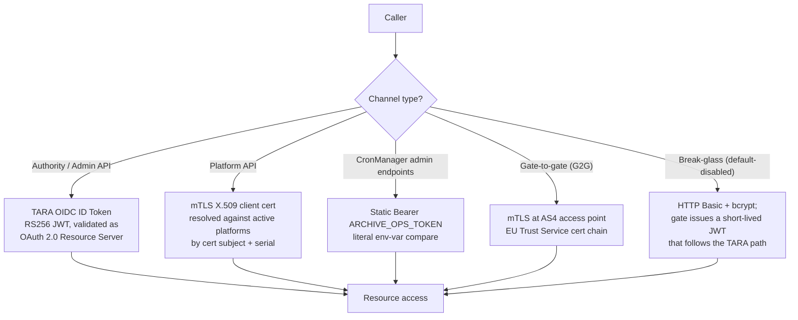

# EPIC 2 — Authentication

> Part of [Theme 1](theme_1_en.md)

**AS A** system administrator or authority user  
**I WANT** secure authentication mechanisms (TARA, JWT, mTLS)  
**SO THAT** only authorized parties can access the gate

**Reference:** [Permissions Matrix](../specs/permissions-matrix.md) — Authentication flow and authorization checks

**Authentication channels at a glance:**

The gate is a **stateless OAuth 2.0 Resource Server** for Authority and Admin traffic — there is no server-side admin session and no `session_id` cookie; the JWT is the session. The `sessions` table is repurposed as a JWT denylist (per-token revocation) and `users.token_revoked_at` carries the per-user broadcast revocation marker.

See `seq-12-user-authentication.mmd` and `seq-16-mtls-fast-protocol.mmd` for full detail.

#### Acceptance Criteria

##### Admin UI authentication (TARA OIDC → JWT, gate is Resource Server)

The gate is a **stateless OAuth 2.0 Resource Server**. The TARA OIDC code-exchange happens in the admin browser (or in a thin client-side login helper) and yields an ID Token / Access Token; the UI then attaches that JWT as `Authorization: Bearer <token>` on every subsequent request. The gate does not maintain server-side admin sessions.

**Happy path:**
- [ ] Admin opens UI; the UI's TARA login flow yields an ID Token (RS256 JWT, claims `iss`, `aud`, `exp`, `sub` = Estonian PIC, `jti`).
- [ ] UI calls gate APIs with `Authorization: Bearer <TARA-JWT>`. Gate validates signature against cached TARA JWKS; checks `sessions` denylist (`SELECT 1 FROM sessions WHERE jti = $1 AND expires_at > NOW()`); resolves `users` row by `tara_sub = jwt.sub`.
- [ ] No `session_id` cookie. No DB-side admin-session store. The gate-side `sessions` table is a **JWT denylist** (`jti, revoked_at, reason`), not a session table.
- [ ] Multi-node deployment requires no session affinity (the JWT is the session).

**Edge cases:**
- [ ] JWT signature invalid → `401 TOKEN_INVALID`.
- [ ] `iss` not the configured TARA → `401 TOKEN_INVALID`.
- [ ] `aud` not the gate's TARA `client_id` → `401 TOKEN_INVALID`.
- [ ] `exp` past → `401 TOKEN_INVALID`.
- [ ] `jti` in `sessions` denylist (admin or self revocation) → `401 TOKEN_INVALID` with `detail: "token revoked"`.
- [ ] JWT `sub` does not resolve to any active `users` row → `401 TOKEN_INVALID` with `detail: "no provisioned user"`.

**Error handling:**
- [ ] Logout: `POST /api/v1/auth/logout` writes `(jti, revoked_at, reason='logout')` to `sessions`; subsequent calls with the same JWT are rejected.
- [ ] Admin revoke: `POST /api/v1/users/{userId}/revoke-token` writes the same denylist row but with `reason='admin_revoke'`.
- [ ] Break-glass: `POST /api/v1/auth/local-token` issues a gate-signed JWT (RS256, hardcoded 600 s TTL) verified against the bcrypt local-admin row; default-disabled (`LOCAL_ADMIN_FALLBACK_ENABLED=false`).

**Technical constraints:**
- [ ] `TARA_OIDC_DISCOVERY_URL`, `TARA_CLIENT_ID`, `TARA_CLIENT_SECRET` (UI-side, optional for the gate's RS role), `TARA_JWKS_CACHE_SECONDS`, `ARCHIVE_OPS_TOKEN`, `LOCAL_ADMIN_FALLBACK_ENABLED`, `BREAK_GLASS_JWT_SIGNING_KEY`, `BREAK_GLASS_JWT_TTL_SECONDS` per `non-functional.md` §4.1.
- [ ] JWT validation library: JJWT or Nimbus JOSE+JWT (operator's choice; both protocol-compatible).
- [ ] No mandate on Spring Security; the contract is "validate as OAuth 2.0 Resource Server with the named claims".

**Technical artifacts:**
- [ ] OpenAPI: `POST /api/v1/auth/logout`, `POST /api/v1/auth/local-token` (default-disabled), `POST /api/v1/users/{userId}/revoke-token`.
- [ ] Diagram: `seq-12-user-authentication.mmd`, `flow-02-authorization-check.mmd`.

##### Platform/Authority API authentication

**Happy path:**
- [ ] Admin provisions an authority/admin user via `POST /api/v1/users` carrying `taraSub` → `201 Created`. No token is issued — TARA owns auth.
- [ ] Authority / admin calls API with `Authorization: Bearer <TARA-JWT>` → gate validates signature against TARA JWKS, `iss`, `aud`, `exp`, denylist; resolves `users` row by `tara_sub = jwt.sub`; `200 OK` if active and required role present.
- [ ] Platform calls API with **mTLS** — reverse proxy forwards `X-Client-Cert-Subject` / `X-Client-Cert-Serial`; gate resolves `platforms` row → `200 OK`.

**Edge cases:**
- [ ] JWT issued by an issuer other than the configured TARA (`iss` mismatch) → `401 TOKEN_INVALID`.
- [ ] JWT subject does not resolve to any active `users` row → `401 TOKEN_INVALID` with `"detail": "no provisioned user"`.
- [ ] Platform's mTLS cert subject DN + serial resolves to >1 active `platforms` row (config error) → `403 FORBIDDEN_MULTI_PLATFORM`.

**Error handling:**
- [ ] Compromised token: `POST /api/v1/users/:userId/revoke-token` → JWT `jti` added to `sessions` denylist; subsequent requests with that JWT → `401 TOKEN_INVALID`.

**Technical constraints:**
- [ ] Signing: RS256; gate private key loaded from K8s Secret at startup — never in container image
- [ ] Token blacklist TTL = token `exp`; cleaned up automatically

**Technical artifacts:**
- [ ] Diagram: `seq-12-user-authentication.mmd`

##### Gate-to-gate fast protocol

**Happy path:**
- [ ] eFTI Gate A calls `POST /services/fast` on eFTI Gate B with mTLS client certificate; eFTI Gate B verifies against trusted CA → `200 OK`

**Edge cases:**
- [ ] eFTI Gate A presents certificate from unknown CA → TLS handshake fails; event logged WARN with eFTI Gate A IP
- [ ] eFTI Gate A presents revoked certificate (OCSP check fails) → connection refused; event logged

**Error handling:**
- [ ] `X-API-Key` header only (no mTLS) → `401 Unauthorized`; `X-API-Key` not accepted as authentication

**Technical constraints:**
- [ ] mTLS certificates loaded from K8s Secret at runtime — no certificates in container image
- [ ] `X-API-Key` removed from `/services/fast` endpoint entirely

**Technical artifacts:**
- [ ] Diagram: [`../specs/diagrams/seq-16-mtls-fast-protocol.mmd`](../specs/diagrams/seq-16-mtls-fast-protocol.mmd)
