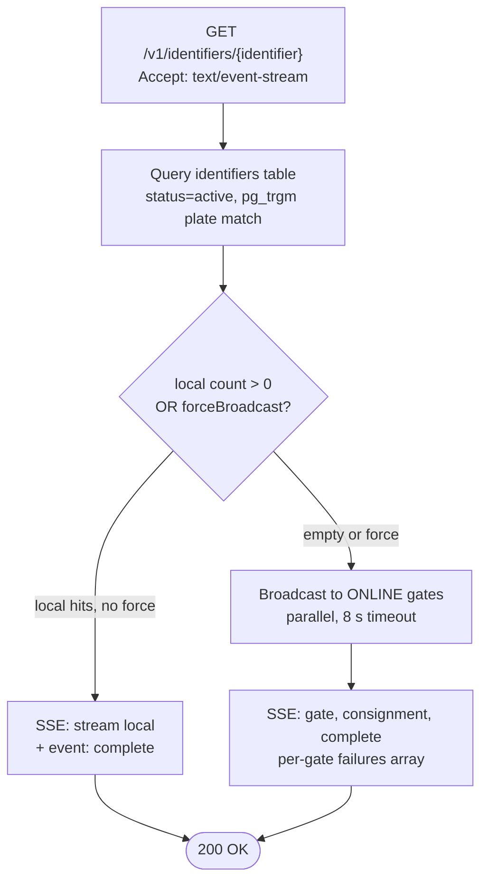

# EPIC 4 — Identifier Search (Authority API)

> Part of [Theme 2](theme_2_en.md)

**AS A** competent authority officer  
**I WANT** to search freight transport identifiers (e.g. by registration plate) across all EU gates  
**SO THAT** I can verify a consignment's compliance with eFTI regulations

**References:**
- [DB Schema](../specs/db/README.md) — Database schema for identifier search
- [Permissions Matrix](../specs/permissions-matrix.md) — Authority access control rules
- [Data Transformations](../specs/data-transformations.md) — XML→DB extraction; denormalised search columns drive the no-JOIN query path
- [OpenAPI](../specs/openapi.yaml) — `GET /v1/identifiers/{identifier}` contract incl. SSE streaming and dateFrom/dateTo filters
- [Errors](../specs/errors.json) — Error codes for invalid plate / country / mode / subset
- [RA §5.1 Identifier Query](../architecture/eFTI-Gate-Reference-Architecture.md#51-identifier-query-cross-border-search) — Cross-border identifier search flow
- [RA §6.1 Gate Responsibilities](../architecture/eFTI-Gate-Reference-Architecture.md#61-gate-responsibilities) — Broadcast-only-when-empty rule

**Search decision at a glance:**

See `flow-01-search-broadcast-decision.mmd` and `seq-03-identifier-search-broadcast.mmd` for full detail.

#### Acceptance Criteria

##### Local search

**Happy path:**
- [ ] `GET /v1/identifiers/{identifier}` queries the `consignments` table directly via its denormalised search columns (`vehicle_plate`, `vehicle_country`, `mode`, `dangerous_goods`, `origin_country`, `destination_country`, `transport_date`); no `JOIN` to `identifiers` in the hot path. All filters applied at the database level: `modeCode`, `identifierTypes`, `registrationCountryCode`, `dangerousGoodsIndicator`, `dateFrom`, `dateTo`, `status`.
- [ ] Default `status` is `active` (omit parameter); use `status=inactive` for cabotage queries; `status=all` returns both.
- [ ] Results paginated: `limit` (default 100, max 1000 per `PageLimit` parameter), `offset`; response includes `X-Total-Count` header.
- [ ] Empty result → `200 OK` with empty array `[]` (per OpenAPI response schema — `type: array`).
- [ ] Local DB query response time &lt; 50 ms at p95 (requires `pg_trgm` GIN index on `consignments.vehicle_plate`).

**Edge cases:**
- [ ] `limit` exceeds 1000 → `400 Bad Request` with `code: BAD_REQUEST_GENERAL` and `"detail": "limit must not exceed 1000"`.
- [ ] `dateFrom` after `dateTo` → `400 Bad Request` with `"detail": "dateFrom must be on or before dateTo"`.
- [ ] `dateFrom`/`dateTo` without an explicit `modeCode` filter — accepted; the database filter applies regardless of mode (the cabotage retention rule itself is road-only — see "Cabotage control" below — but the date-range parameter is general-purpose).

**Error handling:**
- [ ] Missing Bearer token → `401 Unauthorized` RFC 7807
- [ ] Authority user without search permission → `403 Forbidden` with `"detail": "Insufficient permissions for identifier search"`

**Technical constraints:**
- [ ] PostgreSQL 14+; MUST use `pg_trgm` extension for fuzzy plate search — performance requirement: < 50 ms local query
- [ ] DB indexes: `idx_consignments_plate_trgm` (GIN trigram on `consignments.vehicle_plate`) for fuzzy search; `idx_consignments_status_active` (partial, `WHERE status='active'`) for the default search path; `idx_identifiers_value_trgm` (GIN trigram on `identifiers.identifier_value`) for non-plate identifier types.

**Technical artifacts:**
- [ ] OpenAPI: `GET /v1/identifiers/{identifier}` — all query params, response schema, all error responses
- [ ] Diagram: `seq-02-identifier-search-local-only.mmd`

##### Cabotage control

**Happy path:**
- [ ] `dateFrom`/`dateTo` + `status=inactive` + `modeCode=3` returns inactive road consignments whose `transport_date` falls in the range. The 14-day inactive-retention window for road consignments is documented at Reg 2024/1942 Art 11(4).
- [ ] `IdentifierExpirationJob` flips `consignments.status` from `active` to `inactive` 14 days after `transport_date` for `mode='road'` only (see `seq-08-identifier-expiration.mmd`).
- [ ] Result list shows record status (`active` / `inactive`) per item via the `status` field on each row.

**Technical artifacts:**
- [ ] OpenAPI: `dateFrom`, `dateTo` query parameters on `GET /v1/identifiers/{identifier}`

##### Broadcast to other gates

**Happy path:**
- [ ] Broadcast triggered **only** when local search returns 0 results — prevents unnecessary load and privacy exposure
- [ ] Rationale: broadcast-only-when-empty pattern (carried forward from the PoC search behaviour)
- [ ] Broadcast sends parallel requests to all gates with status `ONLINE` (per `gate_status` enum); `OFFLINE` and `DISABLED` gates skipped
- [ ] Per-gate response metadata: `gateId`, `responseTimeMs`, `success`, `failure`
- [ ] Each gate interaction logged: gate ID, response time ms, success/failure

**Edge cases:**
- [ ] 3 of 15 active gates timeout after 8 seconds → partial results returned; timeout gates in `failures[]`; SSE stream still ends with `event: complete`
- [ ] All gates offline → `200 OK` with empty identifiers and populated `failures[]` — not a 5xx error
- [ ] One gate returns unexpected format → that gate marked `failure`; others unaffected

**Technical constraints:**
- [ ] Broadcast timeout: 8 seconds (configurable via `BROADCAST_TIMEOUT_SECONDS`)
- [ ] All active gates queried in parallel — not sequentially

**Technical artifacts:**
- [ ] Diagram: `seq-03-identifier-search-broadcast.mmd`

##### SSE (streaming)

**Happy path:**
- [ ] Request with `Accept: text/event-stream` → `Content-Type: text/event-stream` response
- [ ] Each gate's result: `event: gate` SSE event
- [ ] Each individual consignment: `event: consignment` with `id: <UIL>`
- [ ] Stream ends with `event: complete` — client knows all results delivered
- [ ] Without SSE (`Accept: application/json`) → all results returned together after all gates respond

**Edge cases:**
- [ ] Client disconnects mid-stream → gate stops sending and releases resources (no resource leak)
- [ ] Stream open > 60 seconds (all gates timed out) → `event: complete` sent; connection closed

**Technical artifacts:**
- [ ] OpenAPI: `GET /v1/identifiers/{identifier}` with `Accept: text/event-stream` variant documented
