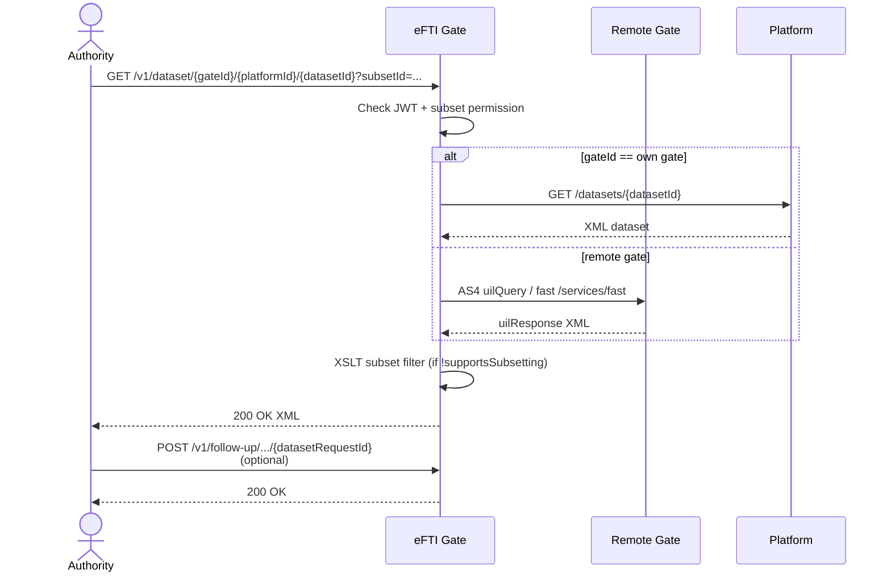

# EPIC 5 — Dataset Retrieval and Follow-up

> Part of [Theme 2](theme_2_en.md)

**AS A** competent authority officer  
**I WANT** to retrieve the full dataset for a specific consignment and send a follow-up message to the platform  
**SO THAT** I can fulfil my legal obligation in freight transport inspection

**References:**
- [DB Schema](../specs/db/README.md) — Database schema for dataset retrieval
- [Permissions Matrix](../specs/permissions-matrix.md) — Subset access permissions
- [Data Transformations](../specs/data-transformations.md) — XML→JSON marshalling, eDelivery AS4 wrapping, SSE streaming
- [OpenAPI](../specs/openapi.yaml) — `GET /v1/dataset/{gateId}/{platformId}/{datasetId}` and `POST /v1/follow-up/...` contracts
- [Errors](../specs/errors.json) — `DATASET_NOT_FOUND`, `FORBIDDEN_SUBSET`, `BAD_GATEWAY`, `FOLLOW_UP_GATE_MISMATCH`
- [RA §2.3 Data Subsets](../architecture/eFTI-Gate-Reference-Architecture.md#23-data-subsets) — Subset filtering — gate vs platform responsibility
- [RA §5.2 Dataset Query](../architecture/eFTI-Gate-Reference-Architecture.md#52-dataset-query-request-full-data) — UIL-based dataset retrieval flow
- [RA §5.3 Follow-Up](../architecture/eFTI-Gate-Reference-Architecture.md#53-follow-up-message) — Follow-up message flow

**Dataset retrieval at a glance:**

See `seq-05-dataset-request.mmd` and `seq-06-dataset-request-denied.mmd` for full detail.

#### Acceptance Criteria

##### Dataset request

**Happy path:**
- [ ] `GET /v1/dataset/:gateId/:platformId/:datasetId` with ≥1 `subsetId` → JWT validated, subset permissions checked
- [ ] Local request (own gate's platform): routes to platform client; returns `Content-Type: application/xml` unchanged
- [ ] `X-Request-ID` echoed in response header
- [ ] Local dataset retrieval response time < 5 seconds at p95

**Edge cases:**
- [ ] No `subsetId` parameter → `400 Bad Request` with `"detail": "At least one subsetId is required"`
- [ ] UIL points to remote gate with status `OFFLINE` → `502 Bad Gateway` with `"detail": "Gate 'eu-fi01.efti.fi' is offline — dataset unavailable"` — checked before sending request

**Error handling:**
- [ ] User `subsets` does not include requested `subsetId` → `403 Forbidden` with `"detail": "Subset 'EU04' not in your permitted subsets"`
- [ ] eFTI platform client returns non-200 → `502 Bad Gateway`; gate does not cache or modify dataset
- [ ] eFTI Gate is content-agnostic: dataset XML forwarded unchanged regardless of content

**Technical artifacts:**
- [ ] OpenAPI: `GET /v1/dataset/{gateId}/{platformId}/{datasetId}`
- [ ] Diagram: `seq-05-dataset-request.mmd`, `seq-06-dataset-request-denied.mmd`

##### Subsetter module

**Happy path:**
- [ ] eFTI platform with `supportsSubsetting=false`: gate applies XSLT-based filter; only permitted subsets returned to authority
- [ ] Filter applied before response sent — authority never receives data beyond permitted subsets

**Edge cases:**
- [ ] XSLT produces empty output → `200 OK` with empty XML body; not `404`
- [ ] Dataset > 10 MB → SAX-based streaming parser used; dataset not fully loaded into JVM heap

**Technical constraints:**
- [ ] Subsetter MUST use SAX streaming — no DOM in-memory parsing for large payloads
- [ ] Rationale: prevents OOM errors for large freight documents

##### Follow-up

**Happy path:**
- [ ] `POST /v1/follow-up/:gateId/:platformId/:datasetId/:datasetRequestId` → JWT validated; routes by `gateId`
- [ ] `gateId == own gate` → forwarded to platform client (REST) → `200 OK`
- [ ] `gateId != own gate` → forwarded to gate-to-gate client → `200 OK`
- [ ] Follow-up logged: follow-up ID, requesting user ID, `datasetRequestId`, timestamp, destination

**Edge cases:**
- [ ] eFTI platform has `eDeliveryCert` → follow-up also sent via eDelivery AS4
- [ ] `datasetRequestId` references no prior request → still forwarded; logged DEBUG

**Error handling:**
- [ ] Remote gate offline → `502 Bad Gateway` with `"detail": "Gate 'eu-de01.efti.de' is offline"`
- [ ] eFTI platform client error → `502 Bad Gateway`; failure logged ERROR with full trace

**Technical constraints:**
- [ ] Follow-up log record (Art 6(2)(c) Reg 2024/1942): follow-up ID, AAP/requesting gate ID, date and time of receipt — mandatory fields

**Technical artifacts:**
- [ ] OpenAPI: `POST /v1/follow-up/{gateId}/{platformId}/{datasetId}/{datasetRequestId}`
- [ ] DB schema: `follow_up_log` table with Art 6(2)(c) mandatory fields
