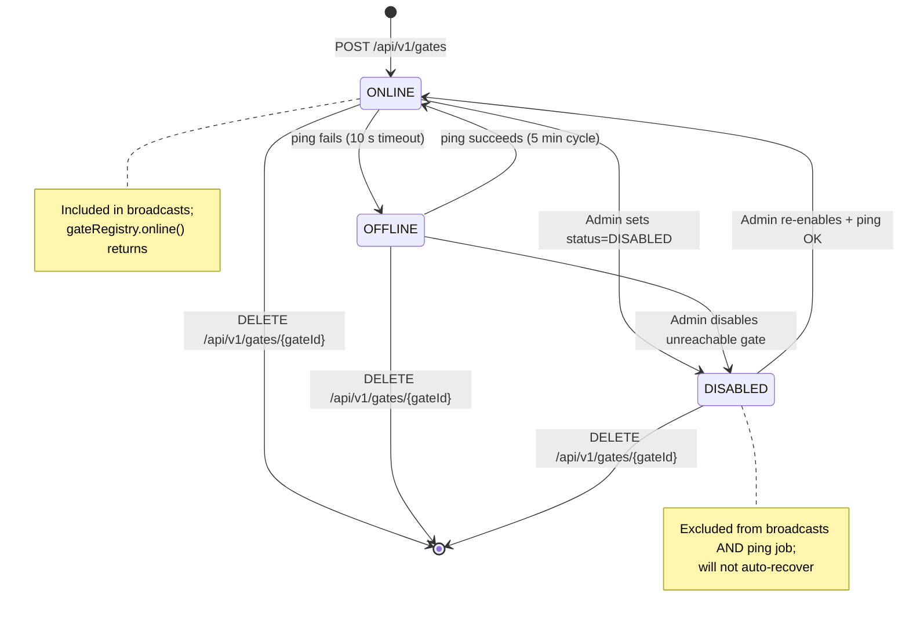

# EPIC 6 — Gate Registry Management (Admin API)

> Part of [Theme 3](theme_3_en.md)

**AS A** system administrator  
**I WANT** to manage the list of EU eFTI gates and monitor their status  
**SO THAT** broadcast requests only reach operational gates

**References:**
- [DB Schema](../specs/db/README.md) — Gate registry schema
- [RA §1 System Actors](../architecture/eFTI-Gate-Reference-Architecture.md#1-system-actors--components) — Gate actor roles and registry context

**Gate lifecycle at a glance:**

See `state-05-gate-health.mmd` for full detail.

#### Acceptance Criteria

##### CRUD

**Happy path:**
- [ ] `GET /api/v1/gates` — Super Admin sees all gates; regular Admin sees only gates in their `roles[ADMIN]` scope-IDs; paginated
- [ ] `GET /api/v1/gates/{gateId}` — returns the latest row for a single gate (404 if unknown)
- [ ] `POST /api/v1/gates` — creates new gate with `id`, `countryCode`, `eDeliveryUrl`, `eDeliveryCert`; 409 on existing id → `201 Created`
- [ ] `PUT /api/v1/gates/{gateId}` — updates an existing gate (append-only INSERT); 404 on unknown id → `200 OK`
- [ ] `DELETE /api/v1/gates/{gateId}` — soft-delete (latest row written with `is_active=FALSE`) → `204 No Content`
- [ ] `GET /api/v1/gates/own` — returns own gate configuration

**Edge cases:**
- [ ] Admin deletes own gate → `400 Bad Request` with `code: BAD_REQUEST_GENERAL`, `"detail": "Cannot delete your own gate"`
- [ ] `POST /api/v1/gates` with `id` already registered → `409 Conflict`
- [ ] `PUT` / `DELETE` on non-existent gate → `404 Not Found`

**Error handling:**
- [ ] Write to a gate not in admin's `roles[ADMIN]` scope-IDs → `403 FORBIDDEN_WRITE_ACCESS`

**Technical artifacts:**
- [ ] OpenAPI: `GET /api/v1/gates`, `GET /api/v1/gates/{gateId}`, `POST /api/v1/gates`, `PUT /api/v1/gates/{gateId}`, `DELETE /api/v1/gates/{gateId}`, `GET /api/v1/gates/own`

##### Ping

**Happy path:**
- [ ] `POST /api/v1/gates/{gateId}/ping` (admin-triggered, manual one-off) → fast protocol ping (`POST {eDeliveryUrl}` with mTLS) or eDelivery SOAP ping → `200 OK` with `responseTimeMs`
- [ ] Recurring peer-gate health probe is driven by **CronManager** calling `POST /api/v1/admin/ping-gates` (every 5 min by default; YAML in `docs/specs/deploy/cronmanager-ping-gates.yaml`); the gate process never schedules its own jobs.
- [ ] Ping result INSERTs a new `gates` row with the latest `status` (ONLINE / OFFLINE; DISABLED is operator-set) and `last_ping_at = NOW()`. A `NOTIFY` on the `registry_change_gates` channel fires after commit.

**Edge cases:**
- [ ] Peer gate does not respond within `PING_TIMEOUT_SECONDS` → status flipped to `OFFLINE`; `502 Bad Gateway` with `"detail": "Gate 'eu-fi01' did not respond within N seconds"`
- [ ] Peer gate was `OFFLINE`, ping succeeds → next INSERT carries `status='ONLINE'`; transition logged INFO

**Technical constraints:**
- [ ] Ping timeout: client-side AS4 / fast-HTTP timeout (default 10 s; configurable via `PING_TIMEOUT_SECONDS` in `non-functional.md` §4.1).
- [ ] Ping schedule lives in CronManager YAML (`cronmanager-ping-gates.yaml`), not in the gate. There is no `PING_INTERVAL_MINUTES` env var on the gate.
- [ ] `DISABLED` and `is_active=FALSE` gates are excluded from the sweep query.

**Edge cases:**
- [ ] Ping job attempts to start on 2 nodes → database advisory lock ensures only 1 node runs it

**Technical constraints:**
- [ ] Leader election: the CronManager admin endpoint enforces a multi-node-safe mutex (one in-flight call wins; others get 409). Implementation may use database advisory locks or any equivalent mechanism.

**Technical artifacts:**
- [ ] OpenAPI: `POST /api/v1/gates/{gateId}/ping`
