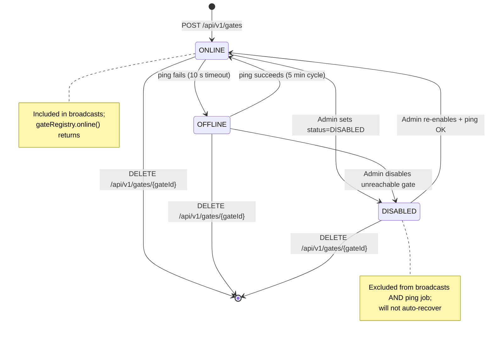

# EPIC 6 — Gate Registry Management (Admin API)

> Part of [Theme 3](theme_3_en.md)

**AS A** system administrator  
**I WANT** to manage the list of EU eFTI gates and monitor their status  
**SO THAT** broadcast requests only reach operational gates

**References:**
- [DB Schema](../specs/db/README.md) — Gate registry schema
- [RA §1 System Actors](../architecture/eFTI-Gate-Reference-Architecture.md#1-system-actors--components) — Gate actor roles and registry context

**Gate lifecycle at a glance:**

See `state-05-gate-health.mmd` for full detail.

#### Acceptance Criteria

##### CRUD

**Happy path:**
- [ ] `GET /api/v1/gates` — Super Admin sees all gates; regular Admin sees only gates in their `roles[GATE]` Party IDs; paginated
- [ ] `POST /api/v1/gates` — adds new gate with `baseUrl`, `eDeliveryUrl`, certificate info; write access requires matching Party ID → `201 Created`
- [ ] `DELETE /api/v1/gates/:gateId` — write access verified → `204 No Content`
- [ ] `GET /api/v1/gates/own` — returns own gate configuration

**Edge cases:**
- [ ] Admin deletes own gate → `409 Conflict` with `"detail": "Cannot delete your own gate"`
- [ ] `POST /api/v1/gates` with `baseUrl` already registered → `409 Conflict`
- [ ] `DELETE` on non-existent gate → `404 Not Found`

**Error handling:**
- [ ] Write with non-matching Party ID → `403 Forbidden`

**Technical artifacts:**
- [ ] OpenAPI: `GET /api/v1/gates`, `POST /api/v1/gates`, `DELETE /api/v1/gates/{gateId}`, `GET /api/v1/gates/own`

##### Ping

**Happy path:**
- [ ] `POST /api/v1/gates/:gateId/ping` → fast protocol ping (`POST {eDeliveryUrl}` with mTLS) → `200 OK` with `responseTimeMs`
- [ ] eDelivery ping: SOAP ping request → `200 OK` or `502`
- [ ] Ping result updates gate status in database and in-memory registry on all nodes (via NOTIFY)

**Edge cases:**
- [ ] eFTI Gate does not respond within 10 seconds → status set `OFFLINE`; `502 Bad Gateway` with `"detail": "Gate 'eu-fi01.efti.fi' did not respond within 10 seconds"`
- [ ] eFTI Gate was `OFFLINE`, ping succeeds → status changed to `ONLINE`; status change logged INFO

**Technical constraints:**
- [ ] Ping timeout: 10 seconds (configurable via `PING_TIMEOUT_SECONDS`)

##### Automated monitoring

**Happy path:**
- [ ] Automated ping runs every 5 minutes (production only, configurable via `PING_INTERVAL_MINUTES`)
- [ ] `DISABLED` status gates not pinged by automated job
- [ ] Status change logged INFO: gate ID, old status, new status, timestamp

**Edge cases:**
- [ ] Ping job attempts to start on 2 nodes → database advisory lock ensures only 1 node runs it

**Technical constraints:**
- [ ] Leader election: database advisory lock (`pg_try_advisory_lock`)

**Technical artifacts:**
- [ ] OpenAPI: `POST /api/v1/gates/{gateId}/ping`
