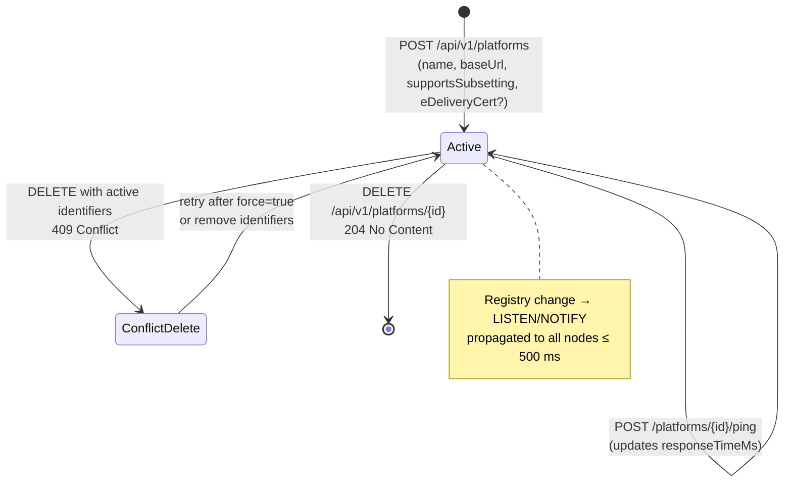

# EPIC 7 — Platform Registry Management (Admin API)

> Part of [Theme 3](theme_3_en.md)

**AS A** system administrator  
**I WANT** to manage the eFTI platform registry  
**SO THAT** platforms can register identifiers and authorities can retrieve datasets

**References:**
- [DB Schema](../specs/db/README.md) — Platform registry schema
- [RA §1 System Actors](../architecture/eFTI-Gate-Reference-Architecture.md#1-system-actors--components) — Platform actor roles and registry context

**Platform lifecycle at a glance:**

See `seq-10-platform-registration.mmd` and `state-03-platform-status.mmd` for full detail.

#### Acceptance Criteria

**Happy path:**
- [ ] `GET /api/v1/platforms` — Super Admin sees all; Admin sees only platforms in their `roles[ADMIN]` gate scope (admin's `users.roles.ADMIN` Party IDs); paginated
- [ ] `POST /api/v1/platforms` — creates platform with `id`, `baseUrl`, `supportsSubsetting`, `certSubject`, `certSerial`, optional `eDeliveryCert` → `201 Created` (409 if `id` already exists)
- [ ] `PUT /api/v1/platforms/{platformId}` — updates an existing platform (append-only INSERT) → `200 OK` (404 if unknown id)
- [ ] `DELETE /api/v1/platforms/{platformId}` — soft-delete (latest row written with `is_active=FALSE`) → `204 No Content`
- [ ] `POST /api/v1/platforms/{platformId}/ping` — checks HTTP connectivity to `baseUrl` → `200 OK` with `responseTimeMs` or `502`
- [ ] eFTI platform without `eDeliveryCert`: REST-only; with `eDeliveryCert`: also callable via eDelivery AS4
- [ ] eFTI platform with `supportsSubsetting=false`: gate applies XSLT subsetter before returning dataset

**Edge cases:**
- [ ] `POST /api/v1/platforms` with `baseUrl` already registered → `409 Conflict`
- [ ] `DELETE` while platform has active identifiers → `409 Conflict` with `"detail": "Platform has 42 active identifiers — delete them first or use force=true"`
- [ ] Ping — platform unreachable after 10 seconds → `502 Bad Gateway` with `"detail": "Platform 'mta-platform-1' did not respond within 10 seconds"`

**Error handling:**
- [ ] Write with non-matching Party ID → `403 Forbidden`

**Technical constraints:**
- [ ] Registry changes propagated to all nodes via LISTEN/NOTIFY within 500 ms

**Technical artifacts:**
- [ ] OpenAPI: `GET /api/v1/platforms`, `POST /api/v1/platforms`, `DELETE /api/v1/platforms/{platformId}`, `POST /api/v1/platforms/{platformId}/ping`
