# EPIC 7 — Platform Registry Management (Admin API)

> Part of [Theme 3](theme_3_en.md)

**AS A** system administrator  
**I WANT** to manage the eFTI platform registry  
**SO THAT** platforms can register identifiers and authorities can retrieve datasets

**References:**
- [DB Schema](../specs/db/README.md) — Platform registry schema
- [RA §1 System Actors](../architecture/eFTI-Gate-Reference-Architecture.md#1-system-actors--components) — Platform actor roles and registry context

**Platform lifecycle at a glance:**

```mermaid
stateDiagram-v2
    [*] --> Active: POST /api/v1/platforms<br/>(id, baseUrl, supportsSubsetting,<br/>certSubject, certSerial, eDeliveryCert?)
    Active --> Active: PUT /api/v1/platforms/{id}<br/>(append-only INSERT; cert renewal etc.)
    Active --> Active: POST /api/v1/platforms/{id}/ping<br/>(updates responseTimeMs)
    Active --> SoftDeleted: DELETE /api/v1/platforms/{id}<br/>(latest row is_active=FALSE)
    SoftDeleted --> Active: PUT with new row is_active=TRUE
    note right of Active
        Registry change → app emits NOTIFY registry_change, id
        in same transaction; other nodes LISTEN and reload
        from gates/platforms within ≤ 500 ms.
    end note
```

See `seq-10-platform-registration.mmd` and `state-03-platform-status.mmd` for full detail.

#### Acceptance Criteria

**Happy path:**
- [ ] `GET /api/v1/platforms` — Super Admin sees all; Admin sees only platforms in their `roles[ADMIN]` gate scope (admin's `users.roles.ADMIN` Party IDs); paginated
- [ ] `POST /api/v1/platforms` — creates platform with `id`, `baseUrl`, `supportsSubsetting`, `certSubject`, `certSerial`, optional `eDeliveryCert` → `201 Created` (409 if `id` already exists)
- [ ] `PUT /api/v1/platforms/{platformId}` — updates an existing platform (append-only INSERT) → `200 OK` (404 if unknown id)
- [ ] `DELETE /api/v1/platforms/{platformId}` — soft-delete (latest row written with `is_active=FALSE`) → `204 No Content`
- [ ] `POST /api/v1/platforms/{platformId}/ping` — checks HTTP connectivity to `baseUrl` → `200 OK` with `responseTimeMs` or `502`
- [ ] eFTI platform without `eDeliveryCert`: REST-only; with `eDeliveryCert`: also callable via eDelivery AS4
- [ ] eFTI platform with `supportsSubsetting=false`: gate applies XSLT subsetter before returning dataset

**Edge cases:**
- [ ] `POST /api/v1/platforms` with `id` already registered → `409 Conflict`
- [ ] `DELETE` is **always** soft (writes `is_active=FALSE`); existing identifiers from the platform stay queryable. There is no force-delete and no purge — append-only.
- [ ] Manual ping — platform unreachable after 10 seconds → `502 Bad Gateway` with `"detail": "Platform 'mta-platform-1' did not respond within 10 seconds"`

**Error handling:**
- [ ] Admin writing to a platform whose owning gate is not in the admin's `roles[ADMIN]` scope-IDs → `403 FORBIDDEN_WRITE_ACCESS`

**Technical constraints:**
- [ ] Registry changes propagated to all nodes via an app-emitted `NOTIFY registry_change, '<id>'` in the same transaction as the INSERT — other nodes LISTEN and reload within 500 ms

**Technical artifacts:**
- [ ] OpenAPI: `GET /api/v1/platforms`, `GET /api/v1/platforms/{platformId}`, `POST /api/v1/platforms`, `PUT /api/v1/platforms/{platformId}`, `DELETE /api/v1/platforms/{platformId}`, `POST /api/v1/platforms/{platformId}/ping`
