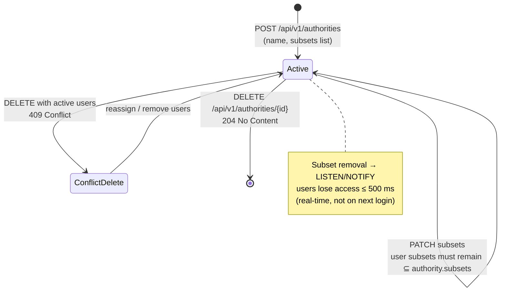

# EPIC 8 — Authority Registry Management (Admin API)

> Part of [Theme 3](theme_3_en.md)

**AS A** system administrator  
**I WANT** to manage the registry of Competent Authorities  
**SO THAT** authority users have controlled access to eFTI data

## Spec anchors

| Contract surface | Reference |
|---|---|
| **API operations** | `GET/POST/PUT/DELETE /api/v1/authorities[/{authorityId}]` |
| | Full request / response / error shapes: [`openapi.yaml`](../specs/openapi.yaml) |
| **Schema** | `authorities` (append-only; logical id = `authorities.id`; latest row by `created_at` wins; `is_active=FALSE` on latest = soft-delete; columns: `country_code`, `name`, `subsets TEXT[]`) |
| | Full schema: [`db/schema.sql`](../specs/db/schema.sql) |
| **Access-check rules** | Admin write scope-ID check on the authority's owning gate; subset filtering rules for authority users: [`permissions-matrix.md`](../specs/permissions-matrix.md) |
| **Error codes** | `BAD_REQUEST_GENERAL` |
| | `INVALID_SUBSET` |
| | `FORBIDDEN_SUBSET` |
| | `FORBIDDEN_WRITE_ACCESS` |
| | Full catalog: [`errors.json`](../specs/errors.json) |
| **Cluster sync** | `LISTEN/NOTIFY` on channel `registry_change_authorities` — see [`non-functional.md`](../specs/non-functional.md) §3 |
| **Architecture** | [RA §2.3 Data Subsets](../architecture/eFTI-Gate-Reference-Architecture.md#23-data-subsets) |
| **Diagrams** | [`seq-11-authority-registration.mmd`](../specs/diagrams/seq-11-authority-registration.mmd) |
| | [`state-04-authority-status.mmd`](../specs/diagrams/state-04-authority-status.mmd) |

## Authority lifecycle at a glance

## Acceptance Criteria

**Business rules:**
- [ ] Listing: Super Admin sees all authorities; a regular Admin sees only authorities whose owning gate is in their `users.roles[ADMIN]` scope-IDs.
- [ ] All writes (create / update / delete) are INSERTs of a new `authorities` row sharing the same logical `id`. Latest row wins.
- [ ] Delete is **always** soft (`is_active=FALSE` on the latest row). User rows referencing the authority remain queryable. There is no purge.
- [ ] Subset assignment: every value in `authorities.subsets[]` must be a valid subset code (`EU01`–`EU07`).
- [ ] If a `PUT` removes a subset from `authorities.subsets`, every existing authority user whose `users.subsets` is no longer a subset of the parent's becomes immediately denied on their next request (per the `FORBIDDEN_SUBSET` rule). The admin must follow up with `PUT /api/v1/users/{userId}` to trim those users' subsets.

**Denial scenarios:**
- [ ] `POST` with an `id` whose latest row is active → conflict.
- [ ] `PUT` / `DELETE` on a logical id that doesn't exist → not found.
- [ ] `POST` / `PUT` carries a subset value outside the canonical set → `INVALID_SUBSET`.
- [ ] Admin writes to an authority whose owning gate is **not** in the caller's `users.roles[ADMIN]` scope-IDs → `FORBIDDEN_WRITE_ACCESS`.

## Cluster-sync contract

- [ ] On every commit of an `authorities` INSERT, the application emits `NOTIFY registry_change_authorities, '<id>'` from the same transaction (no DB-side trigger). All gate nodes hold an open `LISTEN` on this channel and reload the latest row for the affected id within ≤ 500 ms — subset removals therefore take effect in real time, not on next login.

## Lifecycle states

The state machine in [`state-04-authority-status.mmd`](../specs/diagrams/state-04-authority-status.mmd) describes the two states an `authorities` row can be in:

**`Active`** — latest `authorities` row has `is_active=TRUE`.
- Authority users may search via `GET /v1/identifiers/{identifier}` and pull datasets via `GET /v1/dataset/...`.
- `subsets[]` controls which eFTI subsets users under this authority may request.
- Each authority user's `users.subsets` must be ⊆ `authorities.subsets` at all times (enforced at user-create / user-update time AND re-enforced on each request because `users.subsets` is resolved live).
- Authority users may send follow-up messages via `POST /v1/follow-up/...`.

**`Inactive`** — latest `authorities` row has `is_active=FALSE`.
- Latest-row lookup excludes the authority (filter `is_active=TRUE`).
- All authority users under it are denied on their next request (the resolved `users` row's owning authority is no longer active).
- Historical access logs remain in `audit_log` (preserved indefinitely per GDPR Art. 30).
- Old `authorities` rows are archived nightly by CronManager (Epic 26).

## Rationale

Authorities are the **subset-permission roots**: a user's permitted subsets must always be a subset of their authority's. Real-time propagation matters — when an admin removes a subset from an authority (e.g. legal change), every user under it must lose that access immediately, not on their next session. The append-only + `LISTEN/NOTIFY` pattern delivers that without server-side session state.
