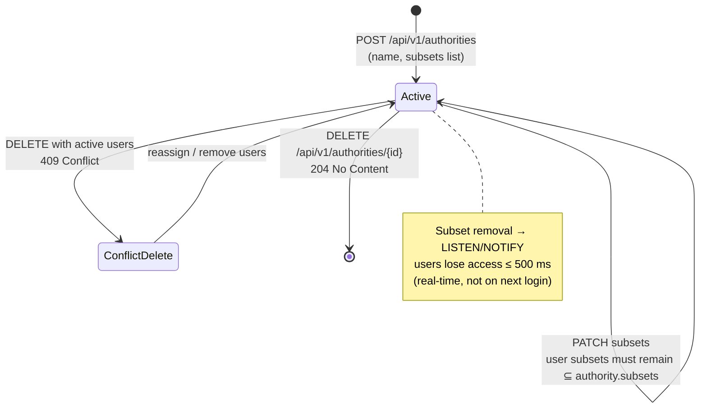

# EPIC 8 — Authority Registry Management (Admin API)

> Part of [Theme 3](theme_3_en.md)

**AS A** system administrator  
**I WANT** to manage the registry of Competent Authorities  
**SO THAT** authority users have controlled access to eFTI data

**References:**
- [DB Schema](../specs/db/README.md) — Authority registry schema
- [Permissions Matrix](../specs/permissions-matrix.md) — Authority subset permissions
- [RA §2.3 Data Subsets](../architecture/eFTI-Gate-Reference-Architecture.md#23-data-subsets) — Authority subset assignment model

**Authority lifecycle at a glance:**

See `seq-11-authority-registration.mmd` and `state-04-authority-status.mmd` for full detail.

#### Acceptance Criteria

**Happy path:**
- [ ] `GET /api/v1/authorities` — Super Admin sees all; Admin sees only authorities in their `roles[AUTHORITY]` Party IDs; paginated
- [ ] `GET /api/v1/authorities/:authorityId` — returns authority details: name, `subsets[]`, contact
- [ ] `POST /api/v1/authorities` — adds authority with permitted `subsets[]` → `201 Created`
- [ ] `DELETE /api/v1/authorities/:authorityId` → `204 No Content`

**Edge cases:**
- [ ] `DELETE` when authority has active users → `409 Conflict` with `"detail": "Authority has 3 active users — delete or reassign them first"`
- [ ] `POST` with unknown subset code → `400 Bad Request` with `"detail": "Unknown subset: 'EU99'"`
- [ ] Authority `subsets[]` updated to remove a subset → existing users lose access immediately (real-time, not on next login)
- [ ] `GET /api/v1/authorities/:authorityId` for non-existent → `404 Not Found`

**Error handling:**
- [ ] Write with non-matching Party ID → `403 Forbidden`

**Technical constraints:**
- [ ] Subset access change propagated via LISTEN/NOTIFY within 500 ms

**Technical artifacts:**
- [ ] OpenAPI: `GET /api/v1/authorities`, `POST /api/v1/authorities`, `DELETE /api/v1/authorities/{authorityId}`
