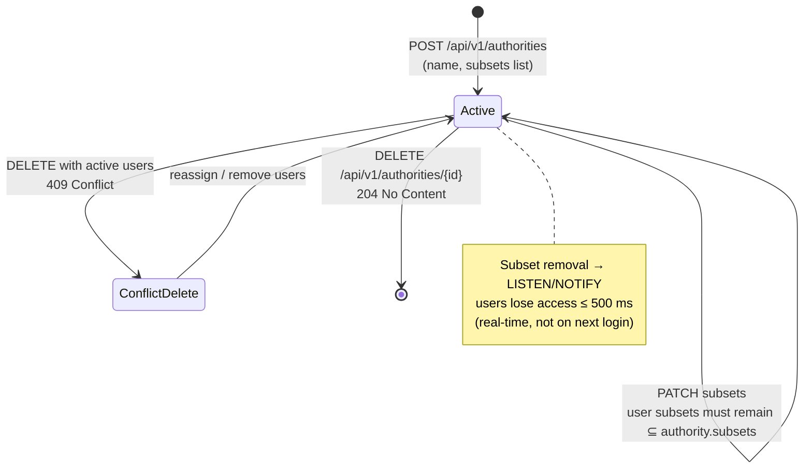

# EPIC 8 — Authority Registry Management (Admin API)

> Part of [Theme 3](theme_3_en.md)

**AS A** system administrator  
**I WANT** to manage the registry of Competent Authorities  
**SO THAT** authority users have controlled access to eFTI data

**References:**
- [DB Schema](../specs/db/README.md) — Authority registry schema
- [Permissions Matrix](../specs/permissions-matrix.md) — Authority subset permissions
- [RA §2.3 Data Subsets](../architecture/eFTI-Gate-Reference-Architecture.md#23-data-subsets) — Authority subset assignment model

**Authority lifecycle at a glance:**

See `seq-11-authority-registration.mmd` and `state-04-authority-status.mmd` for full detail.

#### Acceptance Criteria

**Happy path:**
- [ ] `GET /api/v1/authorities` — Super Admin sees all; regular Admin sees only authorities operating under gates in their `roles[ADMIN]` scope-IDs; paginated
- [ ] `GET /api/v1/authorities/{authorityId}` — returns the latest row for the given authority: id, countryCode, name, subsets[], isActive
- [ ] `POST /api/v1/authorities` — creates authority with permitted `subsets[]`; 409 on existing id → `201 Created`
- [ ] `PUT /api/v1/authorities/{authorityId}` — updates an existing authority (append-only INSERT); 404 on unknown id → `200 OK`
- [ ] `DELETE /api/v1/authorities/{authorityId}` — soft-delete (latest row written with `is_active=FALSE`) → `204 No Content`

**Edge cases:**
- [ ] `DELETE` is always soft (writes `is_active=FALSE`); existing user rows referencing the authority's id stay queryable. There is no purge — append-only.
- [ ] `POST` / `PUT` with unknown subset code → `400 Bad Request` with `code: INVALID_SUBSET`, `"detail": "Unknown subset: 'EU99'"`
- [ ] `PUT` that removes a subset from `authorities.subsets` → existing users whose `users.subsets` is no longer ⊆ `authorities.subsets` are rejected on the next request (`403 FORBIDDEN_SUBSET`); admin must follow up with `PUT /api/v1/users/{userId}` to trim their subsets.
- [ ] `GET /api/v1/authorities/{authorityId}` for non-existent → `404 Not Found`

**Error handling:**
- [ ] Admin writing to an authority whose owning gate is not in the admin's `roles[ADMIN]` scope-IDs → `403 FORBIDDEN_WRITE_ACCESS`

**Technical constraints:**
- [ ] Registry changes propagated to all nodes via an app-emitted `NOTIFY registry_change, '<id>'` in the same transaction as the INSERT — other nodes LISTEN and reload within 500 ms

**Technical artifacts:**
- [ ] OpenAPI: `GET /api/v1/authorities`, `GET /api/v1/authorities/{authorityId}`, `POST /api/v1/authorities`, `PUT /api/v1/authorities/{authorityId}`, `DELETE /api/v1/authorities/{authorityId}`
