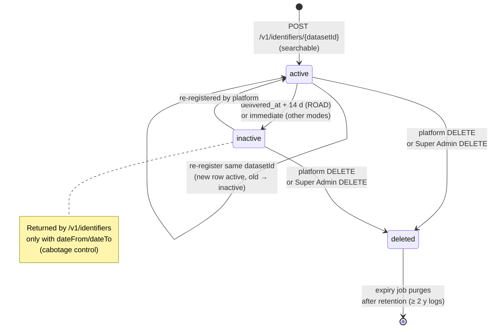

# EPIC 9 — Consignment Management (Admin API)

> Part of [Theme 3](theme_3_en.md)

**AS A** system administrator  
**I WANT** to view and manage stored consignment data  
**SO THAT** I can audit data and remove erroneous records

**References:**
- [DB Schema](../specs/db/README.md) — Consignment lifecycle schema
- [Data Transformations](../specs/data-transformations.md) — XML→DB column mapping for denormalised search columns
- [OpenAPI](../specs/openapi.yaml) — `GET /api/v1/consignments`, `DELETE /api/v1/consignments/{datasetId}` contracts
- [RA §3 Data Lifecycle](../architecture/eFTI-Gate-Reference-Architecture.md#3-data-lifecycle--ownership) — CMDS active/inactive/deleted lifecycle
- [RA §6.2 Data Processing Matrix](../architecture/eFTI-Gate-Reference-Architecture.md#62-data-processing-matrix) — What data is stored and where

**Consignment lifecycle at a glance:**

See `state-01-identifier-lifecycle.mmd` and `seq-08-identifier-expiration.mmd` for full detail.

#### Acceptance Criteria

##### Viewing and deletion

**Happy path:**
- [ ] `GET /api/v1/consignments` — Super Admin sees all; Admin sees own platform's consignments; sorted `updatedAt DESC`; paginated
- [ ] `DELETE /api/v1/consignments/:datasetId` — Super Admin only; soft delete (status → `deleted`) → `204 No Content`

**Edge cases:**
- [ ] Regular admin attempts `DELETE` → `403 Forbidden` with `"detail": "Only Super Admin can delete consignments"`
- [ ] `DELETE` on already-deleted record → `404 Not Found`

**Technical artifacts:**
- [ ] OpenAPI: `GET /api/v1/consignments`, `DELETE /api/v1/consignments/{datasetId}`

##### Identifier status management (Regulation 2025/2243)

**Happy path:**
- [ ] Status lifecycle: `active` (searchable) → `inactive` (historical queries only) → `deleted` (returns not found)
- [ ] eFTI platform sends updated data for same `datasetId` → previous version → `inactive`; new version → `active`
- [ ] eFTI platform sends DELETE request → status → `deleted` (soft delete; not physically removed immediately)
- [ ] `deleted` records physically purged after retention period

**Edge cases:**
- [ ] eFTI platform re-registers after `deleted` → new `active` record created; old `deleted` retained until retention expiry

**Technical constraints:**
- [ ] DB: `status` enum (`active`, `inactive`, `deleted`); `expires_at` timestamp per record
- [ ] MUST use Flyway or Liquibase for schema migration — no custom scripts

##### Retention rules (Regulation 2024/1942)

**Happy path:**
- [ ] All data access logs (authority queries, dataset requests) retained ≥ **2 years**
- [ ] Road transport (`mode_code=3`): identifier deactivated (`active → inactive`) **14 days** after `delivered_at` (cabotage control, art. 11 para. 4)
- [ ] Other transport modes: deactivated immediately after `delivered_at`
- [ ] Expiry job purges `deleted` records past retention — database-level filter (not application memory)
- [ ] System supports export of 5-year monitoring report data for European Commission

**Edge cases:**
- [ ] `delivered_at` not set (in transit) → identifier remains `active`; expiry job skips
- [ ] Expiry job starts on 2 nodes simultaneously → leader election: only 1 node processes

**Technical constraints:**
- [ ] Expiry job: daily, random window 03:45–05:45 (production only); `EXPIRY_JOB_WINDOW_START` / `EXPIRY_JOB_WINDOW_END`
- [ ] Leader election: database advisory lock (`pg_try_advisory_lock`)
- [ ] Expiry job logs deleted record count at INFO level

**Technical artifacts:**
- [ ] DB index: `CREATE INDEX idx_consignments_expiry ON consignments (mode_code, delivered_at) WHERE status = 'deleted'`
- [ ] Unit test: expiry logic — ROAD/non-ROAD mode, `delivered_at` set/not set

---
