# EPIC 9 — Consignment Management (Admin API)

> Part of [Theme 3](theme_3_en.md)

**AS A** system administrator
**I WANT** to view and manage stored consignment data
**SO THAT** I can audit data and remove erroneous records

**References:**
- [DB Schema](../specs/db/README.md) — Append-only consignment lifecycle
- [Data Transformations](../specs/data-transformations.md) — XML→DB column mapping for denormalised search columns
- [OpenAPI](../specs/openapi.yaml) — `GET /api/v1/consignments`, `DELETE /api/v1/consignments/{datasetId}` contracts
- [RA §3 Data Lifecycle](../architecture/eFTI-Gate-Reference-Architecture.md#3-data-lifecycle--ownership) — active/inactive/deleted lifecycle
- [RA §6.2 Data Processing Matrix](../architecture/eFTI-Gate-Reference-Architecture.md#62-data-processing-matrix) — What data is stored and where
- [Epic 26](epic_26_en.md) — CronManager-driven append-only archival sweep

**Consignment lifecycle at a glance:**

```mermaid
stateDiagram-v2
    [*] --> active: POST /v1/identifiers/{datasetId}<br/>(INSERT consignments row, status='active')
    active --> active: re-register same datasetId<br/>(append-only INSERT; latest row wins)
    active --> inactive: CronManager → /api/v1/admin/expire-identifiers<br/>(road, transport_date+14d <NOW())<br/>or immediate inactive INSERT for other modes
    inactive --> active: re-registered by platform
    active --> deleted: Platform DELETE /v1/identifiers/{datasetId}<br/>or Admin DELETE /api/v1/consignments/{datasetId}<br/>(append-only INSERT, status='deleted')
    inactive --> deleted: Platform / Admin DELETE
    note right of inactive
        Returned by /v1/identifiers only with
        dateFrom/dateTo (cabotage control,
        Reg 2024/1942 Art 11(4)).
    end note
    note right of deleted
        Append-only — nothing is physically removed.
        Old (non-latest) rows are archived nightly by
        CronManager (Epic 26) to cold storage. The
        runtime app role has no DELETE grant.
    end note
```

See `state-01-identifier-lifecycle.mmd` and `seq-08-identifier-expiration.mmd` for full detail.

#### Acceptance Criteria

##### Viewing and deletion

**Happy path:**
- [ ] `GET /api/v1/consignments` — Super Admin sees all; Admin sees own gate-scope consignments; latest row per `dataset_id` resolved by `SELECT DISTINCT ON (dataset_id) … ORDER BY dataset_id, created_at DESC` and presented in `created_at DESC` order; paginated
- [ ] `DELETE /api/v1/consignments/{datasetId}` — Super Admin only; INSERTs a new `consignments` row with `status='deleted'` (append-only) → `204 No Content`

**Edge cases:**
- [ ] Regular admin attempts `DELETE` → `403 Forbidden` with `"detail": "Only Super Admin can delete consignments"`
- [ ] `DELETE` against a `dataset_id` whose latest row is already `status='deleted'` → `404 Not Found`

**Technical artifacts:**
- [ ] OpenAPI: `GET /api/v1/consignments`, `DELETE /api/v1/consignments/{datasetId}`

##### Identifier status management (Regulation 2025/2243)

**Happy path:**
- [ ] Status lifecycle: `active` (searchable) → `inactive` (historical queries only) → `deleted` (returns not found)
- [ ] Re-registration: a new `consignments` row INSERTed for the same `dataset_id`; previous row stays in place but is no longer the latest. No row is mutated.
- [ ] Platform DELETE / admin DELETE: a new row INSERTed with `status='deleted'`. The previous row is unchanged.

**Edge cases:**
- [ ] Re-registration after a `status='deleted'` row exists → new `active` row INSERTed; latest now reads `active`. The deleted row remains until archived.

**Technical constraints:**
- [ ] DB: `status` enum (`active`, `inactive`, `deleted`); `expires_at` timestamp per row.
- [ ] Schema migration: Liquibase (per `non-functional.md` §4 — Liquibase is the pinned migration tool; alternative implementations may match the *behaviour* with another tool but the reference implementation is Liquibase).

##### Retention rules (Regulation 2024/1942)

**Happy path:**
- [ ] All data access logs (authority queries, dataset requests) retained ≥ **7 years** in `audit_log` (which is preserved indefinitely on the live DB; never archived).
- [ ] Road transport (`mode='road'`): identifier deactivated (`active → inactive`) **14 days** after `transport_date` (cabotage control, Reg 2024/1942 Art 11(4)). Triggered by CronManager calling `POST /api/v1/admin/expire-identifiers`.
- [ ] Other transport modes: deactivated immediately after `delivered_at` (operator may choose to mark inactive at platform-DELETE time instead).
- [ ] **Non-latest consignments rows are archived nightly** by CronManager via `POST /api/v1/admin/archive`; copied to cold storage and DELETEd from the live DB by the `db_archiver` PostgreSQL role. The live DB carries only the latest row per `dataset_id` after each archival sweep.
- [ ] System supports export of 5-year monitoring report data for the European Commission.

**Edge cases:**
- [ ] `transport_date` not set or in future → identifier remains `active`; the expiry sweep skips.
- [ ] Concurrent CronManager calls to `/admin/expire-identifiers` → `pg_try_advisory_lock` returns FALSE on the second; gate replies `409 Conflict`. Same pattern for `/admin/archive` and `/admin/ping-gates`.

**Technical constraints:**
- [ ] Expiry sweep schedule lives in CronManager YAML (`docs/specs/deploy/cronmanager-expire.yaml`), default `0 45 3 * * ?` (03:45 daily). The gate carries no `EXPIRY_JOB_WINDOW_*` env var.
- [ ] Concurrency guard at handler entry: `pg_try_advisory_lock(<expire-lock-key>)`; if held, return `409 Conflict`.
- [ ] Expiry sweep logs `event.action: identifier.expire` with `efti.expired_count` per run (per `logging-spec.md` §5).

**Technical artifacts:**
- [ ] DB index: `CREATE INDEX idx_consignments_dataset_latest ON consignments (dataset_id, created_at DESC)` — the canonical latest-row index used by both reads and the expiry/archive scans.
- [ ] Unit test: expiry logic — `mode='road'` vs other modes, `transport_date` set / not set / in future, idempotency on a second run.

---
